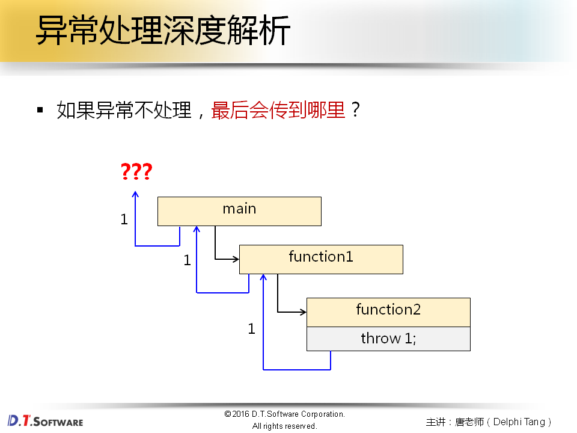
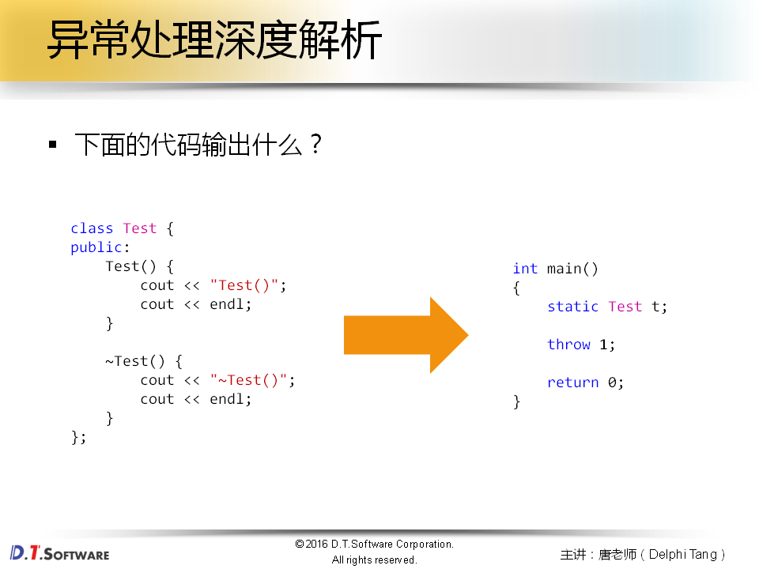
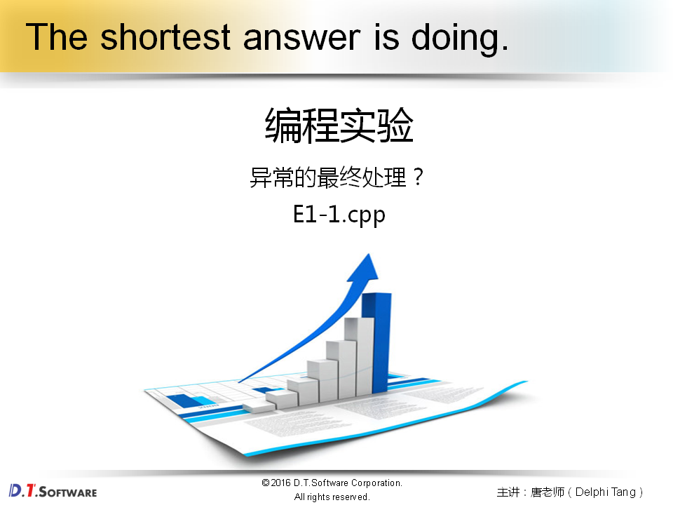
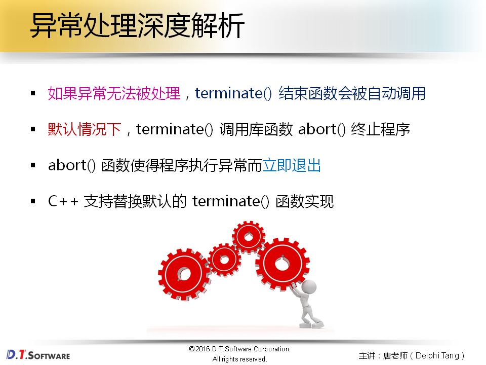
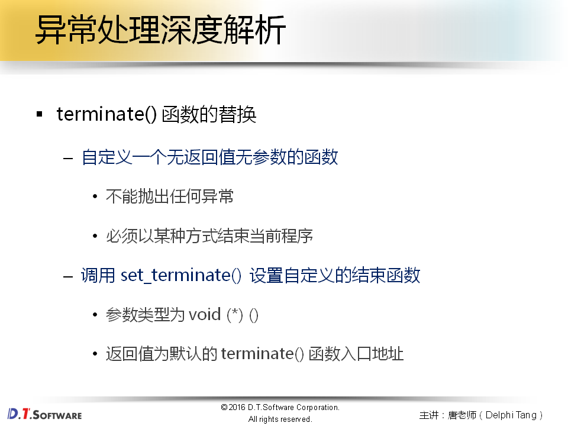
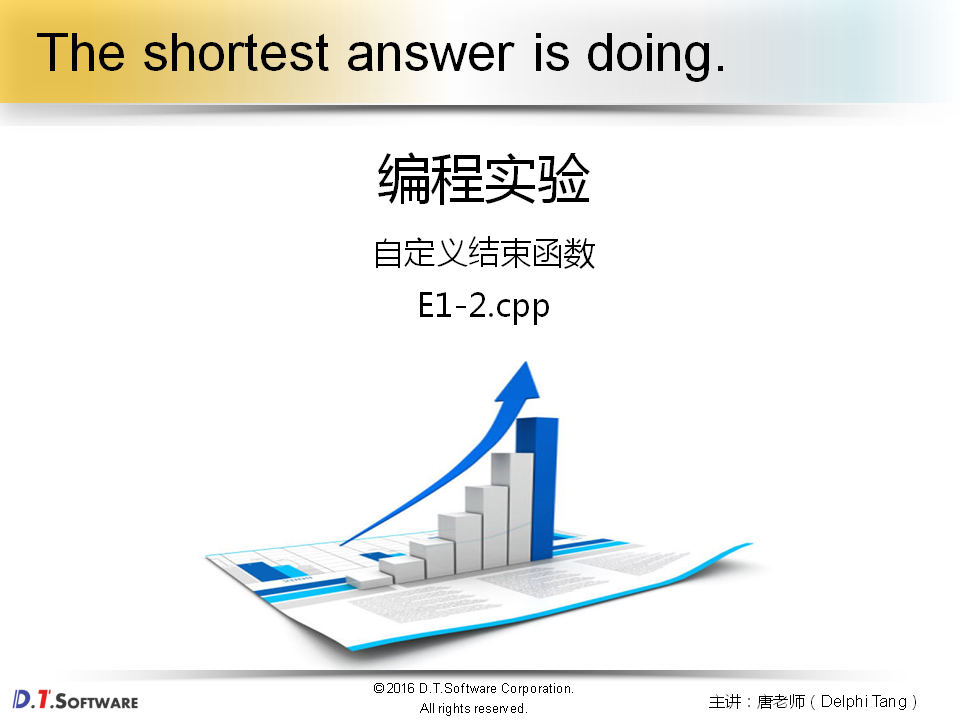
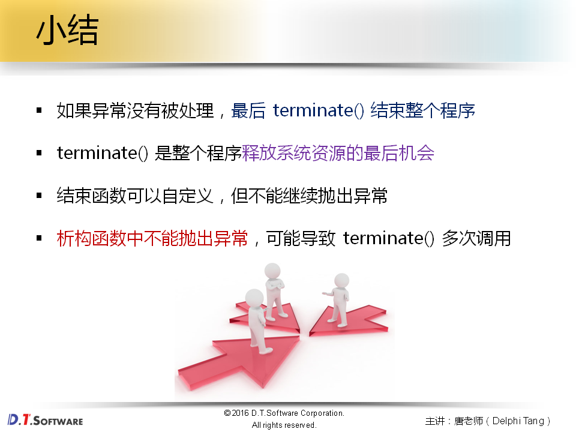

# 外传篇.1-异常处理深度解析










```cpp
#include <iostream>

using namespace std;

class Test 
{
public:
    Test() 
    {
        cout << "Test()"; 
        cout << endl;
    }
	
    ~Test() 
    {
        cout << "~Test()"; 
        cout << endl;
    }
};


int main()
{
    static Test t;
    
    throw 1;
	
    return 0;
}

```

**没有人处理异常，程序会被中止，情况取决于编译器，main函数里面的异常会被terminate进行处理**









```cpp
#include <iostream>
#include <cstdlib>
#include <exception>

using namespace std;

void my_terminate()
{
    cout << "void my_terminate()" << endl;
    exit(1); // 会确保全局，静态的对象都会被析构掉；
}

class Test 
{
public:
    Test() 
    {
        cout << "Test()"; 
        cout << endl;
    }
	
    ~Test() 
    {
        cout << "~Test()"; 
        cout << endl;
    }
};


int main()
{
    set_terminate(my_terminate);
    
    static Test t;
    
    throw 1;
	
    return 0;
}

```


```cpp
#include <iostream>
#include <cstdlib>
#include <exception>

using namespace std;

void my_terminate()
{
    cout << "void my_terminate()" << endl;
    // exit(1);
    abort();
}

class Test 
{
public:
    Test() 
    {
        cout << "Test()"; 
        cout << endl;
    }
	
    ~Test() 
    {
        cout << "~Test()"; 
        cout << endl;
        
        throw 2;
    }
};


int main()
{
    set_terminate(my_terminate);
    
    static Test t;
    
    throw 1;
	
    return 0;
}

```

