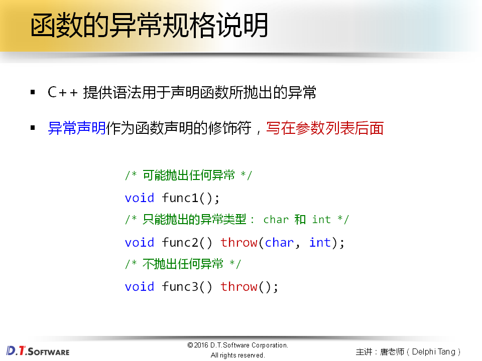
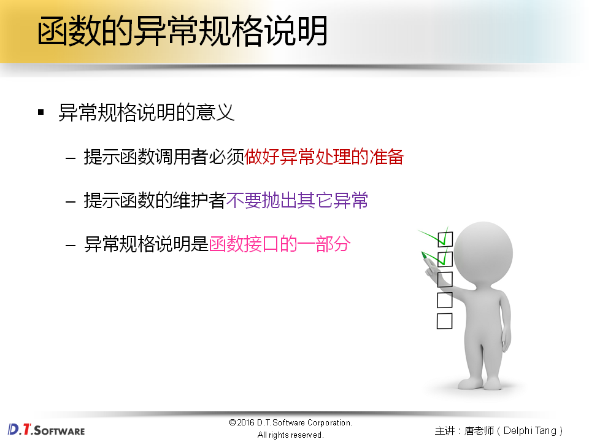
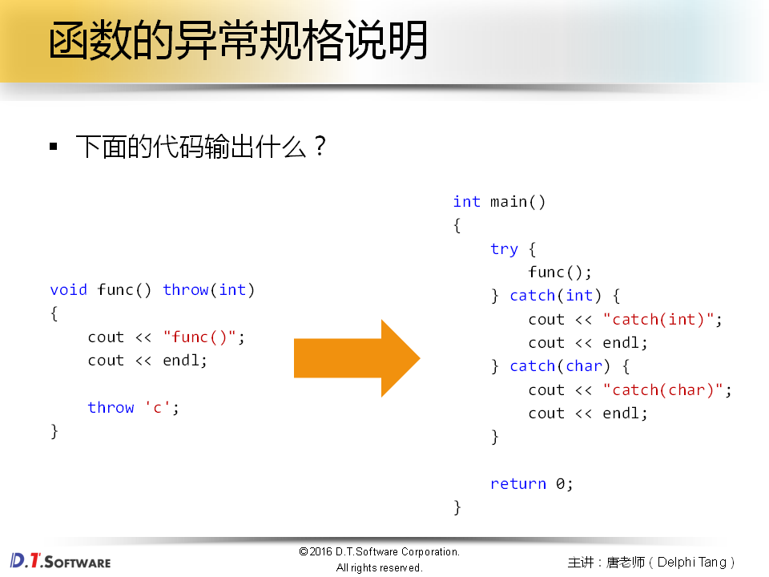
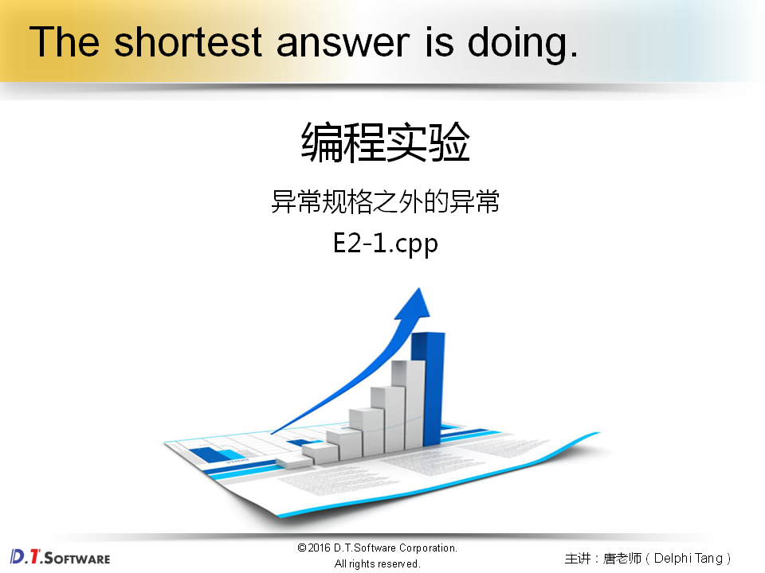
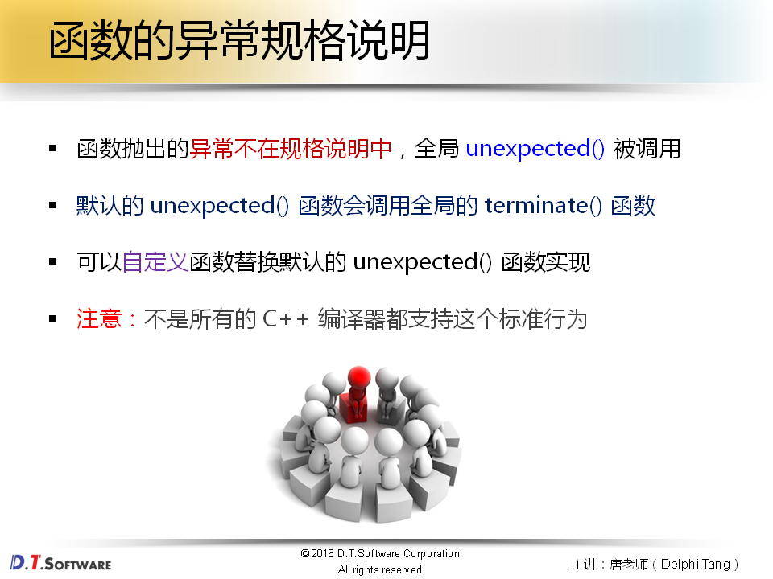
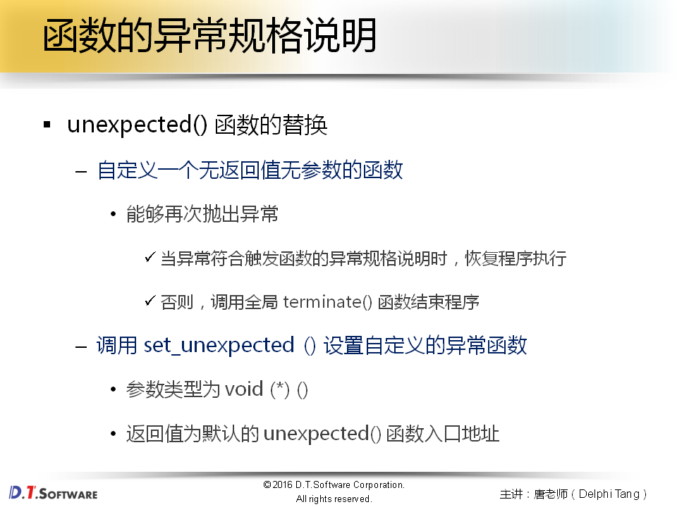
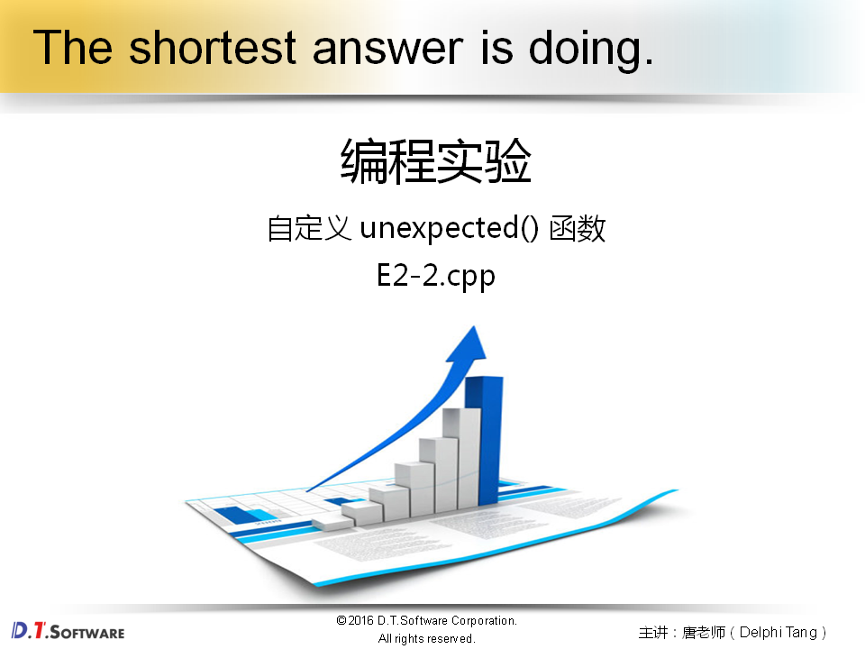
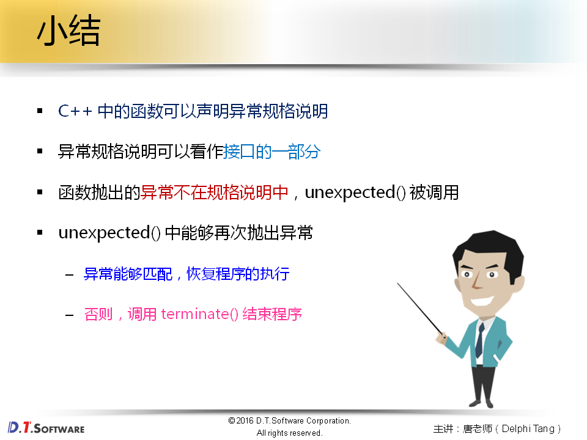

# 外传篇2-函数的异常规格说明













```cpp
#include <iostream>

using namespace std;

void func() throw(int)
{
    cout << "func()";
    cout << endl;
    
    throw 'c';
}


int main()
{
    try 
    {
        func();
    } 
    catch(int) 
    {
        cout << "catch(int)";
        cout << endl;
    } 
    catch(char) 
    {
        cout << "catch(char)";
        cout << endl;
    }

    return 0;
}
```









```cpp
#include <iostream>
#include <cstdlib>
#include <exception>

using namespace std;

void my_unexpected()
{
    cout << "void my_unexpected()" << endl;
    // exit(1);
    throw 1;
}

void func() throw(int)
{
    cout << "func()";
    cout << endl;
    
    throw 'c';
}

int main()
{
    set_unexpected(my_unexpected);
    
    try 
    {
        func();
    } 
    catch(int) 
    {
        cout << "catch(int)";
        cout << endl;
    } 
    catch(char) 
    {
        cout << "catch(char)";
        cout << endl;
    }

    return 0;
}
```

