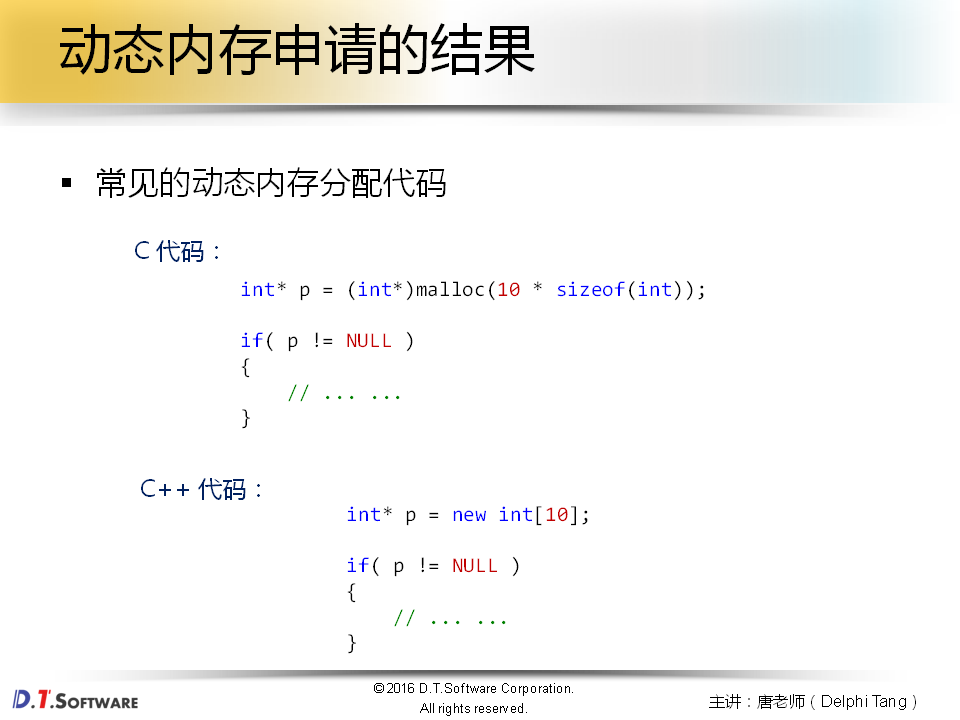
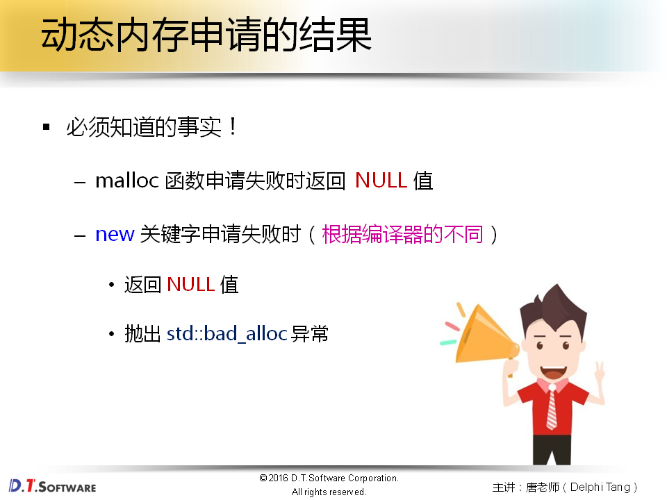
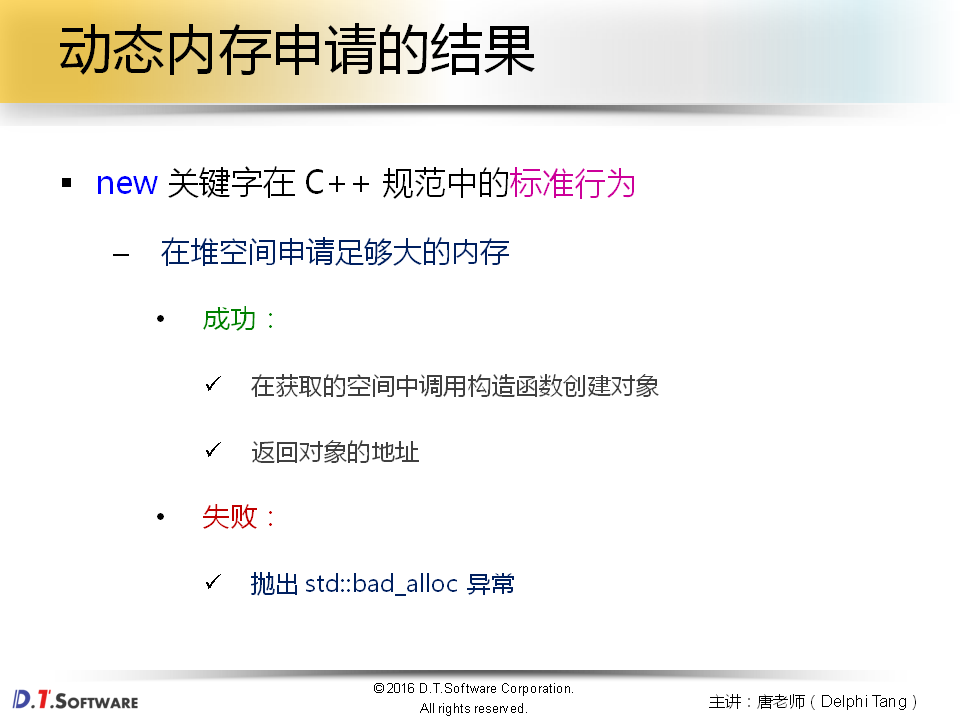
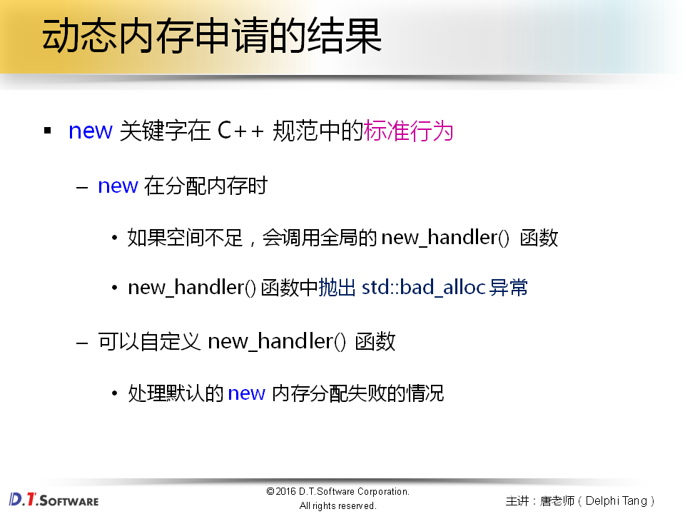
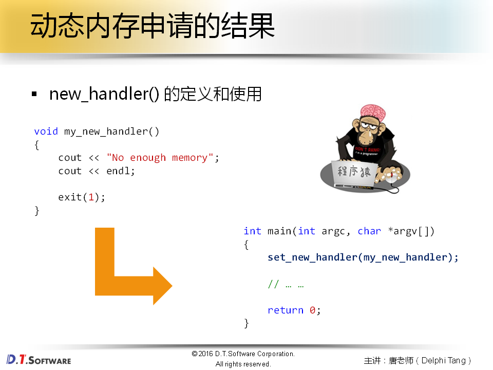
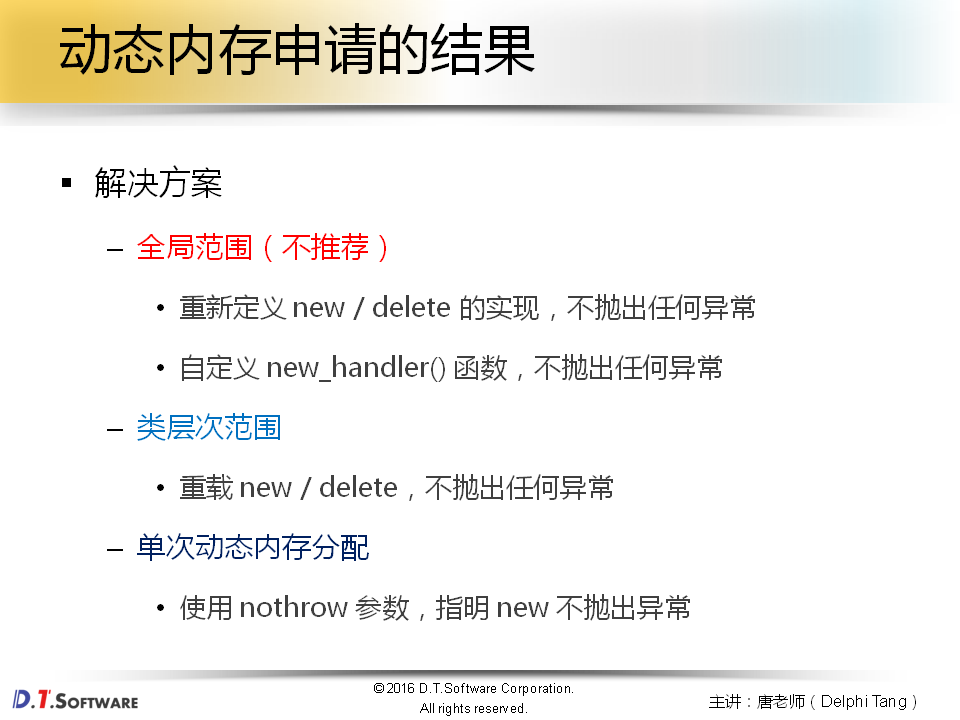
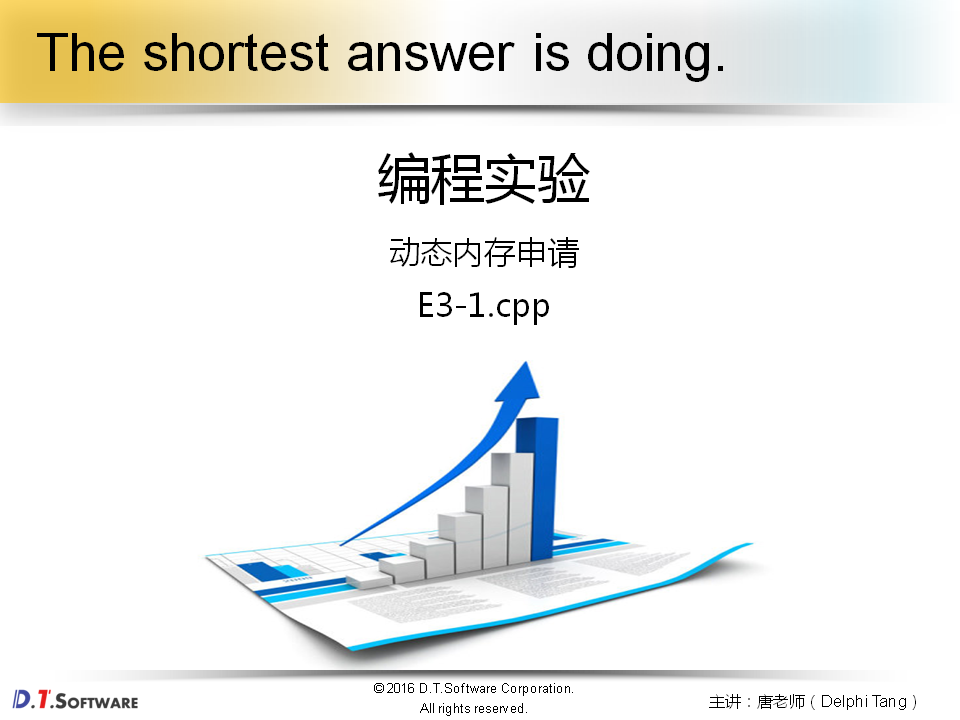
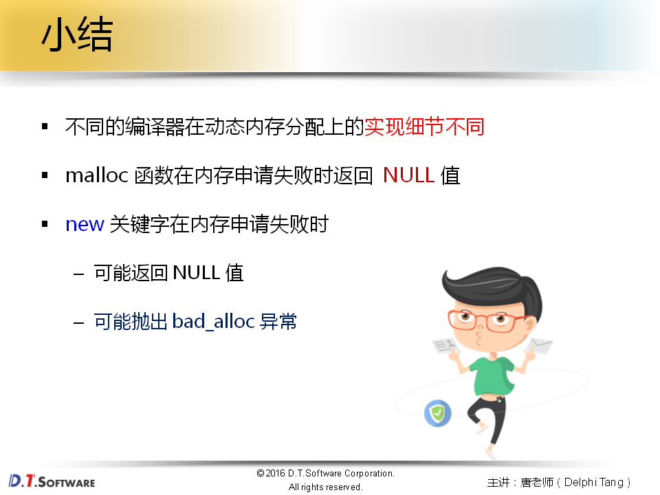

# 外传篇3-动态内存申请的结果






















```
/***
*new.cxx - defines C++ new routine
*
*       Copyright (c) Microsoft Corporation.  All rights reserved.
*
*Purpose:
*       Defines C++ new routine.
*
*******************************************************************************/


#ifdef _SYSCRT
#include <cruntime.h>
#include <crtdbg.h>
#include <malloc.h>
#include <new.h>
#include <stdlib.h>
#include <winheap.h>
#include <rtcsup.h>
#include <internal.h>

void * operator new( size_t cb )
{
    void *res;

    for (;;) {

        //  allocate memory block
        res = _heap_alloc(cb);

        //  if successful allocation, return pointer to memory

        if (res)
            break;

        //  call installed new handler
        if (!_callnewh(cb))
            break;

        //  new handler was successful -- try to allocate again
    }

    RTCCALLBACK(_RTC_Allocate_hook, (res, cb, 0));

    return res;
}
#else  /* _SYSCRT */

#include <cstdlib>
#include <new>

_C_LIB_DECL
int __cdecl _callnewh(size_t size) _THROW1(_STD bad_alloc);
_END_C_LIB_DECL

void *__CRTDECL operator new(size_t size) _THROW1(_STD bad_alloc)
        {       // try to allocate size bytes
        void *p;
        while ((p = malloc(size)) == 0)
                if (_callnewh(size) == 0)
                {       // report no memory
                static const std::bad_alloc nomem;
                _RAISE(nomem);
                }

        return (p);
        }

/*
 * Copyright (c) 1992-2002 by P.J. Plauger.  ALL RIGHTS RESERVED.
 * Consult your license regarding permissions and restrictions.
 V3.13:0009 */
#endif  /* _SYSCRT */

```

```cpp
#include <iostream>
#include <new>
#include <cstdlib>
#include <exception>

using namespace std;

class Test
{
    int m_value;
public:
    Test()
    {
        cout << "Test()" << endl;
        
        m_value = 0;
    }
    
    ~Test()
    {
        cout << "~Test()" << endl;  
    }
    
    void* operator new (unsigned int size) throw()
    {
        cout << "operator new: " << size << endl;
        
        // return malloc(size);
        
        return NULL;
    }
    
    void operator delete (void* p)
    {
        cout << "operator delete: " << p << endl;
        
        free(p);
    }
    
    void* operator new[] (unsigned int size) throw()
    {
        cout << "operator new[]: " << size << endl;
        
        // return malloc(size);
        
        return NULL;
    }
    
    void operator delete[] (void* p)
    {
        cout << "operator delete[]: " << p << endl;
        
        free(p);
    }
};

void my_new_handler()
{
    cout << "void my_new_handler()" << endl;
}

void ex_func_1()
{
    new_handler func = set_new_handler(my_new_handler);
    
    try
    {
        cout << "func = " << func << endl;
        
        if( func )
        {
            func();
        }
    }
    catch(const bad_alloc&)
    {
        cout << "catch(const bad_alloc&)" << endl;
    }
}

void ex_func_2()
{
    Test* pt = new Test();
    
    cout << "pt = " << pt << endl;
    
    delete pt;
    
    pt = new Test[5];
    
    cout << "pt = " << pt << endl;
    
    delete[] pt; 
}

void ex_func_3()
{
    int* p = new(nothrow) int[10];
    
    // ... ...
    
    delete[] p; 
    
    int bb[2] = {0};
    
    struct ST
    {
        int x;
        int y;
    };
    
    ST* pt = new(bb) ST();
    
    pt->x = 1;
    pt->y = 2;
    
    cout << bb[0] << endl;
    cout << bb[1] << endl;
    
    pt->~ST();
}

int main(int argc, char *argv[])
{
    // ex_func_1();
    // ex_func_2();
    // ex_func_3();
    
    return 0;
}


```


