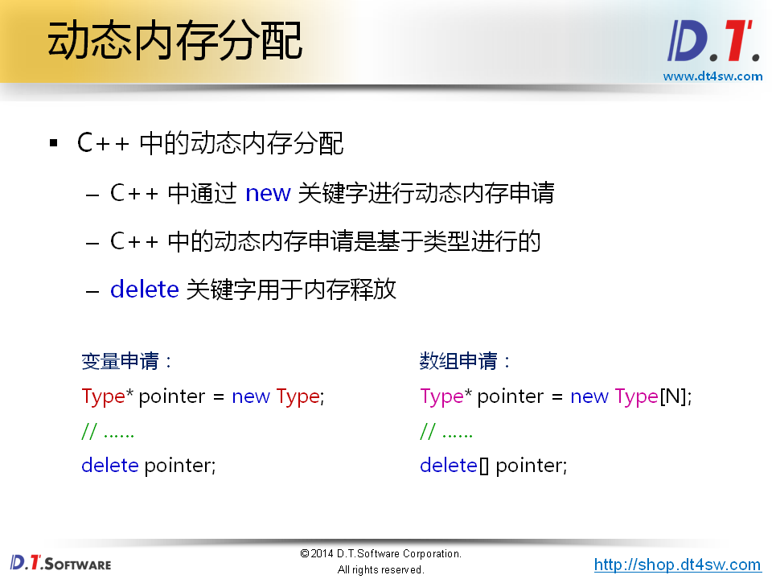
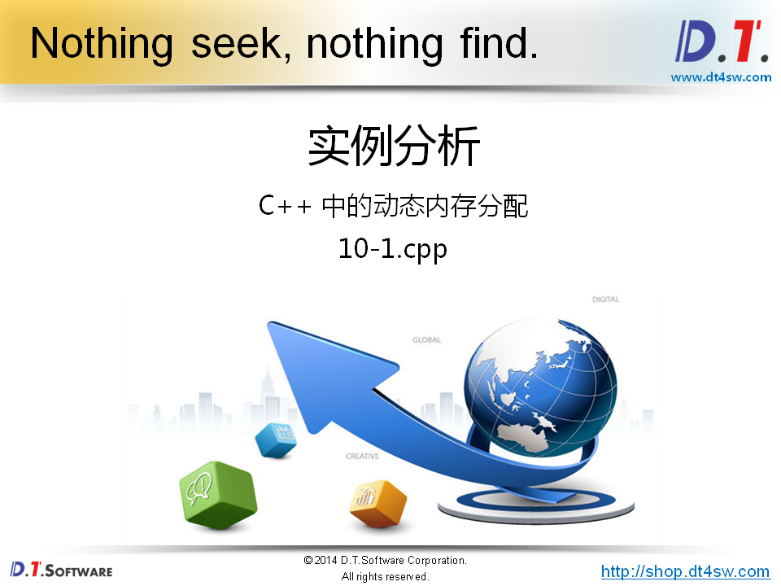
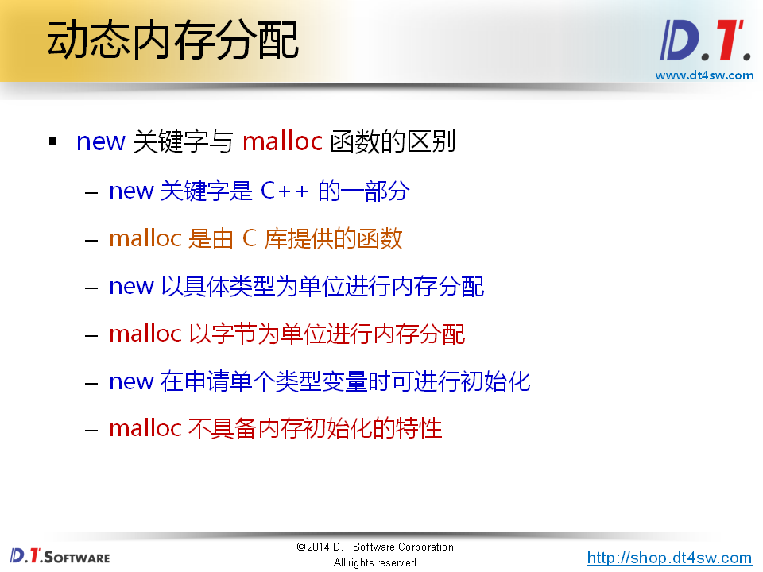
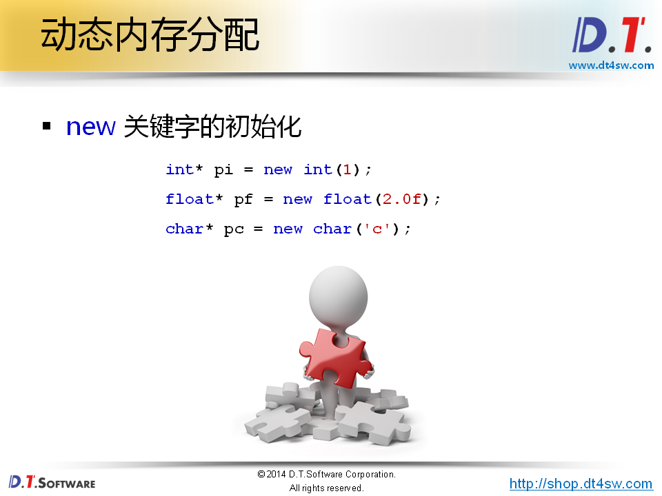
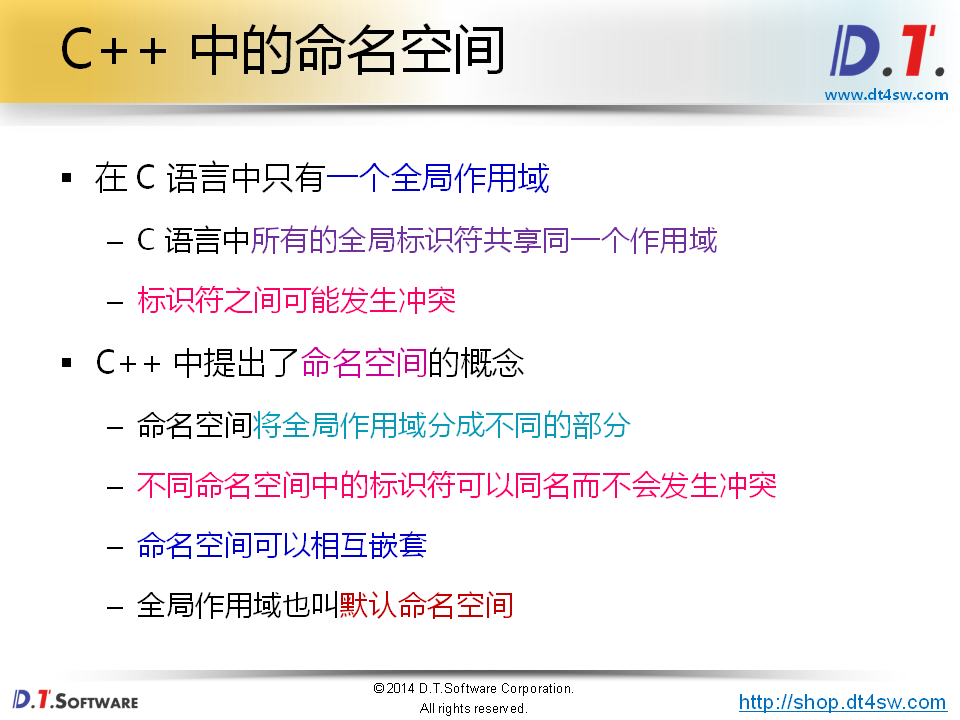
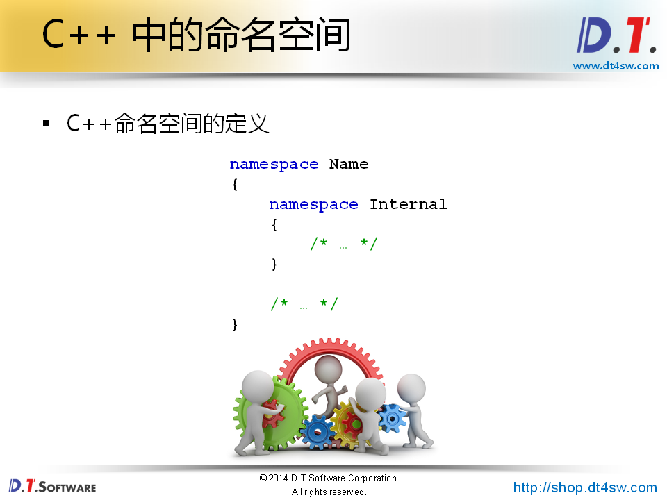
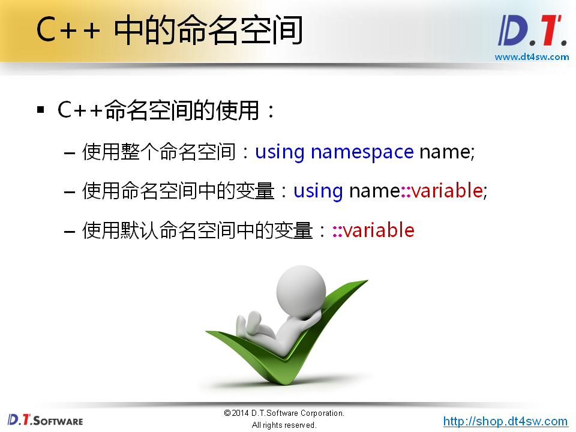

# C++中新成员函数




思考一个问题：

**为什么new会被C++中设置成关键字？**

**C++是基于类型不是基于字节申请的**



```cpp
#include <stdio.h>

int main()
{
    int* p = new int;
    
    *p = 5;
    *p = *p + 10;
    
    printf("p = %p\n", p);  
    printf("*p = %d\n", *p); // 15
    
    delete p;
    
    p = new int[10];
    
    for(int i=0; i<10; i++)
    {
        p[i] = i + 1;
        
        printf("p[%d] = %d\n", i, p[i]);
    }
    
    delete[] p;
    
    return 0;
}
```







```cpp
#include <stdio.h>

int main()
{
    int* pi = new int(1);
    // int* pa = new int[1];
    
    float* pf = new float(2.0f);
    char* pc = new char('c');

    printf("*pi = %d\n", *pi);
    printf("*pf = %f\n", *pf);
    printf("*pc = %c\n", *pc);
    
    delete pi;
    delete pf;
    delete pc;
    
    return 0;
}
```










```cpp
#include <stdio.h>

namespace First
{
    int i = 0;
}

namespace Second
{
    int i = 1;
    
    namespace Internal
    {
        struct P
        {
            int x;
            int y;
        };
    }
}

int main()
{
    using namespace First;
    using Second::Internal::P;
    
    printf("First::i = %d\n", i); // 0
    printf("Second::i = %d\n", Second::i); // 1
    
    P p = {2, 3};
    
    printf("p.x = %d\n", p.x);
    printf("p.y = %d\n", p.y);
    
    return 0;
}
```

