# 新型的类型转换

 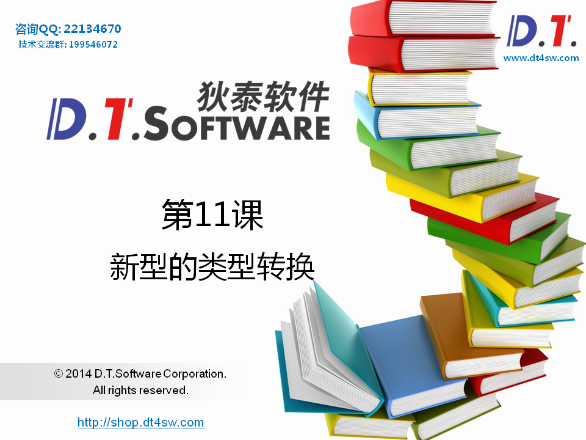


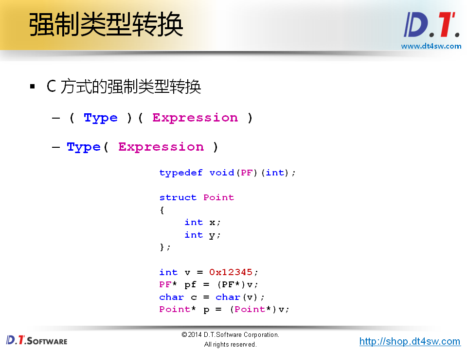


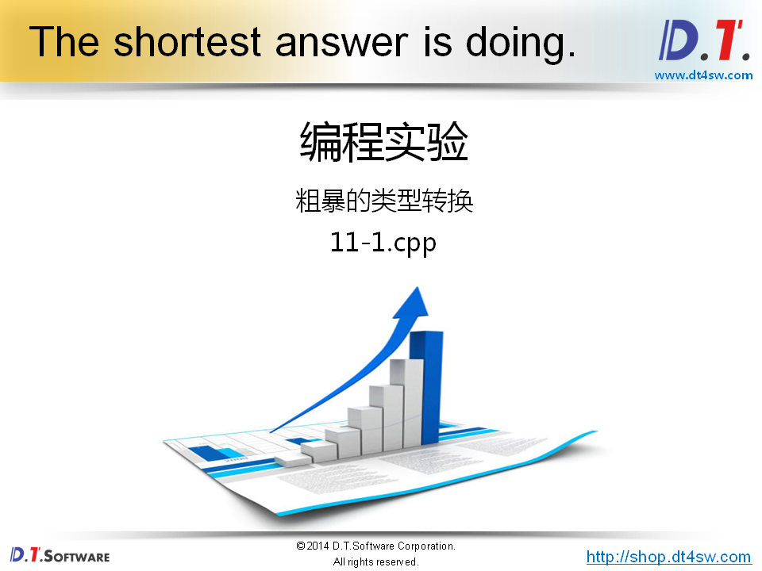

```cpp
#include <stdio.h>

typedef void(PF)(int);

struct Point
{
    int x;
    int y;
};

int main()
{
    int v = 0x12345;
    PF* pf = (PF*)v;
    char c = char(v);
    Point* p = (Point*)v;
    
    pf(5);
    
    printf("p->x = %d\n", p->x);
    printf("p->y = %d\n", p->y);

    return 0;
}
// 段错误
```

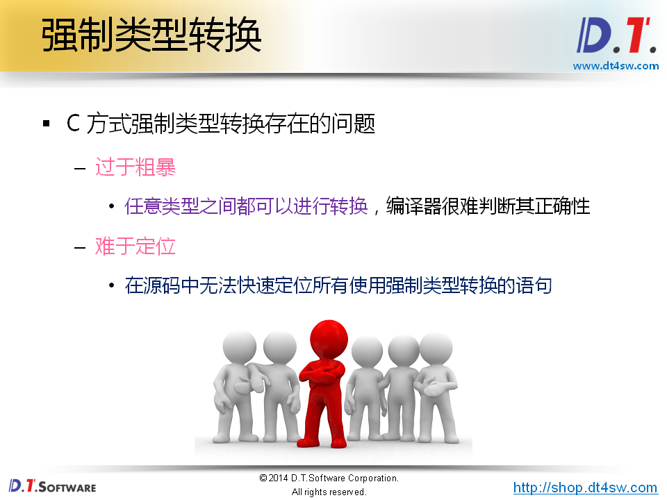


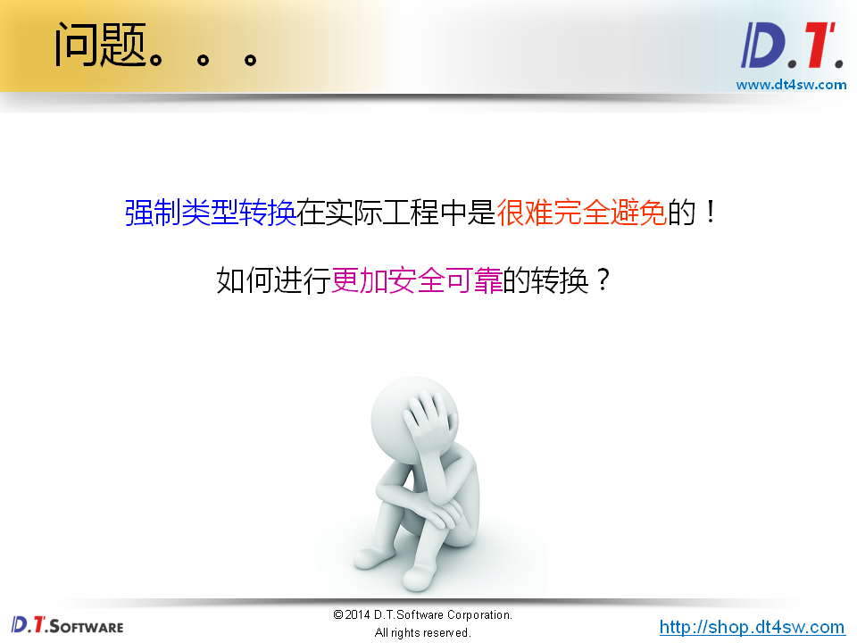


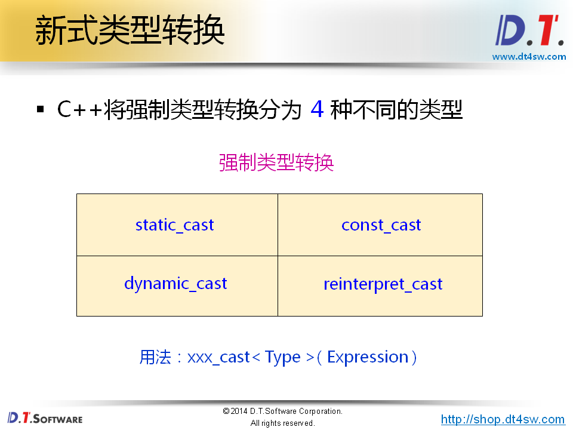


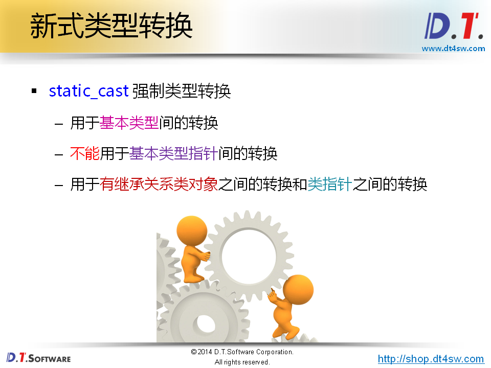

**静态的转换**

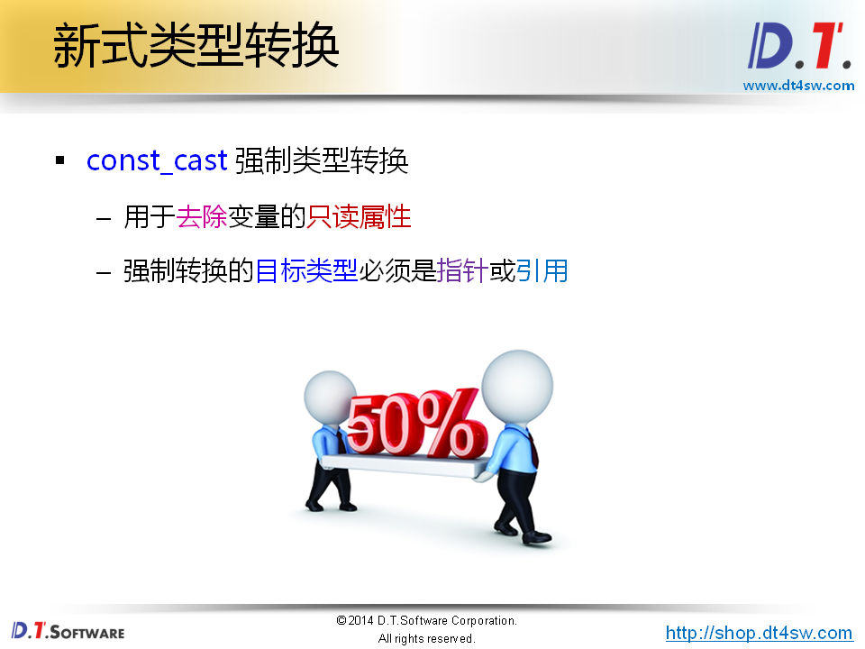

**必须是：指针或者引用**

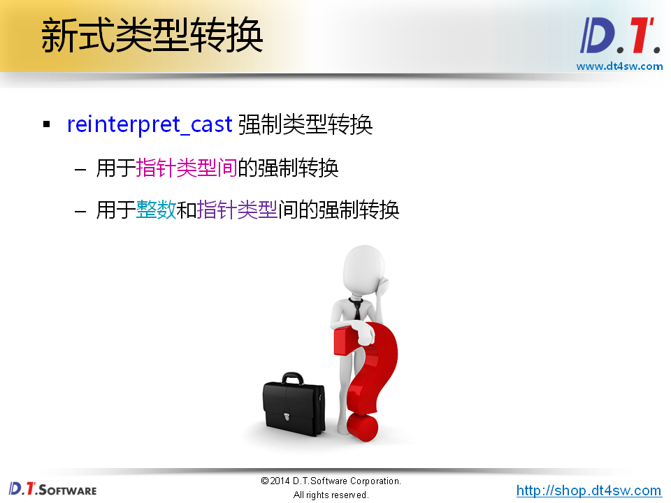

**用于指针类型间**

**也可以在嵌入式中把整数转换位指针类型**

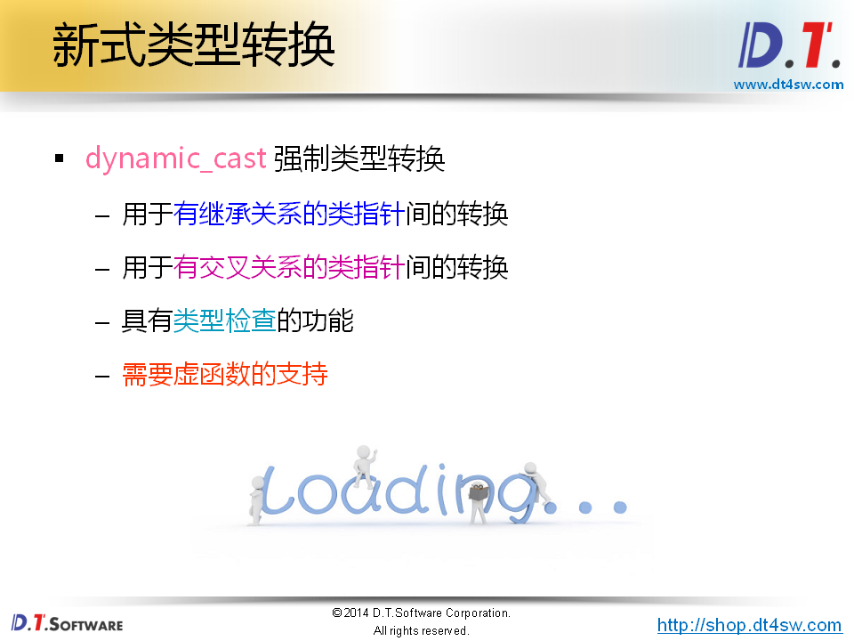

**动态类型的转换**

**只能用于指针类型的zhuanh->需要虚函数支持**

**必须记住这些规则，因为强制类型转换是bug的来源**

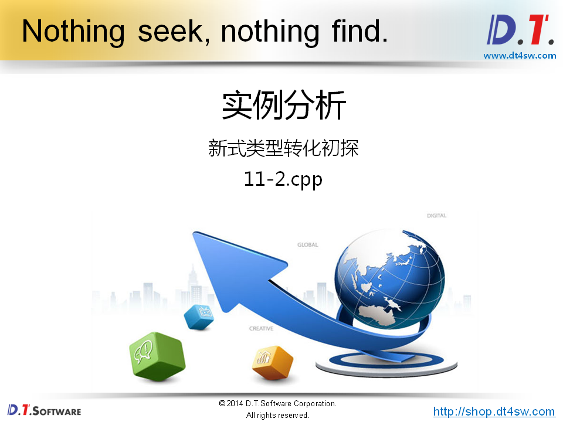

```cpp
#include <stdio.h>

void static_cast_demo()
{
    int i = 0x12345;
    char c = 'c';
    int* pi = &i;
    char* pc = &c;
    
    c = static_cast<char>(i);    // ok
    pc = static_cast<char*>(pi); // error
}

void const_cast_demo()
{
    const int& j = 1;
    int& k = const_cast<int&>(j); // ok
    
    const int x = 2;
    int& y = const_cast<int&>(x); // ok
    
    int z = const_cast<int>(x);   // error不可以只能用于引用或者指针的类型转换
    
    k = 5;
    
    printf("k = %d\n", k); // 5
    printf("j = %d\n", j); // 5
    
    y = 8;
    
    printf("x = %d\n", x);  // 2
    printf("y = %d\n", y);  // 8
    printf("&x = %p\n", &x); // 0xbfd76330
    printf("&y = %p\n", &y); // 0xbfd76330
}

void reinterpret_cast_demo()
{
    int i = 0;
    char c = 'c';
    int* pi = &i;
    char* pc = &c;
    
    pc = reinterpret_cast<char*>(pi); // ok
    pi = reinterpret_cast<int*>(pc);  // ok
    pi = reinterpret_cast<int*>(i);   // ok
    c = reinterpret_cast<char>(i);    // error(不适合基本类型的转换)
}

void dynamic_cast_demo()
{
    int i = 0;
    int* pi = &i;
    char* pc = dynamic_cast<char*>(pi); // error 类指针之间的指针转换
}

int main()
{
    static_cast_demo();
    const_cast_demo();
    reinterpret_cast_demo();
    dynamic_cast_demo();
    
    return 0;
}

```

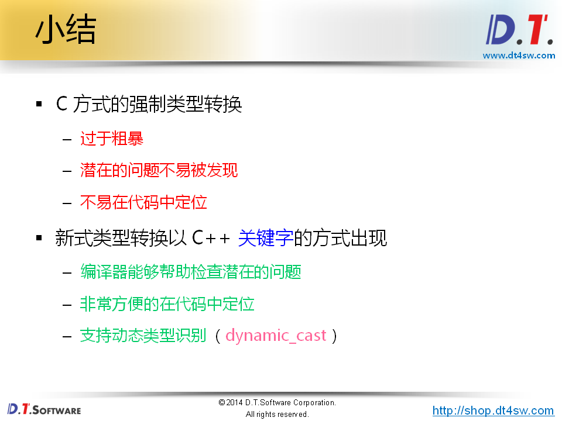