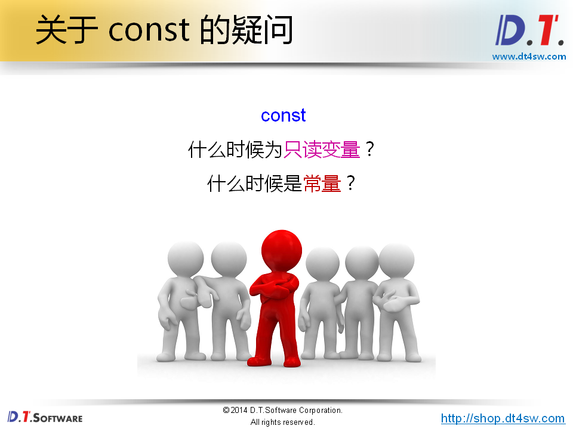
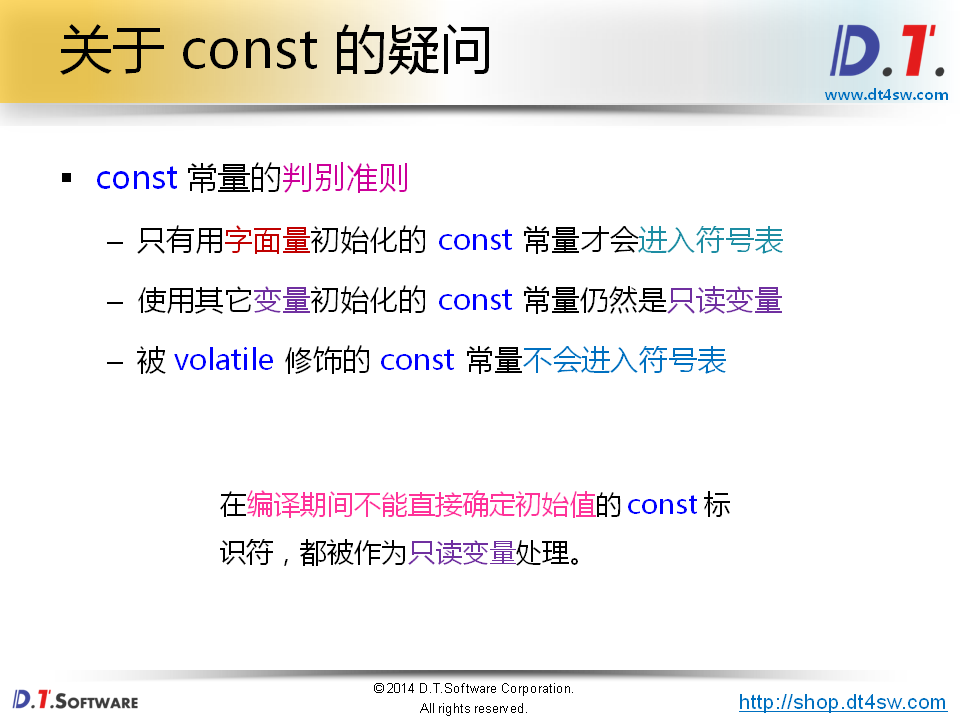
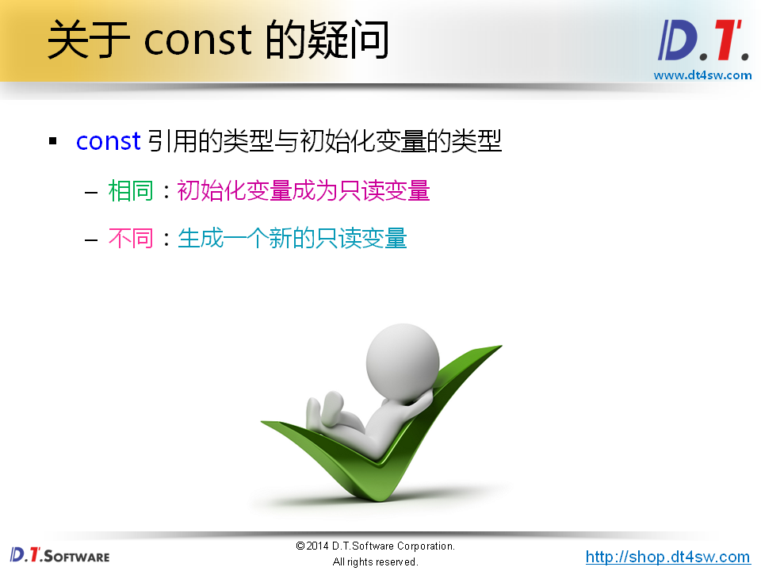
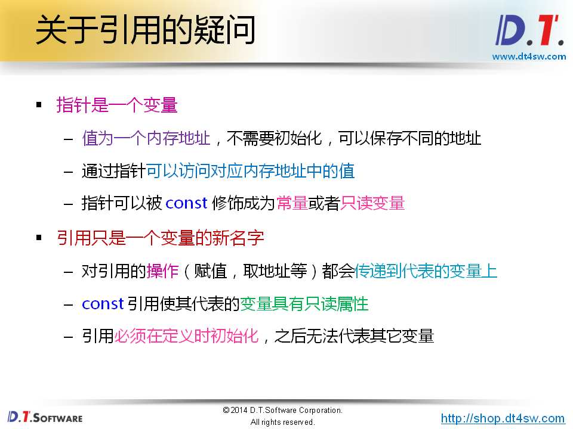
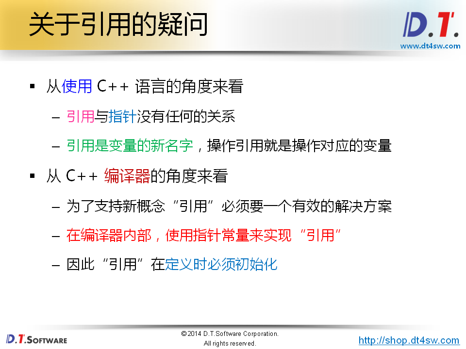
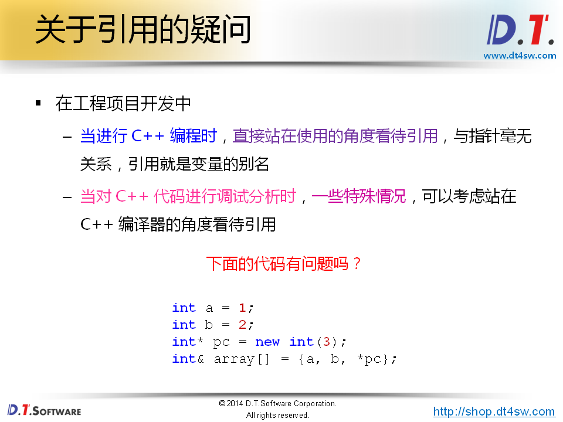
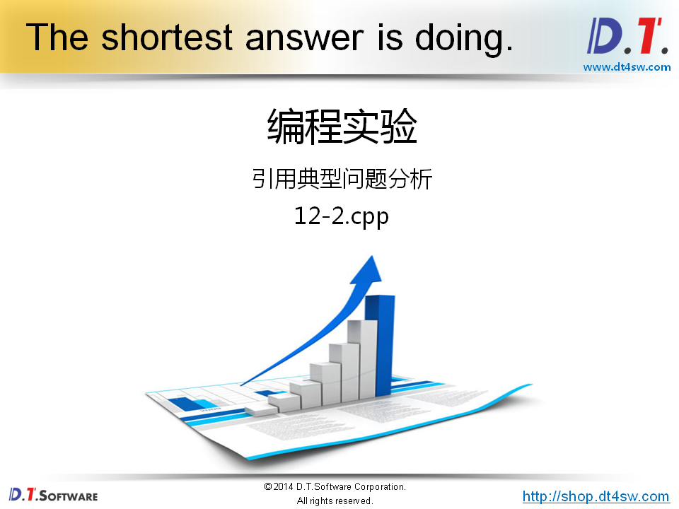
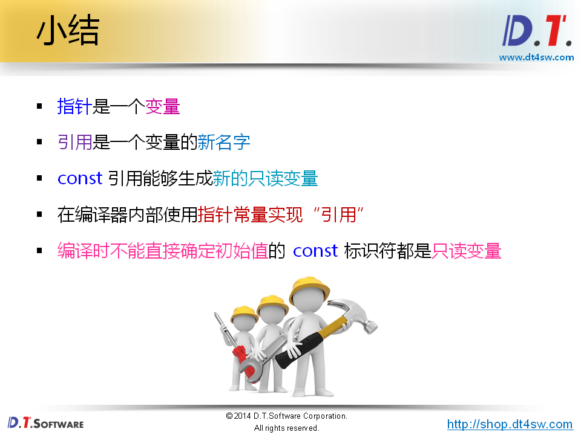

# 经典问题解析一











```cpp
#include <stdio.h>

int main()
{
    const int x = 1;
    const int& rx = x;
    
    int& nrx = const_cast<int&>(rx);
    
    nrx = 5;
    
    printf("x = %d\n", x);       // 1
    printf("rx = %d\n", rx);     // 5
    printf("nrx = %d\n", nrx);   // 5
    printf("&x = %p\n", &x);     // 0xbfc0911c
    printf("&rx = %p\n", &rx);   // 0xbfc0911c
    printf("&nrx = %p\n", &nrx); // 0xbfc0911c 
    
    volatile const int y = 2;    
    int* p = const_cast<int*>(&y);
    
    *p = 6;
    
    printf("y = %d\n", y);       // 6 因为不会放在符号表里面 
    printf("p = %p\n", p);       // 0xbfa590e0
    
    const int z = y;             // 
    
    p = const_cast<int*>(&z);
    
    *p = 7;
    
    printf("z = %d\n", z);      // 7 
    printf("p = %p\n", p);      // oxbfaa62c8栈上空间合法地址
    
    char c = 'c';
    char& rc = c;
    const int& trc = c;
    
    rc = 'a';
    
    printf("c = %c\n", c);       // a
    printf("rc = %c\n", rc);     // a
    printf("trc = %c\n", trc);   // c->const引用进入了符号表
    
    return 0;
}

```












```cpp
#include <stdio.h>

int a = 1;

struct SV
{
    int& x;
    int& y;
    int& z;
};

int main()
{
    int b = 2;
    int* pc = new int(3);
    SV sv = {a, b, *pc};
    int& array[] = {a, b, *pc}; // &array[1] - &array[0] = ?  Expected ==> 4->下面的地址发现内存不连续，破坏了C语言中数据地址连续的特性，所以C++不支持引用数组
                                // error declaration of 'array' as array of references
    printf("&sv.x = %p\n", &sv.x); // 0x804a020
    printf("&sv.y = %p\n", &sv.y); // 0xbfbfdfdc
    printf("&sv.z = %p\n", &sv.z); // 0x8f65008
    
    delete pc;
    
    return 0;
}

```

