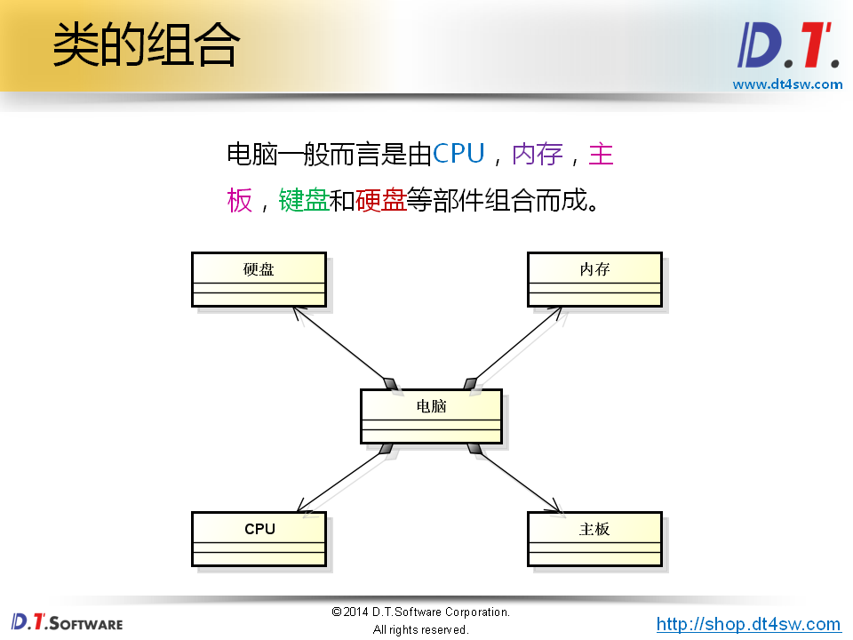
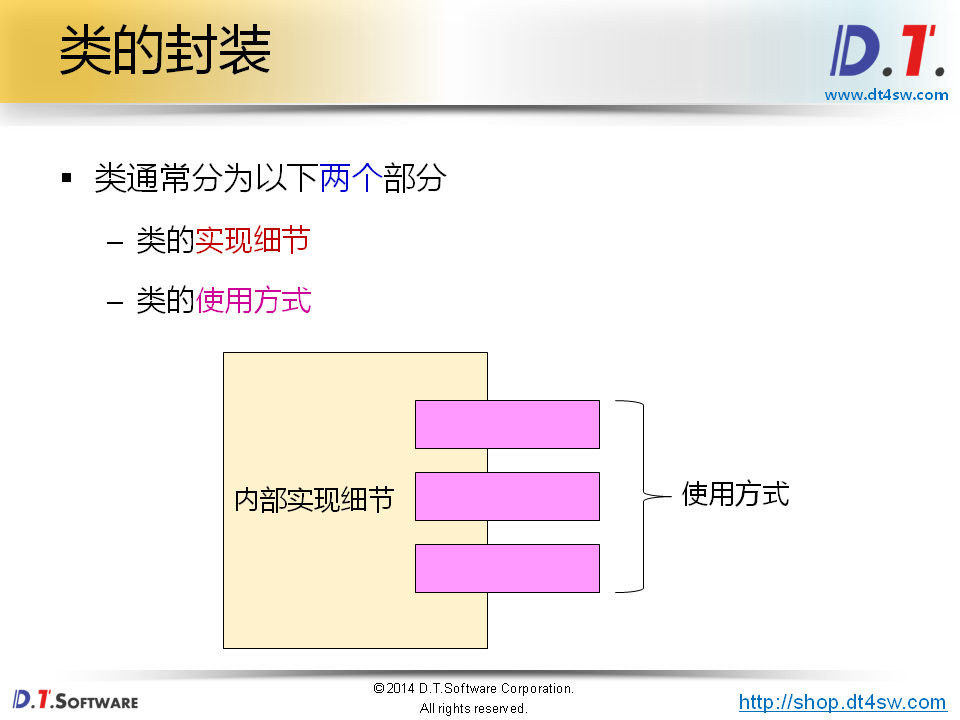
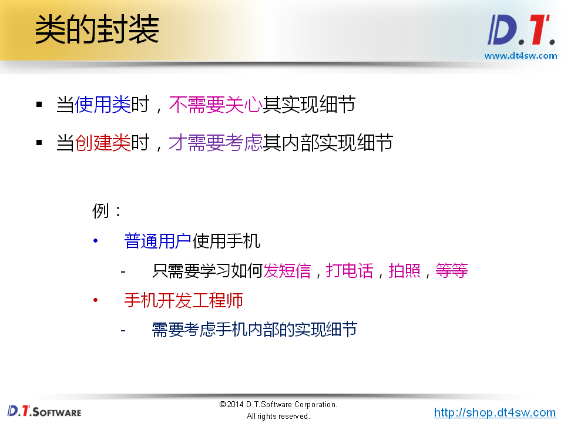
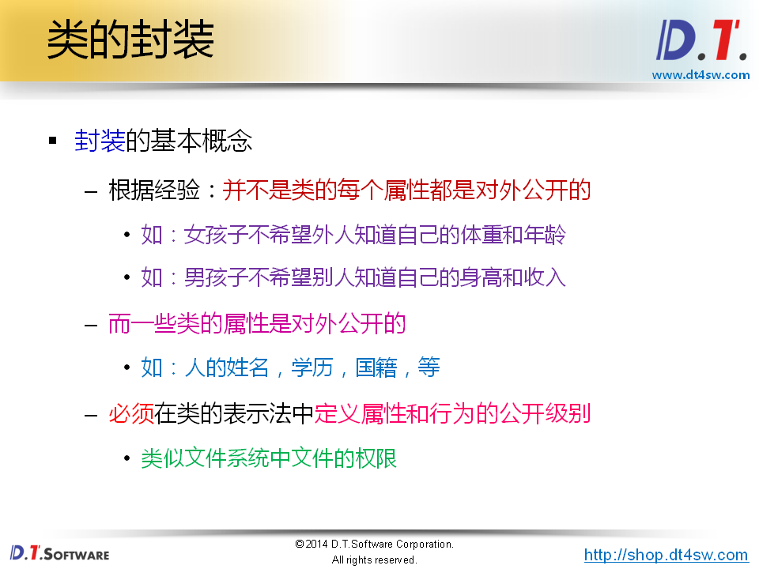
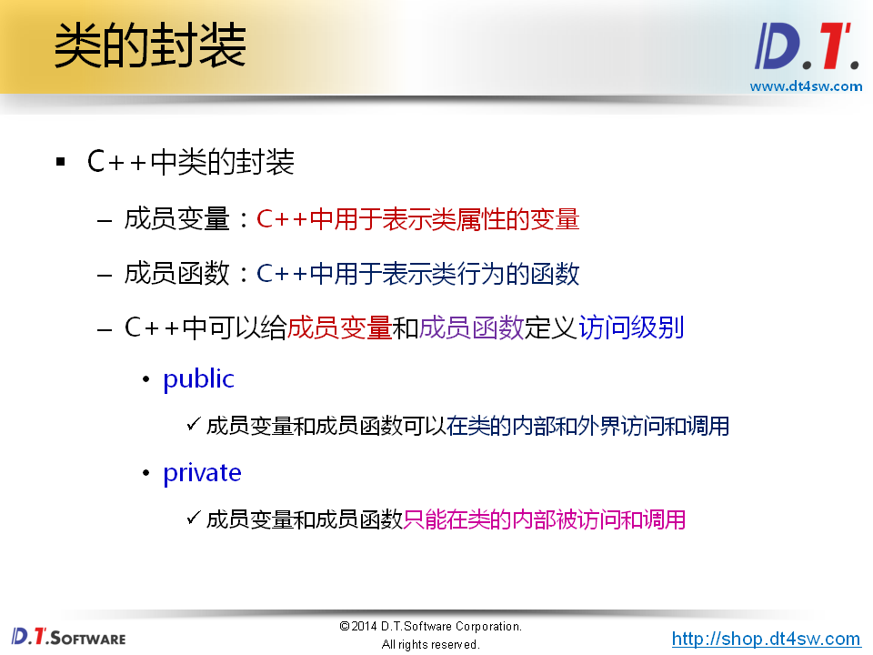
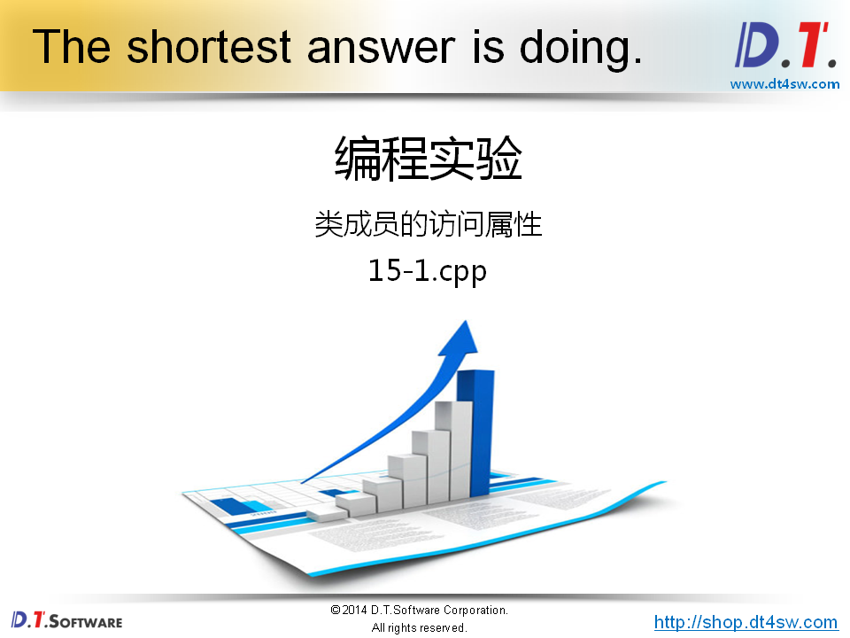
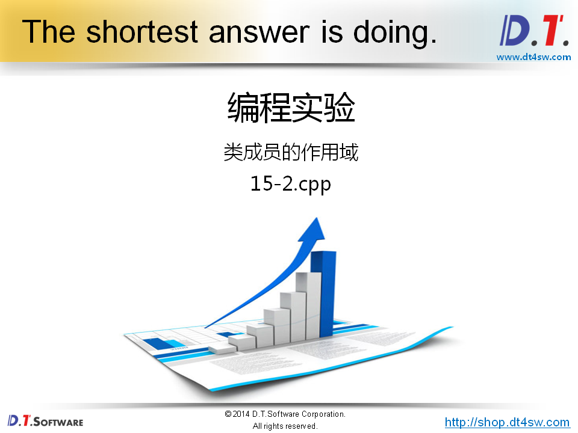
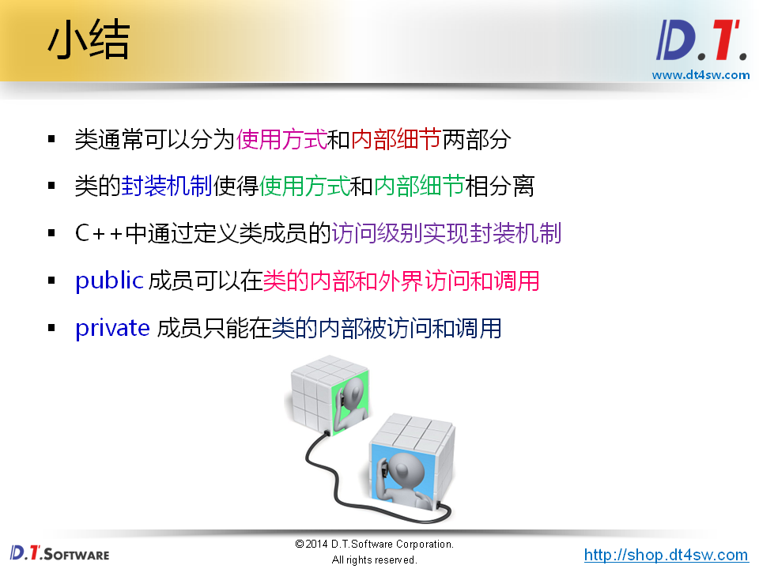

# 类与封装的概念





**几个月成为高手。**

**肯定不懂得。**









封装-》权限






```cpp
#include <stdio.h>

#include <stdio.h>

struct Biology 
{
    bool living;
};

struct Animal : Biology 
{
    bool movable;
    
    void findFood()
    { 
    }
};

struct Plant : Biology 
{
    bool growable;
};

struct Beast : Animal 
{
    void sleep() 
    { 
    }
};

struct Human : Animal 
{
    void sleep() 
    { 
        printf("I'm sleeping...\n");
    }
    
    void work() 
    { 
        printf("I'm working...\n");
    }
};

struct Girl : Human
{
private:
    int age;
    int weight;
public:
    void print()
    {
        age = 22;
        weight = 48;
        
        printf("I'm a girl, I'm %d years old.\n", age);
        printf("My weight is %d kg.\n", weight);
    }
};

struct Boy : Human
{
private:
    int height;
    int salary;
public:
    int age;
    int weight;

    void print()
    {
        height = 175;
        salary = 9000;
        
        printf("I'm a boy, my height is %d cm.\n", height);
        printf("My salary is %d RMB.\n", salary);
    }    
};

int main()
{
    Girl g;
    Boy b;
    
    g.print();
    
    b.age = 19;
    b.weight = 120;
    //b.height = 180; // error有问题，私有得成员变量
    
    b.print();
    
    return 0;
}

```

输出结果：

```bash
I'm a girl, I'm 22 years old.
My weight is 48 kg.
I'm a boy, my height is 19 cm.
My salary is 120 RMB.
```




```cpp
#include <stdio.h>

int i = 1;

struct Test
{
private:
    int i;

public:
    int j;
        
    int getI()
    {
        i = 3;
        
        return i;
    }
};

int main()
{
    int i = 2;
    
    Test test;
    
    test.j = 4;
    
    printf("i = %d\n", i);              // i = 2;
    printf("::i = %d\n", ::i);          // ::i = 1;使用全局的i
    // printf("test.i = %d\n", test.i);    // Error private:
    printf("test.j = %d\n", test.j);    // test.j = 4
    printf("test.getI() = %d\n", test.getI());  // test.getI() = 3
    
    return 0;
}

```

