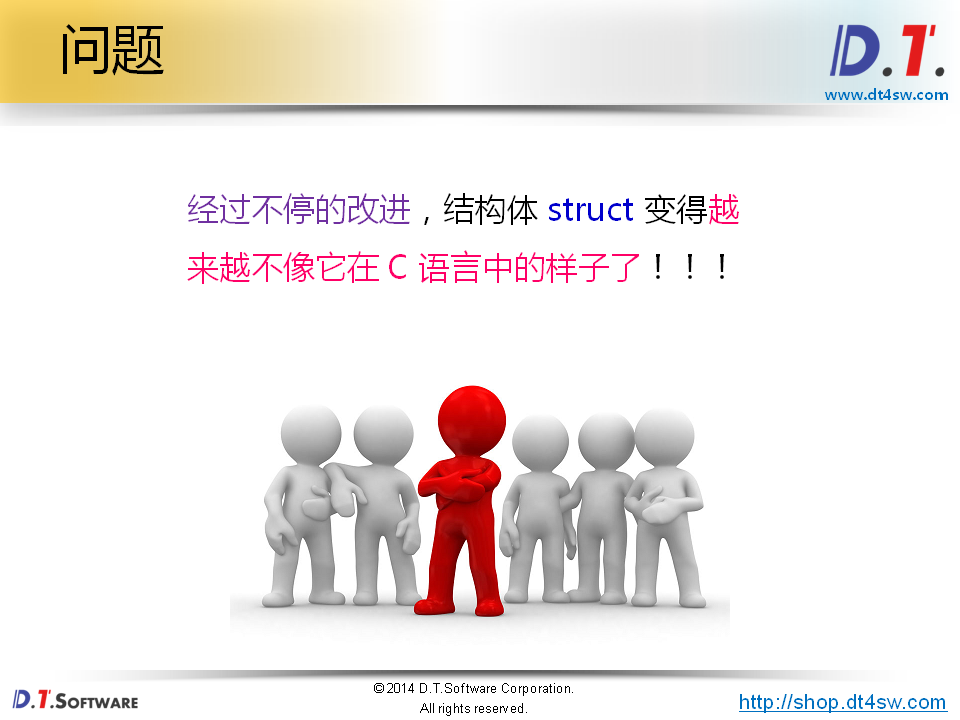
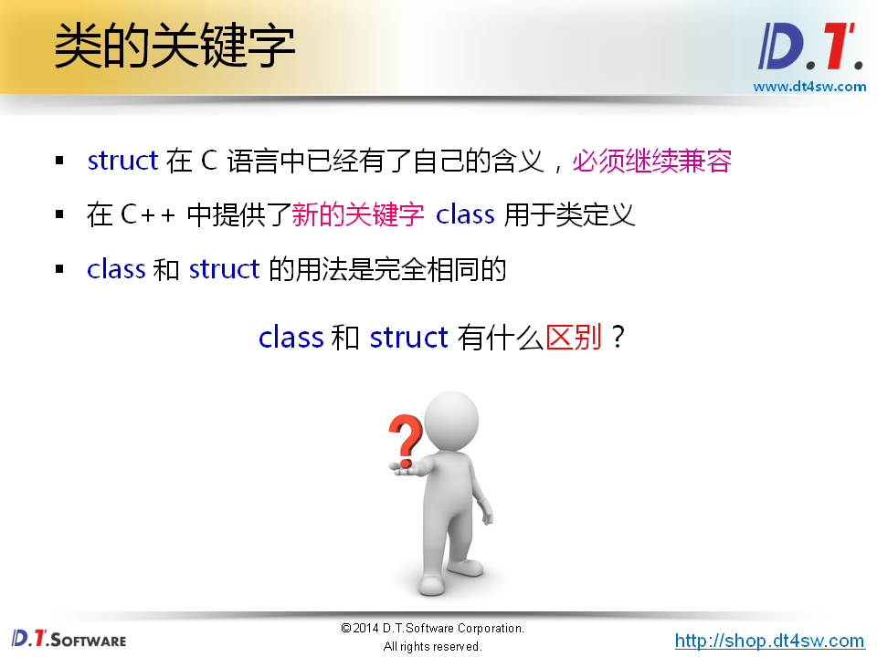
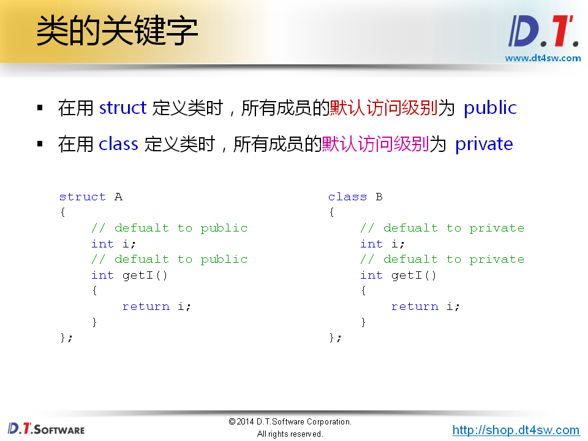
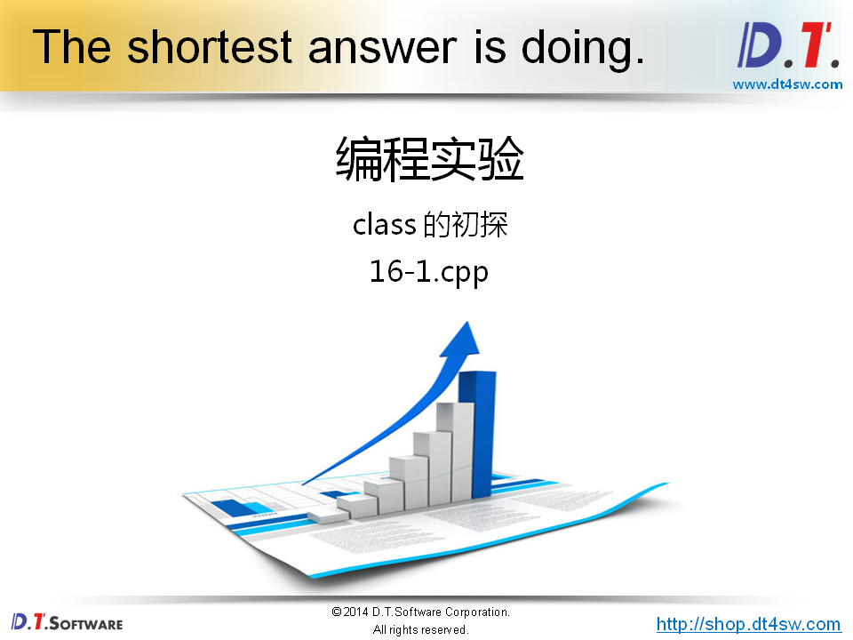
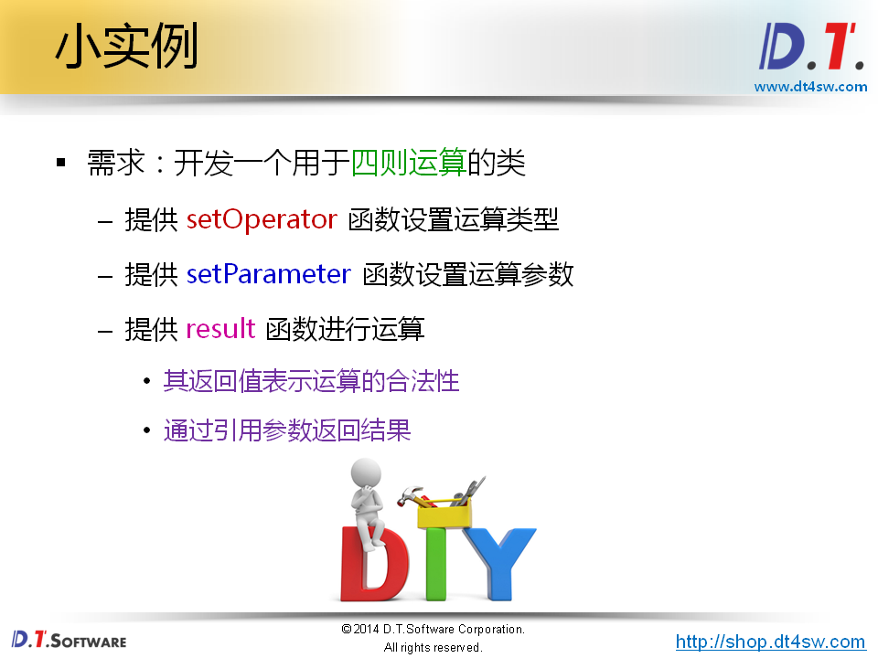
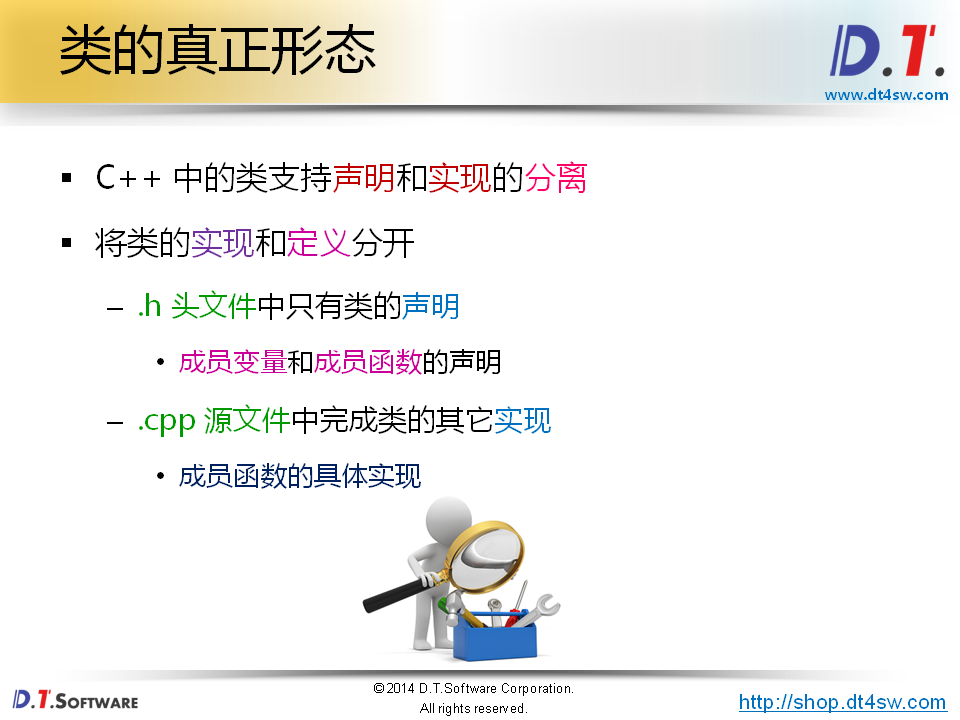
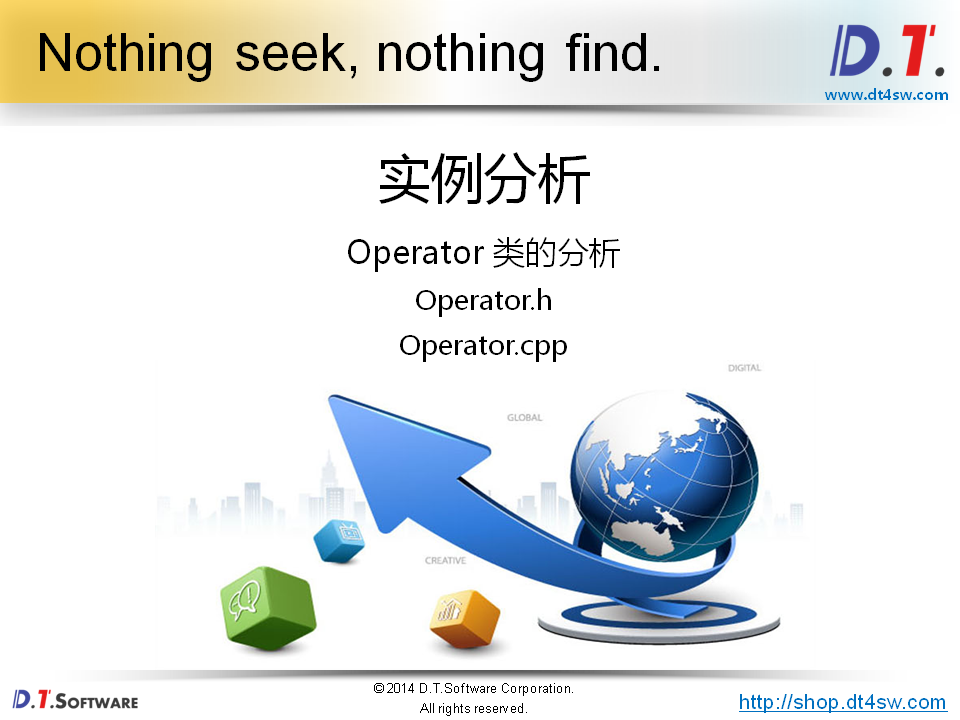
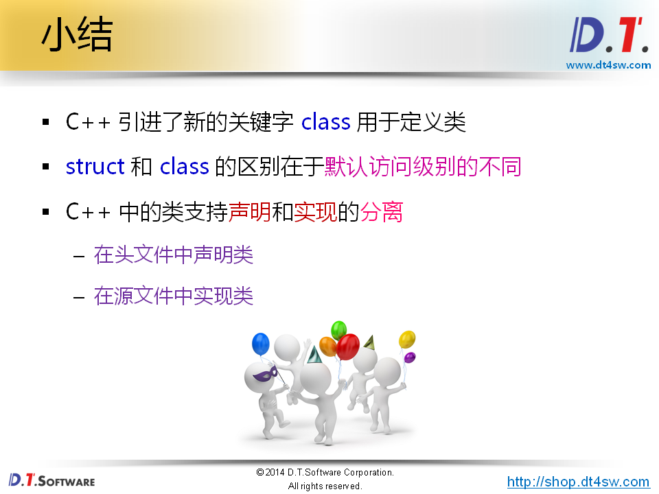

# 类的真正形态













```cpp
#include <stdio.h>

struct A
{
    // defualt to public
    int i;
    // defualt to public
    int getI()
    {
        return i;
    }
};

class B
{
    // defualt to private
    int i;
    // defualt to private
    int getI()
    {
        return i;
    }
};

int main()
{
    A a;
    B b;
    
    a.i = 4;
    
    printf("a.getI() = %d\n", a.getI());
    
    b.i = 4; // errror i is private
    
    printf("b.getI() = %d\n", b.getI()); // error getI is private
    
    return 0;
}
```



```cpp

#ifndef _OPERATOR_H_
#define _OPERATOR_H_

class Operator
{
private:
    char mOp;
    double mP1;
    double mP2;
    
public:
    bool setOperator(char op);
    void setParameter(double p1, double p2);
    bool result(double& r);
};

#endif
// Operator.h
```

```cpp
#include "Operator.h"

bool Operator::setOperator(char op)
{
    bool ret = false;
        
    if( (op == '+') || (op == '-') || (op == '*') || (op == '/') )
    {
        ret = true;
        mOp = op;
    }
    else
    {
        mOp = '\0';
    }
        
    return ret;
}

void Operator::setParameter(double p1, double p2)
{
    mP1 = p1;
    mP2 = p2;
}
    
bool Operator::result(double& r)
{
    bool ret = true;
        
    switch( mOp )
    {
        case '/':
            if( (-0.000000001 < mP2) && (mP2 < 0.000000001) )
            {
                ret = false;
            }
            else
            {
                r = mP1 / mP2;
            }
            break;
        case '+':
            r = mP1 + mP2;
            break;
        case '*':
            r = mP1 * mP2;
            break;
        case '-':
            r = mP1 - mP2;
            break;
        default:
            ret = false;
            break;
    }
        
    return ret;
}
// Operator.cpp
```

```cpp
#include <stdio.h>
#include "Operator.h"

int main()
{
    Operator op;
    double r = 0;
    
    op.setOperator('/');
    op.setParameter(9, 3);
    
    if( op.result(r) )
    {
        printf("r = %lf\n", r);
    }
    else
    {
        printf("Calculate error!\n");
    }
    
    return 0;
}
```

输出结果：

```bash
r = 3.00000
```










