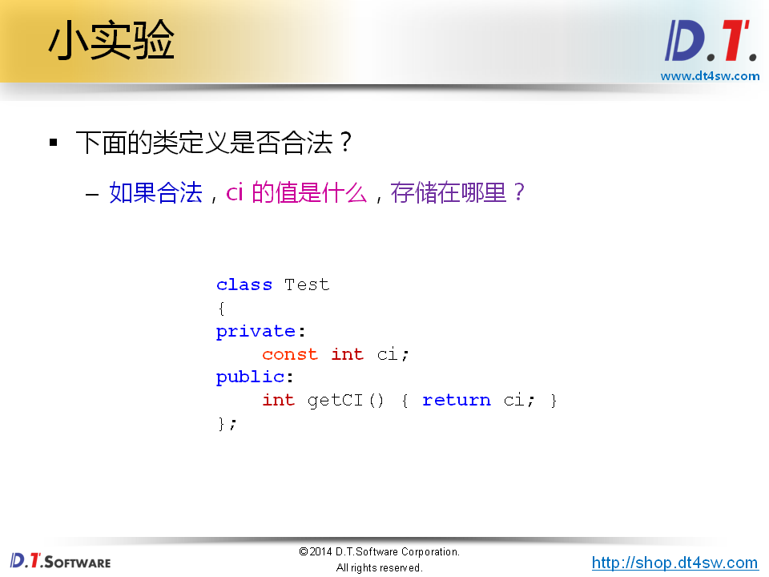
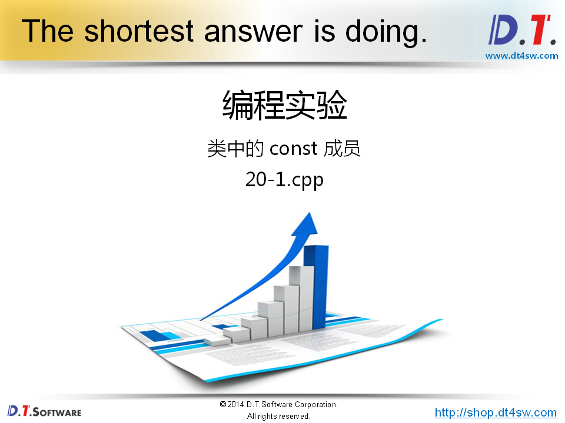
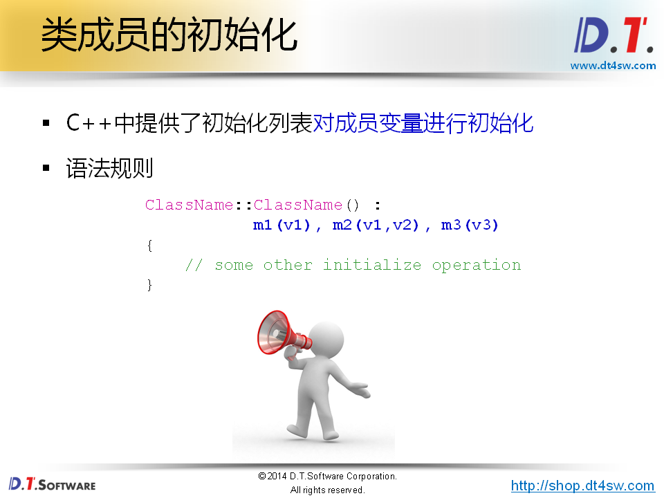
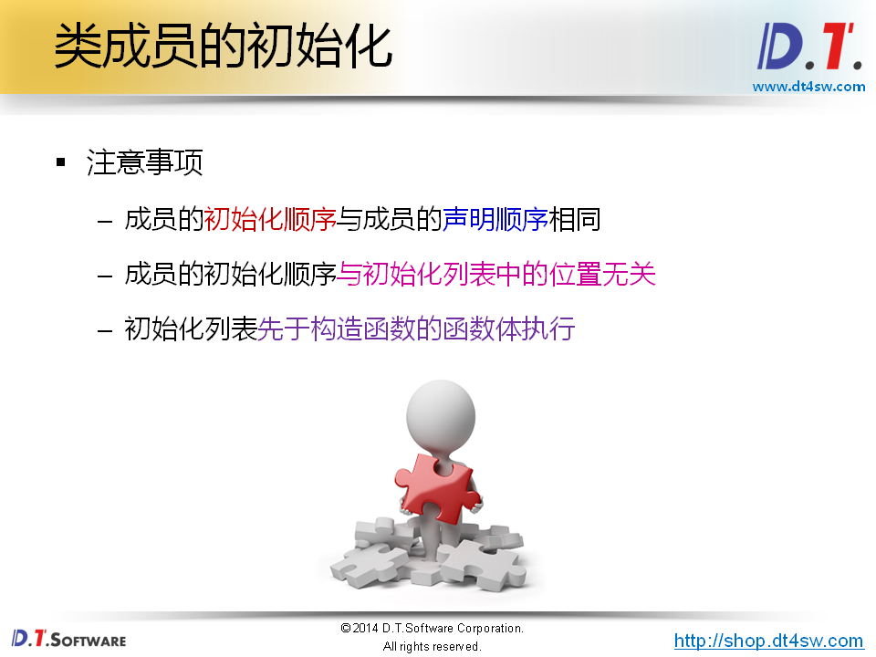
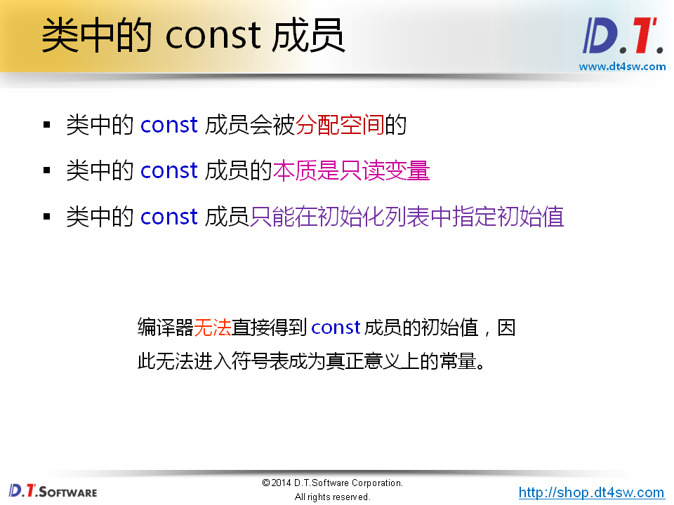
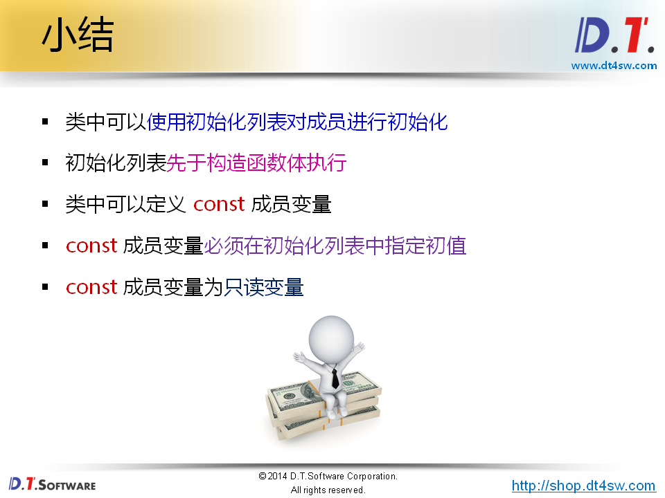

# 初始化列表的使用







```cpp
#include <stdio.h>

class Test
{
private:
    const int ci;
public:
    Test()
    {
        ci = 10; // ci is read-ony data-member
    }
    int getCI() 
    { 
        return ci; 
    }
};


int main()
{
    Test t;
    
    printf("t.ci = %d\n", t.getCI()); // error 14. t with uninitalized const member
    
    return 0;
}

```

**如何初始化类中的const成员变量**







```cpp
#include <stdio.h>

class Value
{
private:
    int mi;
public:
    Value(int i)
    {
        printf("i = %d\n", i);
        mi = i;
    }
    int getI()
    {
        return mi;
    }
};

class Test
{
private:
    Value m2; // value对象，必须在Test构造之前完成构造 ，使用初始化列表
    Value m3;
    Value m1;
public:
    Test() : m1(1), m2(2), m3(3) // 初始化列表不能决定成员的初始化顺序，顺序由声明的成员变量赋值
    {
        printf("Test::Test()\n");
    }
};


int main()
{
    Test t;
    
    return 0;
}

```





```cpp
#include <stdio.h>

class Value
{
private:
    int mi;
public:
    Value(int i)
    {
        printf("i = %d\n", i);
        mi = i;
    }
    int getI()
    {
        return mi;
    }
};

class Test
{
private:
    const int ci;
    Value m2;
    Value m3;
    Value m1;
public:
    Test() : m1(1), m2(2), m3(3), ci(100)
    {
        printf("Test::Test()\n");
    }
    int getCI()
    {
        return ci;
    }
    int setCI(int v)
    {
        int* p = const_cast<int*>(&ci);
        
        *p = v;
    }
};


int main()
{
    Test t;
    
    printf("t.ci = %d\n", t.getCI());
    
    t.setCI(10);
    
    printf("t.ci = %d\n", t.getCI());
    
    return 0;
}

```


