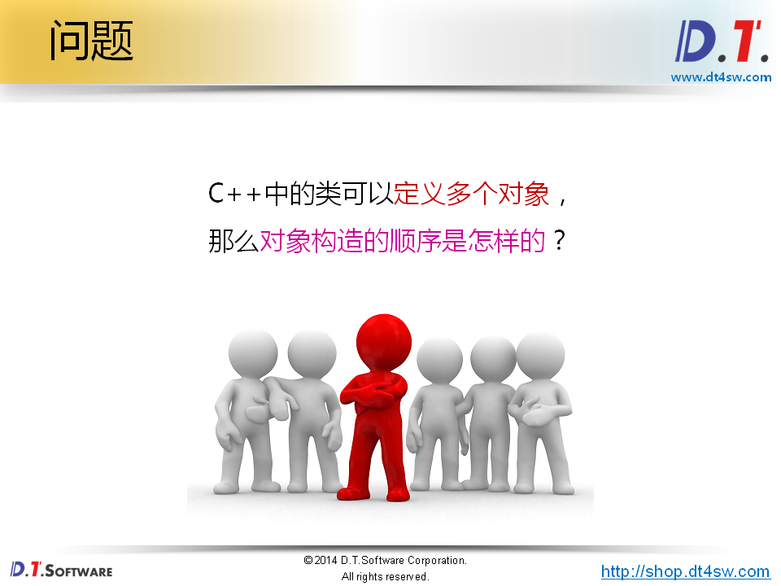
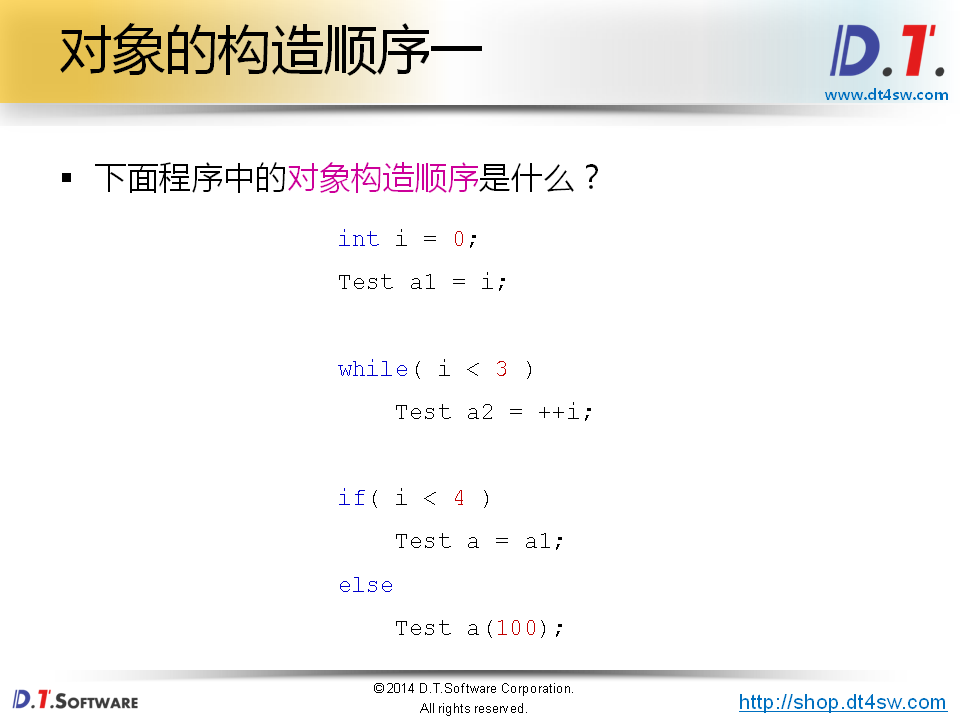
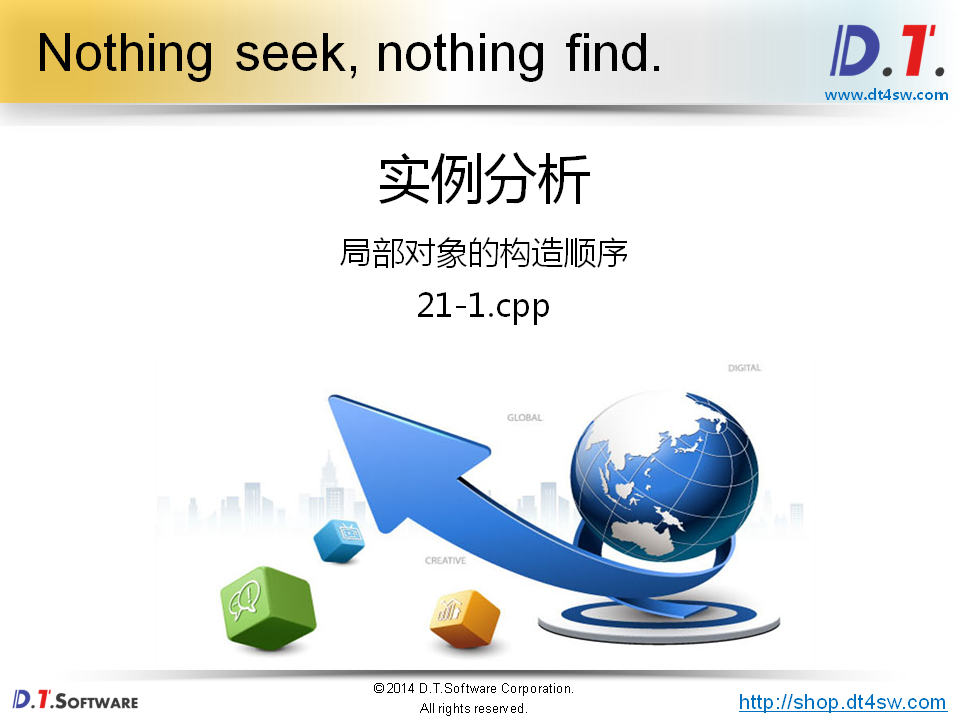
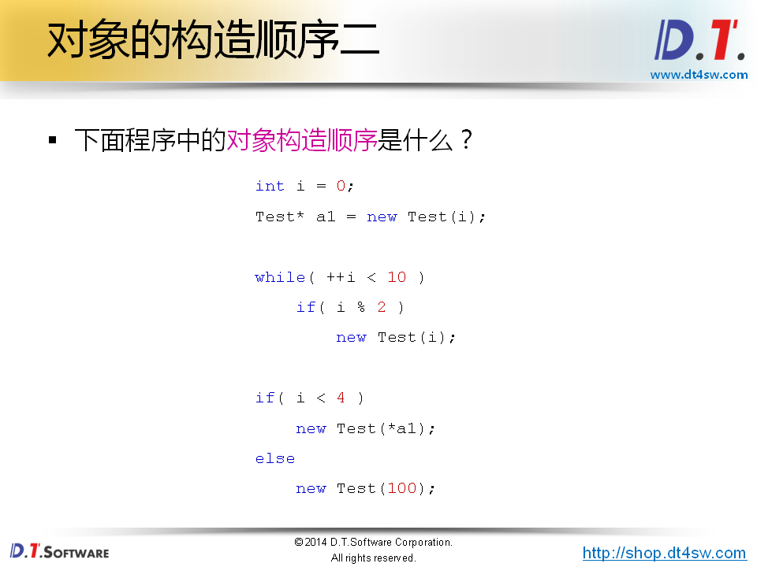
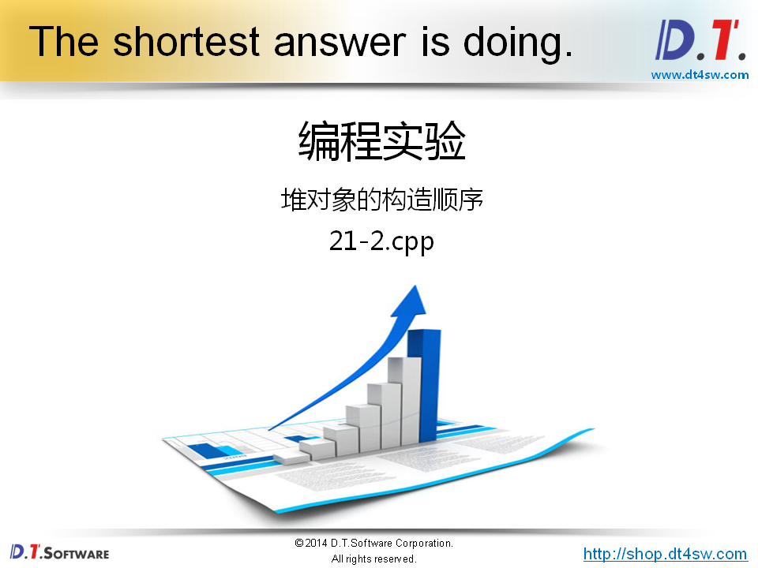
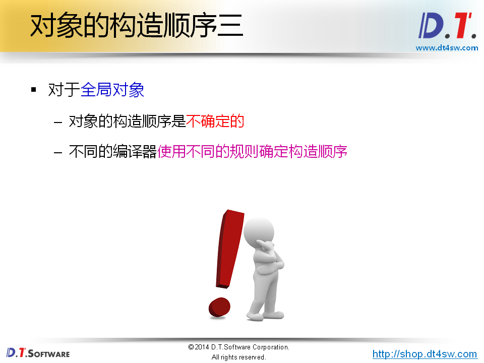

# 对象的构造顺序







```bash
0
1 2 3
0
```



```cpp
#include <stdio.h>

class Test
{
private:
    int mi;
public:
    Test(int i)
    {
        mi = i;
        printf("Test(int i): %d\n", mi);
    }
    Test(const Test& obj)
    {
        mi = obj.mi;
        printf("Test(const Test& obj): %d\n", mi);
    }
};

int main()
{
    int i = 0;
    Test a1 = i; // Test(int i): 0
        
    while( i < 3 ) 
    {
        Test a2 = ++i;// Test(int i): 1, 2, 3
    }
        
    if( i < 4 )
    {
        Test a = a1; // Test(const Testkl& obj): 0
    }
    else
    {
        Test a(100);
    }

    return 0;
}

```

```cpp
#include <stdio.h>

class Test
{
private:
    int mi;
public:
    Test(int i)
    {
        mi = i;
        printf("Test(int i): %d\n", mi);
    }
    Test(const Test& obj)
    {
        mi = obj.mi;
        printf("Test(const Test& obj): %d\n", mi);
    }
    int getMi()
    {
        return mi;
    }
};

int main()
{
    int i = 0;
    Test a1 = i; // Test(int i): 0
        
    while( i < 3 )
    {
        Test a2 = ++i; // Test(int i): 1, 2, 3
    }
goto End;       
        Test a(100);
End:
    printf("a.mi = %d\n", a.getMi());
    return 0;
}

// error，使用初始化的对象，随机值
```







```cpp
#include <stdio.h>

class Test
{
private:
    int mi;
public:
    Test(int i)
    {
        mi = i;
        printf("Test(int i): %d\n", mi);
    }
    Test(const Test& obj)
    {
        mi = obj.mi;
        printf("Test(const Test& obj): %d\n", mi);
    }
    int getMi()
    {
        return mi;
    }
};

int main()
{
    int i = 0;
    Test* a1 = new Test(i); // Test(int i): 0
        
    while( ++i < 10 )
        if( i % 2 )
            new Test(i); // Test(int i): 1, 3, 5, 7, 9
        
    if( i < 4 )
        new Test(*a1);
    else
        new Test(100); // Test(int i): 100
        
    return 0;
}
// goto语句影响程序的执行流

```



**全局对象的构造必须在main函数执行之前构造，因为在main之前，所以不存在执行流的问题，所以顺序也就不确定，和编译器强相关；**


```cpp
#ifndef _TEST_H_
#define _TEST_H_

#include <stdio.h>

class Test
{
public:
    Test(const char* s)
    {
        printf("%s\n", s);
    }
};

#endif
```

```cpp
#include "test.h"

Test t1("t1");

```

```cpp
#include "test.h"

Test t2("t2");

```

```cpp
#include "test.h"

Test t3("t3");

```

```cpp
output:
t3 t1 t2 t4 t5
不同编译器的输出结果不一样
```


**goto语句破坏了程序的执行流**