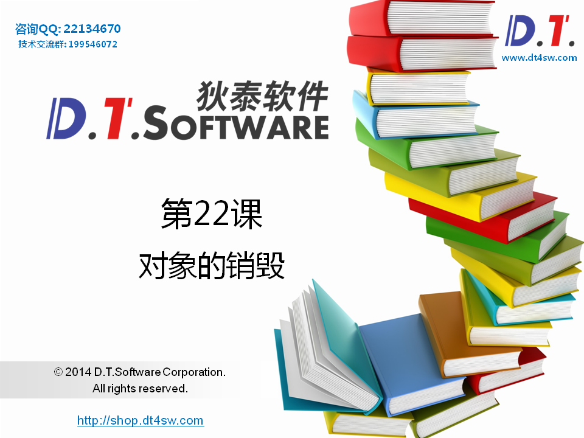
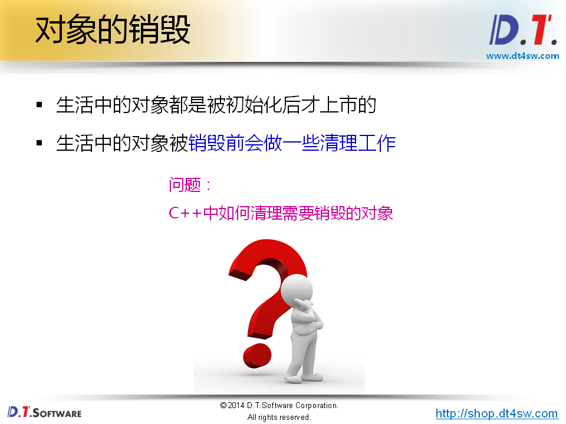
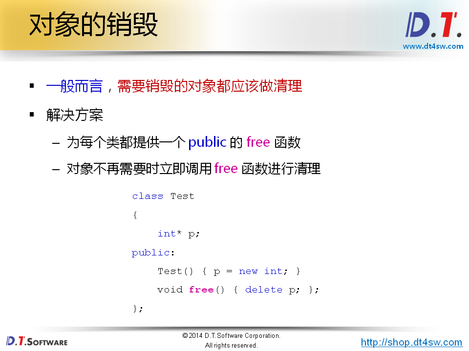
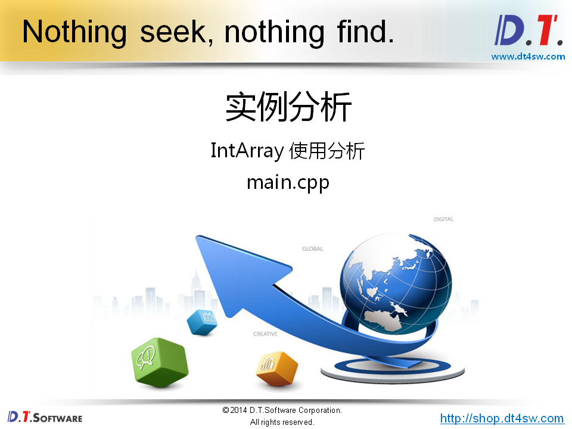
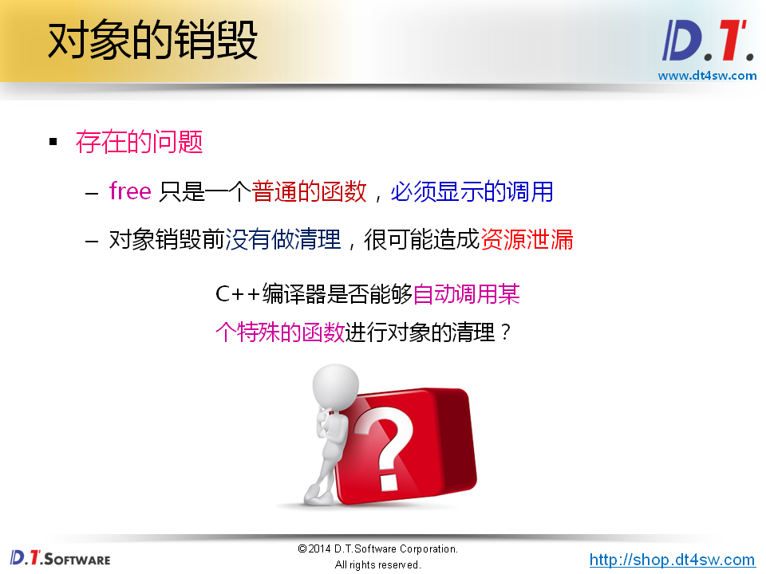
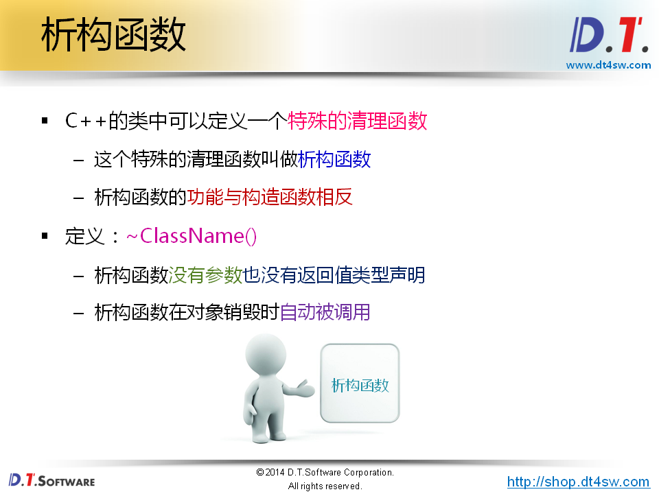
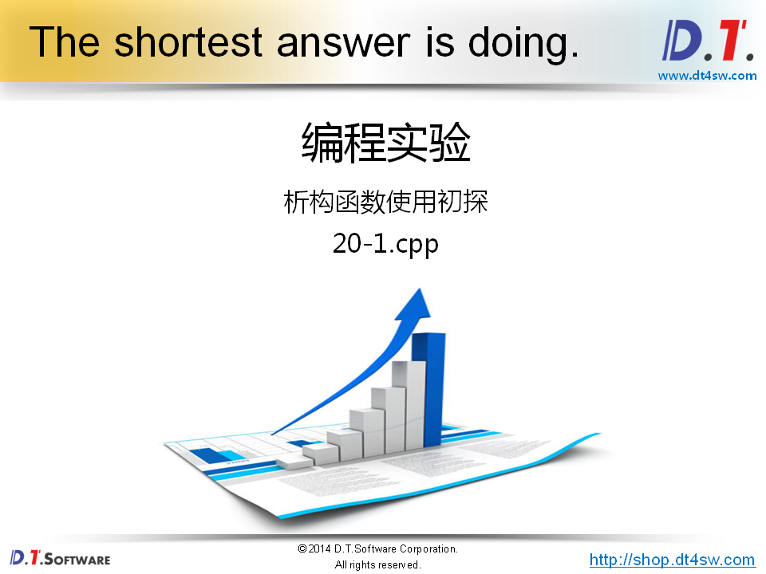
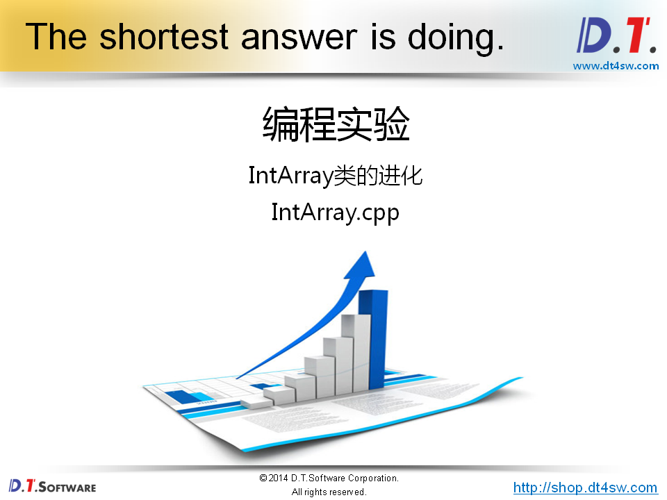
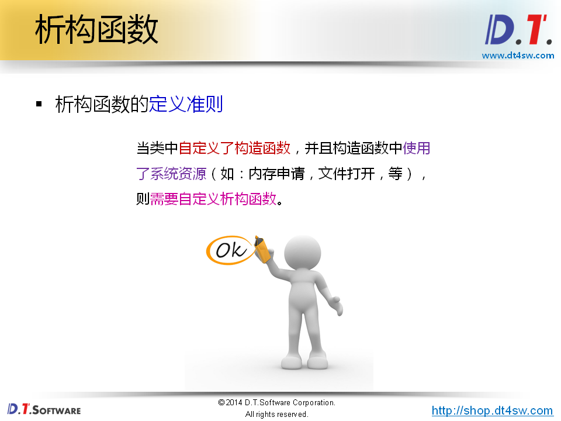
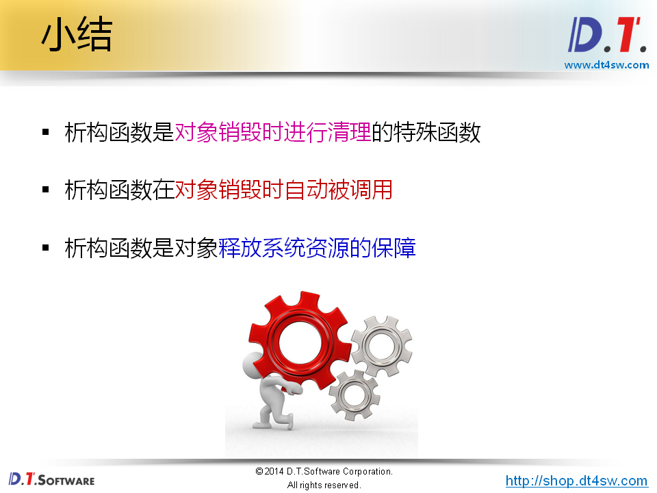

# 对象的销毁













```cpp
#include <stdio.h>
#include "IntArray.h"

int main()
{
    IntArray a(5);    
    
    for(int i=0; i<a.length(); i++)
    {
        a.set(i, i + 1);
    }
    
    for(int i=0; i<a.length(); i++)
    {
        int value = 0;
        
        if( a.get(i, value) )
        {
            printf("a[%d] = %d\n", i, value);
        }
    }
    
    IntArray b = a;
    
    for(int i=0; i<b.length(); i++)
    {
        int value = 0;
        
        if( b.get(i, value) )
        {
            printf("b[%d] = %d\n", i, value);
        }
    }
    
    a.free();// 容易忘记
    b.free();// 容易忘记
    return 0;
}

```






**析构函数不能重载** 



```cpp
#include <stdio.h>

class Test
{
    int mi;
public:
    Test(int i)
    {
        mi = i;
        printf("Test(): %d\n", mi);
    }
    ~Test()
    {
        printf("~Test(): %d\n", mi);
    }
};

int main()
{
    Test t(1);
    
    Test* pt = new Test(2);
    
    delete pt;
    
    return 0;
}

```

```bash
output:
Test(): 1
Test(): 2
~Test(): 2
~Test(): 1
```



```cpp
#include "IntArray.h"

IntArray::IntArray(int len)
{
    m_pointer = new int[len];
    
    for(int i=0; i<len; i++)
    {
        m_pointer[i] = 0;
    }
    
    m_length = len;
}

IntArray::IntArray(const IntArray& obj)
{
    m_length = obj.m_length;
    
    m_pointer = new int[obj.m_length];
    
    for(int i=0; i<obj.m_length; i++)
    {
        m_pointer[i] = obj.m_pointer[i];
    }
}

int IntArray::length()
{
    return m_length;
}

bool IntArray::get(int index, int& value)
{
    bool ret = (0 <= index) && (index < length());
    
    if( ret )
    {
        value = m_pointer[index];
    }
    
    return ret;
}

bool IntArray::set(int index, int value)
{
    bool ret = (0 <= index) && (index < length());
    
    if( ret )
    {
        m_pointer[index] = value;
    }
    
    return ret;
}

IntArray::~IntArray()
{
    delete[]m_pointer;
}

```



**RAII**

