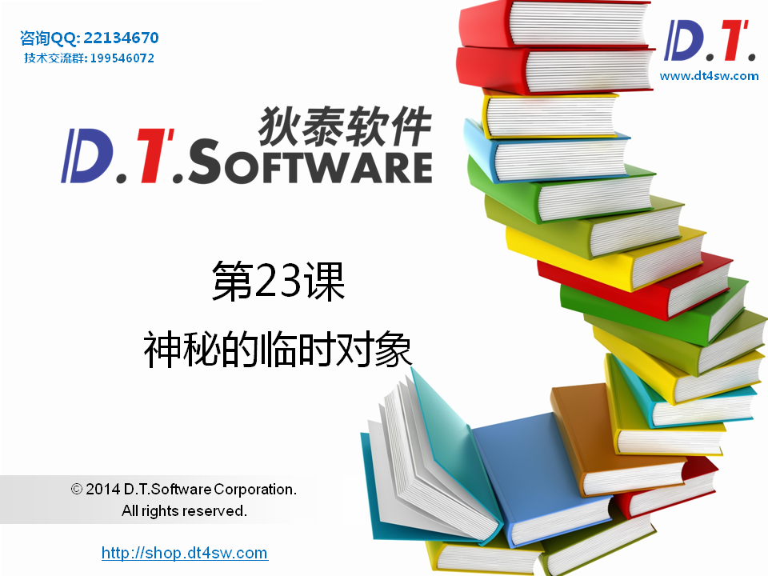
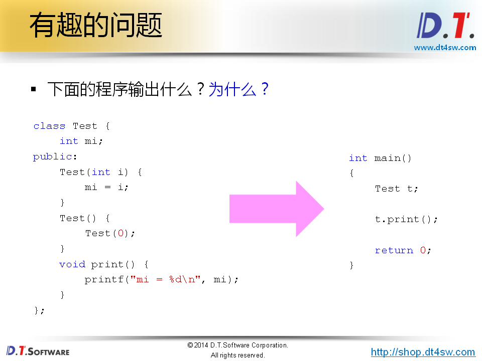
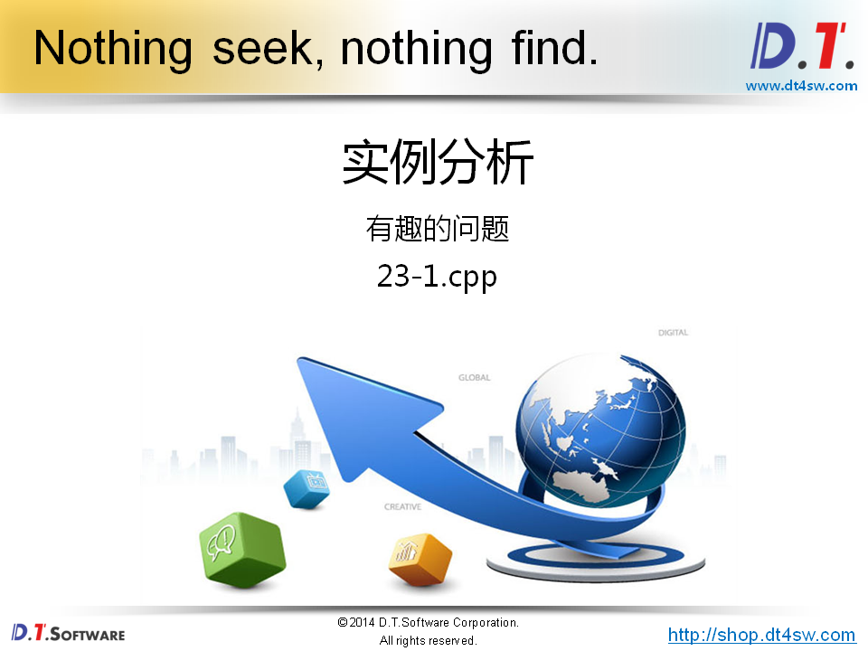
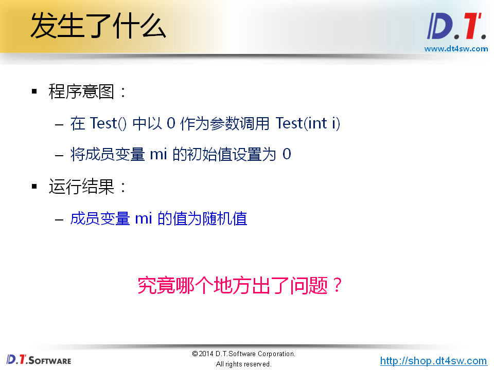
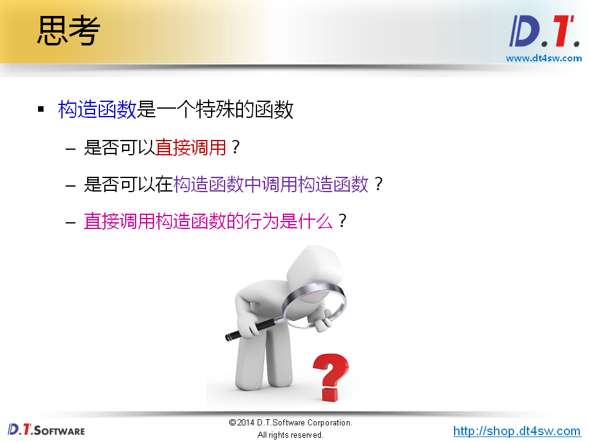
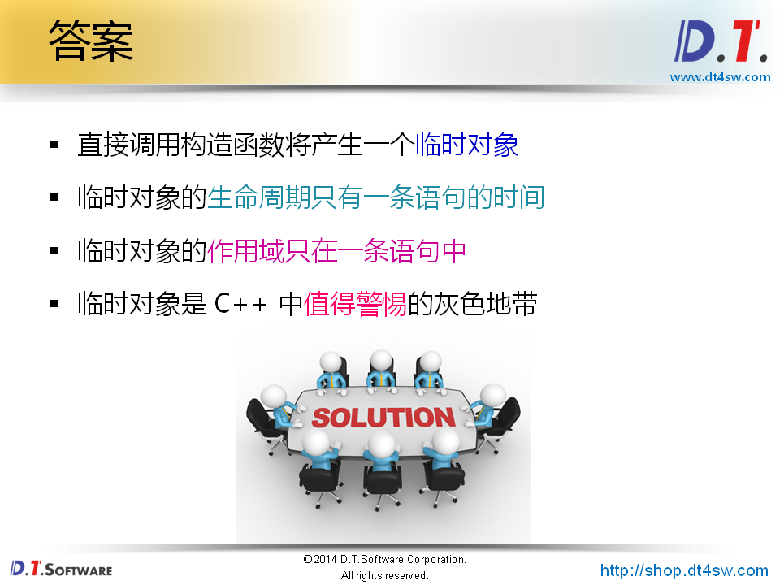
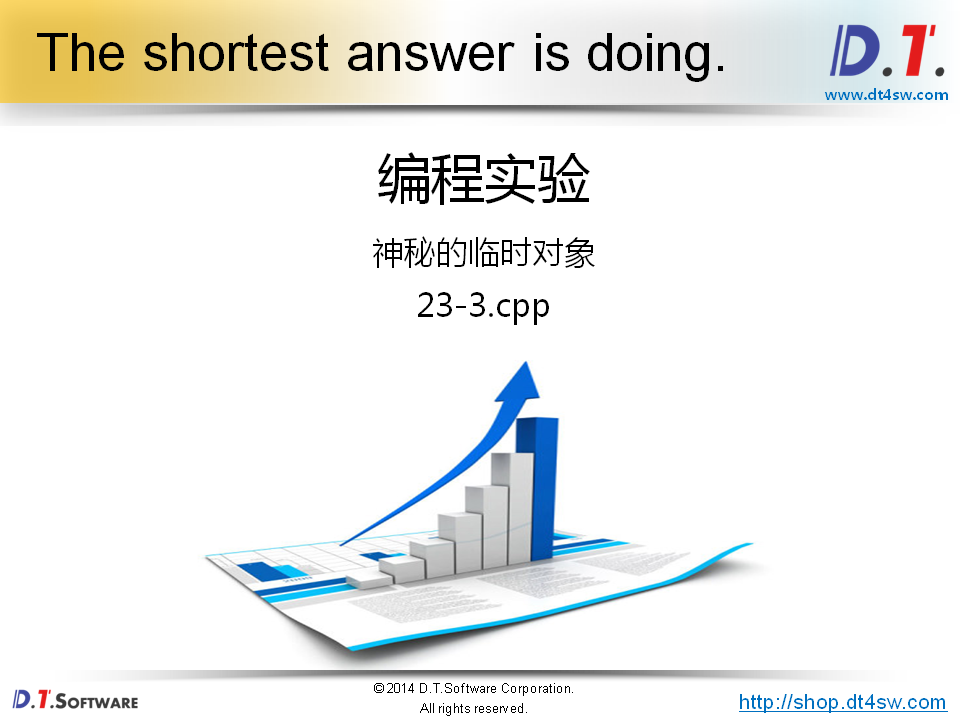
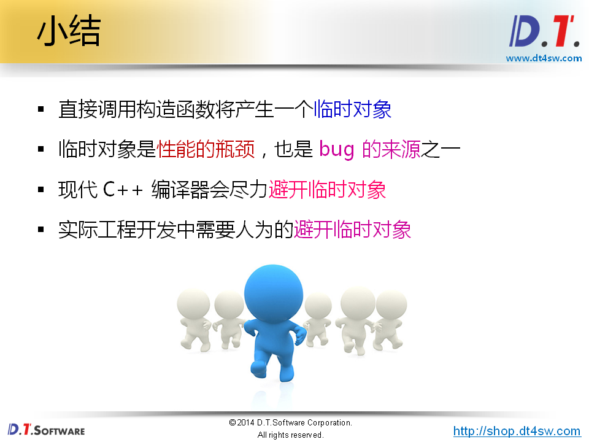

# 神奇的临时对象










```cpp
#include <stdio.h>

class Test {
    int mi;
public:
    Test(int i) {
        mi = i;
    }
    Test() {
        Test(0); // 调用构造函数
    }
    void print() {
        printf("mi = %d\n", mi);
    }
};


int main()
{
    Test t;
    
    t.print();

    return 0;
}

```

```cpp
输出：
    随机值
```



**Test(0)是临时对象，只在当前行有效**



**可以手工调用构造函数**

**语法合法**

**直接调用构造函数将产生一个临时对象**




```cpp
#include <stdio.h>

class Test {
    int mi;
    
    void init(int i)
    {
        mi = i;
    }
public:
    Test(int i) {
        init(i);
    }
    Test() {
        init(0);
    }
    void print() {
        printf("mi = %d\n", mi);
    }
};


int main()
{
    Test t;
    
    t.print();

    return 0;
}

```

```
直接调用成员函数，不会生成临时对象
输出：
 mi = 0
```




```cpp
#include <stdio.h>

class Test
{
    int mi;
public:
    Test(int i)
    {
        printf("Test(int i) : %d\n", i);
        mi = i;
    }
    Test(const Test& t)
    {
        printf("Test(const Test& t) : %d\n", t.mi);
        mi = t.mi;
    }
    Test()
    {
        printf("Test()\n");
        mi = 0;
    }
    int print()
    {
        printf("mi = %d\n", mi);
    }
    ~Test()
    {
        printf("~Test()\n");
    }
};

Test func()
{
    return Test(20);
}

int main()
{
    Test t = Test(10); //1.生成临时对象 2.用临时对象初始化t对象-》调用拷贝构造函数
                       //等价于==> Test t = 10;// 编译器有优化，减少临时对象的产生，提高性能
    Test tt = func();  // ==> Test tt = Test(20); ==> Test tt = 20;
    
    t.print();
    tt.print();
    
    return 0;
}

```

```
mi = 10;
mi = 20;
```

