# 经典问题解析二


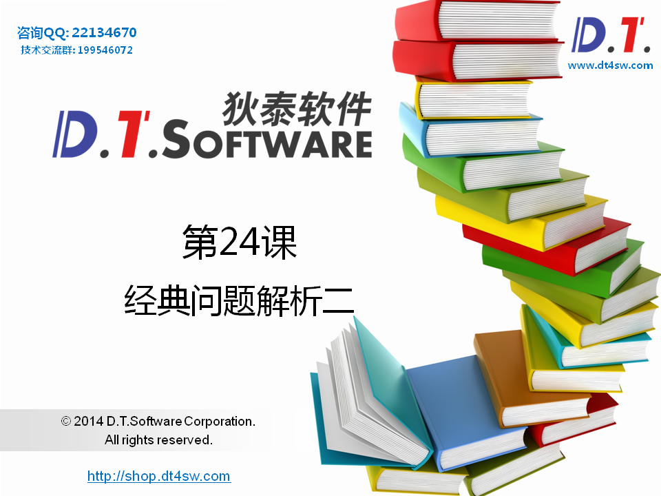


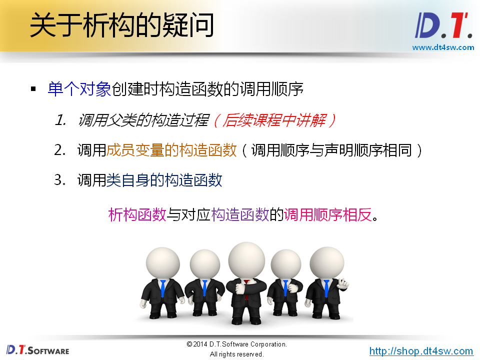


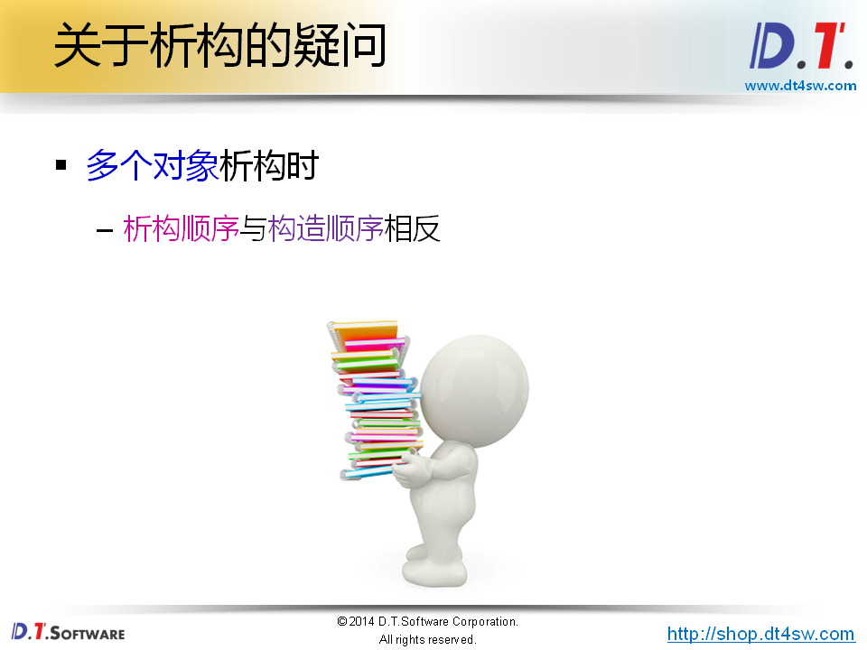


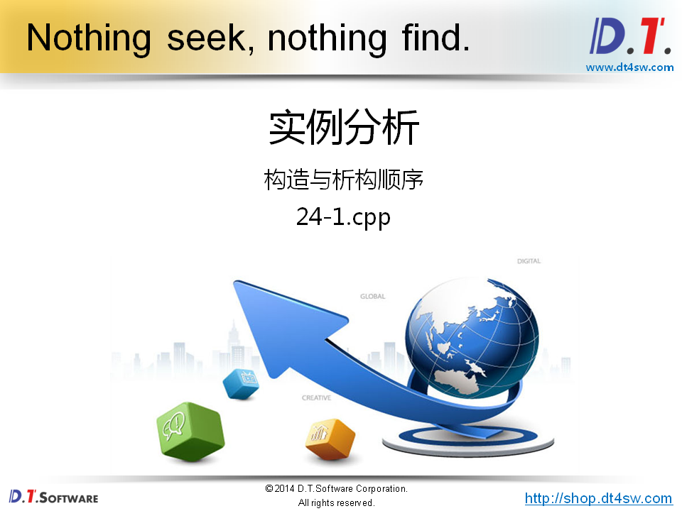

```cpp
#include <stdio.h>

class Member
{
    const char* ms;
public:
    Member(const char* s)
    {
        printf("Member(const char* s): %s\n", s);
        
        ms = s;
    }
    ~Member()
    {
        printf("~Member(): %s\n", ms);
    }
};

class Test
{
    Member mA;
    Member mB;
public:
    Test() : mB("mB"), mA("mA") // 不影响构造顺序
    {
        printf("Test()\n");
    }
    ~Test()
    {
        printf("~Test()\n");
    }
};

Member gA("gA"); // 如果搞成static呢？

int main()
{
    Test t;
    
    return 0;
}

```

```cpp
输出结果：
    gA
    mA
    mB
    Test
    ~Test
    ~mB
    ~mA
    ~gA
```


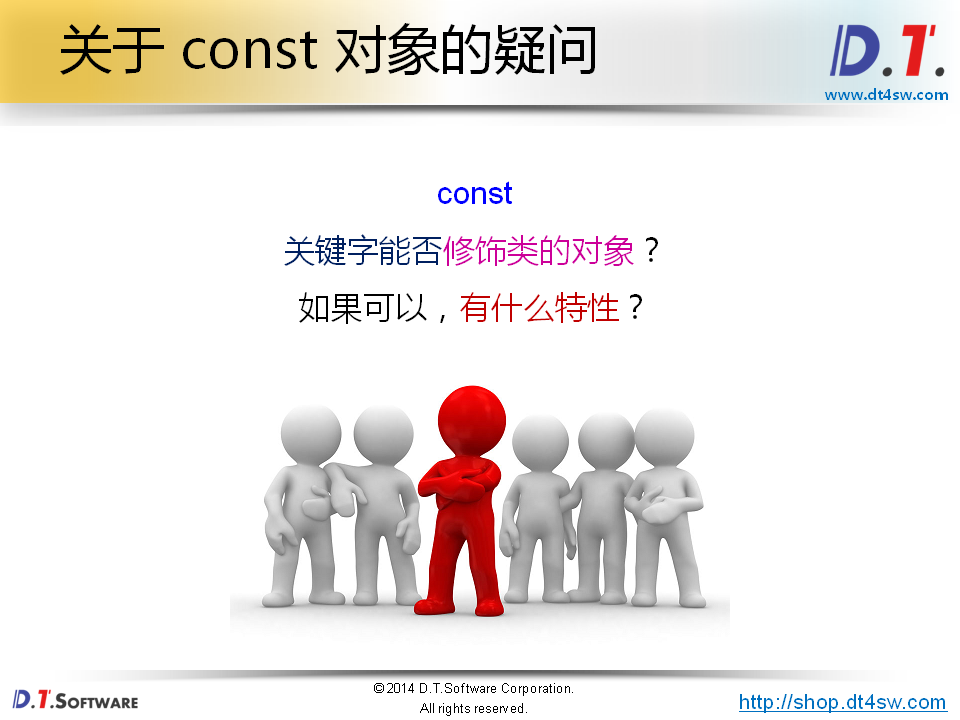

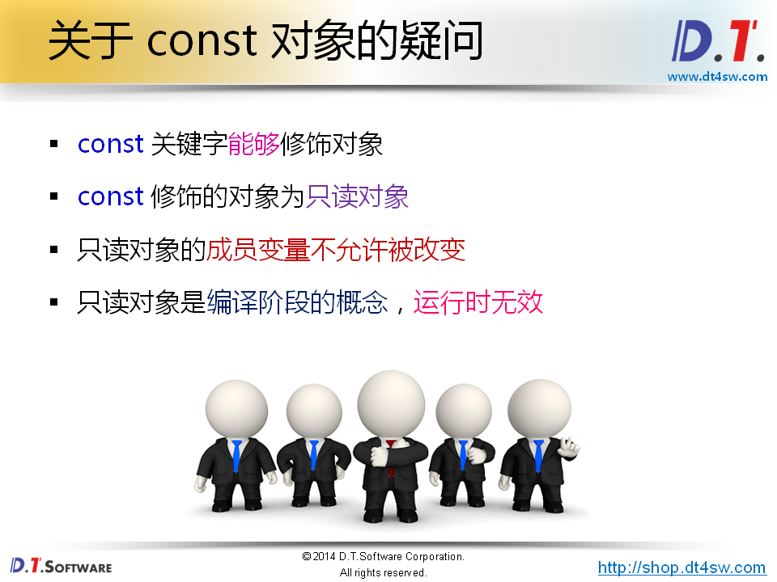


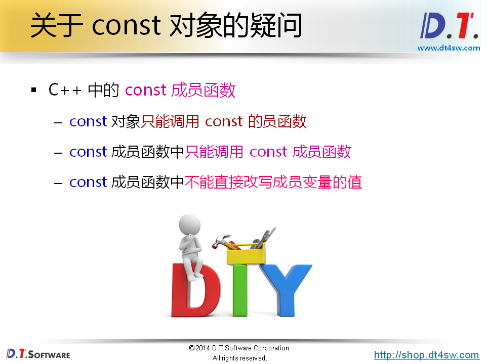


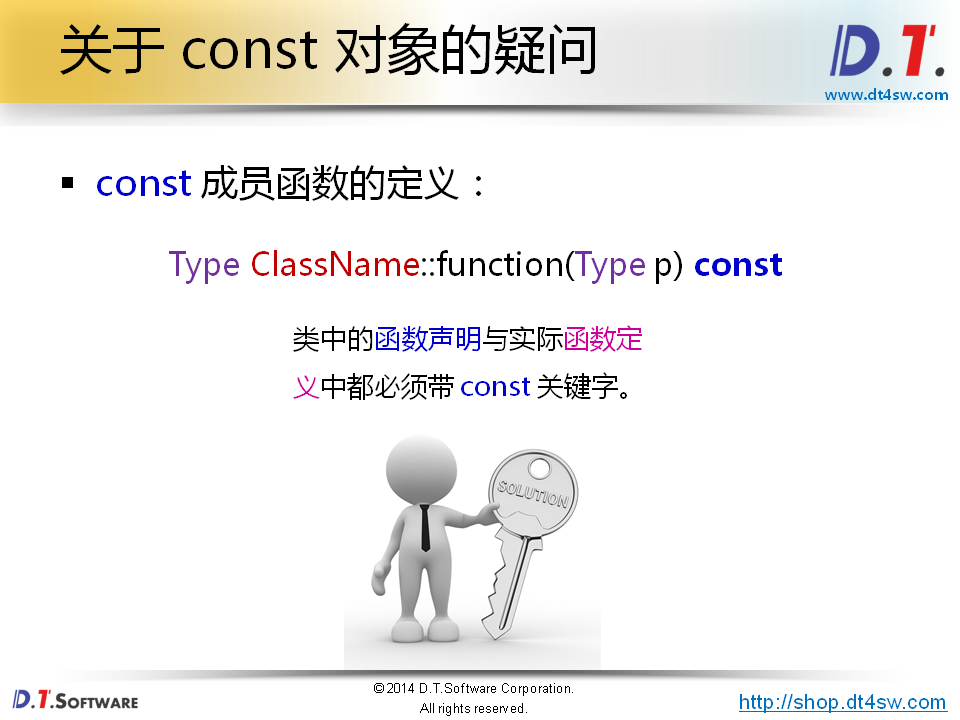


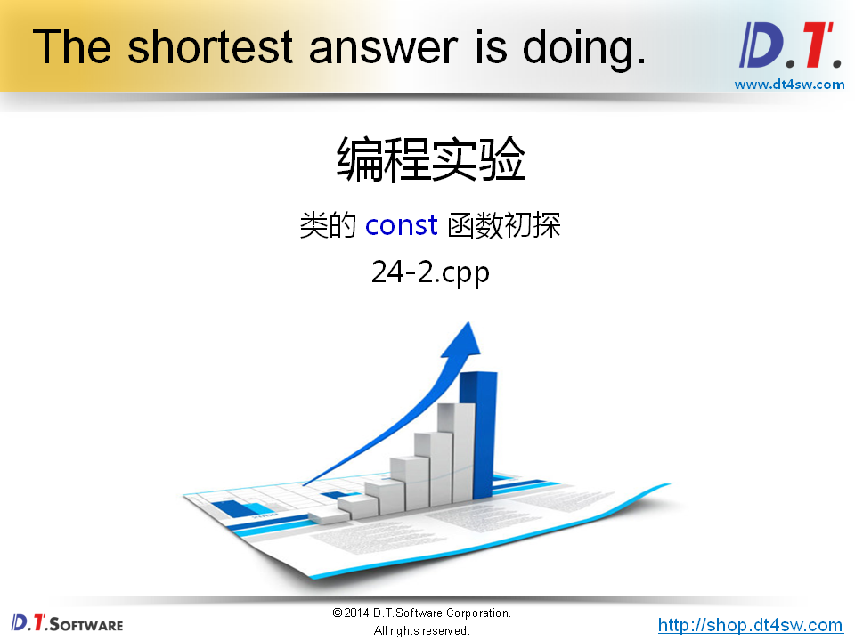

```cpp
#include <stdio.h>

class Test
{
    int mi;
public:
    Test(int i);
    Test(const Test& t);
    int getMi();
};

Test::Test(int i)
{
    mi = i;
}

Test::Test(const Test& t)
{
    mi = t.mi; // mi是private为啥呢访问得到,拷贝构造函数时特殊的成员函数，通过共享的成员函数可以访问任何				 // 所属类的成员变量
}
    
int Test::getMi()
{
    return mi;
}

int main()
{
    Test t(1);
    
    return 0;
}

```


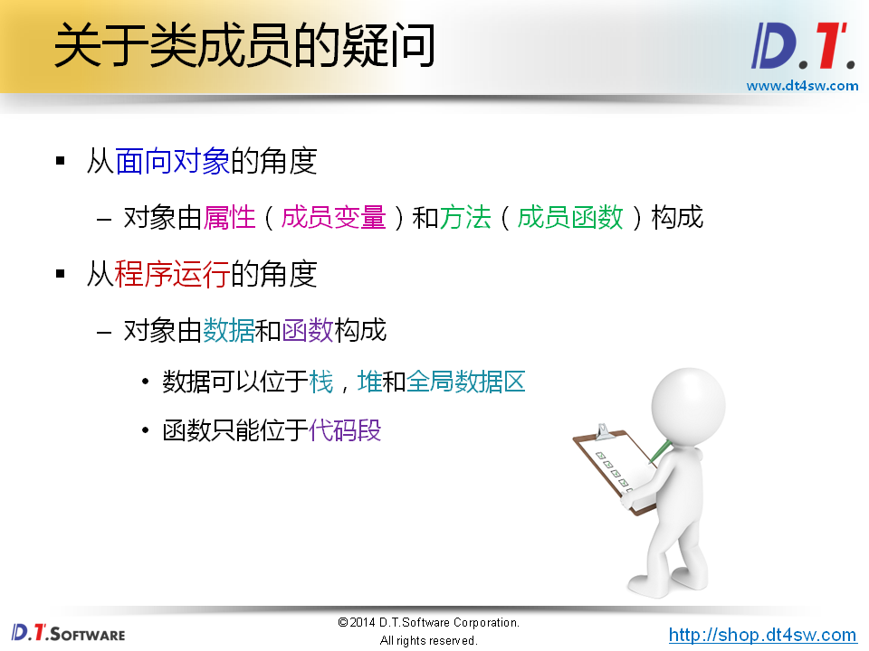


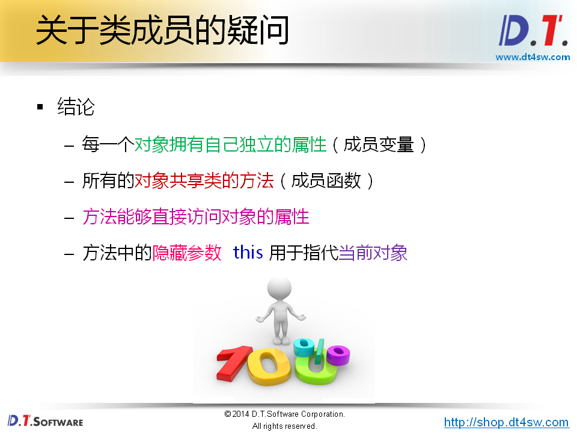

**如何区分不同的对象，在调用成员函数时-》通过this指针**

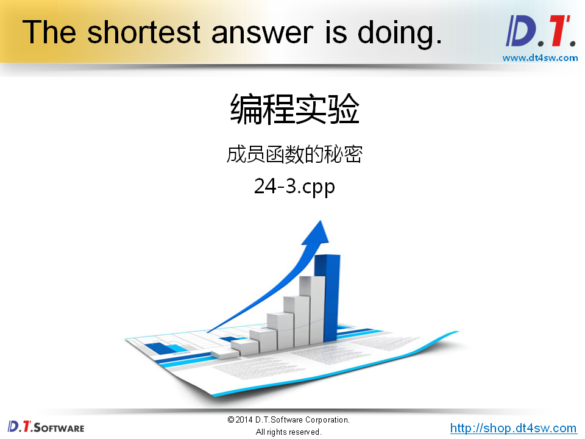

```cpp
#include <stdio.h>

class Test
{
    int mi;
public:
    int mj;
    Test(int i);
    Test(const Test& t);
    int getMi();
    void print();
};

Test::Test(int i)
{
    mi = i;
}

Test::Test(const Test& t)
{
    mi = t.mi;
}
    
int Test::getMi()
{
    return mi;
}

void Test::print()
{
    printf("this = %p\n", this);
}

int main()
{
    Test t1(1);
    Test t2(2);
    Test t3(3);
    
    printf("t1.getMi() = %d\n", t1.getMi());
    printf("&t1 = %p\n", &t1);
    t1.print();
    
    printf("t2.getMi() = %d\n", t2.getMi());
    printf("&t2 = %p\n", &t2);
    t2.print();
    
    printf("t3.getMi() = %d\n", t3.getMi());
    printf("&t3 = %p\n", &t3);
    t3.print();
    
    return 0;
}

```

```cpp
输出结果：
    t1.getMi() = 1
    &t1 = 0xbf85da68
    this = 0xbf85da68
    t2.getMi() = 2
    &t2 = 0xbf85da60
    this = 0xbf85da58
    t3.getMi() = 3
    &t3 = 0xbf85da58
    this = 0xfb85da58
```

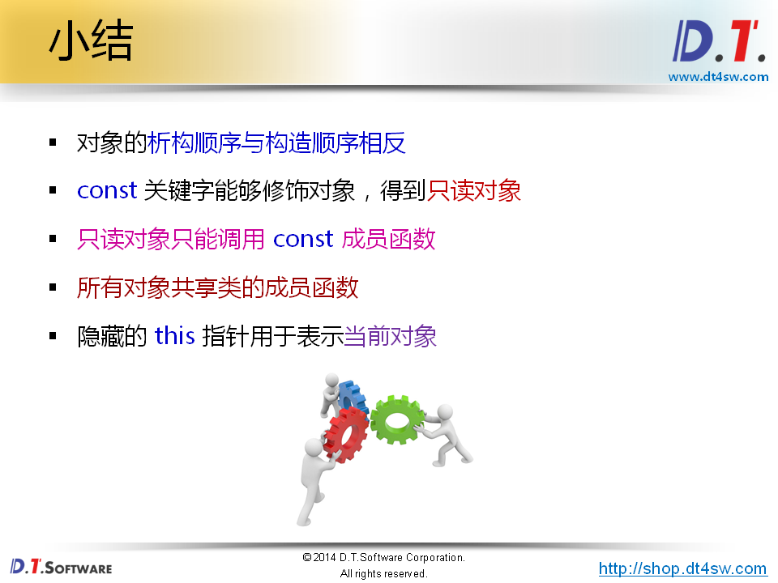