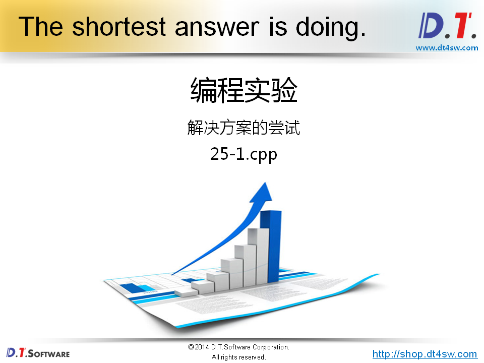
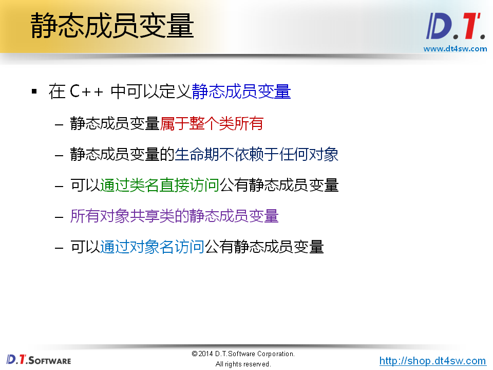
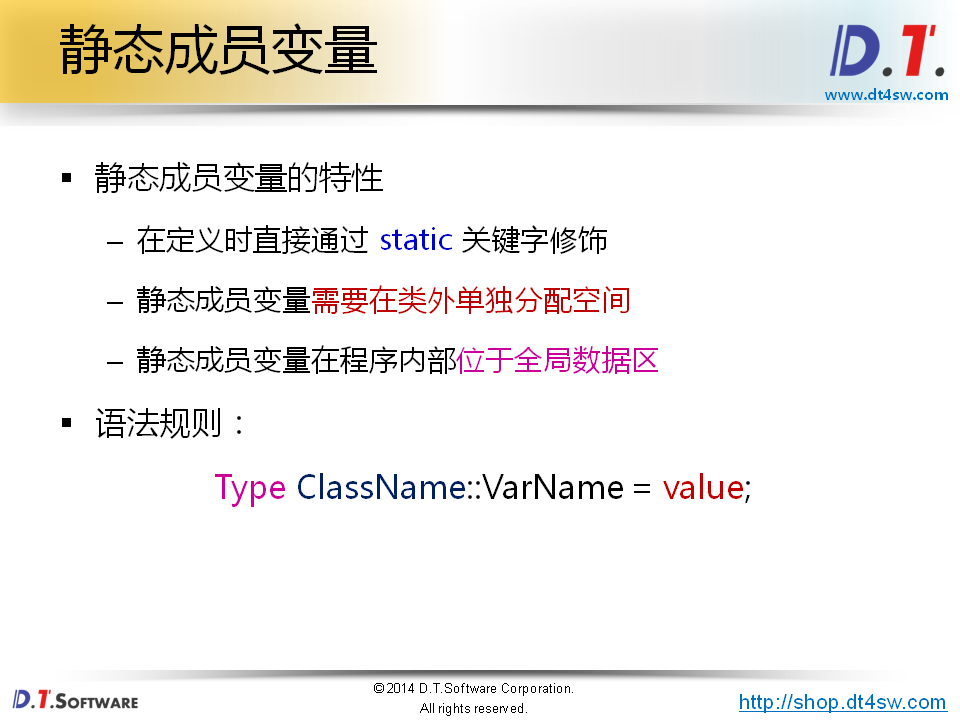
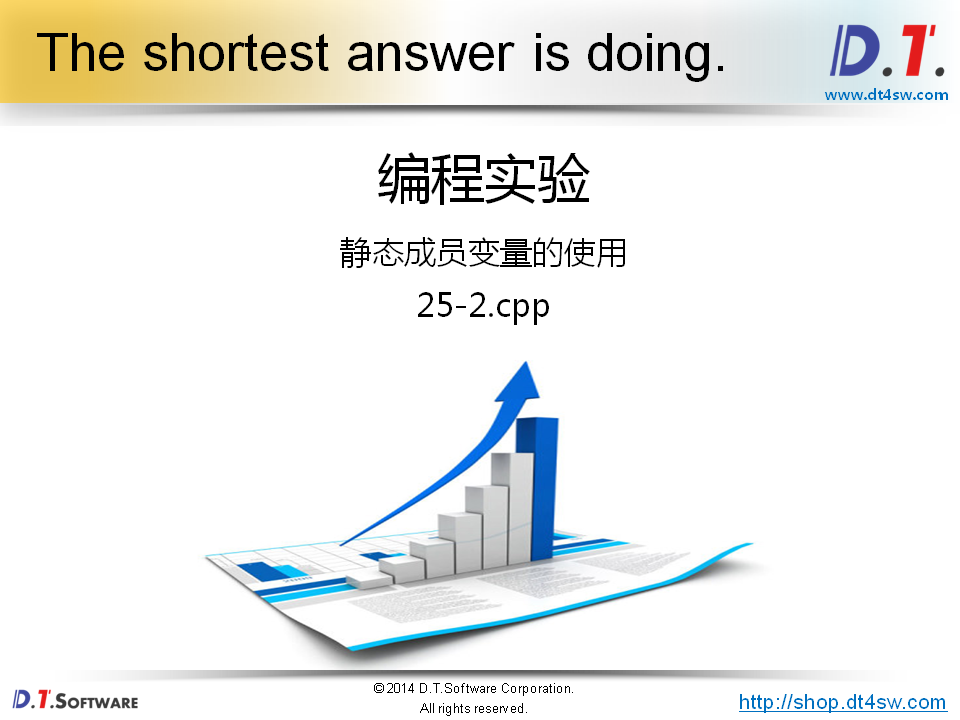
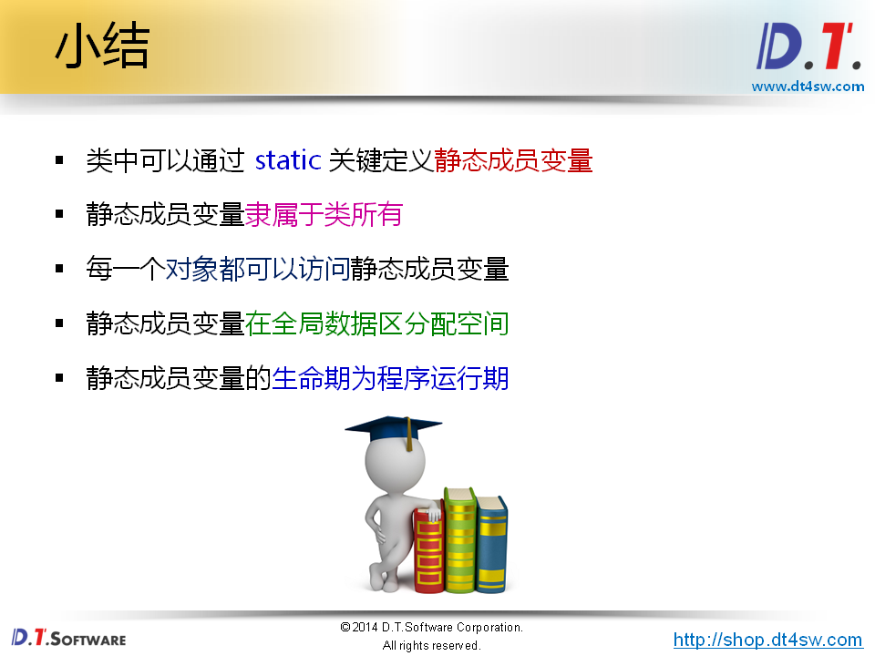

# 类的静态成员变量




```cpp
#include <stdio.h>

class Test
{
private:
    int mCount;
public:
    Test() : mCount(0)
    {
        mCount++;
    }
    ~Test()
    {
        --mCount;
    }
    int getCount()
    {
        return mCount;
    }
};

Test gTest;

int main()
{
    Test t1;
    Test t2;
    
    printf("count = %d\n", gTest.getCount()); // 1
    printf("count = %d\n", t1.getCount());    // 1
    printf("count = %d\n", t2.getCount());    // 1
    // 成员变量是私有的，没有用
    // 使用全局变量，不太好，到处都能修改它，有作用
    
    return 0;
}

```









```cpp
#include <stdio.h>

class Test
{
private:
    static int cCount; // 声明
public:
    Test()
    {
        cCount++;
    }
    ~Test()
    {
        --cCount;
    }
    int getCount()
    {
        return cCount;
    }
};

int Test::cCount = 0; // 初始化

Test gTest;

int main()
{
    Test t1;
    Test t2;
    
    printf("count = %d\n", gTest.getCount());
    printf("count = %d\n", t1.getCount());
    printf("count = %d\n", t2.getCount());
    
    Test* pt = new Test(); // 如何让一个对象不被new,可以把构造函数给private了
    
    printf("count = %d\n", pt->getCount());
    
    delete pt;
    
    printf("count = %d\n", gTest.getCount());
    
    return 0;
}

```

