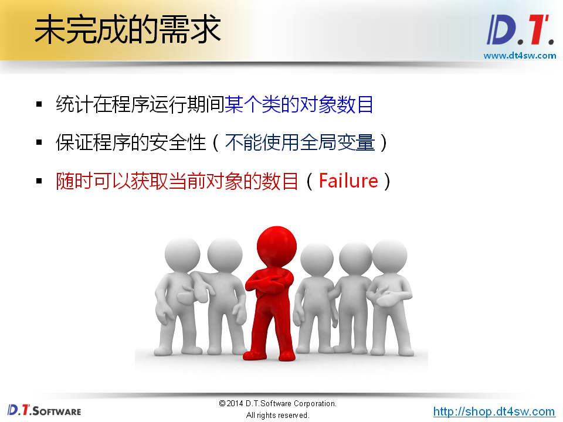
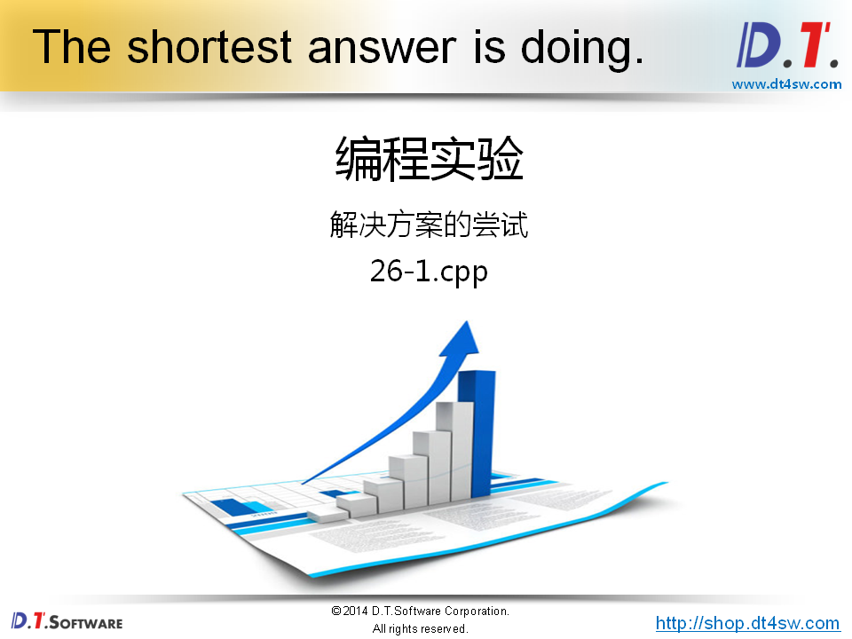
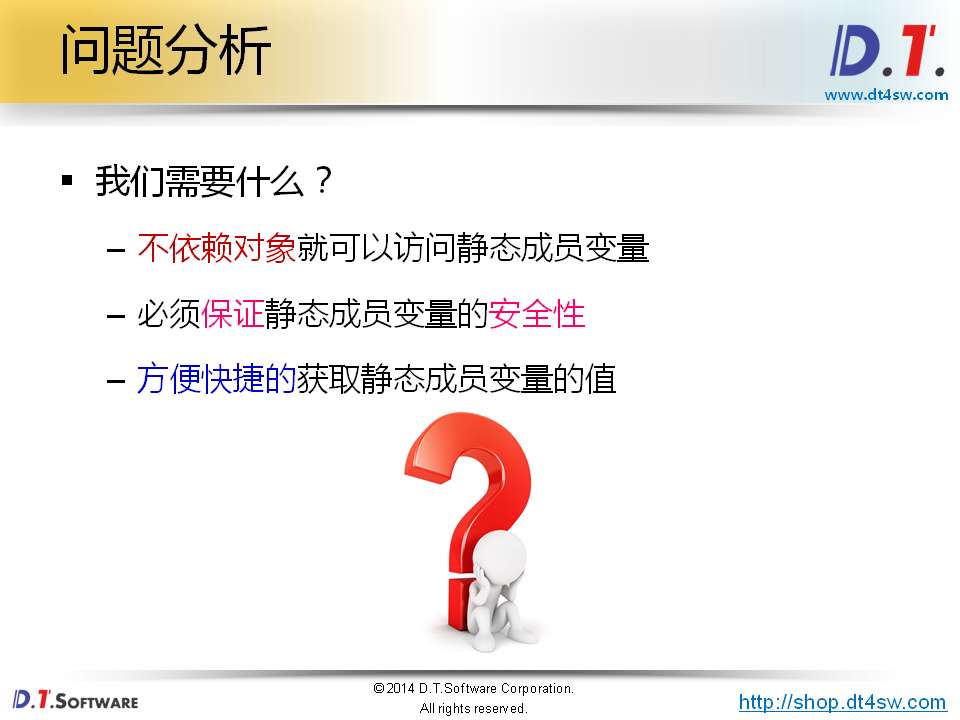
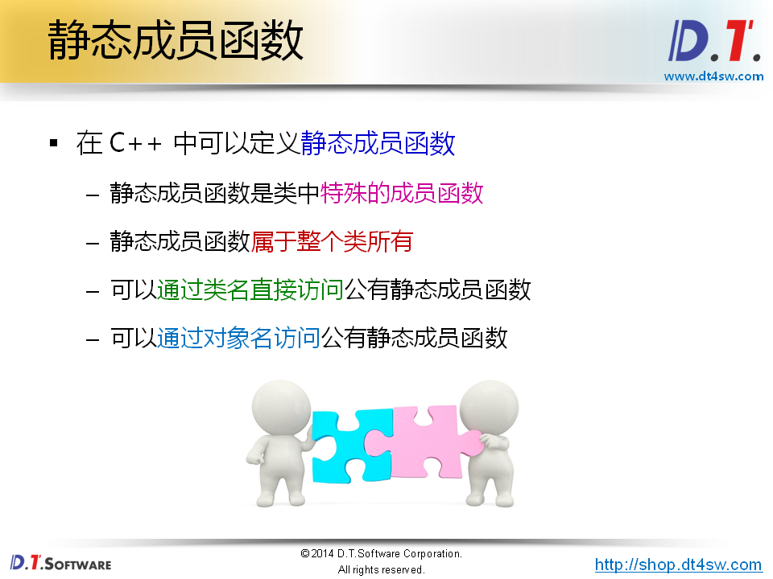
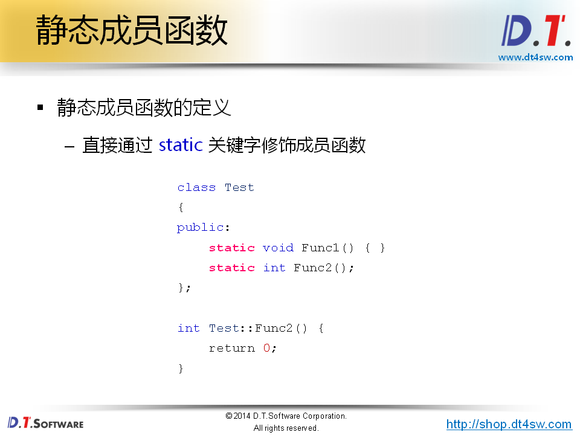
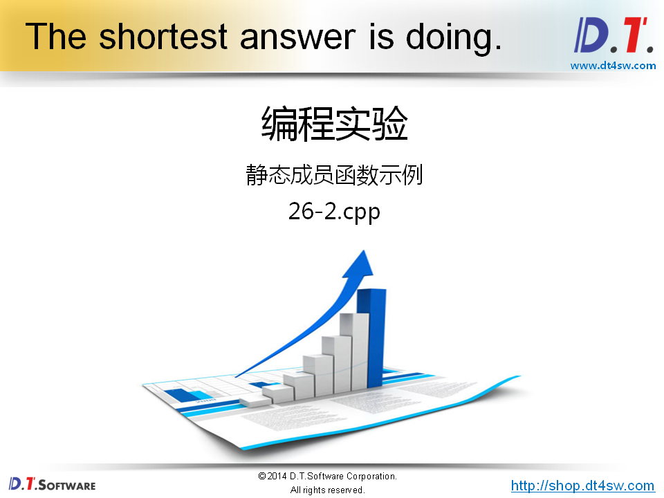
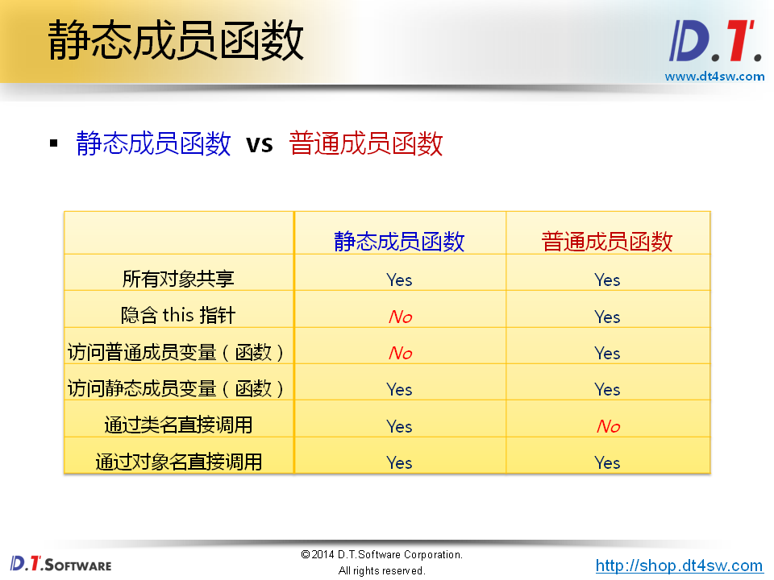
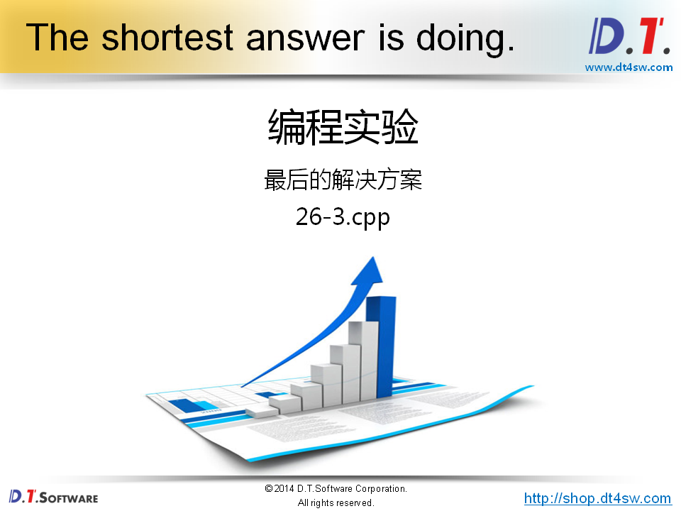
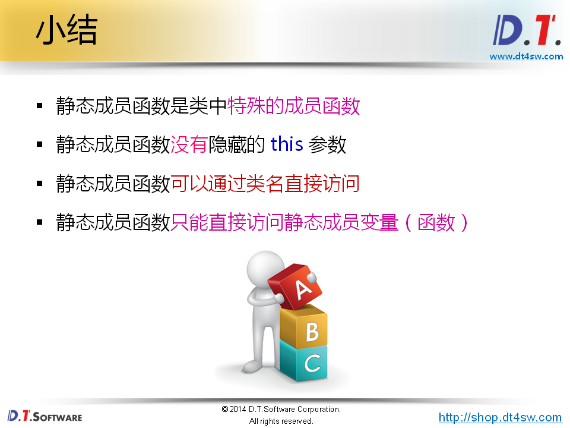

# 类的静态成员函数







```cpp
#include <stdio.h>

class Test
{
public:// 改为共有的
    static int cCount;
public:
    Test()
    {
        cCount++;
    }
    ~Test()
    {
        --cCount;
    }
    int getCount()
    {
        return cCount;
    }
};

int Test::cCount = 0;


int main()
{
    printf("count = %d\n", Test::cCount); // 0
    
    Test::cCount = 1000;
    
    printf("count = %d\n", Test::cCount); // 1000->用户会以为有1000个对象-》误操作导致的问题
    
    return 0;
}

```












```cpp
#include <stdio.h>

class Demo
{
private:
    int i;
public:
    int getI();
    static void StaticFunc(const char* s);
    static void StaticSetI(Demo& d, int v);
};

int Demo::getI()
{
    return i;
}

void Demo::StaticFunc(const char* s)
{
    printf("StaticFunc: %s\n", s);
}

void Demo::StaticSetI(Demo& d, int v)
{
    d.i = v;
    // i = v; // 静态成员函数不能访问成员变量
}

int main()
{
    Demo::StaticFunc("main Begin...");
    
    Demo d;
    
    d.StaticSetId(d, 10);
     printf("d.i = %d\n", d.getI()); // 10
    
    Demo::StaticSetI(d, 10);
    
    printf("d.i = %d\n", d.getI()); // 10
    
    Demo::StaticFunc("main End...");
    
    return 0;
}

```






```cpp
#include <stdio.h>

class Test
{
private:
    static int cCount;
public:
    Test()
    {
        cCount++;
    }
    ~Test()
    {
        --cCount;
    }
    static int GetCount()
    {
        return cCount;
    }
};

int Test::cCount = 0;

int main()
{
    printf("count = %d\n", Test::GetCount()); // 0
    
    Test t1;
    Test t2;
    
    printf("count = %d\n", t1.GetCount()); // 2
    printf("count = %d\n", t2.GetCount()); // 2
    
    Test* pt = new Test();
    
    printf("count = %d\n", pt->GetCount()); // 3
    
    delete pt;
    
    printf("count = %d\n", Test::GetCount()); // 2
    
    return 0;
}

```



没有this参数不能直接访问普通的成员变量和成员函数

