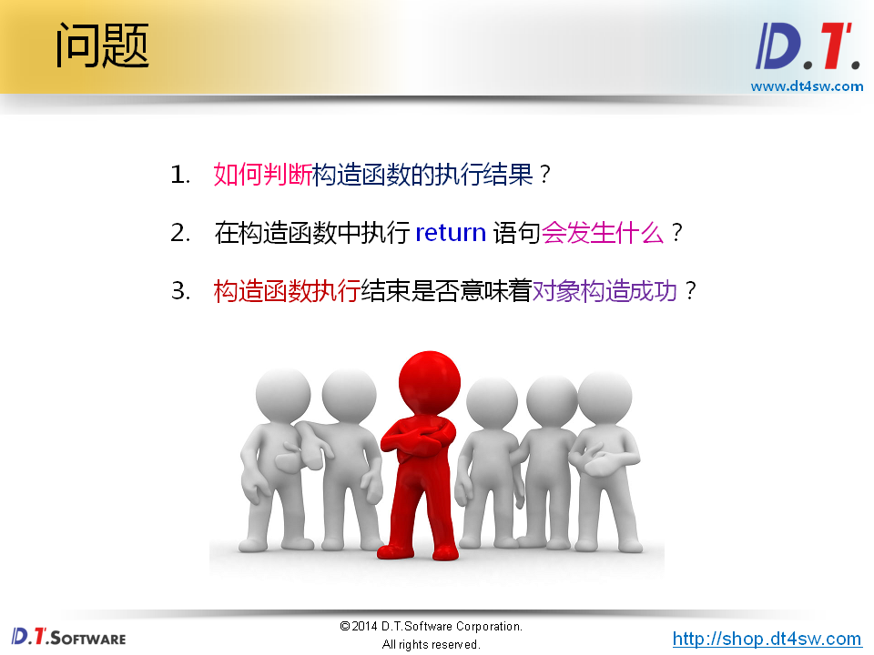
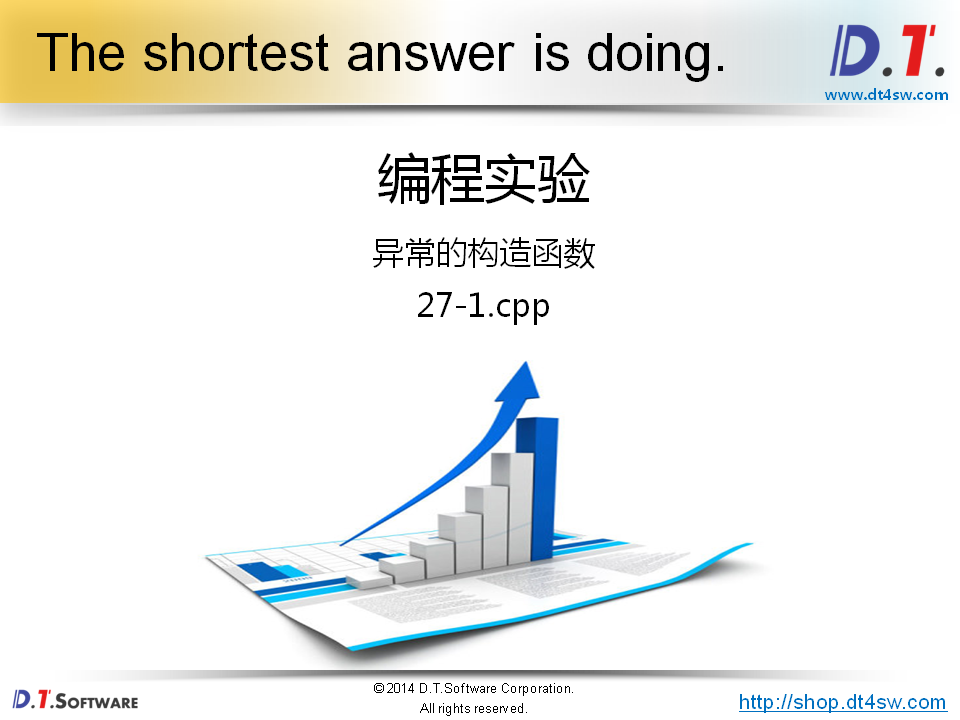
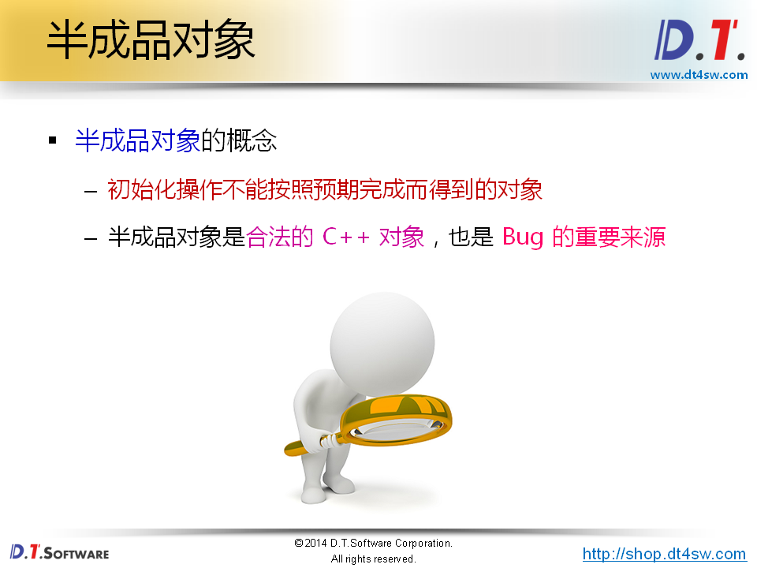
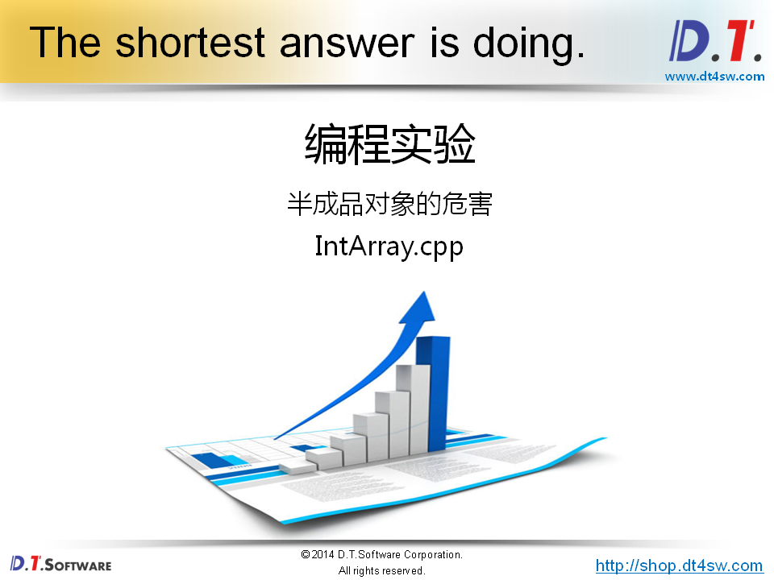
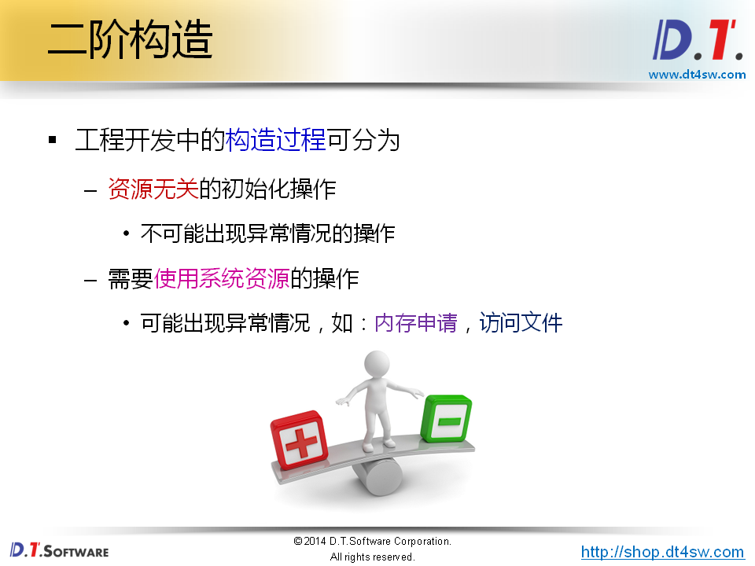
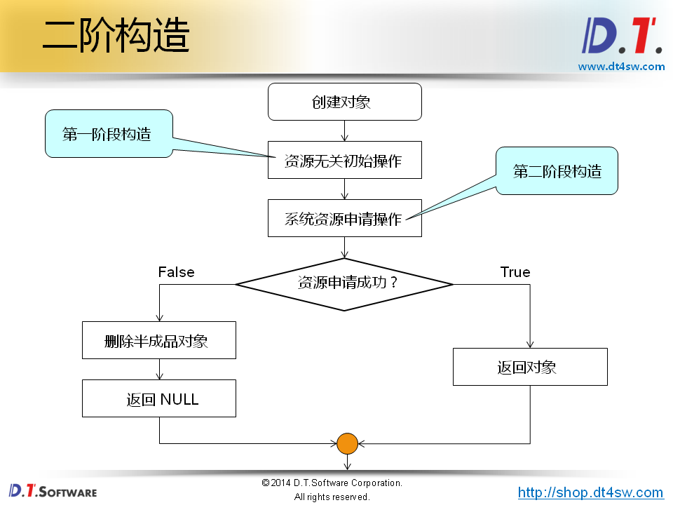
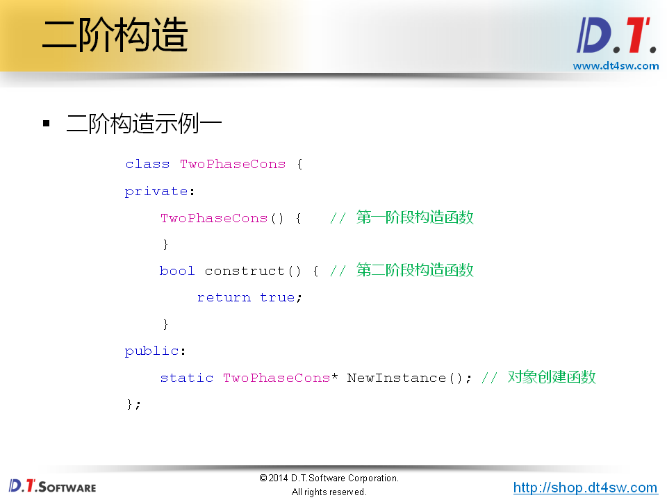
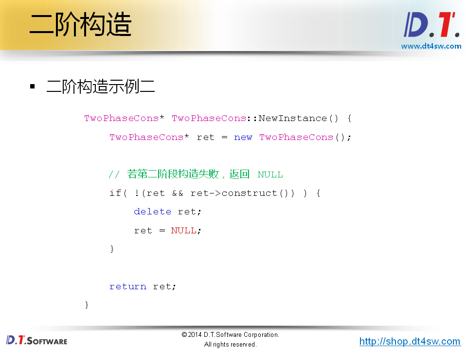
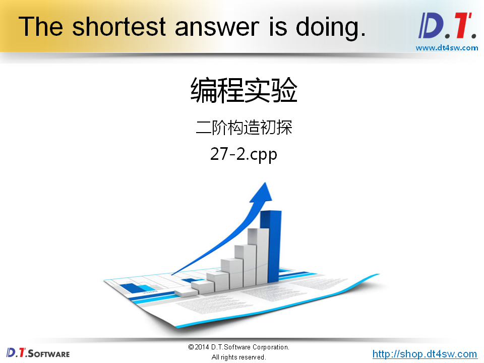
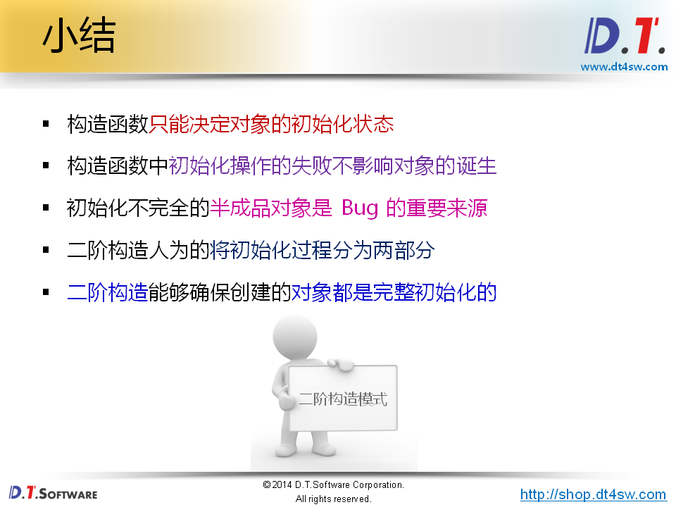

# 二阶构造模式




return返回，构造结束-》不意味对象构造成功



```cpp
#include <stdio.h>

class Test
{
    int mi;
    int mj;
    bool mStatus;
public:
    Test(int i, int j) : mStatus(false)
    {
        mi = i;
        
        return;
        
        mj = j;
        
        mStatus = true;
    }
    int getI()
    {
        return mi;
    }
    int getJ()
    {
        return mj;
    }
    int status()
    {
        return mStatus;
    }
};

int main()
{  
    Test t1(1, 2);
    printf("t1.mi = %d\n", t1.getI()); // 1
    printf("t1.mj = %d\n", t1.getJ()); // 随机值-》mj没有被初始化-》对象的诞生和构造函数执行的结果没有关系，只能说初始化状态有问题
    // 
    
    if( t1.status() ) // 构造不完全对象
    {
        printf("t1.mi = %d\n", t1.getI()); // 1
        printf("t1.mj = %d\n", t1.getJ()); // 随机值-》mj没有被初始化
    
    }
    
    return 0;
}
```







```cpp
#ifndef _INTARRAY_H_
#define _INTARRAY_H_

class IntArray
{
private:
    int m_length;
    int* m_pointer;
    
    IntArray(int len);
    IntArray(const IntArray& obj);
    bool construct();
public:
    static IntArray* NewInstance(int length); 
    int length();
    bool get(int index, int& value);
    bool set(int index ,int value);
    ~IntArray();
};

#endif
```

```cpp
#include "IntArray.h"

IntArray::IntArray(int len)
{
    m_length = len;
}

bool IntArray::construct()
{
    bool ret = true;
    
    m_pointer = new int[m_length]; // 可能失败
    
    if( m_pointer ) // 使用后会随机出现bug段错误
    {
        for(int i=0; i<m_length; i++)
        {
            m_pointer[i] = 0;
        }
    }
    else
    {
        ret = false;
    }
    
    return ret;
}

IntArray* IntArray::NewInstance(int length) 
{
    IntArray* ret = new IntArray(length);
    
    if( !(ret && ret->construct()) ) 
    {
        delete ret;
        ret = 0;
    }
        
    return ret;
}

int IntArray::length()
{
    return m_length;
}

bool IntArray::get(int index, int& value)
{
    bool ret = (0 <= index) && (index < length());
    
    if( ret )
    {
        value = m_pointer[index];
    }
    
    return ret;
}

bool IntArray::set(int index, int value)
{
    bool ret = (0 <= index) && (index < length());
    
    if( ret )
    {
        m_pointer[index] = value;
    }
    
    return ret;
}

IntArray::~IntArray()
{
    delete[]m_pointer;
}

```

```cpp
#include <stdio.h>
#include "IntArray.h"

int main()
{
    IntArray* a = IntArray::NewInstance(5);    
    
    printf("a.length = %d\n", a->length());
    
    a->set(0, 1);
    
    for(int i=0; i<a->length(); i++)
    {
        int v = 0;
        
        a->get(i, v);
        
        printf("a[%d] = %d\n", i, v);
    }
    
    delete a;
    
    return 0;
}

```












new对象第一阶段的构造



```cpp
#include <stdio.h>

class TwoPhaseCons 
{
private:
    TwoPhaseCons() // 第一阶段构造
    {   
    }
    bool construct() // 第二阶段构造函数
    { 
        return true; 
    }
public:
    static TwoPhaseCons* NewInstance(); // 对象创建函数
};

TwoPhaseCons* TwoPhaseCons::NewInstance() 
{
    TwoPhaseCons* ret = new TwoPhaseCons();

    // NULL    
    if( !(ret && ret->construct()) ) 
    {
        delete ret;
        ret = NULL;
    }
        
    return ret;
}


int main()
{
    TwoPhaseCons* obj = TwoPhaseCons::NewInstance();
    
    printf("obj = %p\n", obj);

    delete obj;
    
    return 0;
}

```


```cpp
#include "IntArray.h"

IntArray::IntArray(int len)
{
    m_length = len;
}

bool IntArray::construct()
{
    bool ret = true;
    
    m_pointer = new int[m_length];
    
    if( m_pointer )
    {
        for(int i=0; i<m_length; i++)
        {
            m_pointer[i] = 0;
        }
    }
    else
    {
        ret = false;
    }
    
    return ret;
}

IntArray* IntArray::NewInstance(int length) 
{
    IntArray* ret = new IntArray(length);
    
    if( !(ret && ret->construct()) ) 
    {
        delete ret;
        ret = 0;
    }
        
    return ret;
}

int IntArray::length()
{
    return m_length;
}

bool IntArray::get(int index, int& value)
{
    bool ret = (0 <= index) && (index < length());
    
    if( ret )
    {
        value = m_pointer[index];
    }
    
    return ret;
}

bool IntArray::set(int index, int value)
{
    bool ret = (0 <= index) && (index < length());
    
    if( ret )
    {
        m_pointer[index] = value;
    }
    
    return ret;
}

IntArray::~IntArray()
{
    delete[]m_pointer;
}

```




