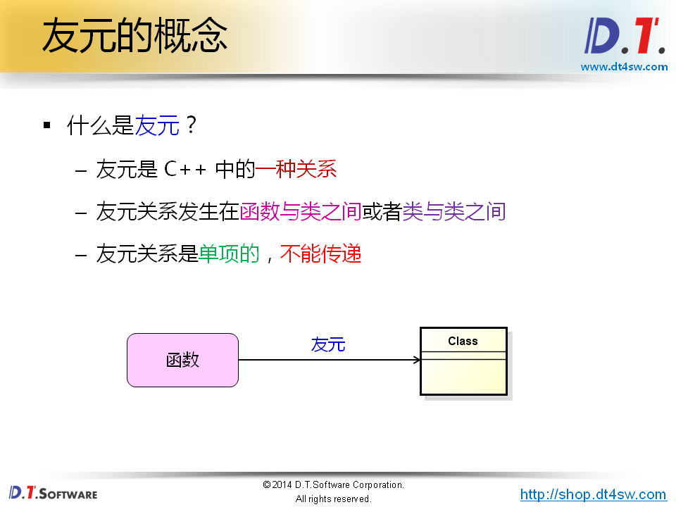
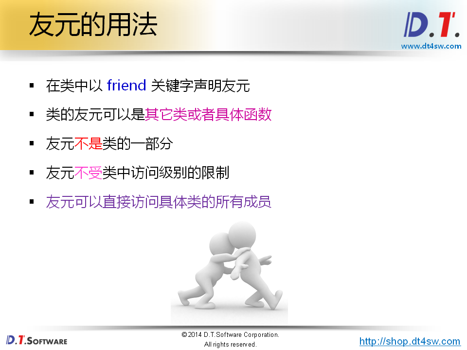
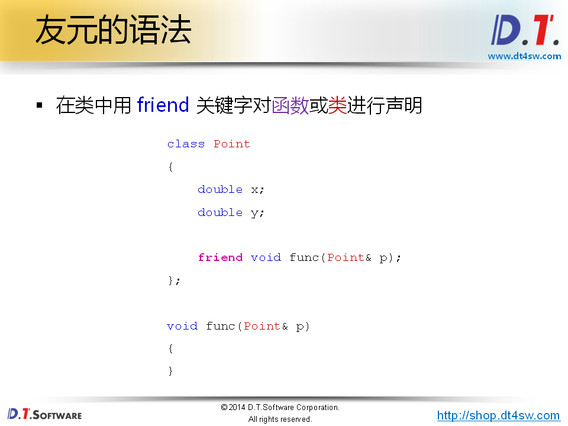
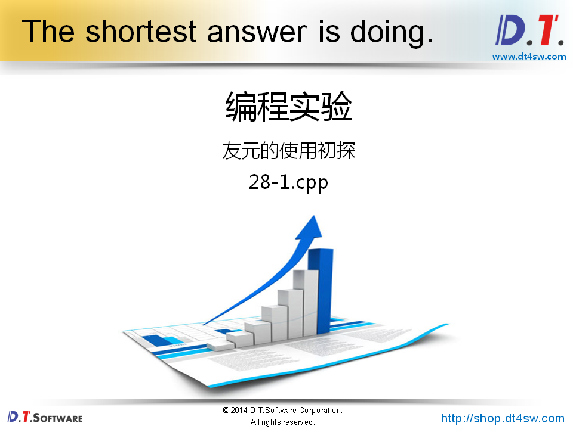
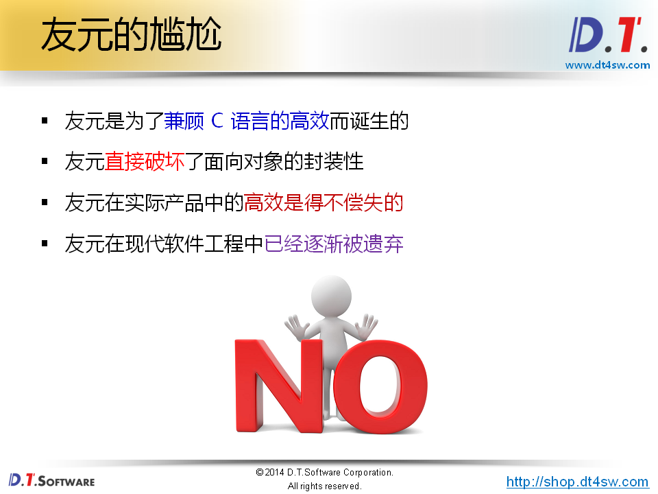
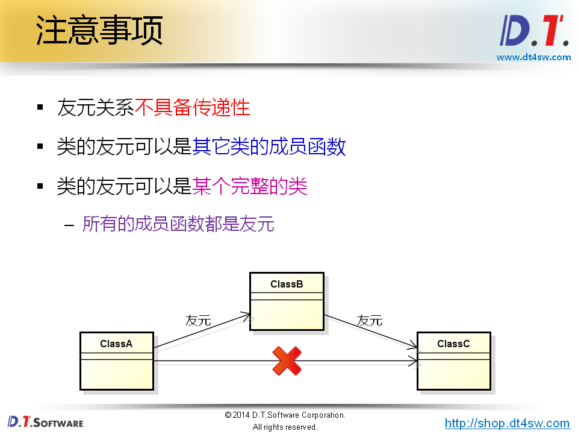
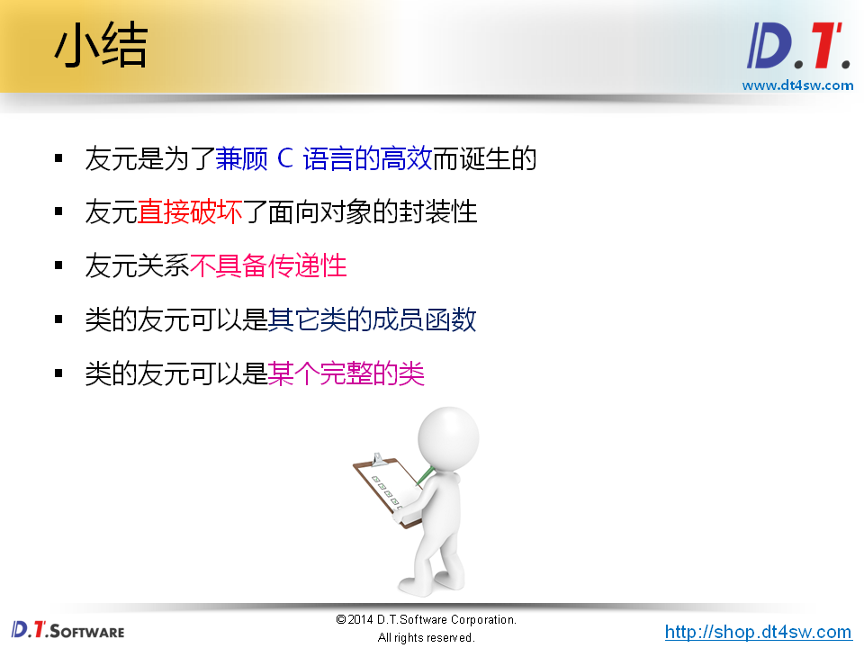

# 友元的尴尬能力













```cpp
#include <stdio.h>
#include <math.h>

class Point
{
    double x;
    double y;
public:
    Point(double x, double y)
    {
        this->x = x;
        this->y = y;
    }
    
    double getX()
    {
        return x;
    }
    
    double getY()
    {
        return y;
    }
       
    friend double func(Point& p1, Point& p2);
};

double func(Point& p1, Point& p2) //不声明为friend，x,y不能访问因为是私有的成员变量
{
    double ret = 0;
    
    ret = (p2.y - p1.y) * (p2.y - p1.y) +
          (p2.x - p1.x) * (p2.x - p1.x);
          
    ret = sqrt(ret);
    
    return ret;
}

int main()
{
    Point p1(1, 2);
    Point p2(10, 20);
    
    printf("p1(%f, %f)\n", p1.getX(), p1.getY());
    printf("p2(%f, %f)\n", p2.getX(), p2.getY());
    printf("|(p1, p2)| = %f\n", func(p1, p2));
    
    
    return 0;
}

```







```cpp
#include <stdio.h>

class ClassC
{
    const char* n;
public:
    ClassC(const char* n)
    {
        this->n = n;
    }
    
    friend class ClassB;
};

class ClassB
{
    const char* n;
public:
    ClassB(const char* n)
    {
        this->n = n;
    }
    
    void getClassCName(ClassC& c)
    {
        printf("c.n = %s\n", c.n);
    }
    
    friend class ClassA;
};

class ClassA
{
    const char* n;
public:
    ClassA(const char* n)
    {
        this->n = n;
    }
    
    void getClassBName(ClassB& b)
    {
        printf("b.n = %s\n", b.n);
    }
    /*
    void getClassCName(ClassC& c) // 非法的，友元不具备传递性
    {
        printf("c.n = %s\n", c.n);
    }
    */
};

int main()
{
    ClassA A("A");
    ClassB B("B");
    ClassC C("C");
    
    A.getClassBName(B);
    B.getClassCName(C);
    
    return 0;
}

```

