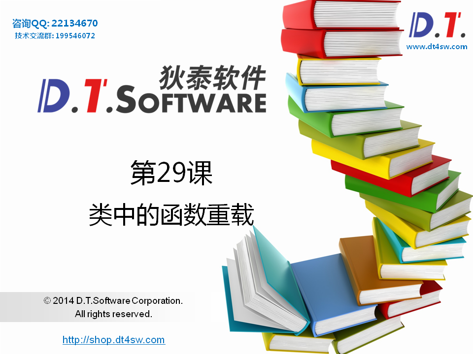
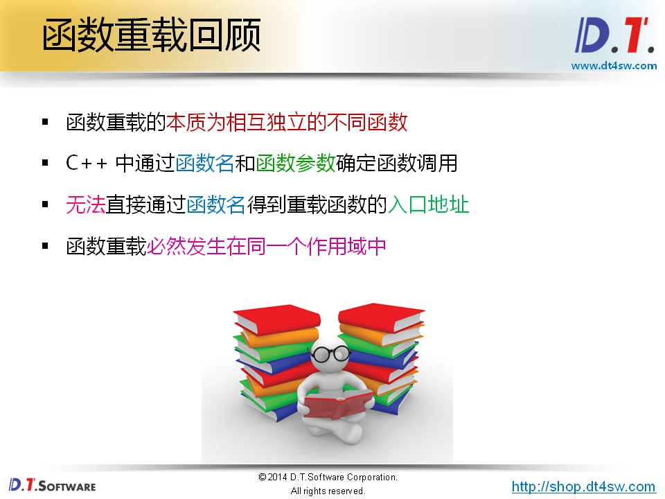
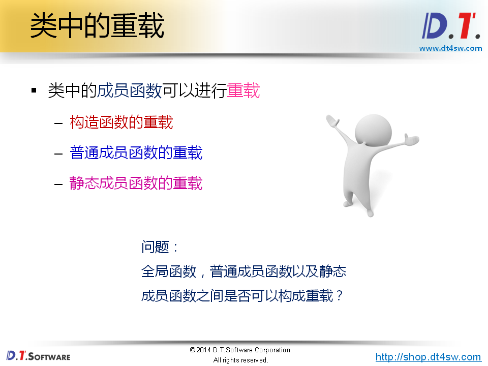
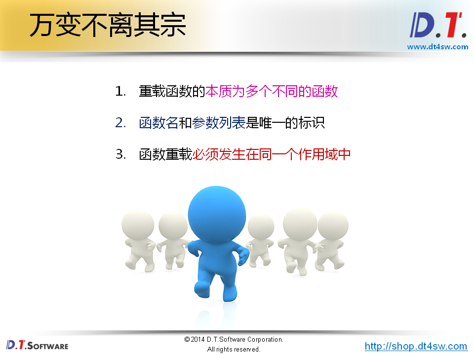
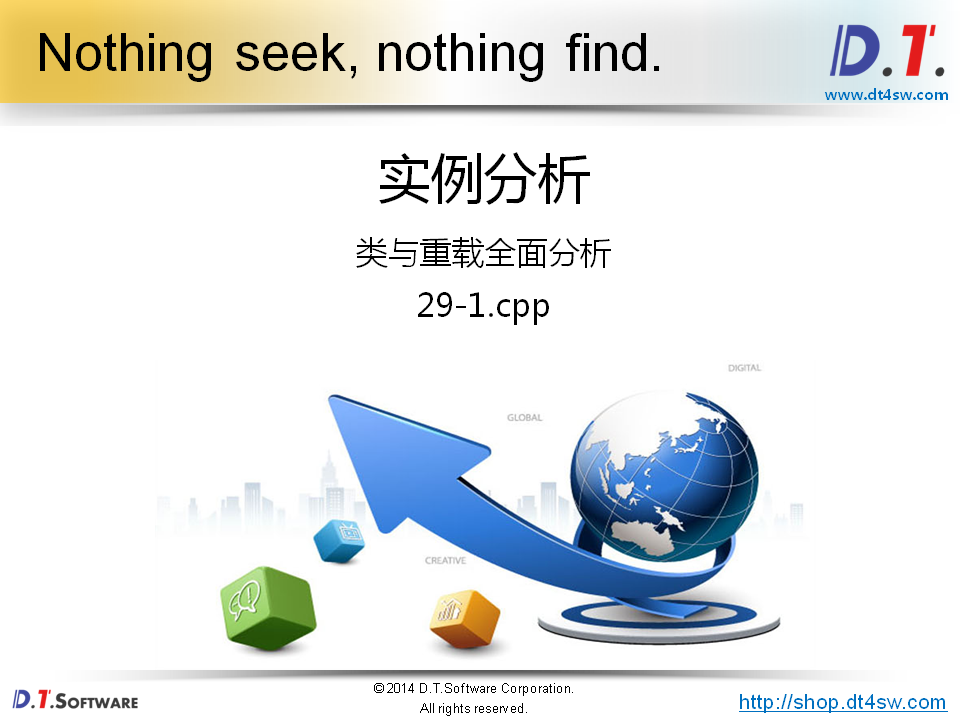
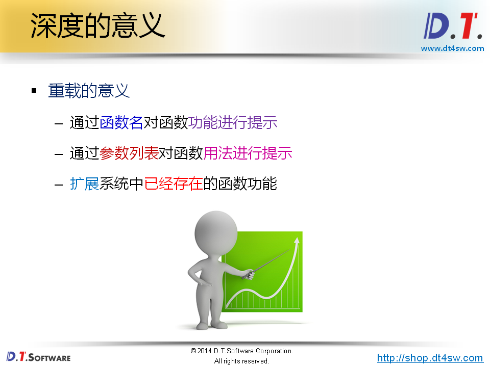
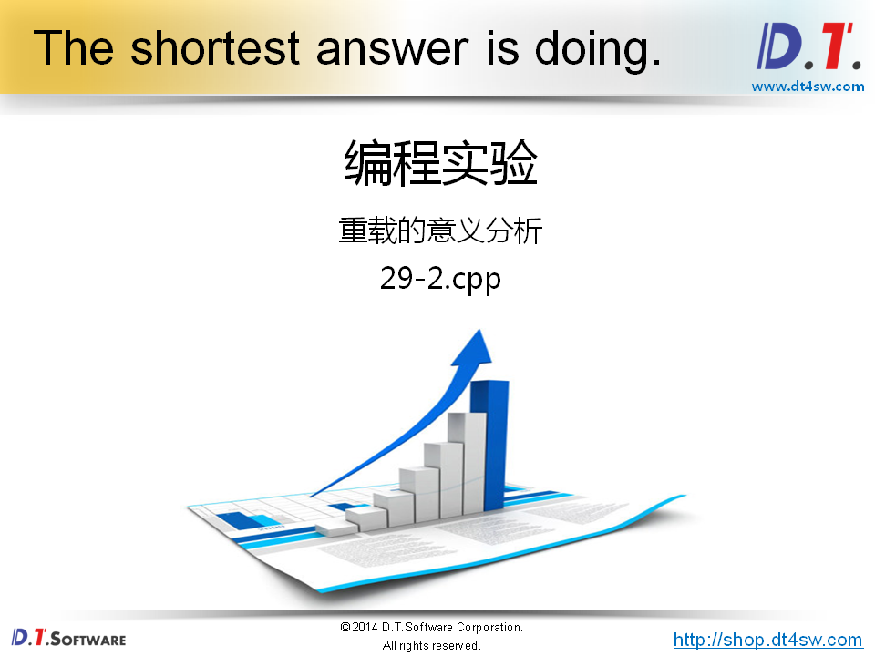
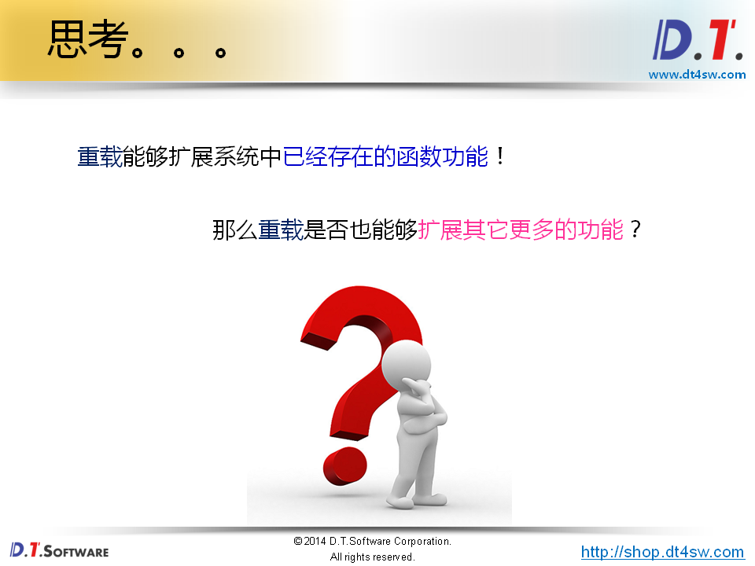
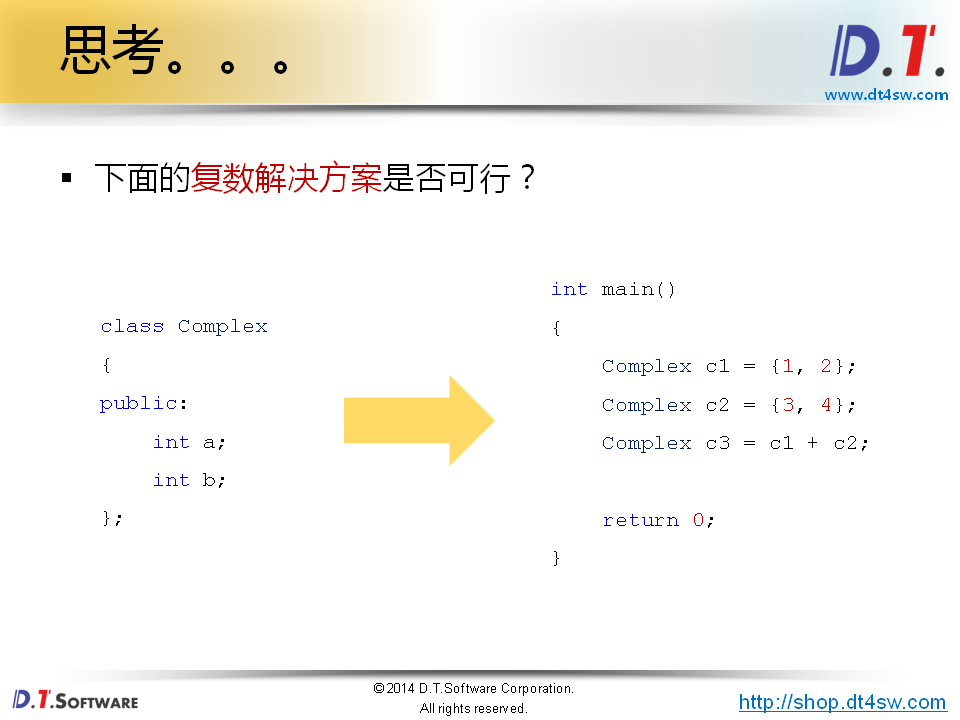
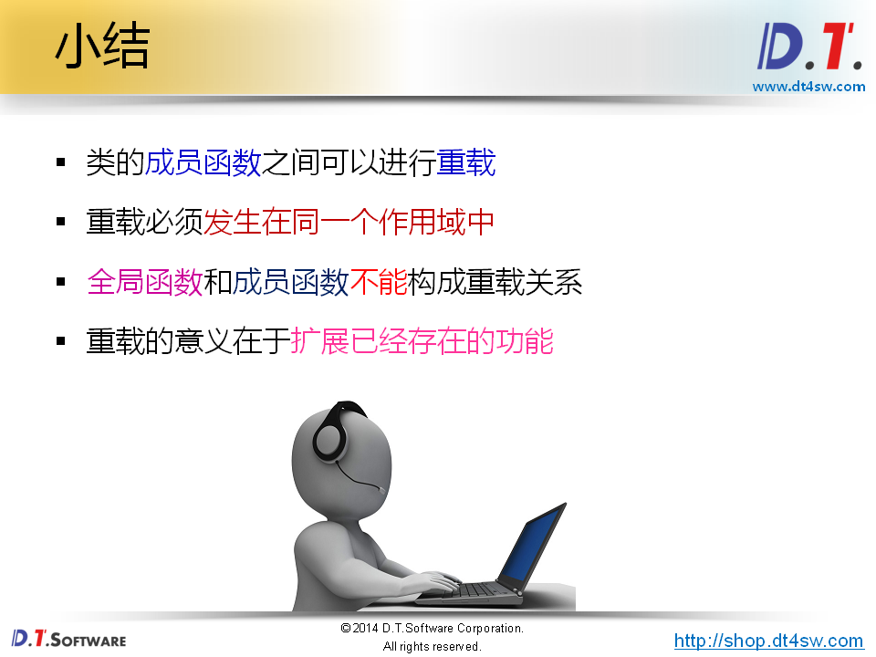

# 类中的函数重载







编译器会根据函数的参数生成函数名类似，后缀为类型的新的函数来区分



构造函数可以

普通成员函数可以

静态成员函数可以



类的成员函数，和全局函数可以构成重载关系吗？不可以-》不在一个作用域中-》为什么需要在一个作用域呢？



```cpp
#include <stdio.h>

class Test
{
    int i;
public:
    Test()
    {
        printf("Test::Test()\n");
        this->i = 0;
    }
    
    Test(int i)
    {
        printf("Test::Test(int i)\n");
        this->i = i;
    }
    
    Test(const Test& obj)
    {
        printf("Test(const Test& obj)\n");
        this->i = obj.i;
    }
    
    static void func()
    {
        printf("void Test::func()\n");
    }
    
    void func(int i)
    {
        printf("void Test::func(int i), i = %d\n", i);
    }
    
    int getI()
    {
        return i;
    }
};

void func()
{
    printf("void func()\n");
}

void func(int i)
{
    printf("void func(int i), i = %d\n", i);
}

int main()
{
    func();
    func(1); // 重载ok
    
    Test t;        // Test::Test()
    Test t1(1);    // Test::Test(int i)
    Test t2(t1);   // Test(const Test& obj)拷贝构造函数也是构造函数，只是参数特殊-》其实多种构造函数都是对构造函数的重载罢了    
    func();        // void func() 他们之间不会冲突，因为作用域不同
    Test::func();  // void Test::func()
    
    func(2);       // void func(int i), i = 2;
    t1.func(2);    // void Test::func(int i), i = 2
    t1.func();     // void Test::func()
    
    return 0;
}

```






```cpp
#include <stdio.h>
#include <string.h>

char* strcpy(char* buf, const char* str, unsigned int n)
{
    return strncpy(buf, str, n);
}

int main()
{
    const char* s = "D.T.Software";
    char buf[8] = {0};
    
    //strcpy(buf, s); // 内存越界
    strcpy(buf, s, sizeof(buf)-1); // 没问题，但是不好-》解决方案使用函数重载
    
    printf("%s\n", buf);
    
    return 0;
}
```







