# 2.C到C++ 的升级

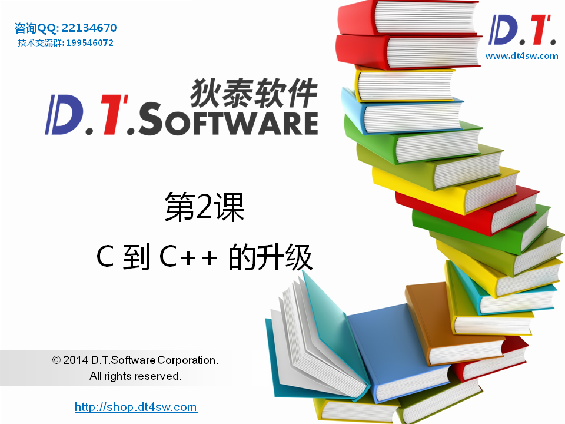


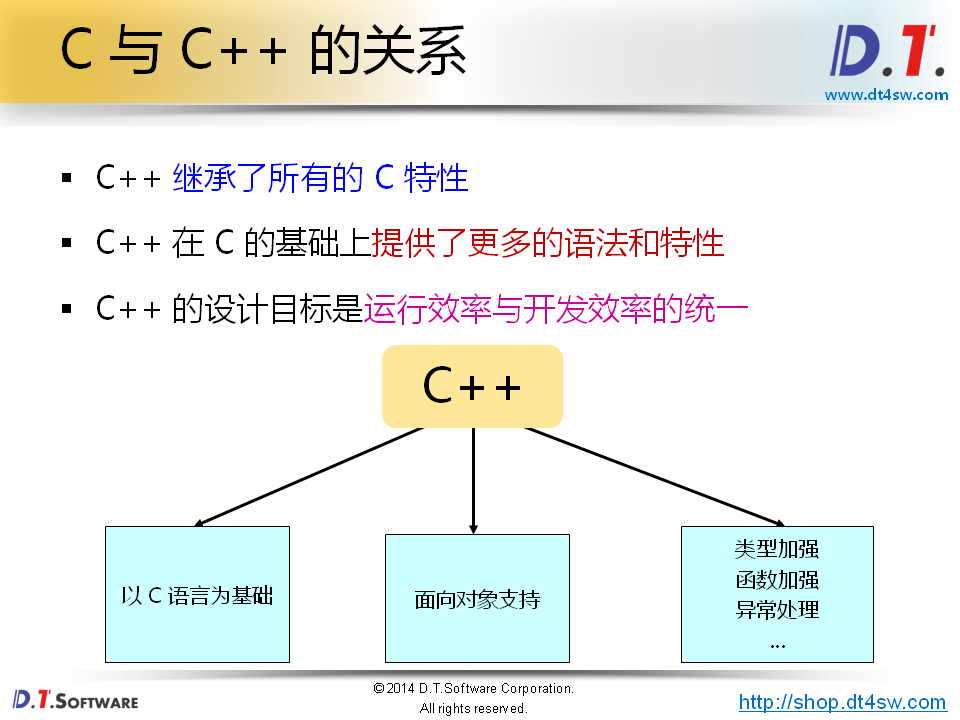


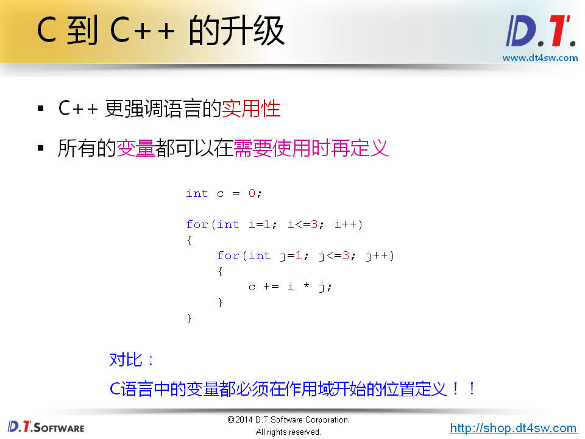


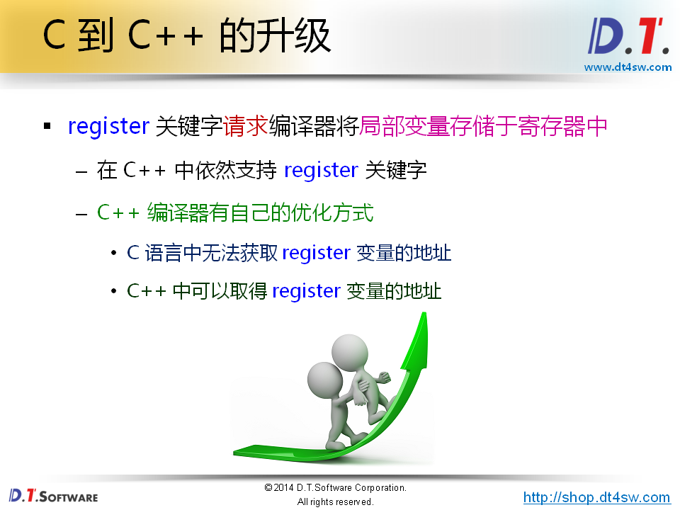


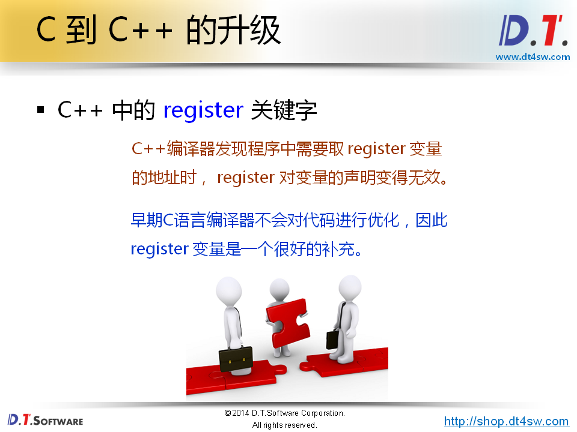


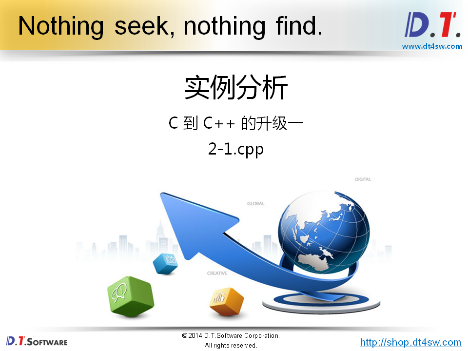

```cpp
#include <stdio.h>

int g_v;
//int g_v;

int main(int argc, char *argv[])
{
    printf("Begin...\n");
    
    int c = 0;//局部变量
    
    for(int i=1; i<=3; i++) //int i/j=1c++加强
    {
        for(int j=1; j<=3; j++)
        {
            c += i * j;
        }
    }
    
    printf("c = %d\n", c);
    
    register int a = 0;//c++加强，对register变量取地址
    
    printf("&a = %p\n", &a);
    
    printf("End...\n");
    
    return 0;
}
// 地址是针对内存来说的，不是针对寄存器来说的；
// C语言编译器int i = 1; error
// 不能取register变量的地址
// C语言中支持同名的全局变量
```

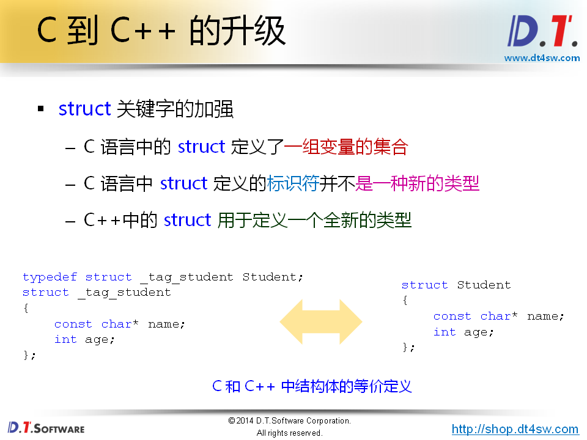

```
C语言中struct为什么是一个标识符
```

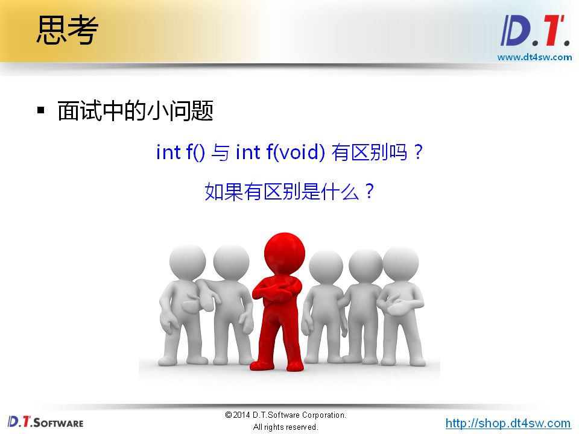

```
在C语言中int f()里面参数可以接受任意参数
在C++中都是返回值为int都没有参数
```

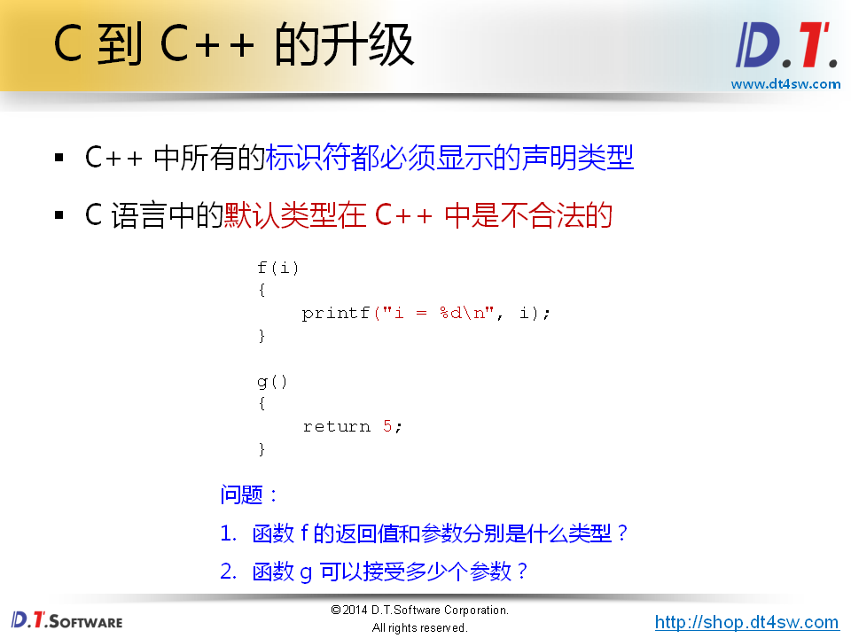


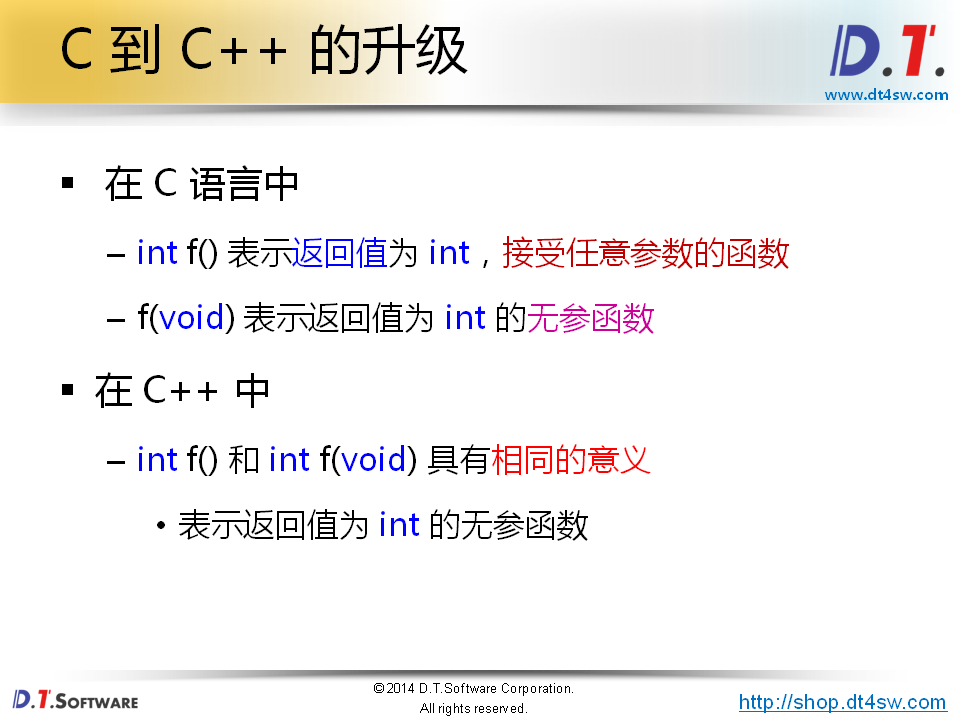

```cpp
任意参数的函数
f(void) 接受任意参数的函数-->二义性->C语言
```


```cpp
#include <stdio.h>

struct Student
{
    const char* name;
    int age;
};

f(i)
{
    printf("i = %d\n", i);
}

g()
{
    return 5;
}


int main(int argc, char *argv[])
{
    Student s1 = {"Delphi", 30};
    Student s2 = {"Tang", 30};
    
    f(10);
    
    printf("g() = %d\n", g(1,2,3,4,5));   
    return 0;
}
// 1.student 不可以,不是类型 C
// f(i) g()  不合法 C++
```

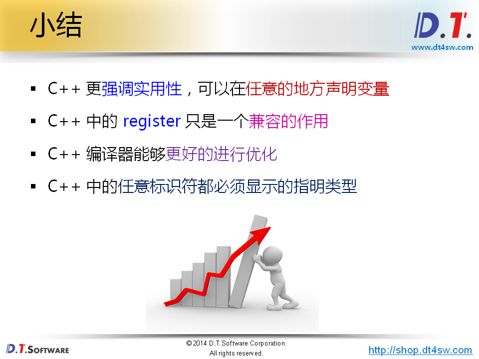