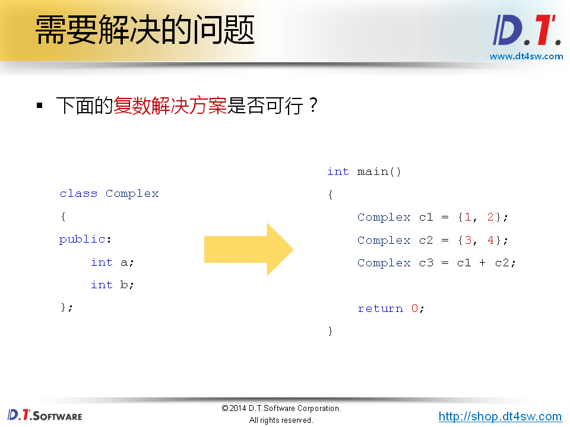
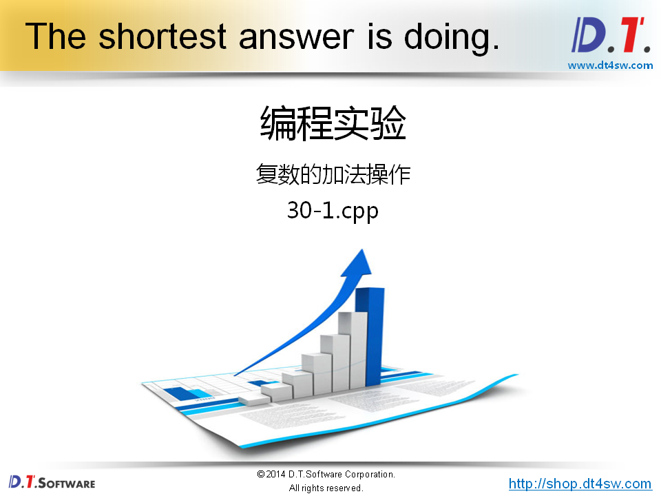
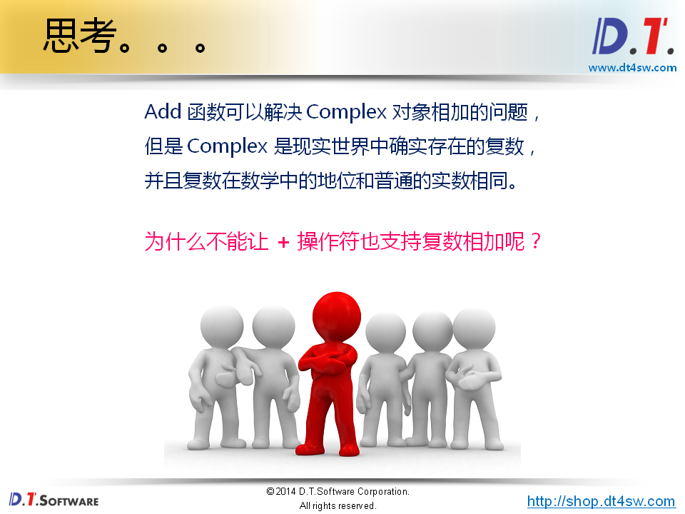
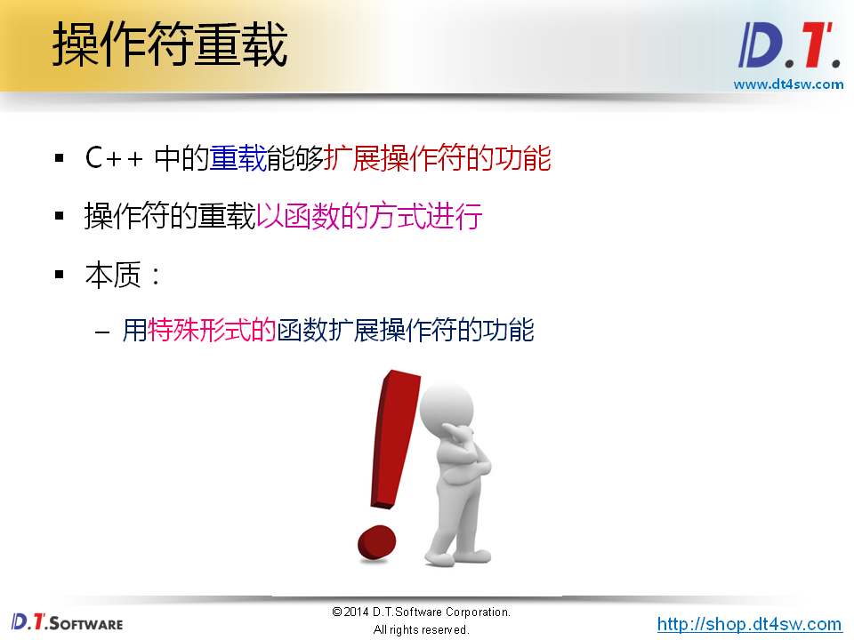
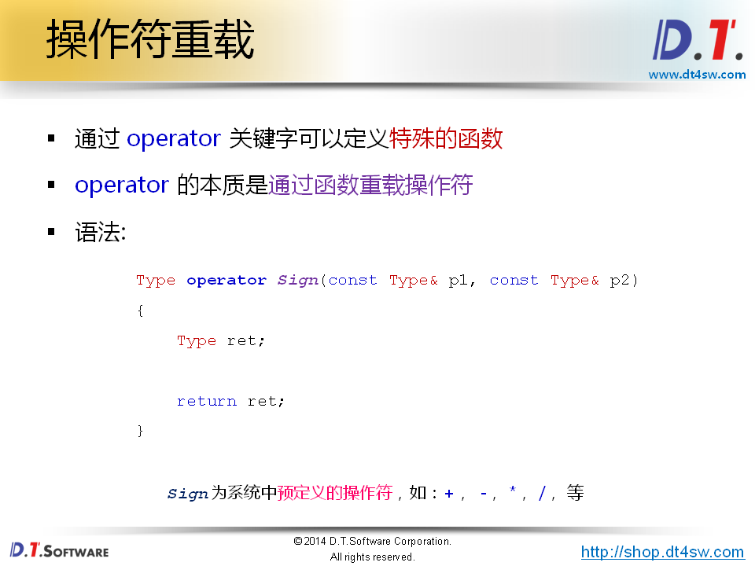
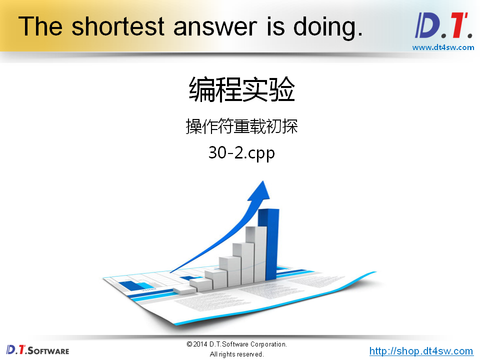
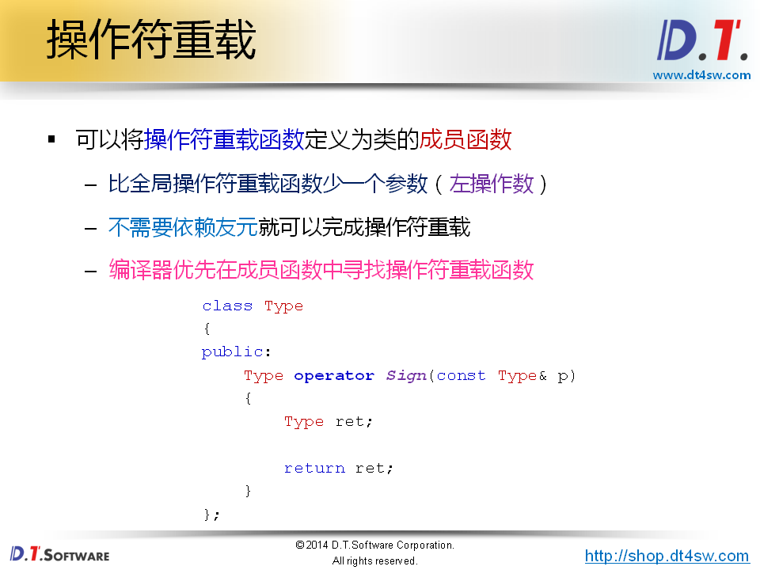
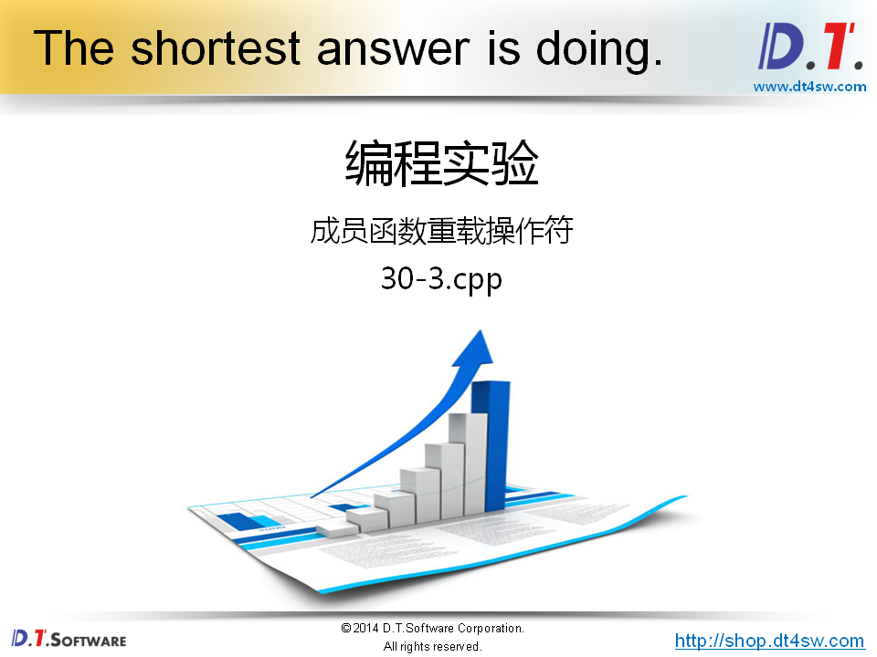
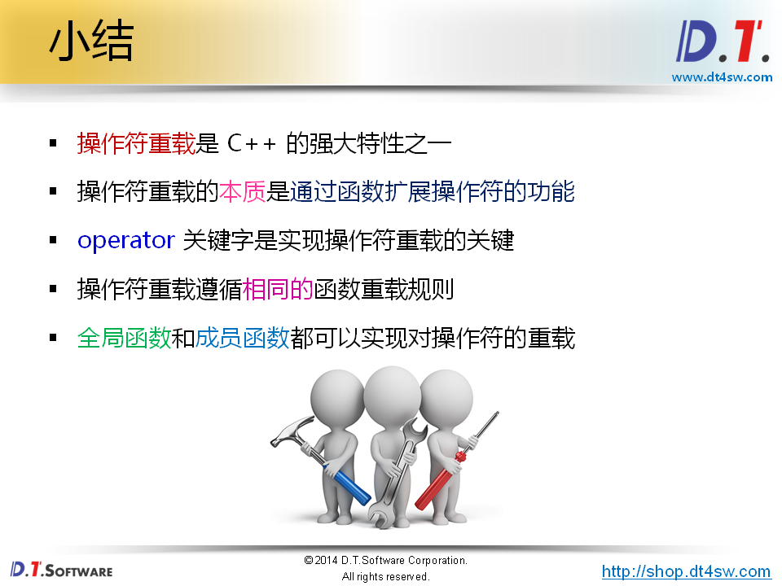

# 操作符重载的概念




ERROR: "operator +"无法作用于该操作



```cpp
#include <stdio.h>

class Complex 
{
    int a;
    int b;
public:
    Complex(int a = 0, int b = 0)
    {
        this->a = a;
        this->b = b;
    }
    
    int getA()
    {
        return a;
    }
    
    int getB()
    {
        return b;
    }
    
    friend Complex Add(const Complex& p1, const Complex& p2);
};

Complex Add(const Complex& p1, const Complex& p2) // 因为a和b是私有的，在类外面是不能直接访问到的，所以使用friend-》为啥不直接当成成员函数呢？
{
    Complex ret;
    
    ret.a = p1.a + p2.a;
    ret.b = p1.b + p2.b;
    
    return ret;
}

int main()
{

    Complex c1(1, 2);
    Complex c2(3, 4);
    Complex c3 = Add(c1, c2); // c1 + c2
    
    printf("c3.a = %d, c3.b = %d\n", c3.getA(), c3.getB());
    
    return 0;
}

```












```cpp
#include <stdio.h>

class Complex 
{
    int a;
    int b;
public:
    Complex(int a = 0, int b = 0)
    {
        this->a = a;
        this->b = b;
    }
    
    int getA()
    {
        return a;
    }
    
    int getB()
    {
        return b;
    }
    
    friend Complex operator + (const Complex& p1, const Complex& p2);
};

Complex operator + (const Complex& p1, const Complex& p2)
{
    Complex ret;
    
    ret.a = p1.a + p2.a;
    ret.b = p1.b + p2.b;
    
    return ret;
}

int main()
{

    Complex c1(1, 2);
    Complex c2(3, 4);
    Complex c3 = c1 + c2; // operator + (c1, c2)
    
    printf("c3.a = %d, c3.b = %d\n", c3.getA(), c3.getB());
    
    return 0;
}

```



解决方案不够完美-》使用了友元-》如何解决？使用成员函数重载操作符的功能

差异-》比全局操作函数少了一个左参数，成员函数里面隐含了一个this指针



```cpp
#include <stdio.h>

class Complex 
{
    int a;
    int b;
public:
    Complex(int a = 0, int b = 0)
    {
        this->a = a;
        this->b = b;
    }
    
    int getA()
    {
        return a;
    }
    
    int getB()
    {
        return b;
    }
    
    Complex operator + (const Complex& p)
    {
        Complex ret;
        printf("Complex operator + (const Complex& p)\n");
        ret.a = this->a + p.a;
        ret.b = this->b + p.b;
        
        return ret;
    }
    
    friend Complex operator + (const Complex& p1, const Complex& p2);
};

Complex operator + (const Complex& p1, const Complex& p2)
{
    Complex ret;
    printf("Complex operator + (const Complex& p1, const Complex& p2)\n");
    ret.a = p1.a + p2.a;
    ret.b = p1.b + p2.b;
    
    return ret;
}

int main()
{

    Complex c1(1, 2);
    Complex c2(3, 4);
    Complex c3 = c1 + c2; // c1.operator + (c2)调用成员函数版本
    
    printf("c3.a = %d, c3.b = %d\n", c3.getA(), c3.getB());
    
    return 0;
}
```

