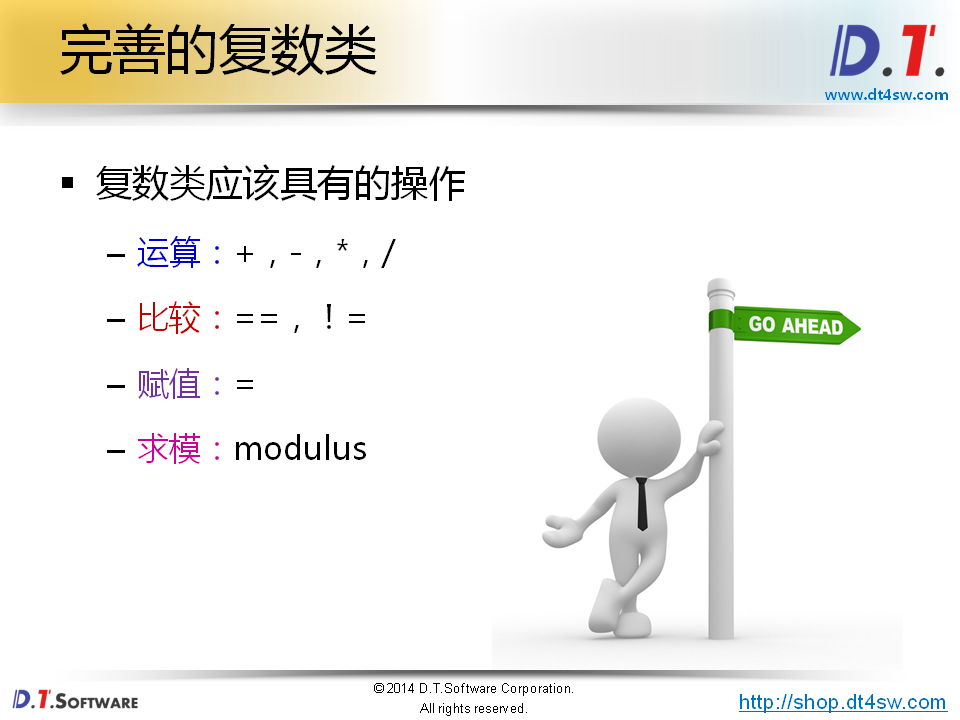
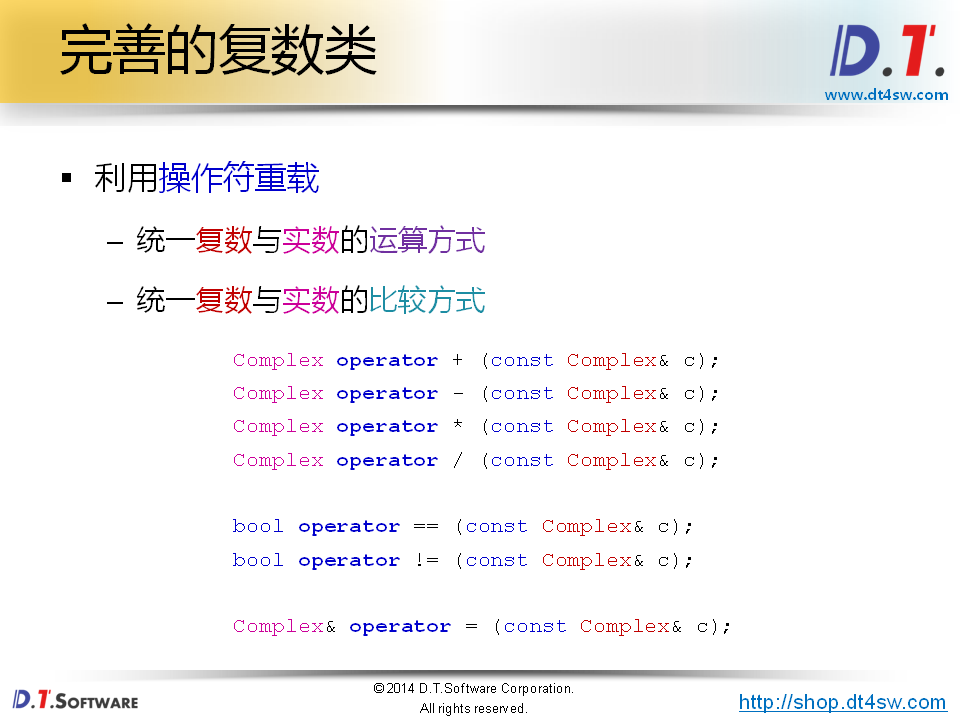
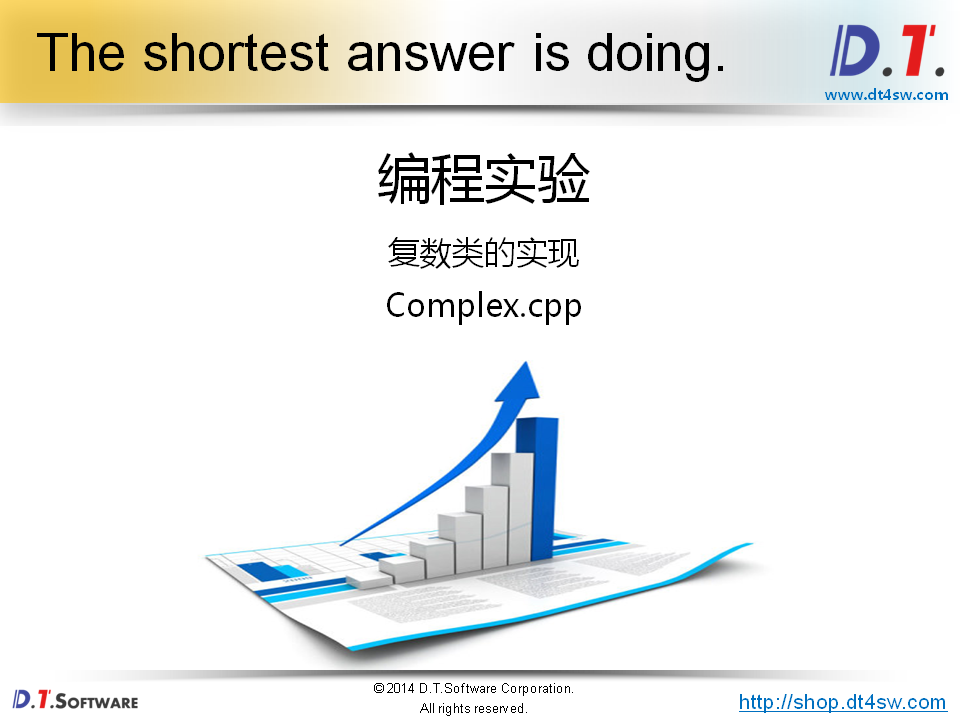
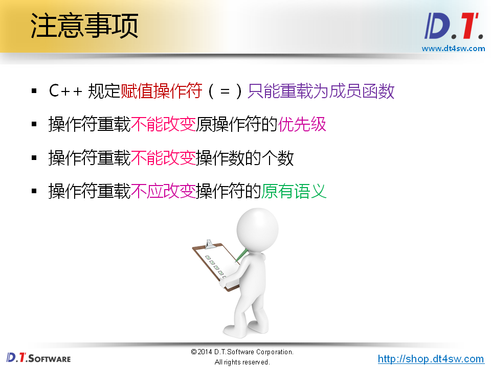

# 完整的复数类










```cpp
#ifndef _COMPLEX_H_
#define _COMPLEX_H_

class Complex
{
    double a;
    double b;
public:
    Complex(double a = 0, double b = 0);
    double getA();
    double getB();
    double getModulus();
    
    Complex operator + (const Complex& c);
    Complex operator - (const Complex& c);
    Complex operator * (const Complex& c);
    Complex operator / (const Complex& c);
    
    bool operator == (const Complex& c);
    bool operator != (const Complex& c);
    
    Complex& operator = (const Complex& c);
};

#endif
```

```cpp
#include "Complex.h"
#include "math.h"

Complex::Complex(double a, double b)
{
    this->a = a;
    this->b = b;
}

double Complex::getA()
{
    return a;
}

double Complex::getB()
{
    return b;
}

double Complex::getModulus()
{
    return sqrt(a * a + b * b);
}

Complex Complex::operator + (const Complex& c)
{
    double na = a + c.a;
    double nb = b + c.b;
    Complex ret(na, nb);
    
    return ret;
}

Complex Complex::operator - (const Complex& c)
{
    double na = a - c.a;
    double nb = b - c.b;
    Complex ret(na, nb); // 构造然后返回
    
    return ret;
}

Complex Complex::operator * (const Complex& c)
{
    double na = a * c.a - b * c.b;
    double nb = a * c.b + b * c.a;
    Complex ret(na, nb);
    
    return ret;
}

Complex Complex::operator / (const Complex& c)
{
    double cm = c.a * c.a + c.b * c.b;
    double na = (a * c.a + b * c.b) / cm;
    double nb = (b * c.a - a * c.b) / cm;
    
    Complex ret(na, nb);
    
    return ret;
}
    
bool Complex::operator == (const Complex& c)
{
    return (a == c.a) && (b == c.b);
}

bool Complex::operator != (const Complex& c)
{
    return !(*this == c); // 当前对象和目前对象是否相等
}
    
Complex& Complex::operator = (const Complex& c)
{
    if( this != &c ) // 判断对象是否相等
    {
        a = c.a;
        b = c.b;
    }
    
    return *this; // 返回当前对象的引用-》为什么，因为对于赋值而言它需要支持连续赋值的
}
```

```cpp
#include <stdio.h>
#include "Complex.h"

int main()
{
    Complex c1(1, 2);
    Complex c2(3, 6);
    Complex c3 = c2 - c1;
    Complex c4 = c1 * c3;
    Complex c5 = c2 / c1;
    
    printf("c3.a = %f, c3.b = %f\n", c3.getA(), c3.getB());
    printf("c4.a = %f, c4.b = %f\n", c4.getA(), c4.getB());
    printf("c5.a = %f, c5.b = %f\n", c5.getA(), c5.getB());
    
    Complex c6(2, 4);
    
    printf("c3 == c6 : %d\n", c3 == c6);
    printf("c3 != c4 : %d\n", c3 != c4);
    
    (c3 = c2) = c1;
    
    printf("c1.a = %f, c1.b = %f\n", c1.getA(), c1.getB());
    printf("c2.a = %f, c2.b = %f\n", c2.getA(), c2.getB());
    printf("c3.a = %f, c3.b = %f\n", c3.getA(), c3.getB());
    
    return 0;
}

```



不应该修改操作符的原有语义->也就是=必须支持连续赋值

