# 初探C++标准库


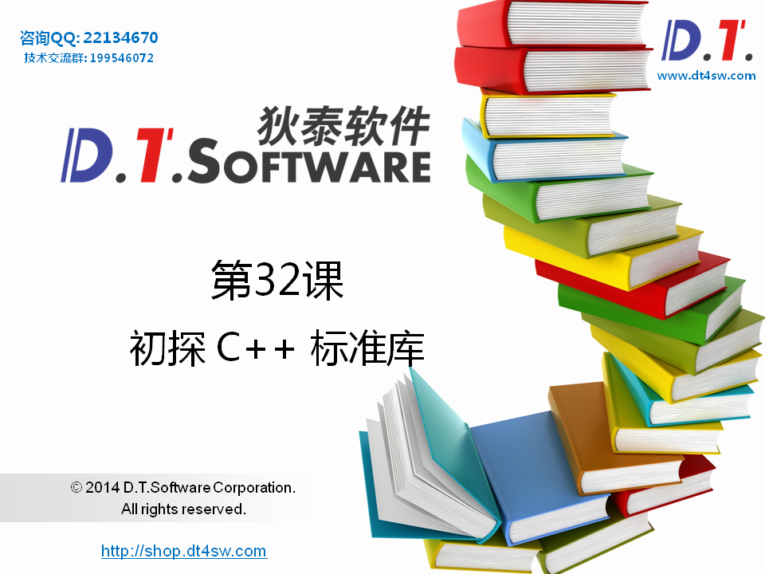


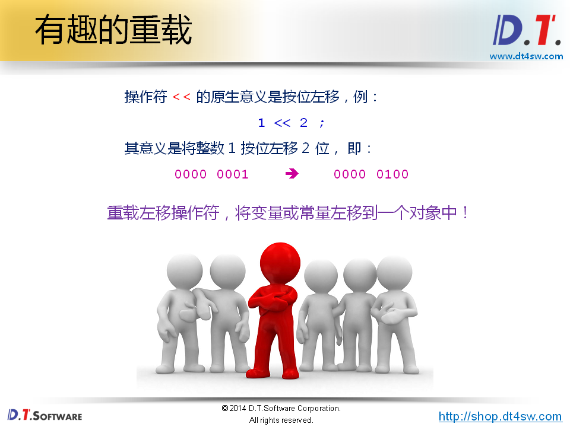


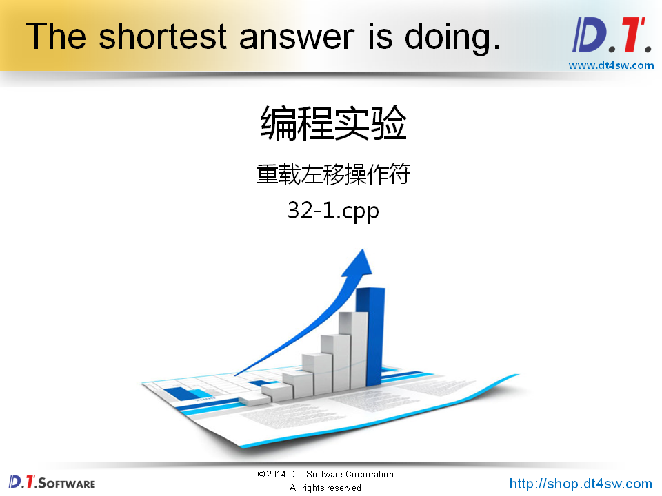

```cpp
#include <stdio.h>

const char endl = '\n';

class Console
{
public:
    Console& operator << (int i)
    {
        printf("%d", i);
        
        return *this;
    }
    Console& operator << (char c)
    {
        printf("%c", c);
        
        return *this;
    }
    Console& operator << (const char* s)
    {
        printf("%s", s);
        
        return *this;
    }
    Console& operator << (double d)
    {
        printf("%f", d);
        
        return *this;
    }
};

Console cout;

int main()
{
    cout << 1 << endl;
    cout << "D.T.Software" << endl;
    
    double a = 0.1;
    double b = 0.2;
    
    cout << a + b << endl;
    
    return 0;
}

```

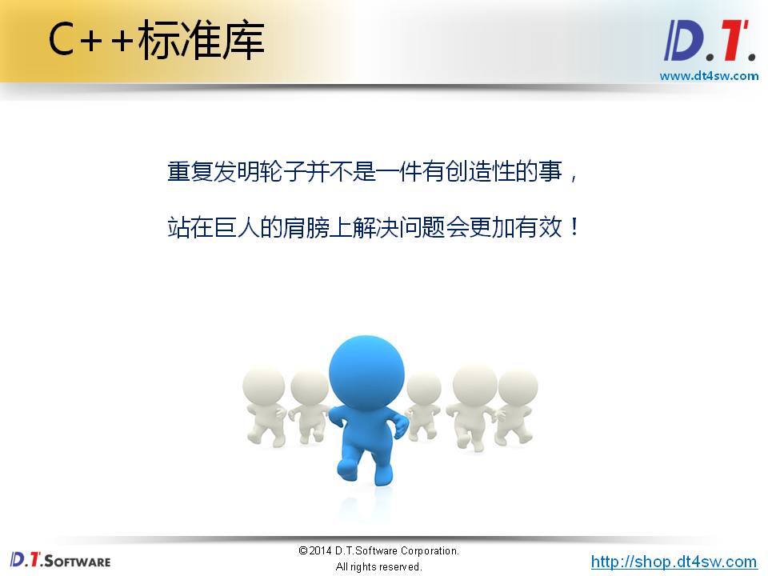


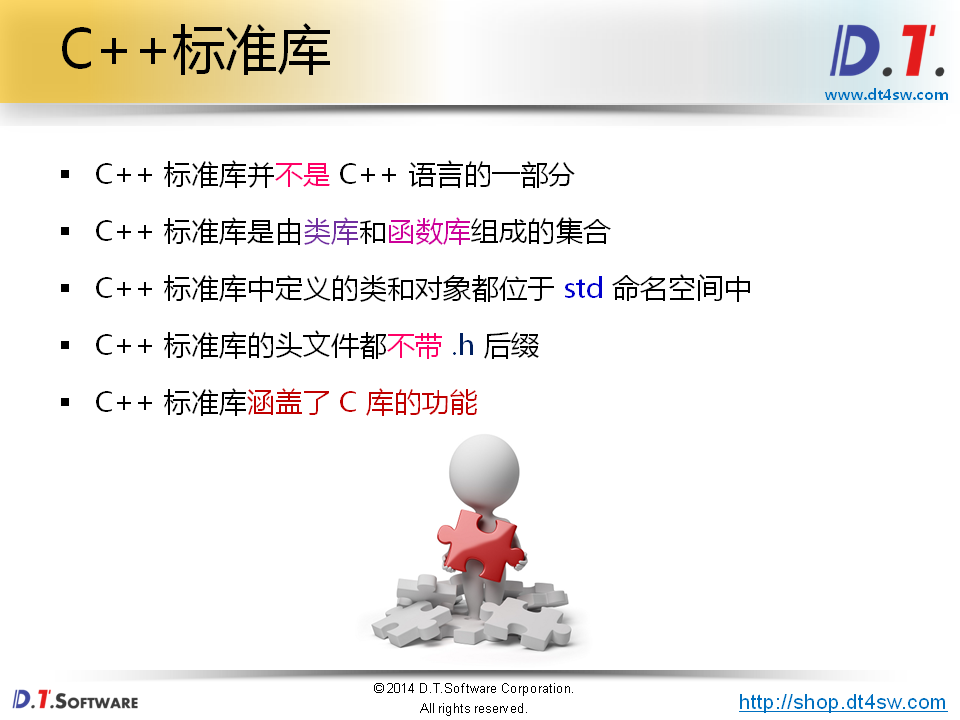


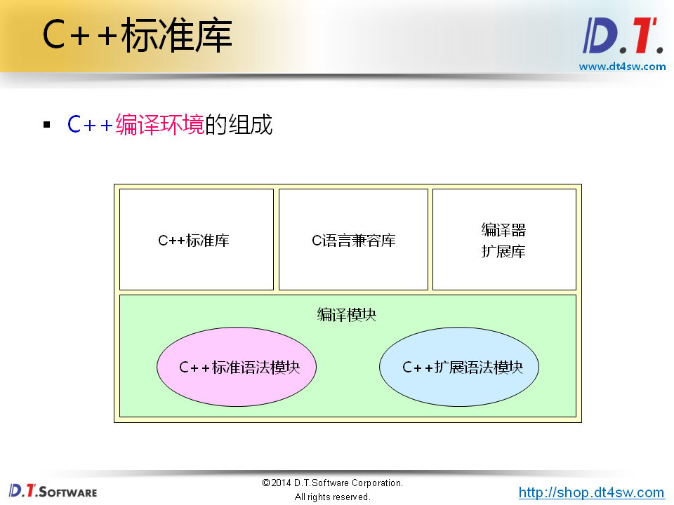


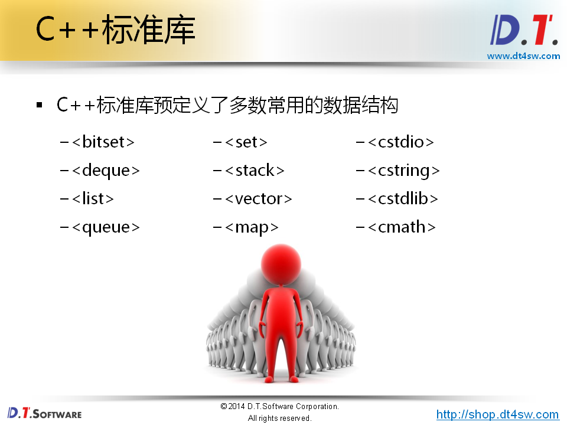


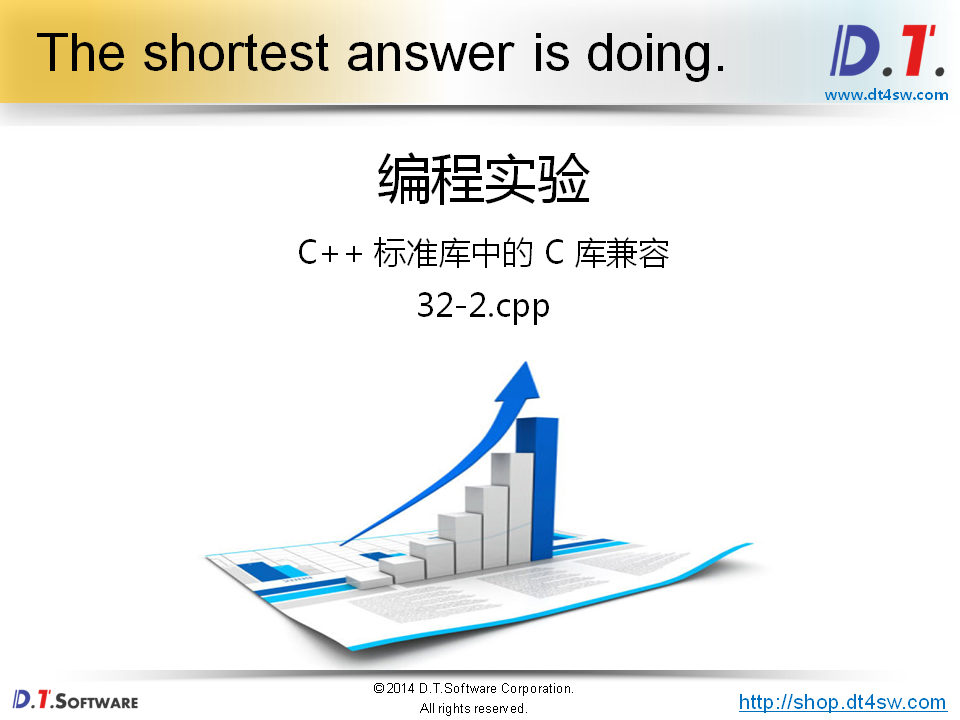

```cpp
#include <cstdio>
#include <cstring>
#include <cstdlib>
#include <cmath>

using namespace std;


int main()
{
    printf("Hello world!\n");
    
    char* p = (char*)malloc(16);
    
    strcpy(p, "D.T.Software");
    
    double a = 3;
    double b = 4;
    double c = sqrt(a * a + b * b);
    
    printf("c = %f\n", c);
    
    free(p);
    
    return 0;
}

```

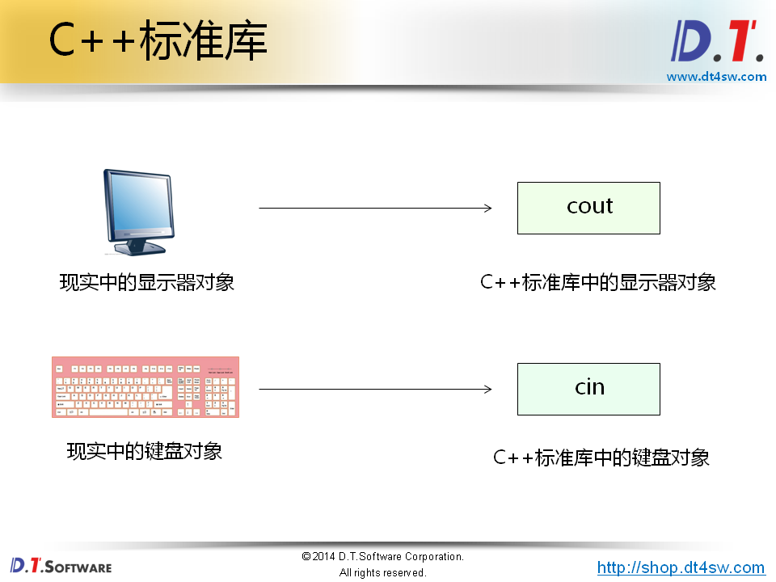


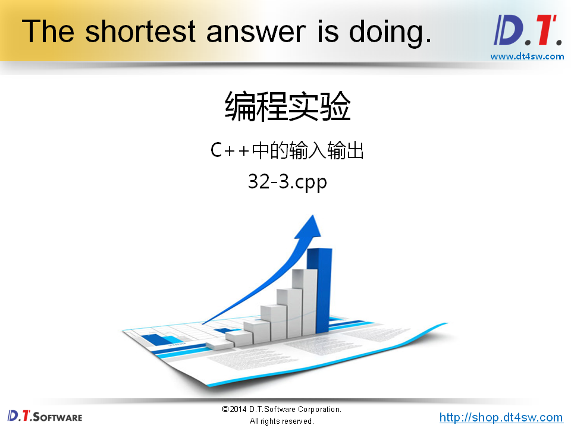

```cpp
#include <iostream>
#include <cmath>

using namespace std;


int main()
{
    cout << "Hello world!" << endl;
    
    double a = 0;
    double b = 0;
    
    cout << "Input a: ";
    cin >> a;
    
    cout << "Input b: ";
    cin >> b;
    
    double c = sqrt(a * a + b * b);
    
    cout << "c = " << c << endl;
    
    return 0;
}

```

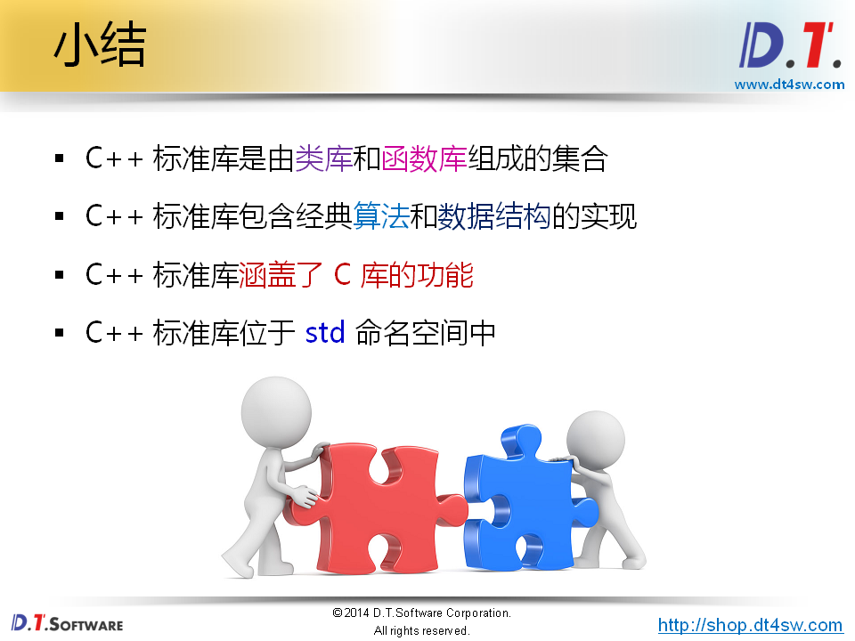