# C++ 中的字符串类


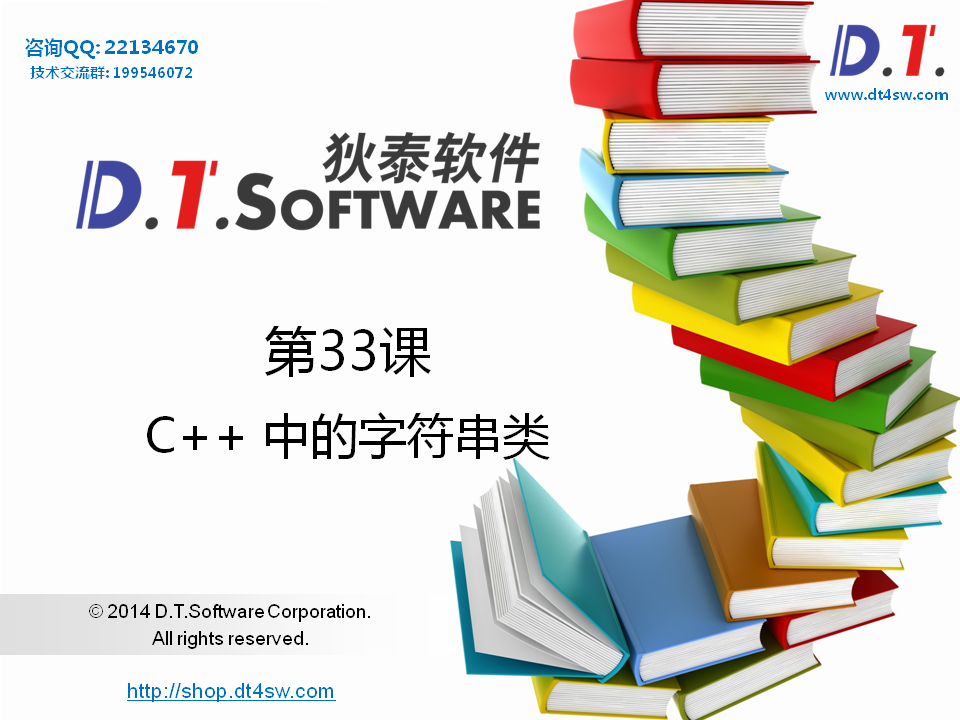


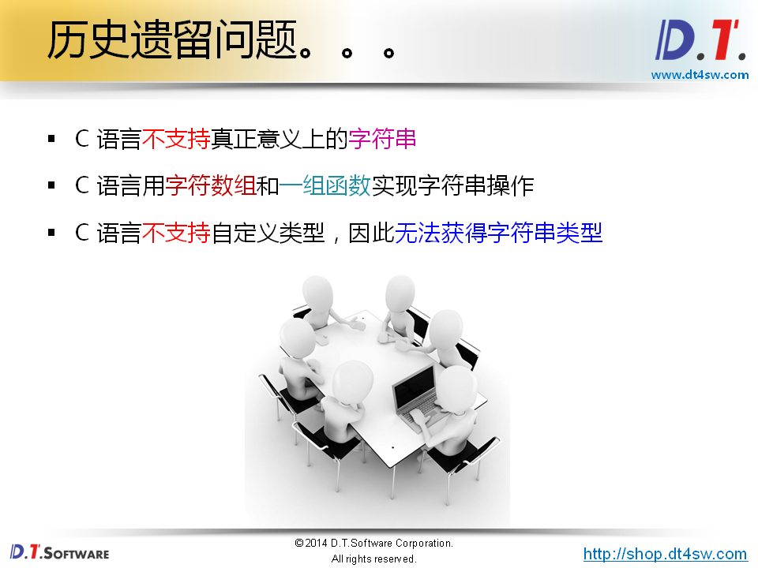


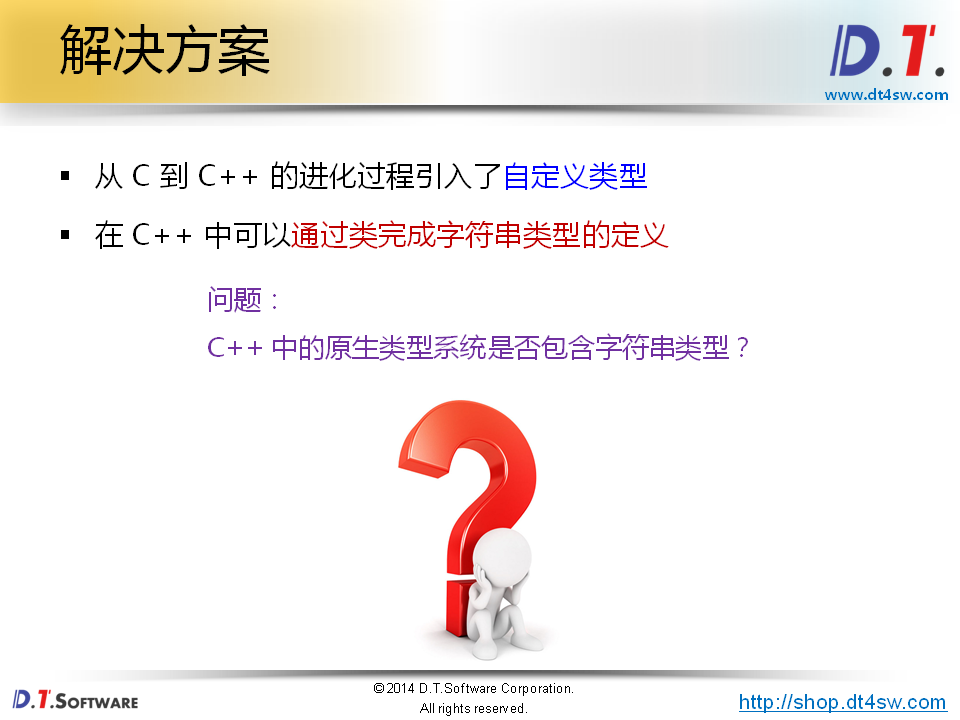


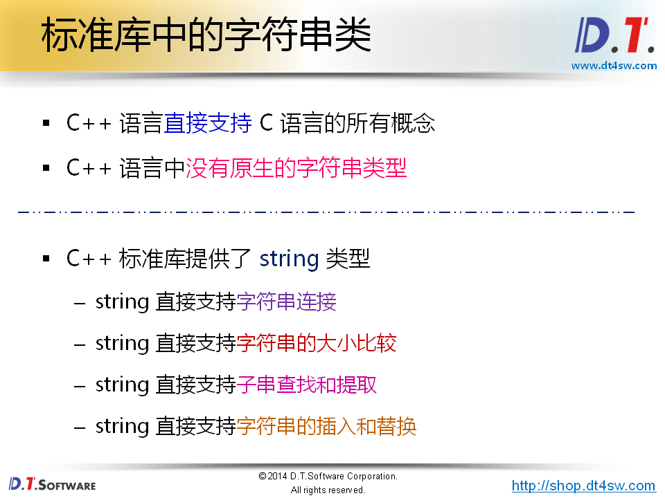


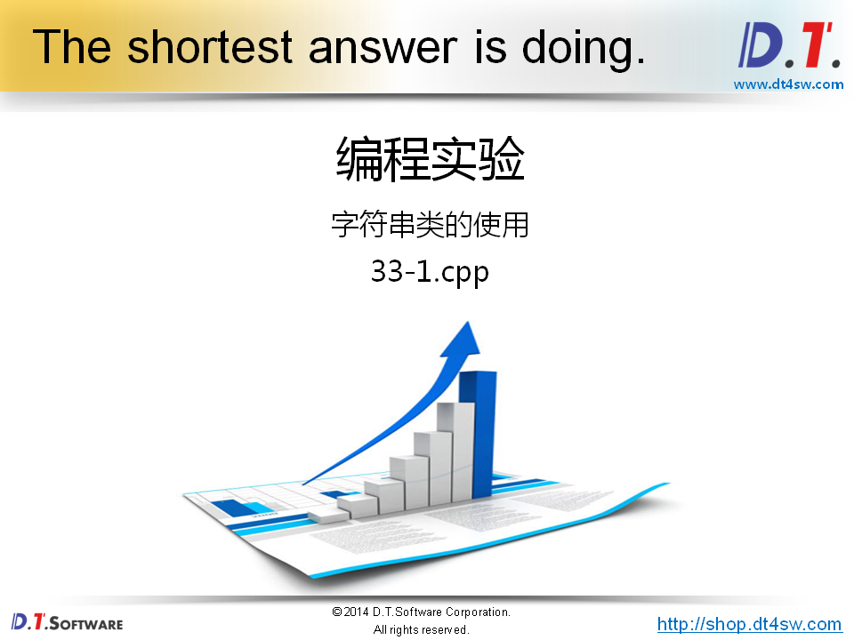

```cpp
#include <iostream>
#include <string>

using namespace std;

void string_sort(string a[], int len)
{
    for(int i=0; i<len; i++)
    {
        for(int j=i; j<len; j++)
        {
            if( a[i] > a[j] )
            {
                swap(a[i], a[j]);
            }
        }
    }
}

string string_add(string a[], int len) 
{
    string ret = "";
    
    for(int i=0; i<len; i++)
    {
        ret += a[i] + "; "; // 因为操作符重载
    }
    
    return ret;
}

int main()
{
    string sa[7] = 
    {
        "Hello World",
        "D.T.Software",
        "C#",
        "Java",
        "C++",
        "Python",
        "TypeScript"
    }; // 字符串数组
    
    string_sort(sa, 7);
    
    for(int i=0; i<7; i++)
    {
        cout << sa[i] << endl;
    }
    
    cout << endl;
    
    cout << string_add(sa, 7) << endl;
    
    return 0;
}

```

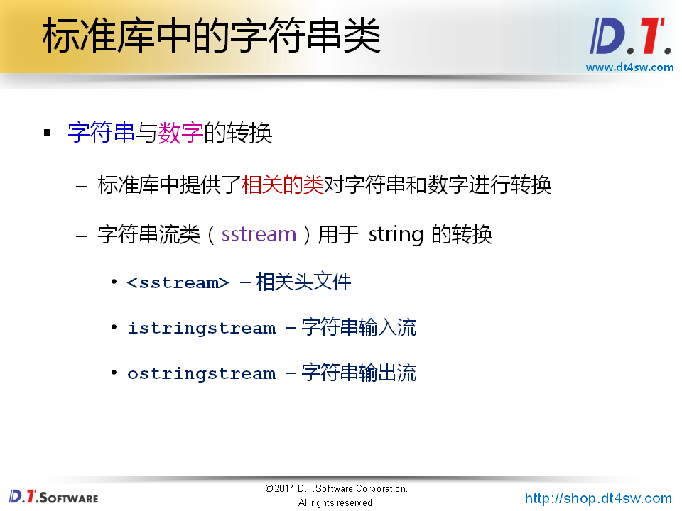


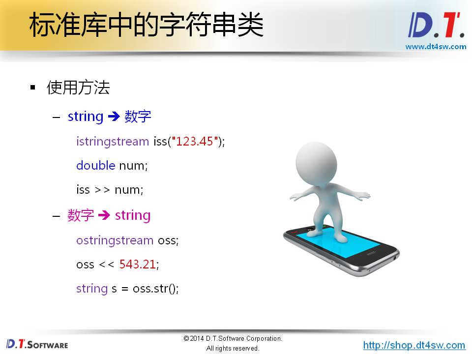

**重要**

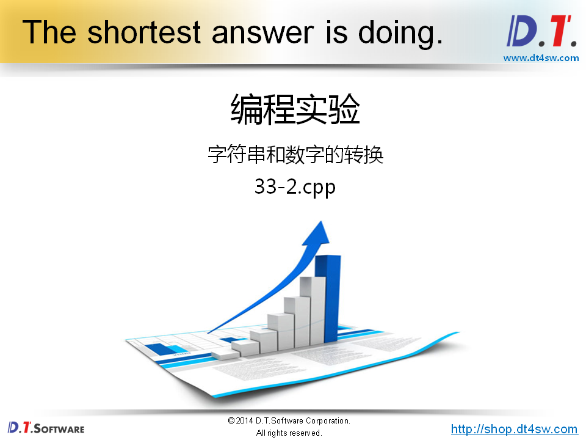

```cpp
#include <iostream>
#include <sstream> // isringstream,ostringstream头文件
#include <string>

using namespace std;


#define TO_NUMBER(s, n) (istringstream(s) >> n)
#define TO_STRING(n) (((ostringstream&)(ostringstream() << n)).str())

bool to_number(const string& s, int& n)
{
    isstringstream iss(s);
    return iss >> n;
}
// 多种类型需要重载-》使用模板、或者宏

string to_string(int n)
{
	ostringstream oss;
    oss << n;
    return oss.str();
}

int main()
{

    double n = 0;
   
    if( TO_NUMBER("234.567", n) )
    {
        cout << n << endl;    
    }

    string s = TO_STRING(12345);

    cout << s << endl;     
    
    return 0;
}

```

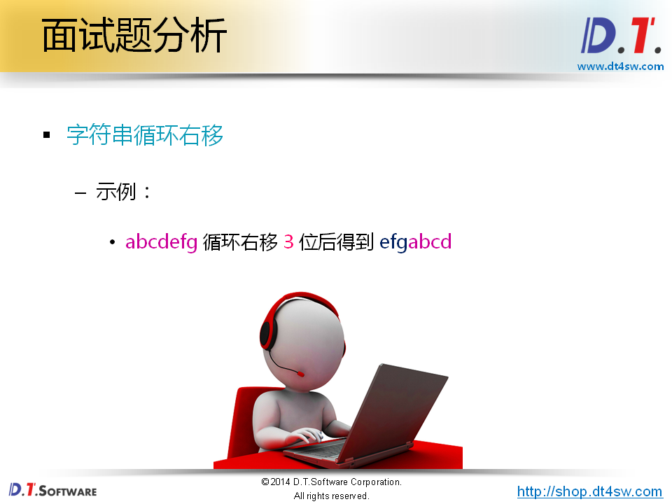


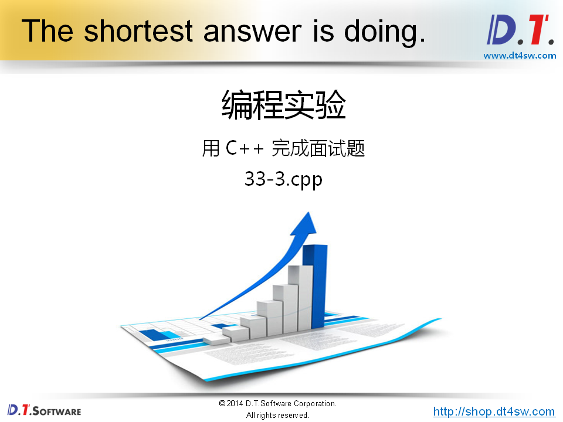

```cpp
#include <iostream>
#include <string>

using namespace std;

string operator >> (const string& s, unsigned int n)
{
    string ret = "";
    unsigned int pos = 0;
    
    n = n % s.length();
    pos = s.length() - n;
    ret = s.substr(pos);
    ret += s.substr(0, pos);
    
    return ret;
}

int main()
{
    string s = "abcdefg";
    string r = (s >> 3);
    
    cout << r << endl;
    
    return 0;
}

```

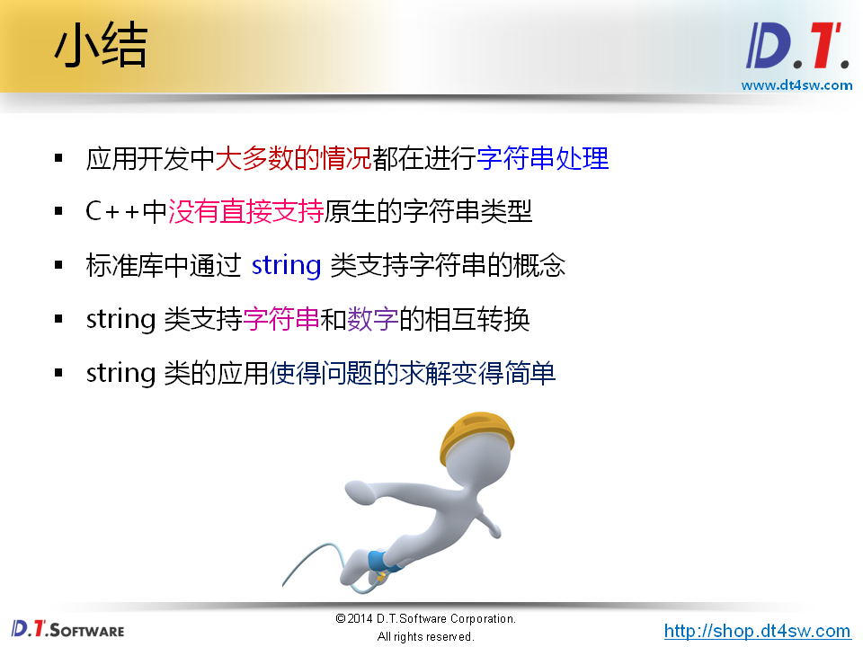


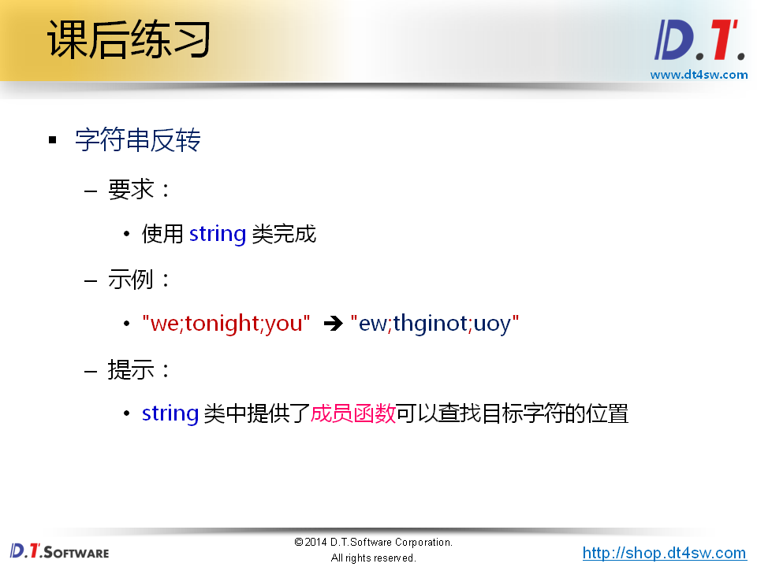

```cpp
#include <iostream>
#include <string>

using namespace std;

string reverse(const string& s, const char c)
{
    string ret = "";

    return ret;
}

int main()
{
    cout << reverse("", ';') << endl;                 // 输出：空字符串
    cout << reverse(";", ';') << endl;                // 输出：;
    cout << reverse("abcde;", ';') << endl;           // 输出：edcba;
    cout << reverse("we;tonight;you", ';') << endl;   // 输出：ew;thginot;uoy
    
    return 0;
}

```

