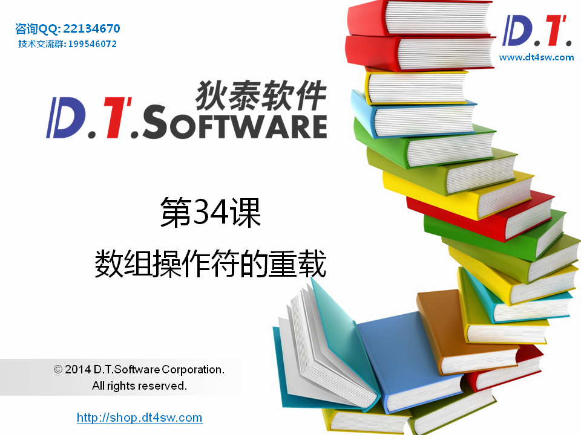
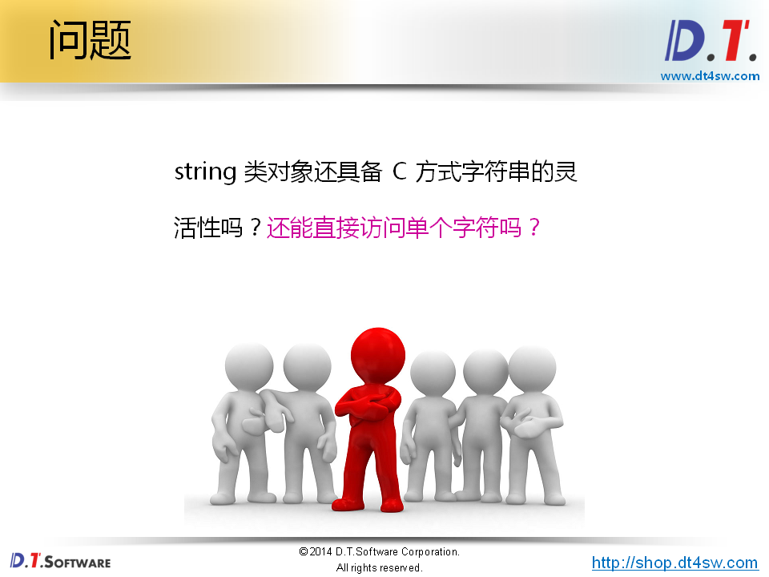
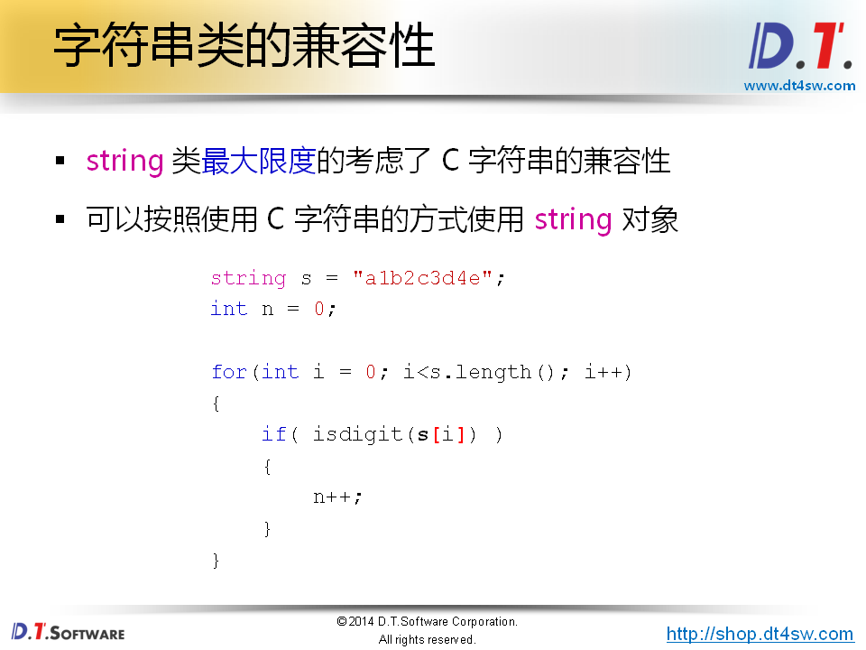
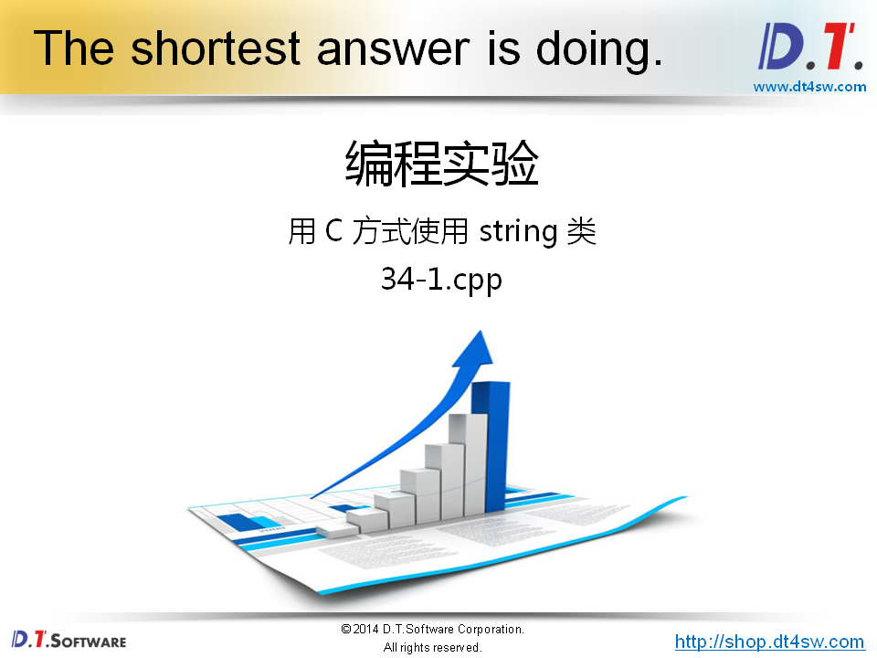
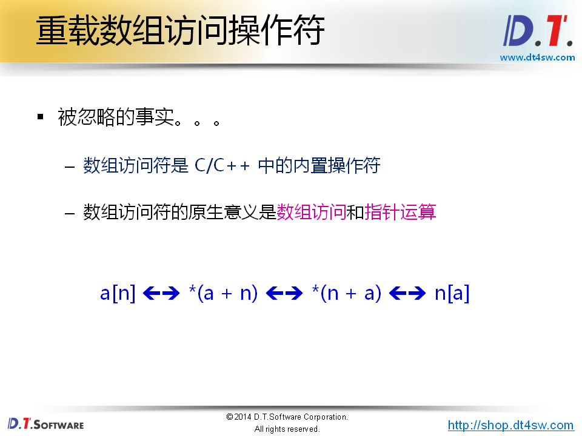
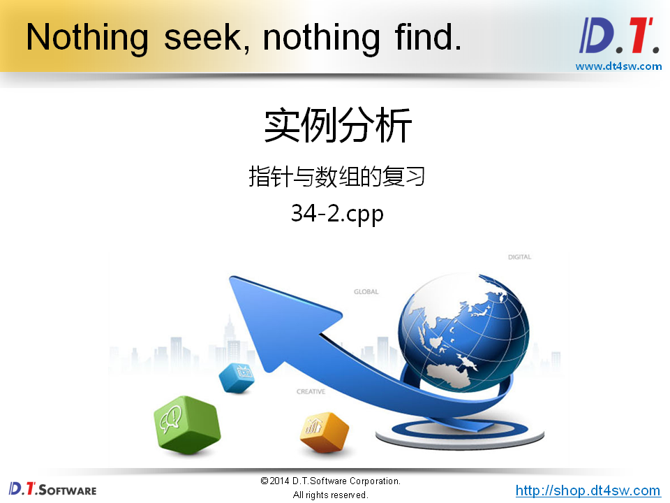
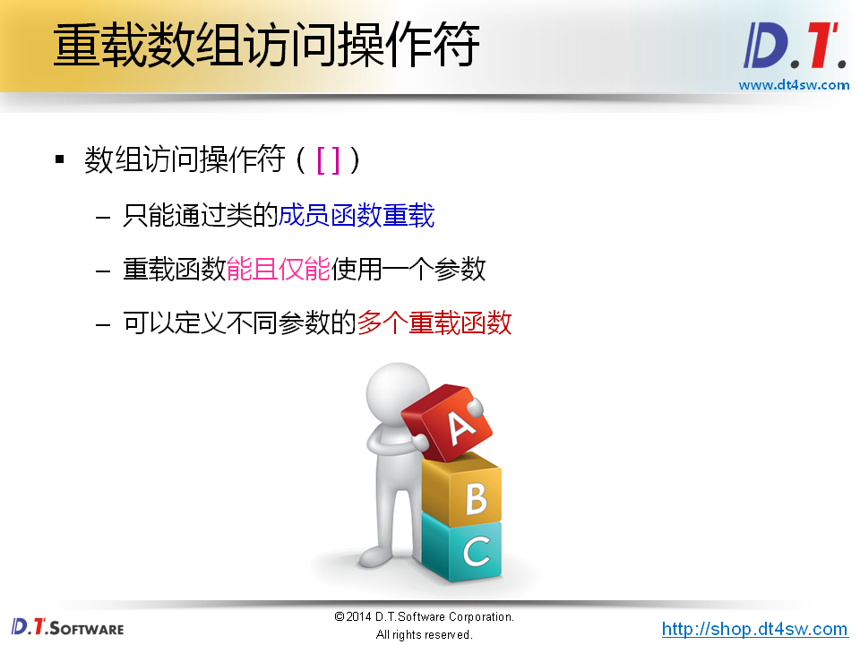
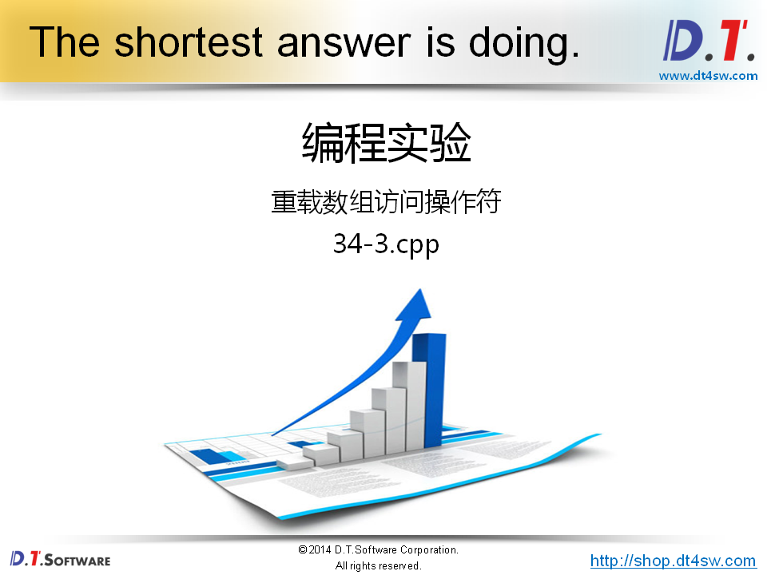
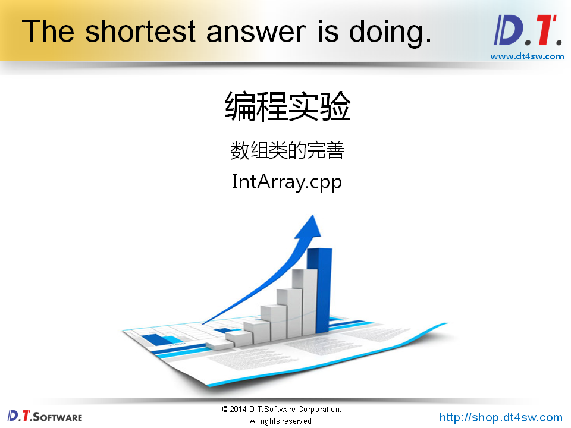
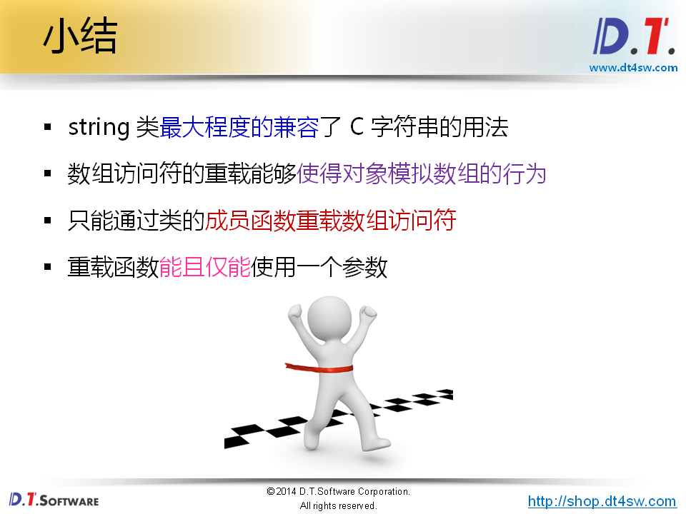

# 数组操作符的重载













```cpp
#include <iostream>
#include <string>

using namespace std;

int main()
{
    string s = "a1b2c3d4e";
    int n = 0;
        
    for(int i = 0; i<s.length(); i++)
    {
        if( isdigit(s[i]) )
        {
            n++;
        }
    }
    
    cout << n << endl;
    
    return 0;
}

```







```cpp
#include <iostream>
#include <string>

using namespace std;

int main()
{
    int a[5] = {0};
    
    for(int i=0; i<5; i++)
    {
        a[i] = i;
    }
    
    for(int i=0; i<5; i++)
    {
        cout << *(a + i) << endl;    // cout << a[i] << endl;
    }
    
    cout << endl;
    
    for(int i=0; i<5; i++)
    {
        i[a] = i + 10;    // a[i] = i + 10;-》为什么这样？编译器支持？
    }
    
    for(int i=0; i<5; i++)
    {
        cout << *(i + a) << endl;  // cout << a[i] << endl;
    }
    
    return 0;
}

```



重载操作符不能违背它的原生含义



```cpp
#include <iostream>
#include <string>

using namespace std;

class Test
{
    int a[5]; // 定义一个私有的成员
public:
    int& operator [] (int i)  // 字符串，数组重载[]有意义
    {
        return a[i];
    }
    
    int& operator [] (const string& s) // 因为函数返回值需要时左值，所以返回值需要时引用
    {
        if( s == "1st" )
        {
            return a[0];
        }
        else if( s == "2nd" )
        {
            return a[1];
        }
        else if( s == "3rd" )
        {
            return a[2];
        }
        else if( s == "4th" )
        {
            return a[3];
        }
        else if( s == "5th" )
        {
            return a[4];
        }
        
        return a[0];
    }
    
    int length()
    {
        return 5;
    }
};

int main()
{
    Test t;
    
    for(int i=0; i<t.length(); i++)
    {
        t[i] = i;
    }
    
    for(int i=0; i<t.length(); i++)
    {
        cout << t[i] << endl;
    }
    
    cout << t["5th"] << endl;
    cout << t["4th"] << endl;
    cout << t["3rd"] << endl;
    cout << t["2nd"] << endl;
    cout << t["1st"] << endl;
    
    return 0;
}

```



```cpp
#ifndef _INTARRAY_H_
#define _INTARRAY_H_

class IntArray
{
private:
    int m_length;
    int* m_pointer;
    
    IntArray(int len);
    IntArray(const IntArray& obj);
    bool construct();
public:
    static IntArray* NewInstance(int length); 
    int length();
    bool get(int index, int& value);
    bool set(int index ,int value);
    int& operator [] (int index);
    IntArray& self();
    ~IntArray();
};

#endif

```

```cpp
#include "IntArray.h"

IntArray::IntArray(int len)
{
    m_length = len;
}

bool IntArray::construct()
{
    bool ret = true;
    
    m_pointer = new int[m_length];
    
    if( m_pointer )
    {
        for(int i=0; i<m_length; i++)
        {
            m_pointer[i] = 0;
        }
    }
    else
    {
        ret = false;
    }
    
    return ret;
}

IntArray* IntArray::NewInstance(int length) 
{
    IntArray* ret = new IntArray(length);
    
    if( !(ret && ret->construct()) ) 
    {
        delete ret;
        ret = 0;
    }
        
    return ret;
}

int IntArray::length()
{
    return m_length;
}

bool IntArray::get(int index, int& value)
{
    bool ret = (0 <= index) && (index < length());
    
    if( ret )
    {
        value = m_pointer[index];
    }
    
    return ret;
}

bool IntArray::set(int index, int value)
{
    bool ret = (0 <= index) && (index < length());
    
    if( ret )
    {
        m_pointer[index] = value;
    }
    
    return ret;
}

int& IntArray::operator [] (int index)
{
    return m_pointer[index];
}

IntArray& IntArray::self()
{
    return *this;
}

IntArray::~IntArray()
{
    delete[]m_pointer;
}

```

```cpp
#include <iostream>
#include <string>
#include "IntArray.h"

using namespace std;

int main()
{
    IntArray* a = IntArray::NewInstance(5);    // 用什么来替代指针->智能指针
    
    if( a != NULL )
    {
        IntArray& array = a->self();
        
        cout << "array.length() = " << array.length() << endl;
    
        array[0] = 1;
        
        for(int i=0; i<array.length(); i++)
        {  
            cout << array[i] << endl;
        }
    }
    
    delete a;
    
    return 0;
}

```

