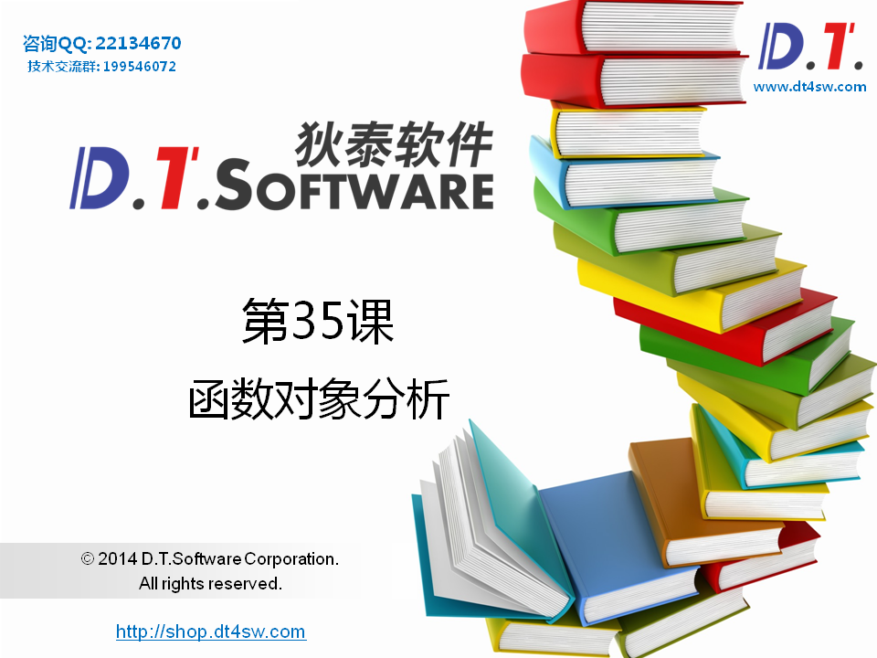
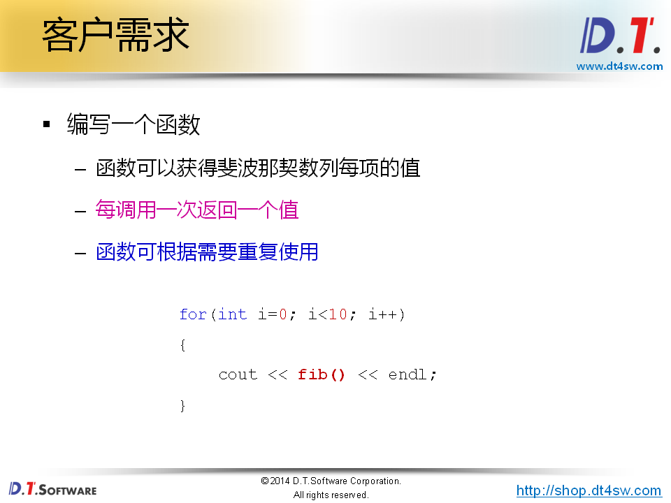
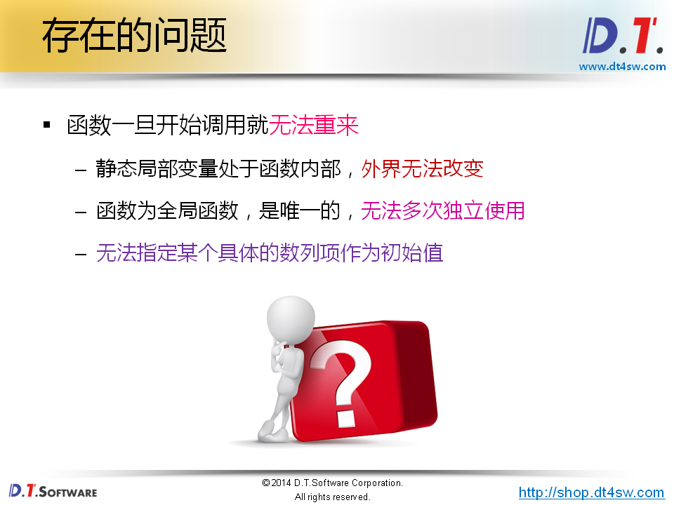
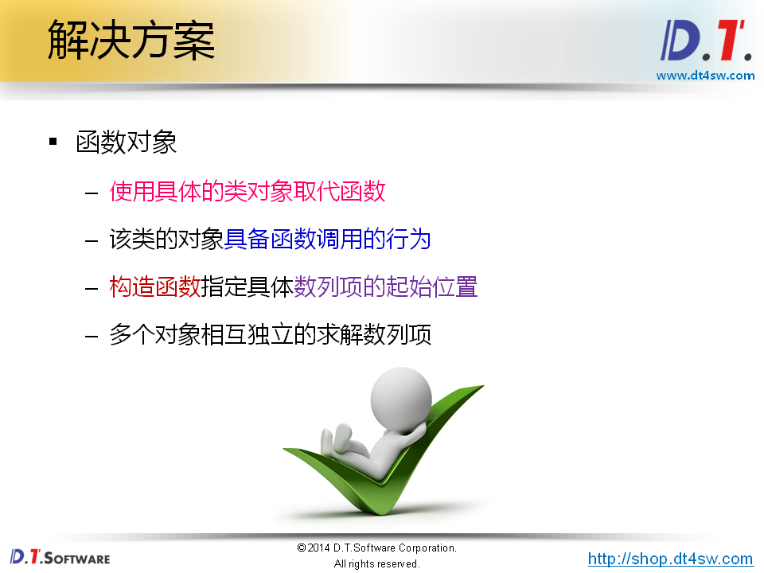
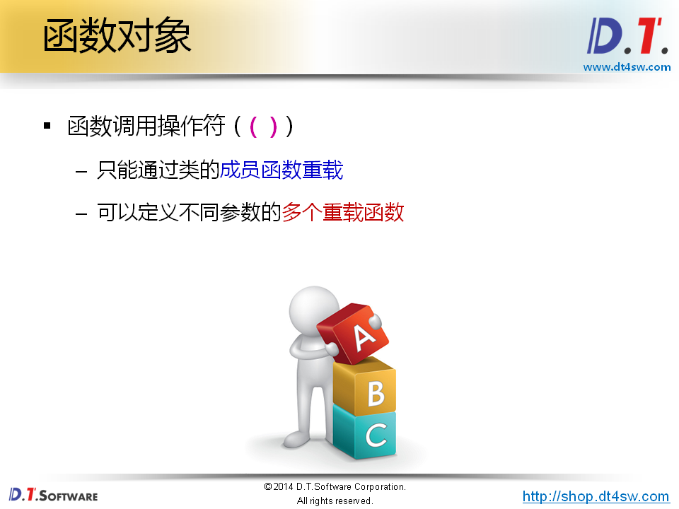
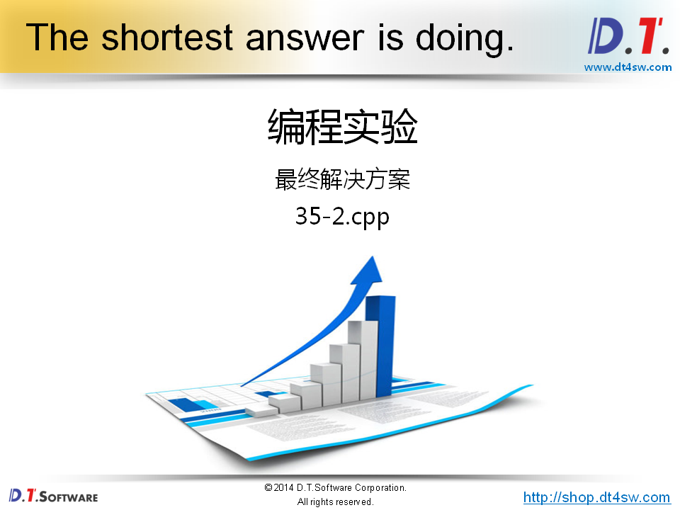
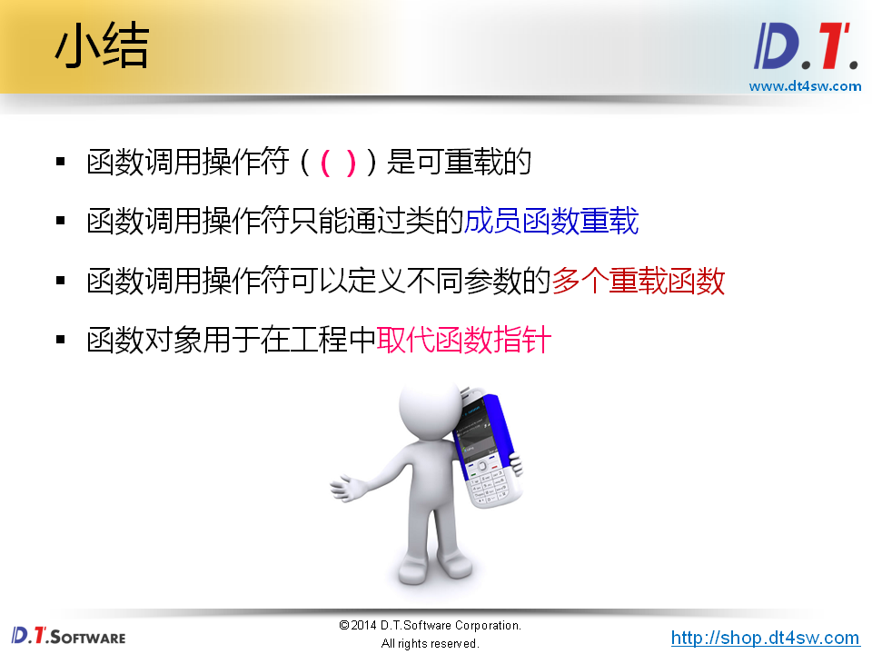

# 函数对象分析








```cpp
#include <iostream>
#include <string>

using namespace std;

int fib()
{
    static int a0 = 0; // 静态局部变量返回后不会被摧毁，有状态 
    static int a1 = 1;
    
    int ret = a1;
    
    a1 = a0 + a1;
    a0 = ret;
    
    return ret;
}


int main()
{
    for(int i=0; i<10; i++)
    {
        cout << fib() << endl;
    }
    
    cout << endl;
    
    for(int i=0; i<5; i++)
    {
        cout << fib() << endl;
    }
    
    return 0;
}

```












```cpp
#include <iostream>
#include <string>

using namespace std;

class Fib
{
    int a0;
    int a1;
public:
    Fib()
    {
        a0 = 0;
        a1 = 1;
    }
    
    Fib(int n)
    {
        a0 = 0;
        a1 = 1;
        
        for(int i=2; i<=n; i++)
        {
            int t = a1;
            
            a1 = a0 + a1;
            a0 = t;
        }
    }
    
    int operator () ()
    {
        int ret = a1;
    
        a1 = a0 + a1;
        a0 = ret;
        
        return ret;
    }
};

int main()
{
    Fib fib;
    
    for(int i=0; i<10; i++)
    {
        cout << fib() << endl;
    }
    
    cout << endl;
    
    for(int i=0; i<5; i++)
    {
        cout << fib() << endl;
    }
    
    cout << endl;
    
    Fib fib2(10);
    
    for(int i=0; i<5; i++)
    {
        cout << fib2() << endl;
    }
    
    return 0;
}

```

