# 36.经典问题解析三


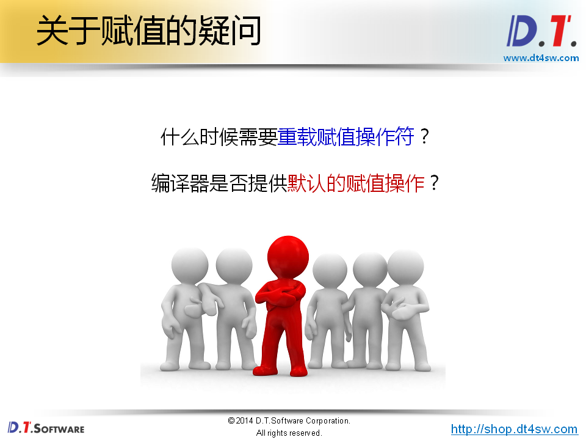


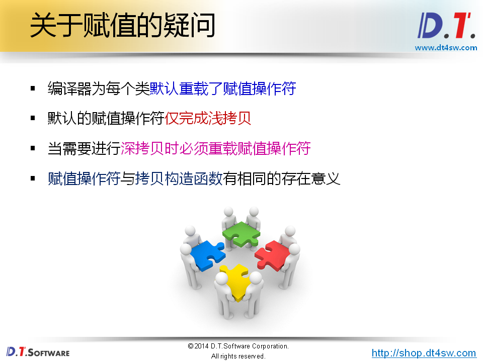

**Note:浅拷贝**

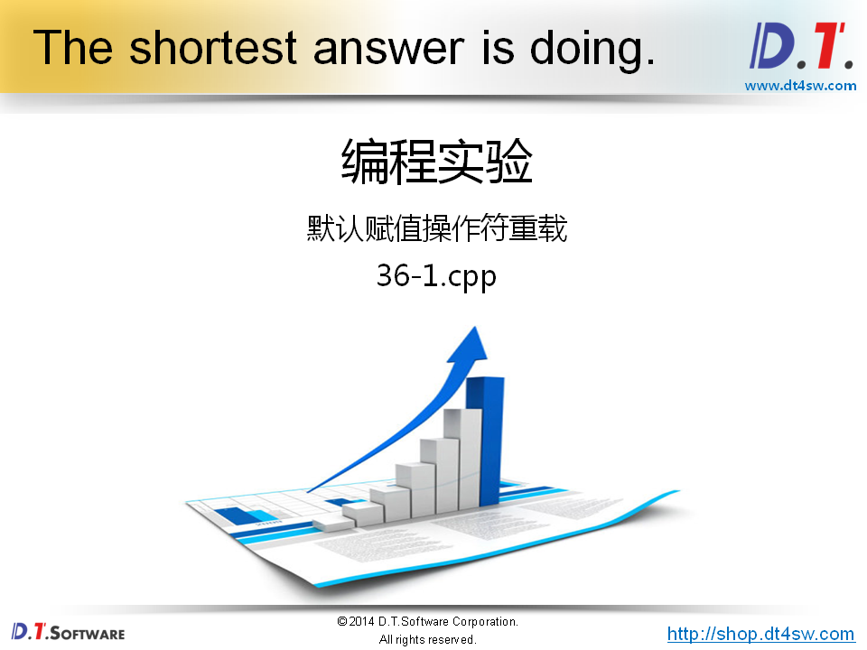

```cpp
#include <iostream>
#include <string>

using namespace std;

class Test
{
    int* m_pointer;
public:
    Test()
    {
        m_pointer = NULL;
    }
    Test(int i)
    {
        m_pointer = new int(i);
    }
    Test(const Test& obj)
    {
        m_pointer = new int(*obj.m_pointer); // 取得整型值，参数空间里面得值复制到申请到得新的空间里面去
    }
    Test& operator = (const Test& obj)
    {
        if( this != &obj ) // check自赋值
        {
            delete m_pointer;
            m_pointer = new int(*obj.m_pointer); //  
        }
        
        return *this;
    }
    void print()
    {
        cout << "m_pointer = " << hex << m_pointer << endl;
    }
    ~Test()
    {
        delete m_pointer;
    }
};

int main()
{
    Test t1 = 1;
    Test t2;
    
    t2 = t1;
    
    t1.print();
    t2.print();
    
    return 0;
}

```

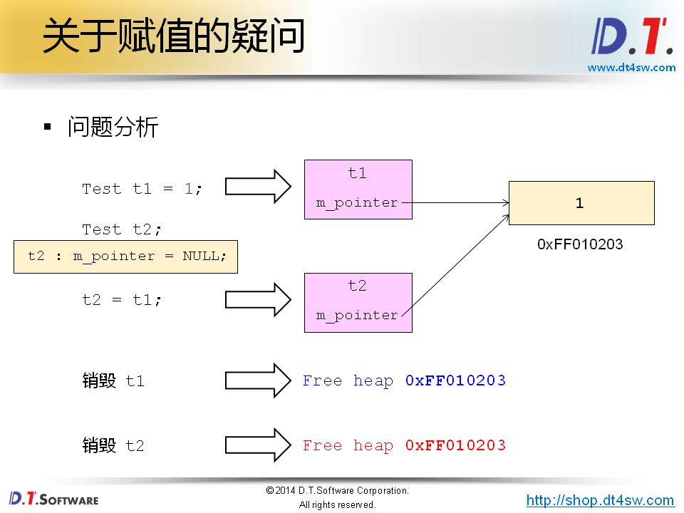


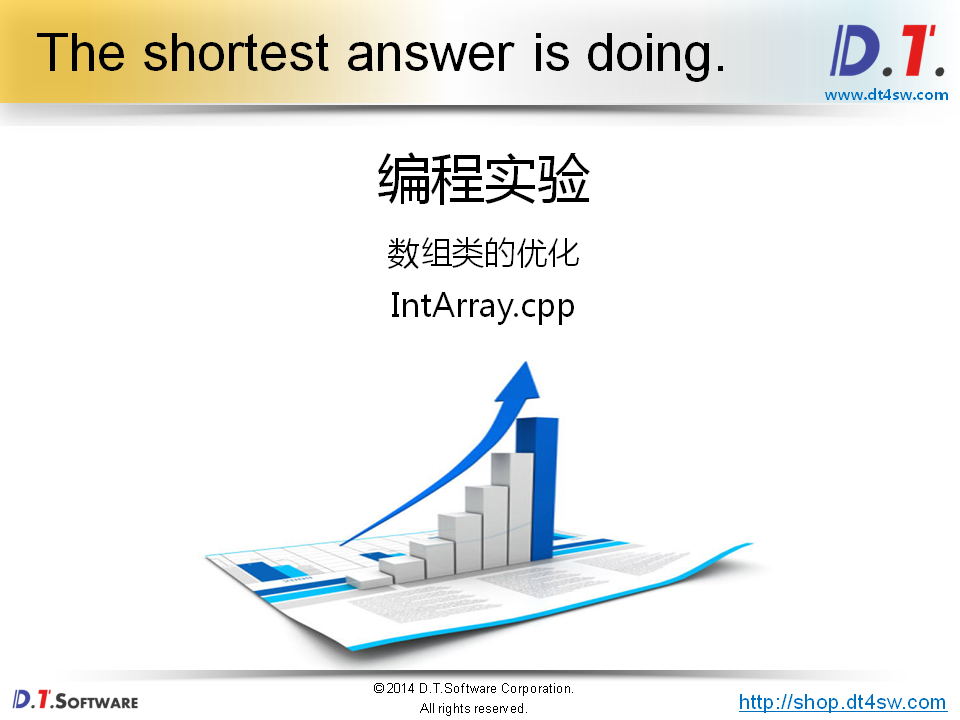

```cpp
#ifndef _INTARRAY_H_
#define _INTARRAY_H_

class IntArray
{
private:
    int m_length;
    int* m_pointer;
    
    IntArray(int len);
    IntArray(const IntArray& obj);
    bool construct();
public:
    static IntArray* NewInstance(int length); 
    int length();
    bool get(int index, int& value);
    bool set(int index ,int value);
    int& operator [] (int index);
    IntArray& operator = (const IntArray& obj);
    IntArray& self();
    ~IntArray();
};

#endif

```

```cpp
#include "IntArray.h"

IntArray::IntArray(int len)
{
    m_length = len;
}

bool IntArray::construct()
{
    bool ret = true;
    
    m_pointer = new int[m_length];
    
    if( m_pointer )
    {
        for(int i=0; i<m_length; i++)
        {
            m_pointer[i] = 0;
        }
    }
    else
    {
        ret = false;
    }
    
    return ret;
}

IntArray* IntArray::NewInstance(int length) 
{
    IntArray* ret = new IntArray(length);
    
    if( !(ret && ret->construct()) ) 
    {
        delete ret;
        ret = 0;
    }
        
    return ret;
}

int IntArray::length()
{
    return m_length;
}

bool IntArray::get(int index, int& value)
{
    bool ret = (0 <= index) && (index < length());
    
    if( ret )
    {
        value = m_pointer[index];
    }
    
    return ret;
}

bool IntArray::set(int index, int value)
{
    bool ret = (0 <= index) && (index < length());
    
    if( ret )
    {
        m_pointer[index] = value;
    }
    
    return ret;
}

int& IntArray::operator [] (int index)
{
    return m_pointer[index];
}

IntArray& IntArray::operator = (const IntArray& obj)
{
    if( this != &obj )
    {
        int* pointer = new int[obj.m_length];
        
        if( pointer )
        {
            for(int i=0; i<obj.m_length; i++)
            {
                pointer[i] = obj.m_pointer[i];
            }
            
            m_length = obj.m_length;
            delete[] m_pointer;
            m_pointer = pointer;
        }
    }
    
    return *this;
}

IntArray& IntArray::self()
{
    return *this;
}

IntArray::~IntArray()
{
    delete[]m_pointer;
}

```

```cpp
#include <iostream>
#include <string>
#include "IntArray.h"

using namespace std;

int main()
{
    IntArray* a = IntArray::NewInstance(5);   
    IntArray* b = IntArray::NewInstance(10);
    
    if( a && b )
    {
        IntArray& array = a->self();
        IntArray& brray = b->self();
        
        cout << "array.length() = " << array.length() << endl;
        cout << "brray.length() = " << brray.length() << endl;
    
        array = brray;
        
        cout << "array.length() = " << array.length() << endl;
        cout << "brray.length() = " << brray.length() << endl;
    }
    
    delete a;
    delete b;
    
    return 0;
}

```

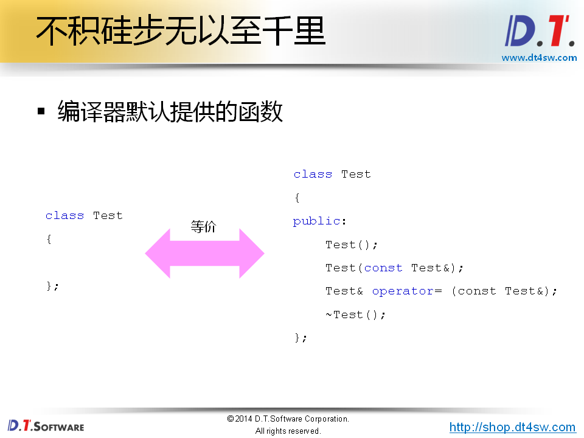

sizeof(Test) = 1

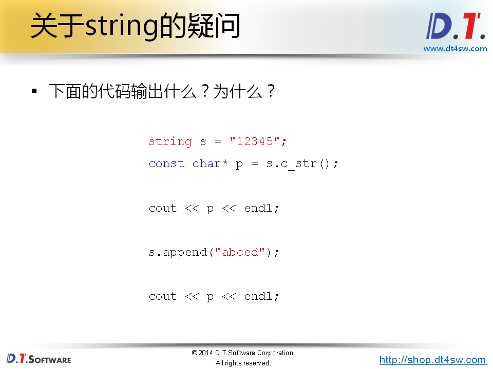


```cpp
#include <iostream>
#include <string>

using namespace std;

int main()
{
    string s = "12345"; // 12345
    const char* p = s.c_str(); // 返回C语言类型得字符串-》这几段代码混合了C/C++得代码形式
        
    cout << p << endl;     
        
    s.append("abced");  // 浅拷贝
        
    cout << p << endl;  // 12345abced->实际上输出12345
                        // 打印s输出是对得
    
    return 0;
}

```

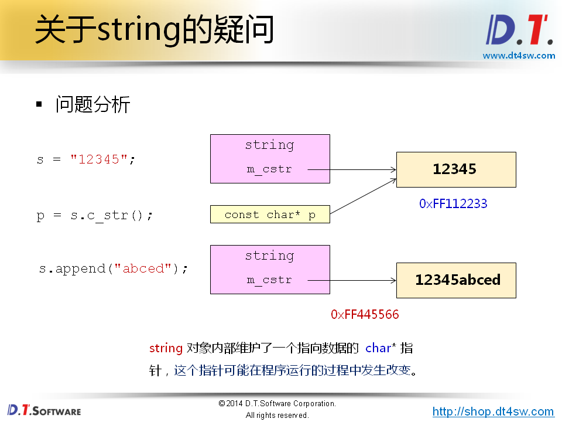

**p指针指向得是是否得结果，p就成了野指针；** **别混合编程！！！！！！**

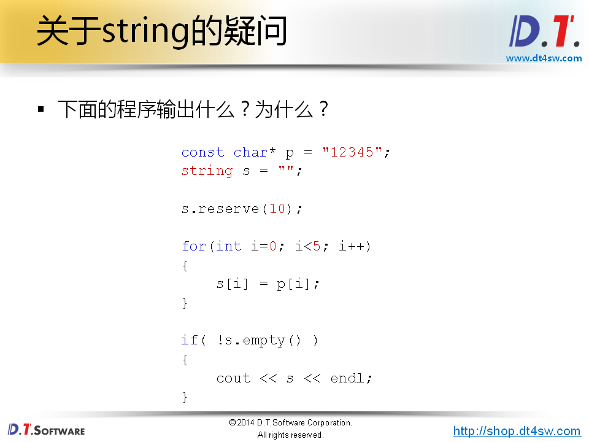


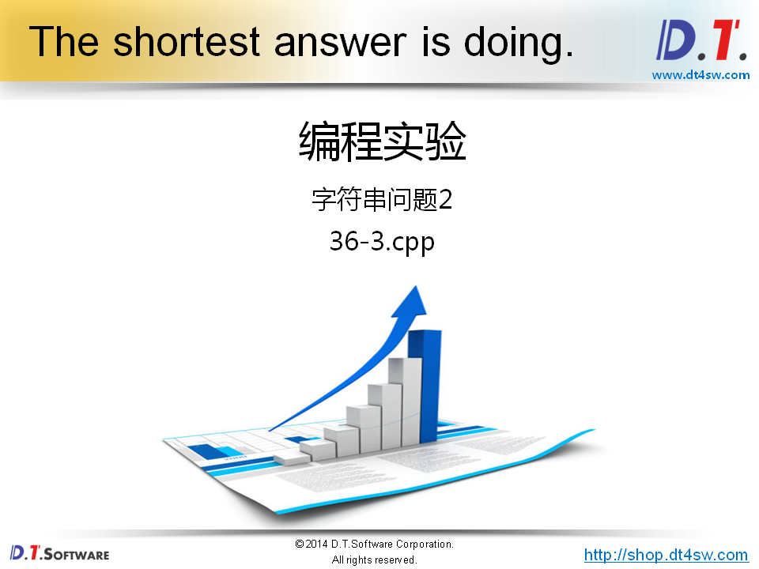

```cpp
#include <iostream>
#include <string>

using namespace std;

int main()
{
    const char* p = "12345"; // C代码
    string s = ""; // C++
        
    s.reserve(10);
    
    
    for(int i=0; i<5; i++)
    {
        s[i] = p[i]; // 赋值操作成功
    }
        
    cout << s << endl; // 空得-》问题在哪里？
    
    return 0;
}

```

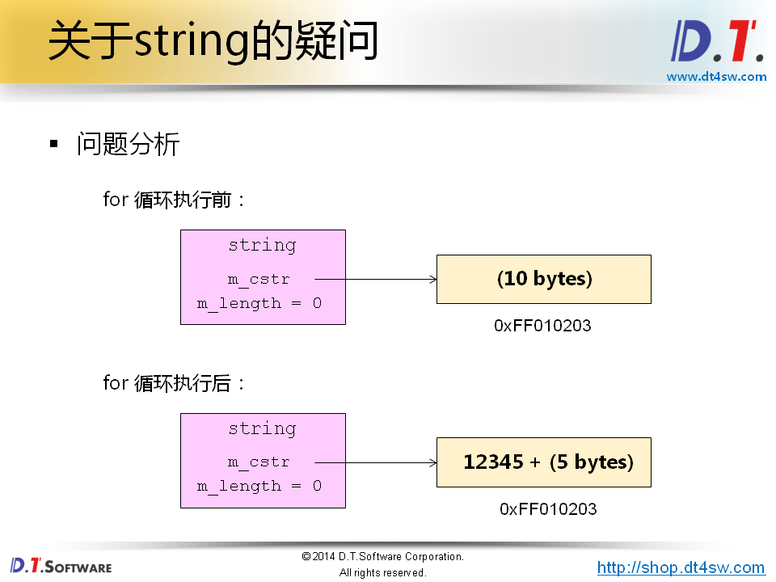

字符串长度得值为0，也就说字符串对象本身不认为自己是一个空串。我们打印是空；

修改为

```cpp
const string p  = "123456";
string s = "";
s = p;
```

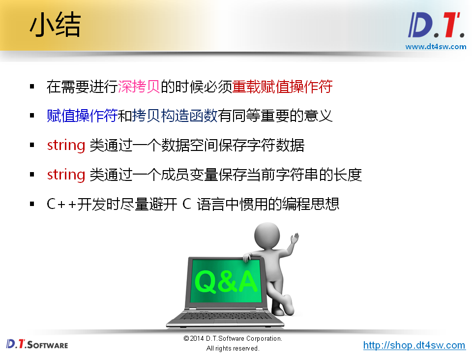