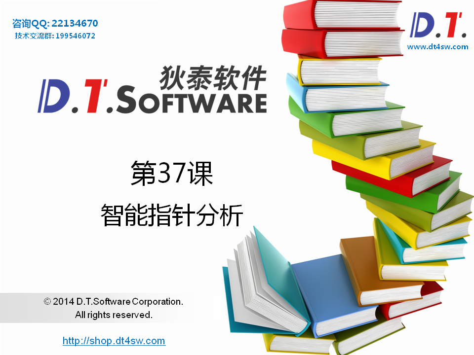
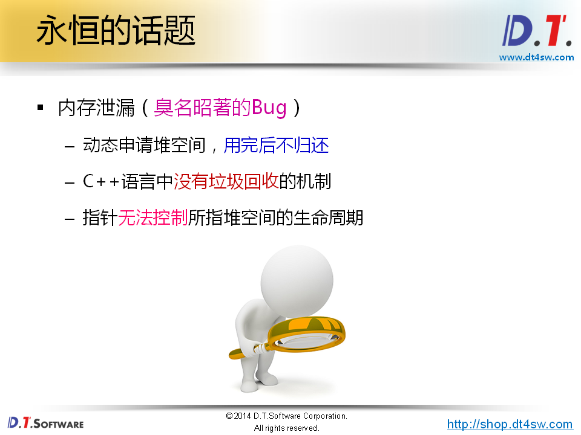
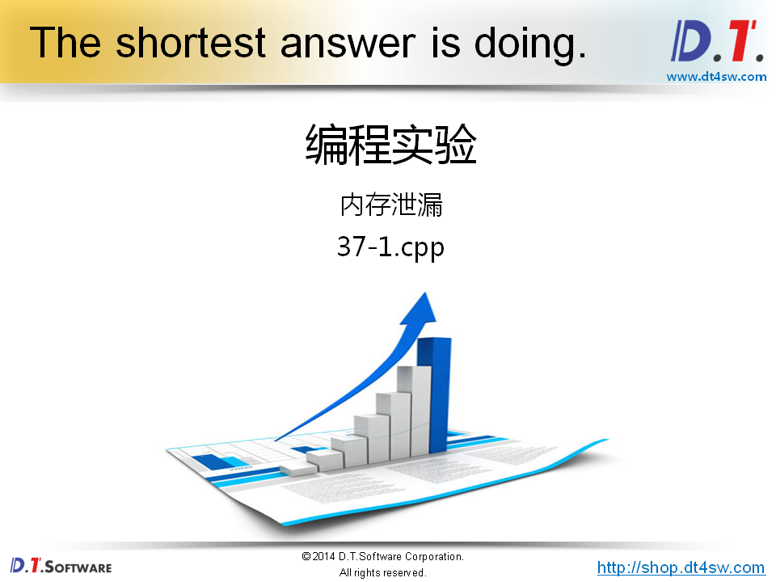
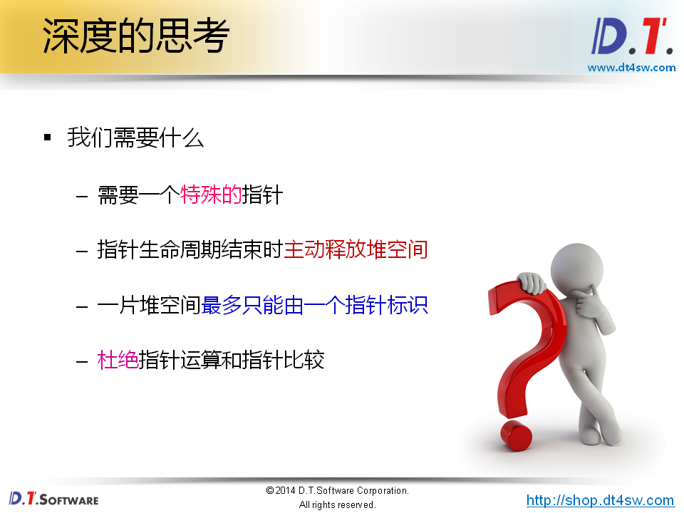
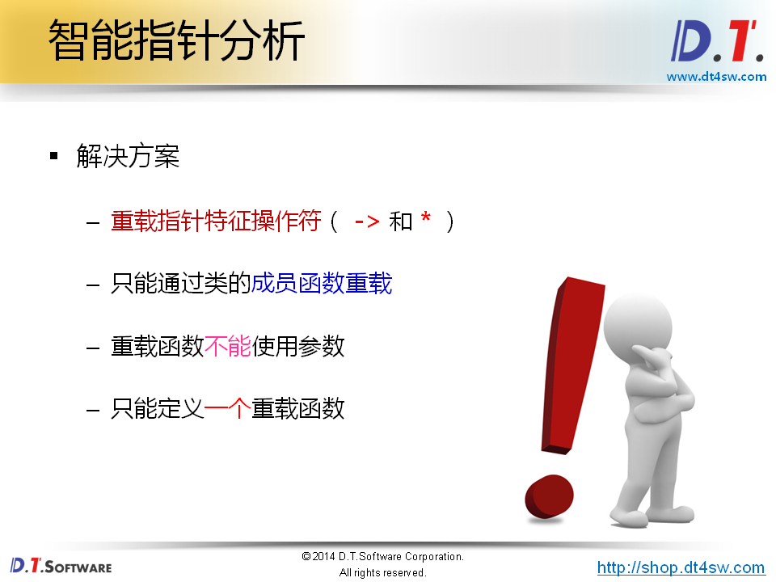
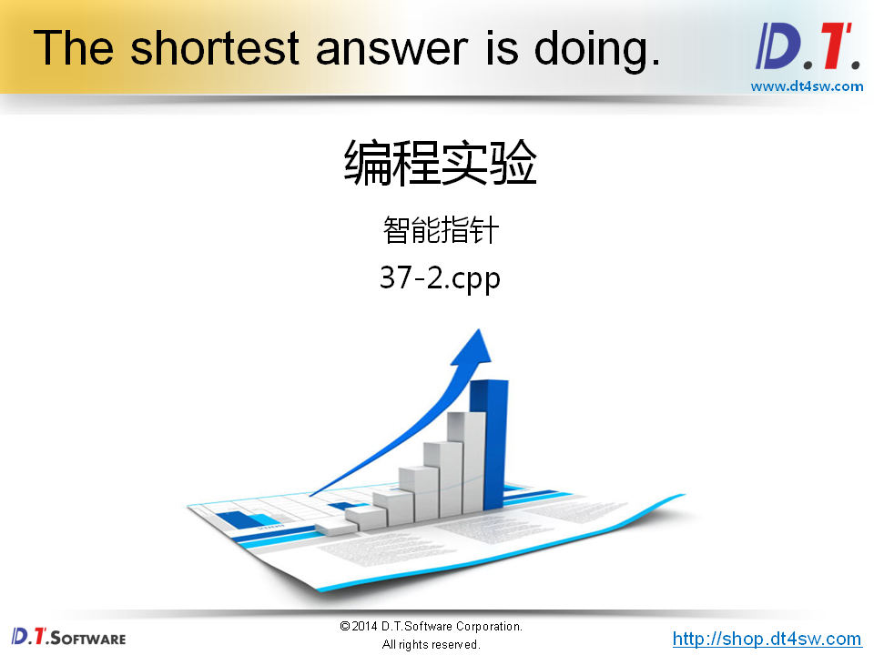
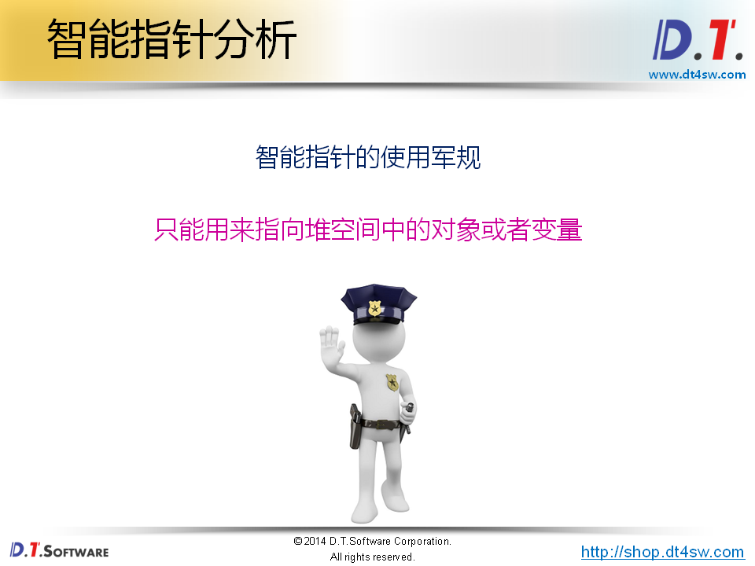
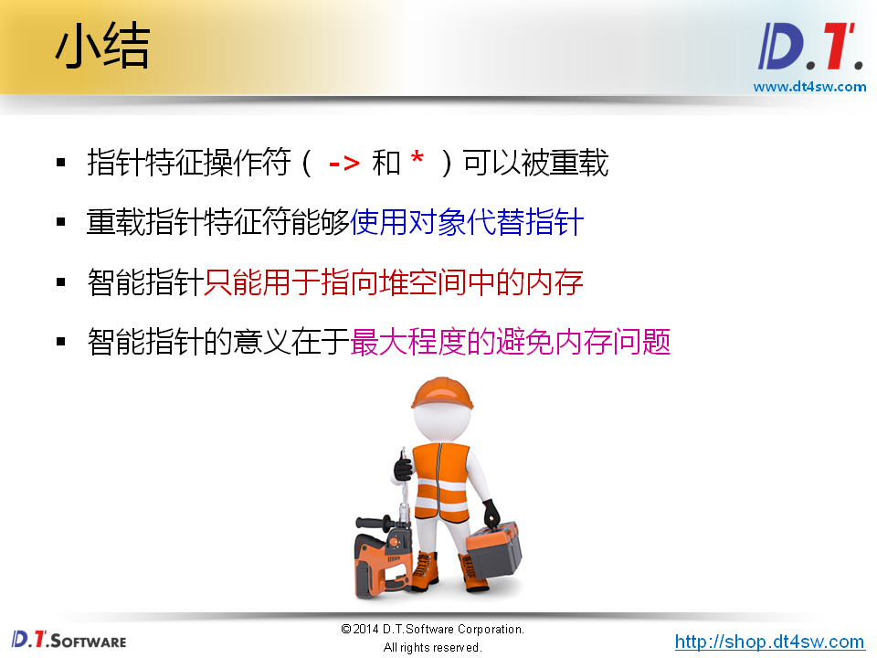

# 37.智能指针










```cpp
#include <iostream>
#include <string>

using namespace std;

class Test
{
    int i;
public:
    Test(int i)
    {
        this->i = i;
    }
    int value()
    {
        return i;
    }
    ~Test()
    {
    }
};

int main()
{
    for(int i=0; i<5; i++)
    {
        Test* p = new Test(i);
        
        cout << p->value() << endl;
        
    
    }
    
    return 0;
}

```






**重载对象模拟指针得行为**



```cpp
#include <iostream>
#include <string>

using namespace std;

class Test
{
    int i;
public:
    Test(int i)
    {
        cout << "Test(int i)" << endl;
        this->i = i;
    }
    int value()
    {
        return i;
    }
    ~Test()
    {
        cout << "~Test()" << endl;
    }
};

class Pointer
{
    Test* mp;
public:
    Pointer(Test* p = NULL)
    {
        mp = p;
    }
    Pointer(const Pointer& obj)
    {
        mp = obj.mp;
        const_cast<Pointer&>(obj).mp = NULL; // 去除只读属性
    }
    Pointer& operator = (const Pointer& obj)
    {
        if( this != &obj )
        {
            delete mp;
            mp = obj.mp;
            const_cast<Pointer&>(obj).mp = NULL; // 去除只读属性
        }
        
        return *this;
    }
    Test* operator -> ()
    {
        return mp;
    }
    Test& operator * ()
    {
        return *mp;
    }
    bool isNull()
    {
        return (mp == NULL);
    }
    ~Pointer()
    {
        delete mp;
    }
};

int main()
{
    Pointer p1 = new Test(0); // 就是Test* p1 = new  Test(0);
    
    cout << p1->value() << endl;
    
    Pointer p2 = p1;
    
    cout << p1.isNull() << endl;
    
    cout << p2->value() << endl;
    
    return 0;
}

```




**不能指向栈空间得地址**

