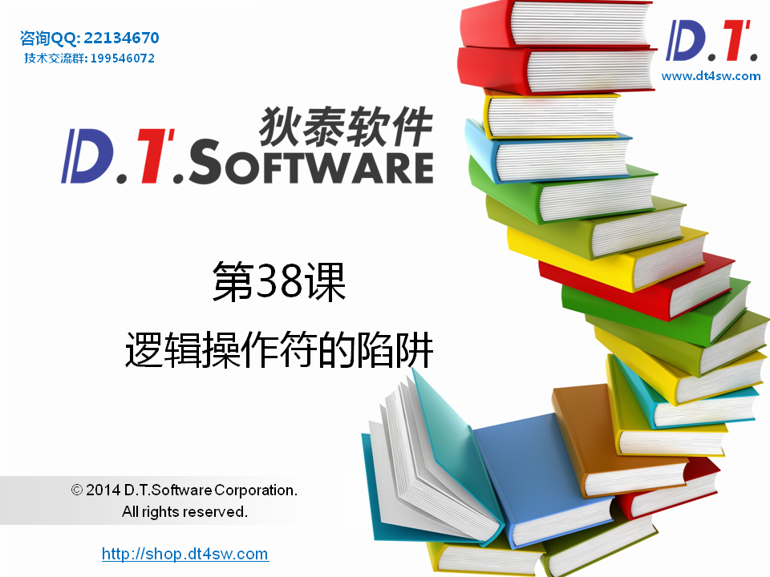
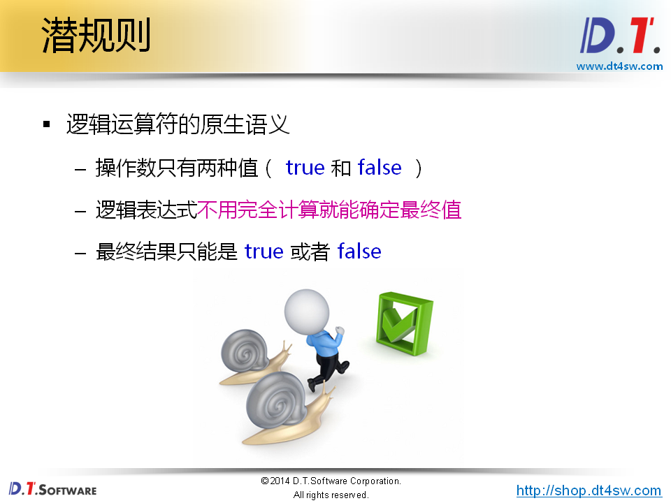
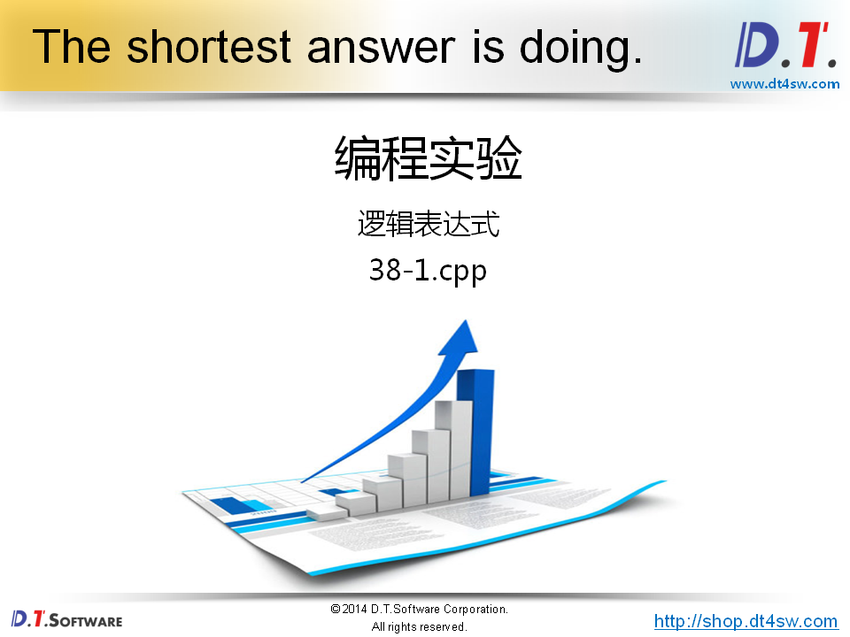
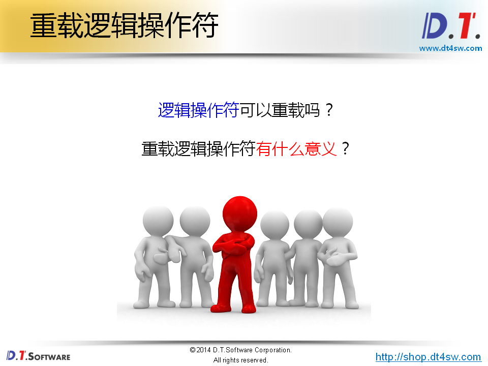
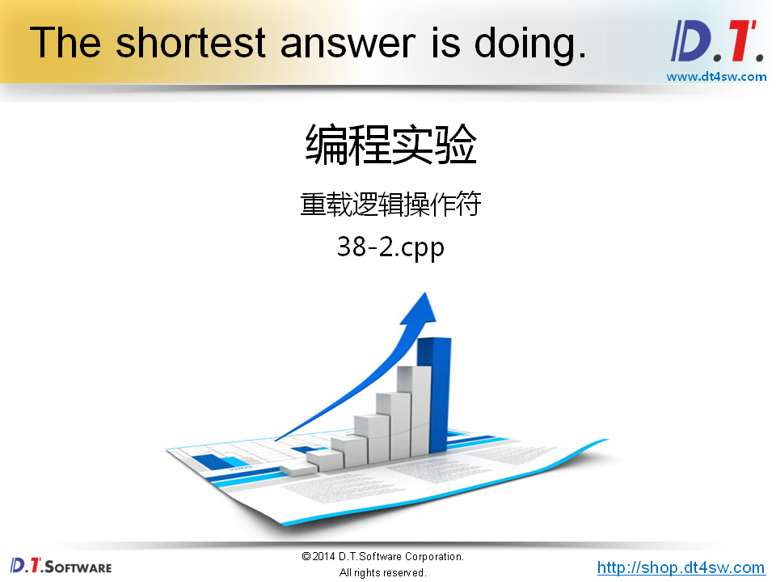
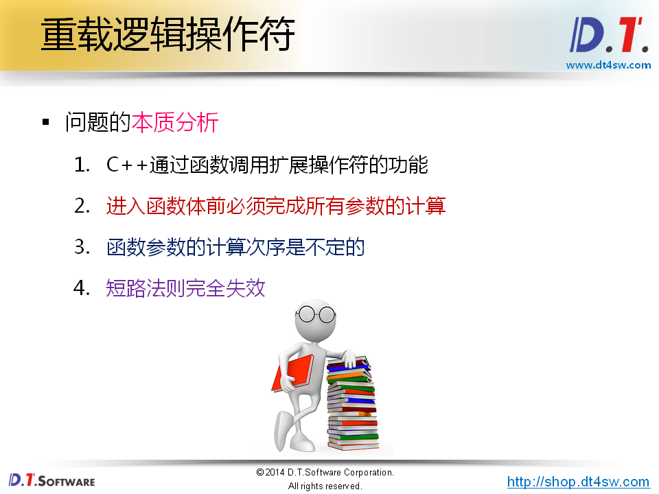
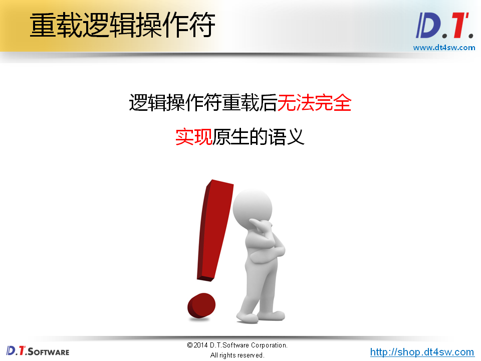
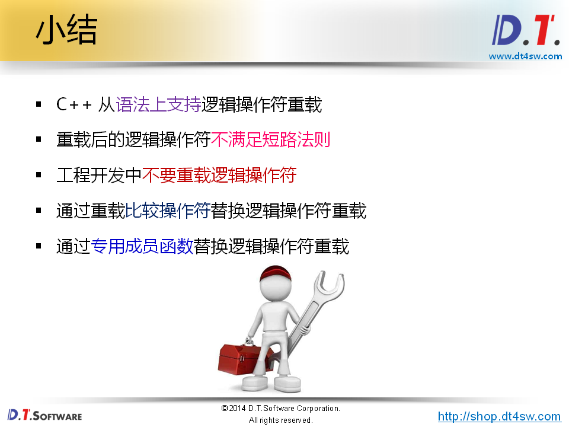
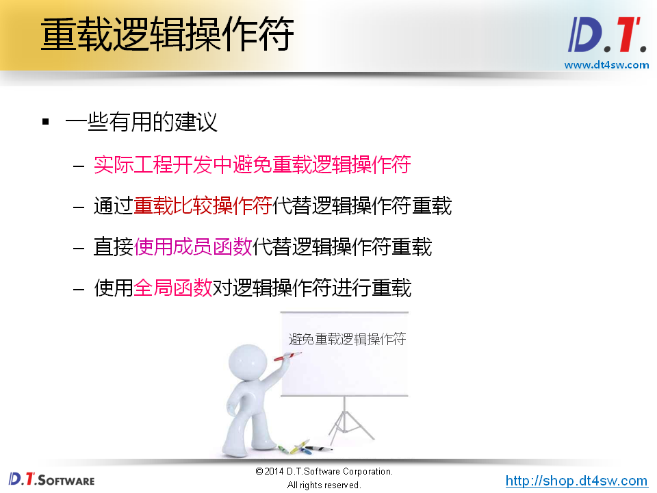

# 38.逻辑操作符的陷阱










```cpp
#include <iostream>
#include <string>

using namespace std;

int func(int i)
{
    cout << "int func(int i) : i = " << i << endl;
    
    return i;
}

int main()
{
    if( func(0) && func(1) ) //0->false 非0->true->false
    {
        cout << "Result is true!" << endl;
    }
    else
    {
        cout << "Result is false!" << endl;
    }
    
    cout << endl;
    
    if( func(0) || func(1) ) //true
    {
        cout << "Result is true!" << endl;
    }
    else
    {
        cout << "Result is false!" << endl;
    }
    
    return 0;
}

```






```cpp
#include <iostream>
#include <string>

using namespace std;

class Test
{
    int mValue;
public:
    Test(int v)
    {
        mValue = v;
    }
    int value() const
    {
        return mValue;
    }
};

bool operator && (const Test& l, const Test& r)
{
    return l.value() && r.value();
}

bool operator || (const Test& l, const Test& r)
{
    return l.value() || r.value();
}

Test func(Test i)
{
    cout << "Test func(Test i) : i.value() = " << i.value() << endl;
    
    return i;
}

int main()
{
    Test t0(0);
    Test t1(1);
    
    if( func(t0) && func(t1) )// 调用2次func--》= (operator && (func(t0), func(t1)))
    {
        cout << "Result is true!" << endl;
    }
    else
    {
        cout << "Result is false!" << endl;
    }
    
    cout << endl;
    
    if( func(1) || func(0) ) // 调用2次func func(1)->true， func(0)->false变得从右往左运算
    {                        // (operator || (func(t0), func(t1)))
        cout << "Result is true!" << endl;
    }
    else
    {
        cout << "Result is false!" << endl;
    }
    
    return 0;
}

```






**违背了原生的语义-》不推荐重载**




