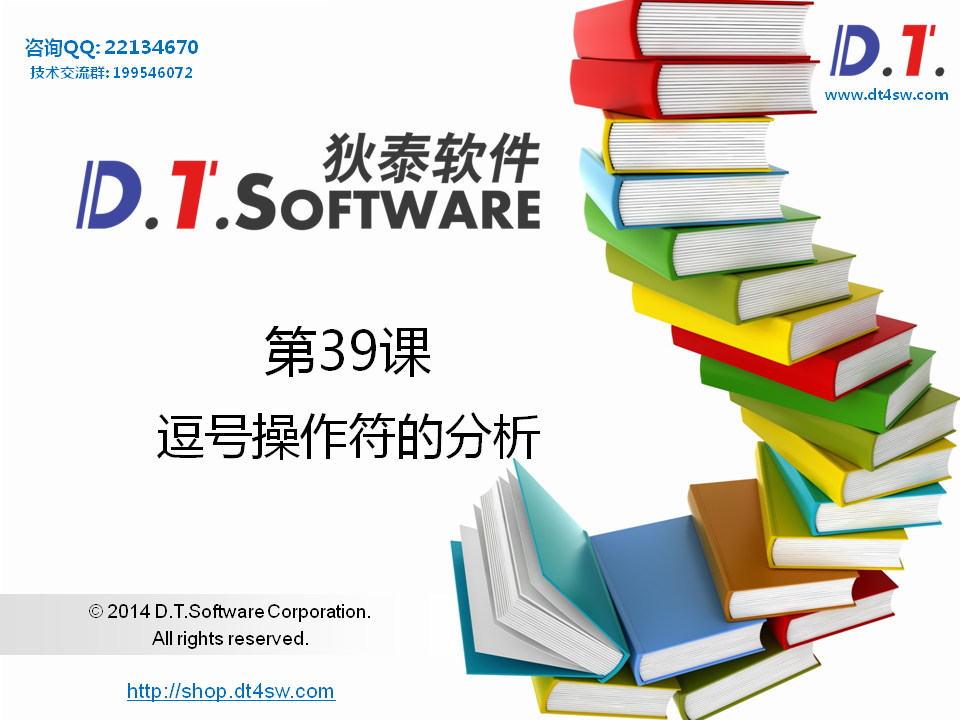
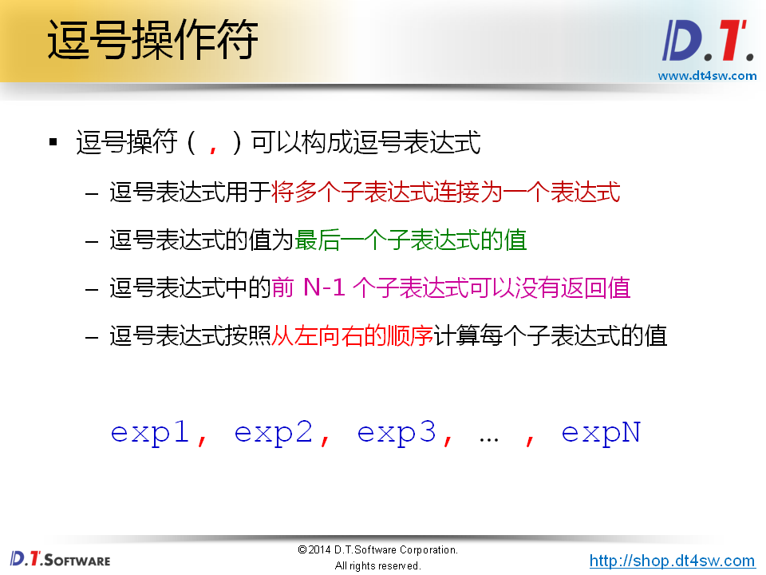
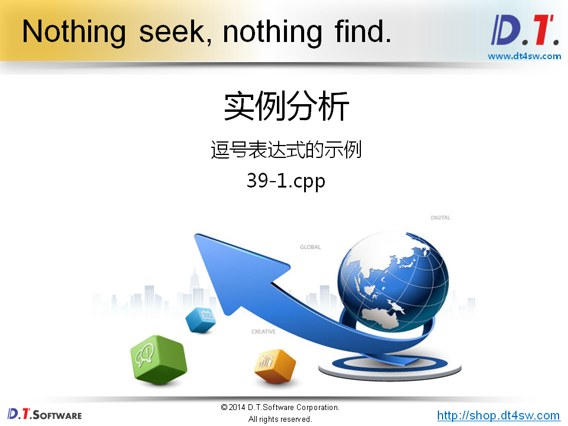
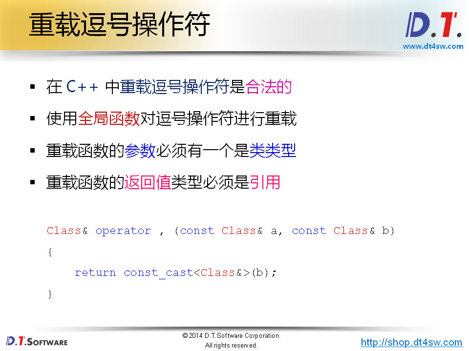
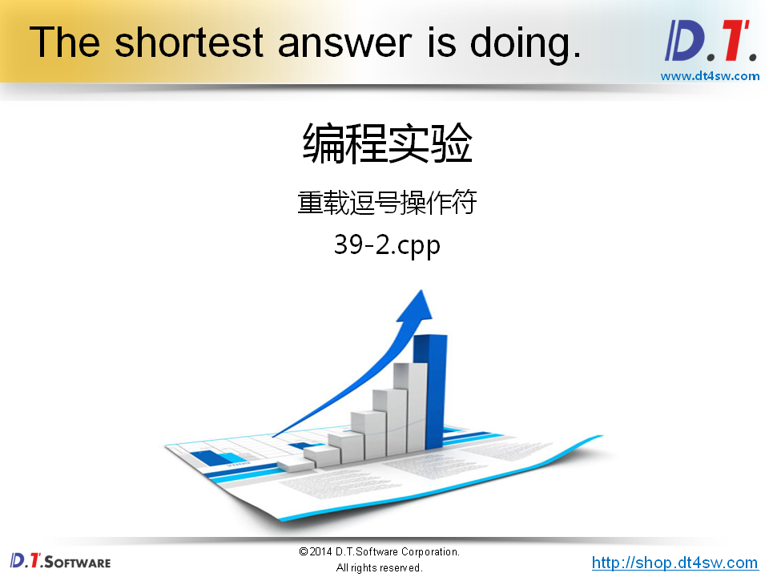
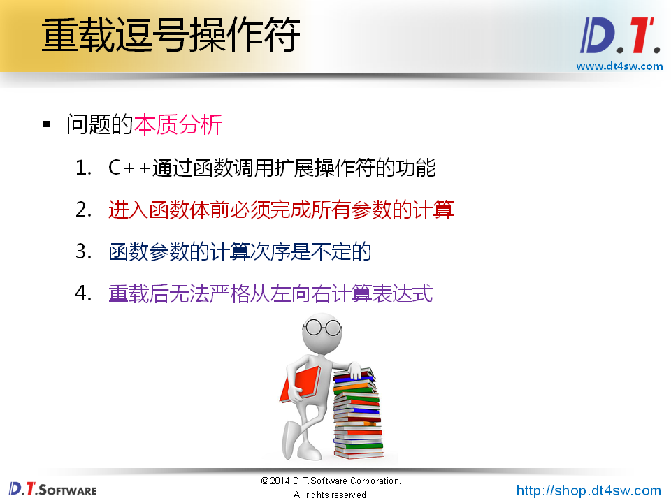
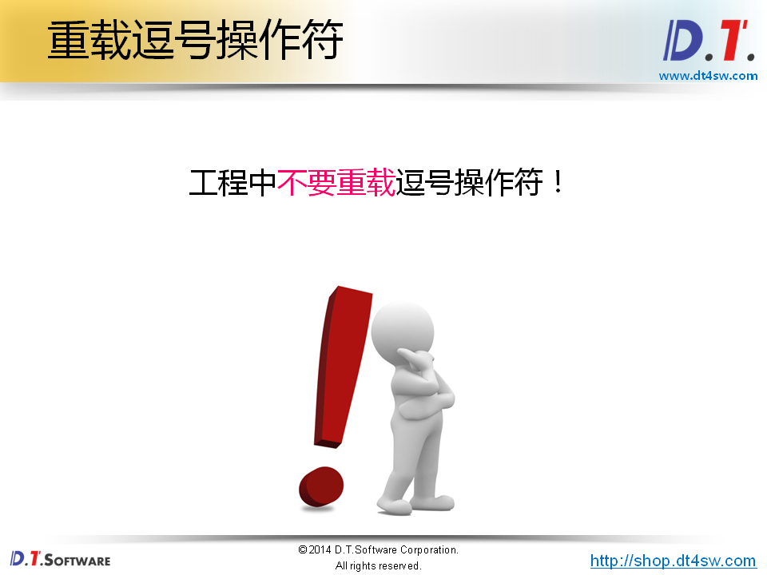
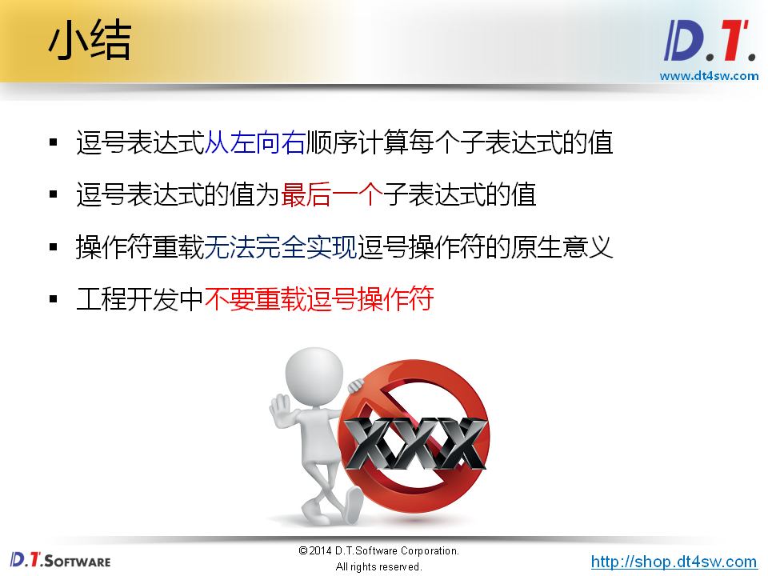

# 39.逗号操作符的分析










```cpp
#include <iostream>
#include <string>

using namespace std;

void func(int i)
{
    cout << "func() : i = " << i << endl;
}

int main()
{   
    int a[3][3] = {
        (0, 1, 2), // 使用括号，就是逗号表达式，2，5，8初始化3 * 3的矩阵，只能初始化前3个，其他是0
        (3, 4, 5), // 修改成{3， 4， 5}就可以了
        (6, 7, 8)
    };
    
    int i = 0;
    int j = 0;
    
    while( i < 5 )    
        func(i),
    
    i++;
        
    for(i=0; i<3; i++)
    {
        for(j=0; j<3; j++)
        {
            cout << a[i][j] << endl;
        }
    }
    
    (i, j) = 6;
    
    cout << "i = " << i << endl; // 3
    cout << "j = " << j << endl; // 6

    return 0;
}
```






```cpp
#include <iostream>
#include <string>

using namespace std;

class Test
{
    int mValue;
public:
    Test(int i)
    {
        mValue = i;
    }
    int value()
    {
        return mValue;
    }
};
/*
Test& operator , (const Test& a, const Test& b)
{
    return const_cast<Test&>(b);
}
*/
Test func(Test& i)
{
    cout << "func() : i = " << i.value() << endl;
    
    return i;
}

int main()
{   
    Test t0(0);
    Test t1(1);
    Test tt = (func(t0), func(t1));  // 并没有从右往左调用-》有问题(中间过程)
                                     // Test tt = func(t1);
    
    cout << tt.value() << endl; // 1
    
    return 0;
}

```







