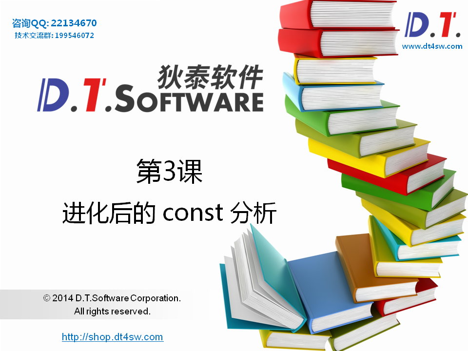
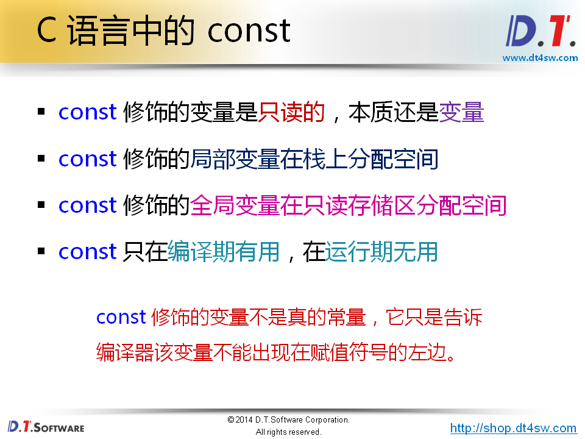
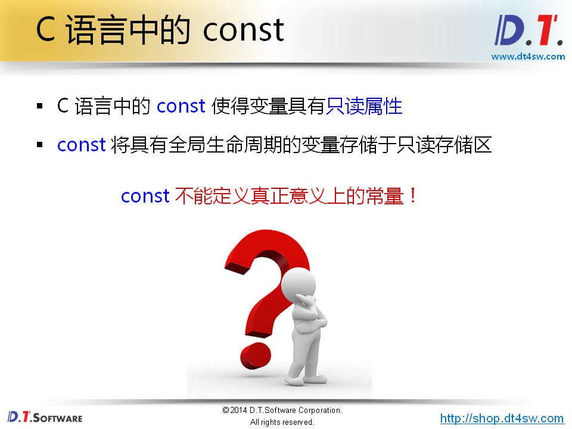
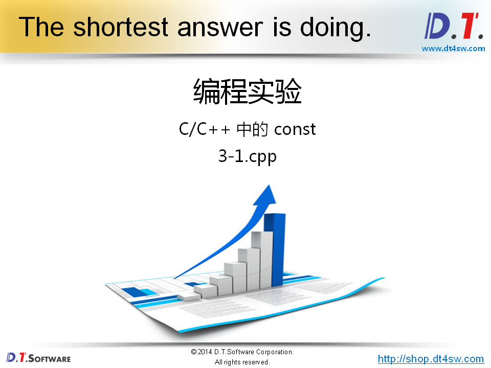
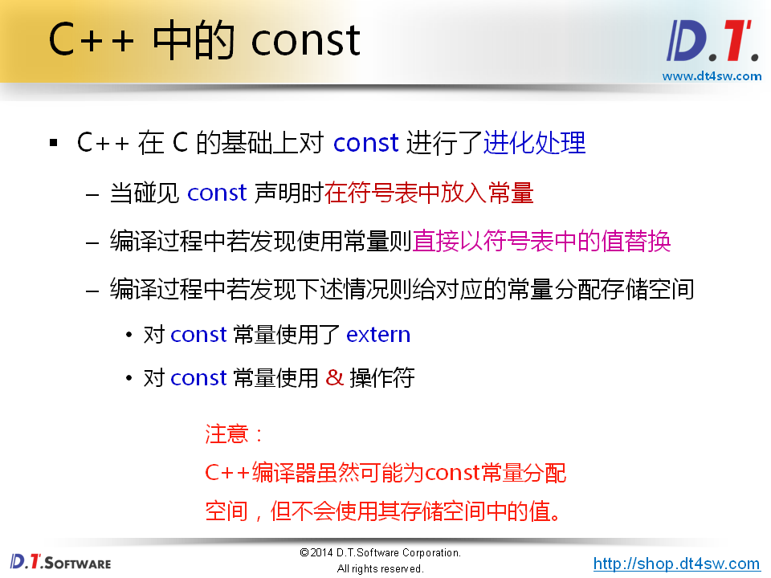
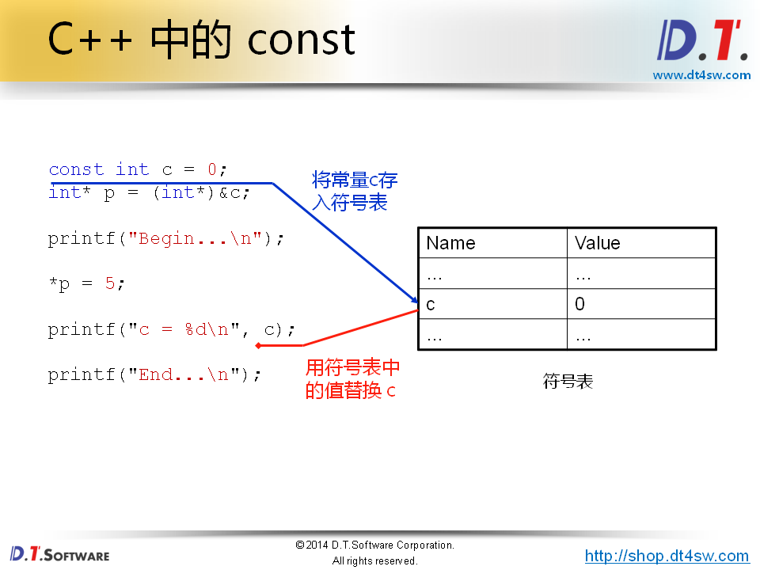
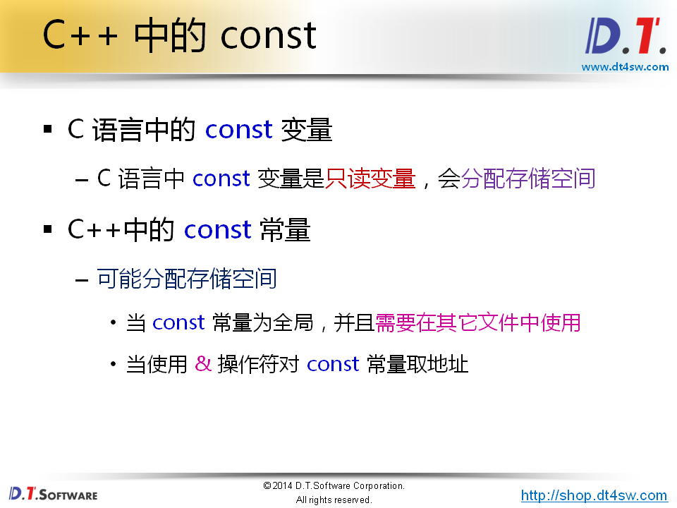
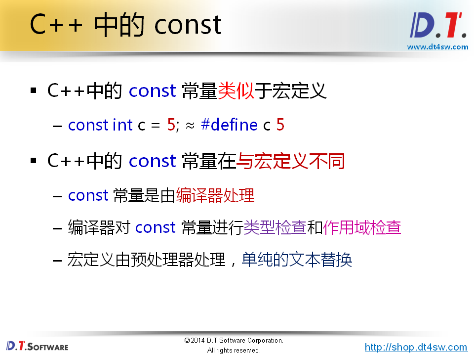
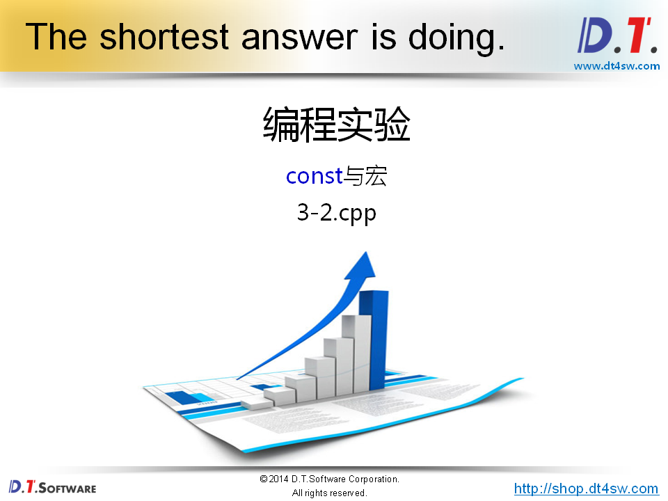
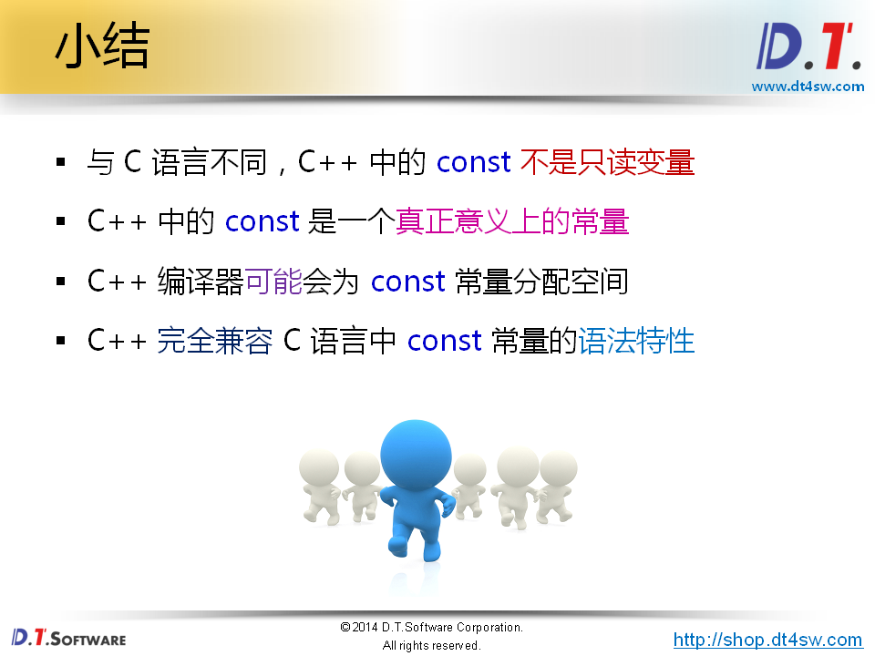

 

 

```cpp
#include <stdio.h>

int main()
{
    const int c = 0;
    int* p = (int*)&c;
    
    printf("Begin...\n");
    
    *p = 5;
    
    printf("c = %d\n", c);
    printf("*p = %d\n", *p);
    
    printf("End...\n");
    
    return 0;
}
// gcc 
// C = 5,
// 打印*p = 5
// C语言唯一的常量是enum 枚举
// g++
// C = 0;
// 打印*p = 5

// 为社么会这样？
```



 **为社么有注意的行为：为了兼容C语言；**

```
编译到(int*)&c里面的时候，遇到(int*)&作用于c,所以编译器会给他分配一个4个字节的空间，但是并使用这个空间；空C里面的值变成5;在打印C的值的时候先去查符号表，找到C的值，打印；
```



```cpp
C语言中，const依然是变量，只是编译器不允许它出现在赋值符号的左边
C++中是const是真正意义上的常量
extern
&地址
都会分配空间
```



 

 

```cpp
#include <stdio.h>

void f()
{
    #define a 3
    const int b = 4;
}

void g()
{
    printf("a = %d\n", a);
    //printf("b = %d\n", b);
}

int main()
{
    const int A = 1;
    const int B = 2;
    int array[A + B] = {0};
    int i = 0;
    
    for(i=0; i<(A + B); i++)
    {
        printf("array[%d] = %d\n", i, array[i]);
    }
    
    f();
    g();
    
    return 0;
}

// gcc 19行有问题 A+B是只读变量，变量相加需要运行的时候才能看到;
// g++ 19行没有问题 A + B是真正的常量 
// gcc/g++中g函数访问f函数里面的宏居然没有问题，因为是直接的文本替换编译器压根不知道a的存在，没有作用域的概念；const int b b作用域在f中
```



 

```cpp

```

