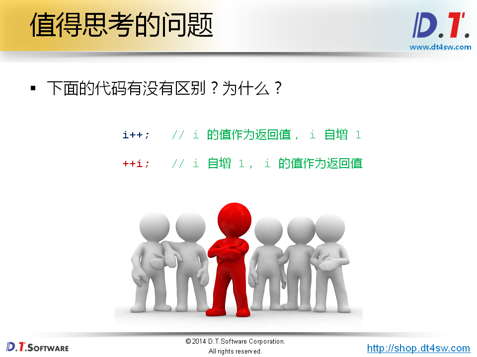
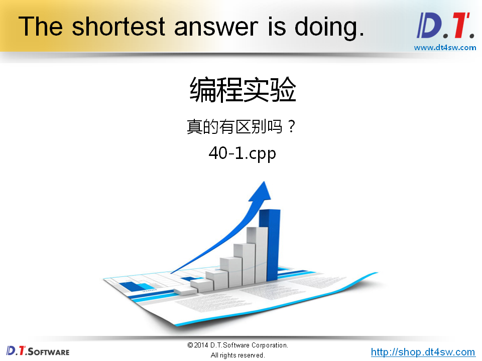
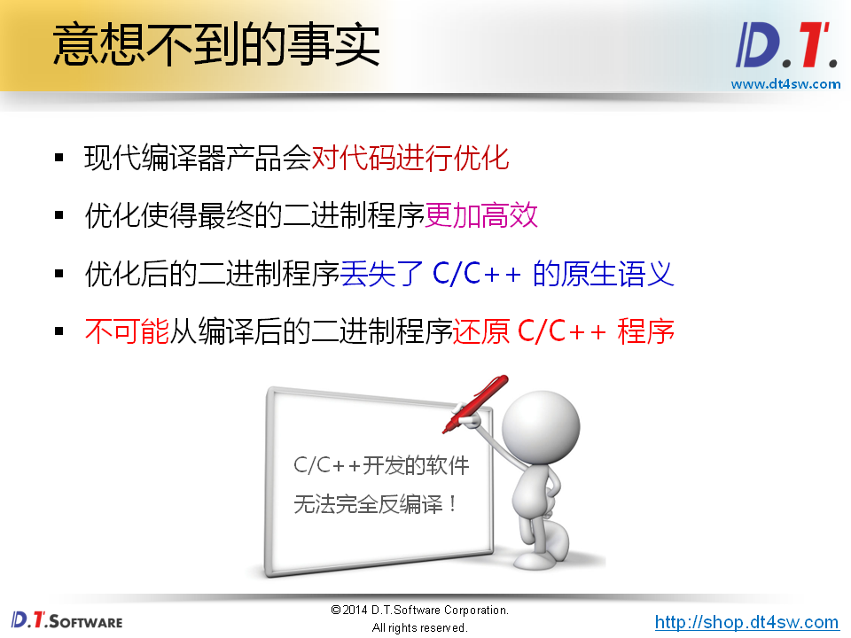
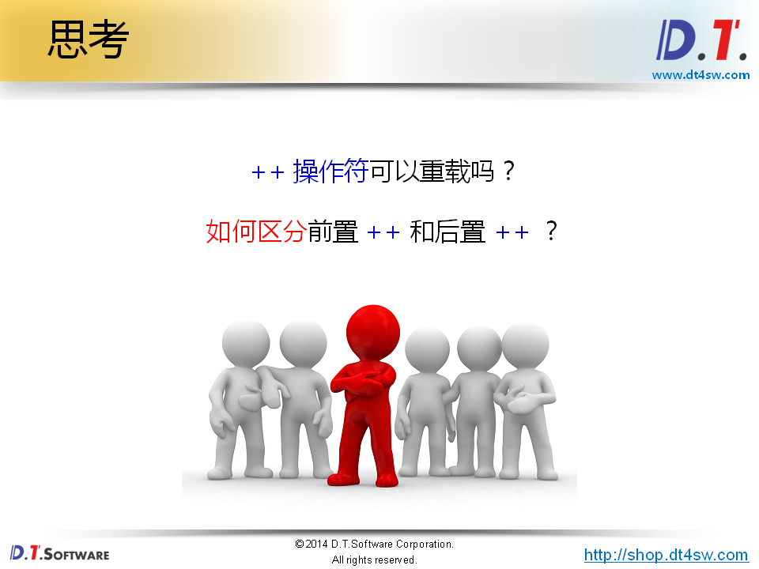
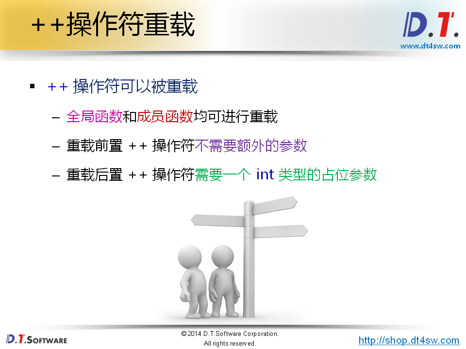
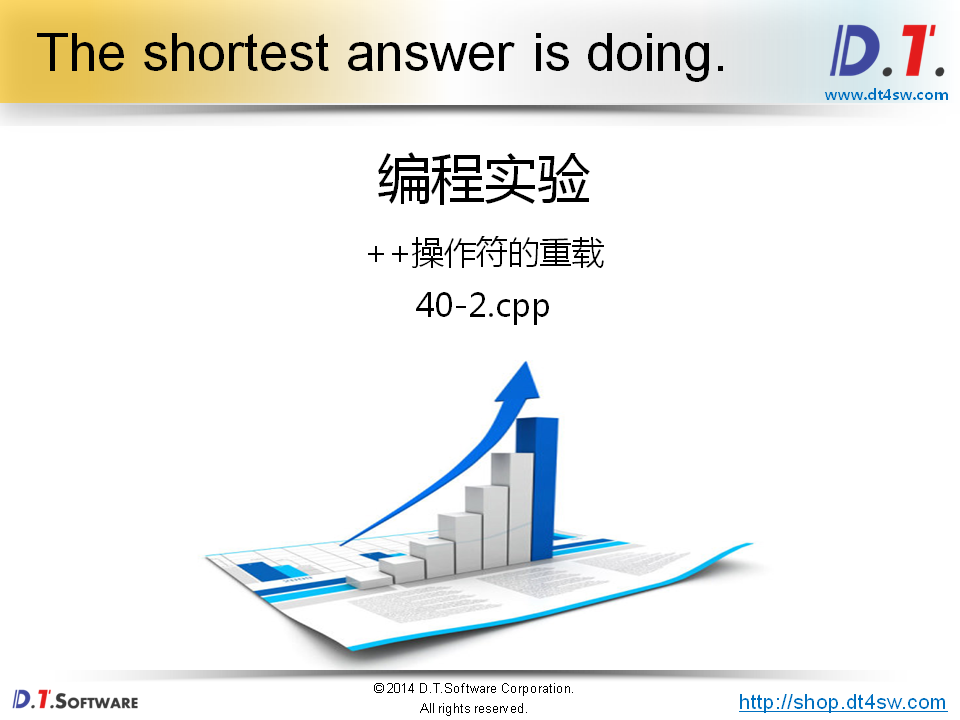
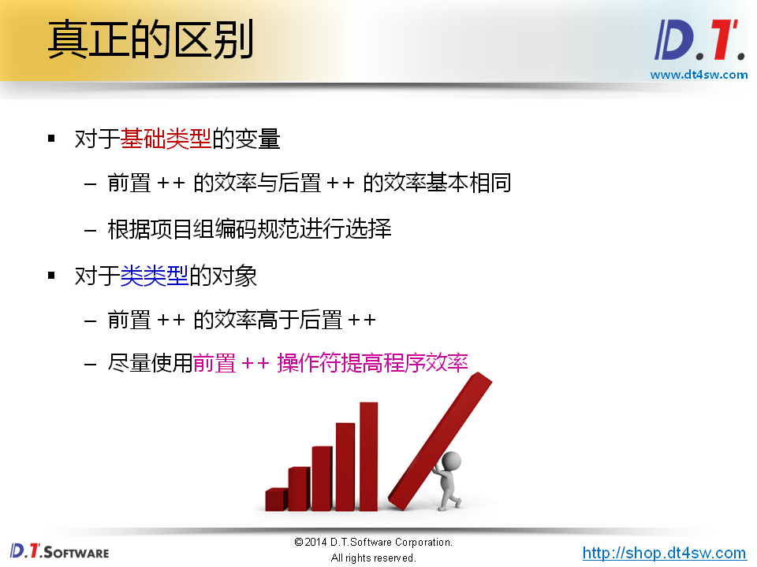
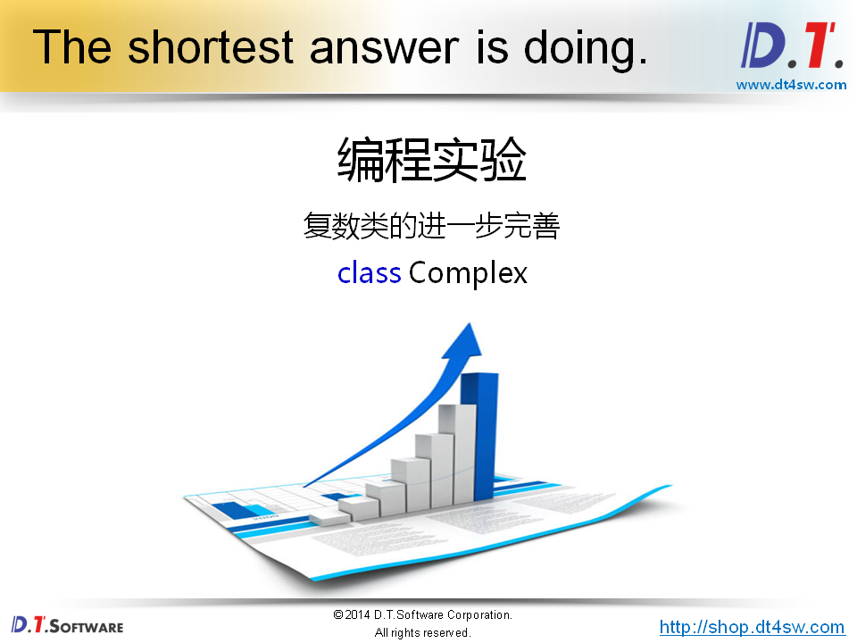
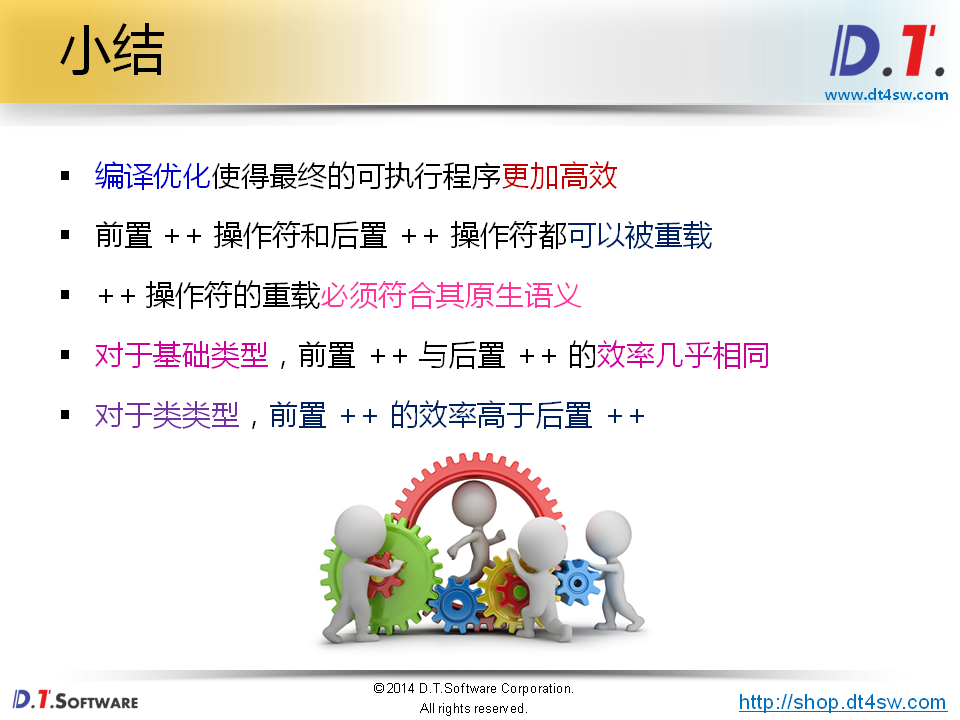

# 40.前置操作符和后置操作符







```cpp
#include <iostream>
#include <string>

using namespace std;

int main()
{
    int i = 0;

    i++;

    ++i;

    return 0;
}

```












```cpp
#include <iostream>
#include <string>

using namespace std;

class Test
{
    int mValue;
public:
    Test(int i)
    {
        mValue = i;
    }
    
    int value()
    {
        return mValue;
    }
    
    Test& operator ++ ()
    {
        ++mValue;
        
        return *this;
    }
    
    Test operator ++ (int) // 为什么返回不是一个引用，因为后置的++需要返回一个局部对象
    {
        Test ret(mValue);
        
        mValue++;
        
        return ret; 
    }
};

int main()
{
    Test t(0);
    
    t++;
    
    ++t;
    
    return 0;
}

```






```cpp

#ifndef _COMPLEX_H_
#define _COMPLEX_H_

class Complex
{
    double a;
    double b;
public:
    Complex(double a = 0, double b = 0);
    double getA();
    double getB();
    double getModulus();
    
    Complex operator + (const Complex& c);
    Complex operator - (const Complex& c);
    Complex operator * (const Complex& c);
    Complex operator / (const Complex& c);
    
    bool operator == (const Complex& c);
    bool operator != (const Complex& c);
    
    Complex& operator = (const Complex& c);
    
    Complex& operator ++ ();
    Complex operator ++ (int);
};

#endif
```

```cpp
#include "Complex.h"
#include "math.h"

Complex::Complex(double a, double b)
{
    this->a = a;
    this->b = b;
}

double Complex::getA()
{
    return a;
}

double Complex::getB()
{
    return b;
}

double Complex::getModulus()
{
    return sqrt(a * a + b * b);
}

Complex Complex::operator + (const Complex& c)
{
    double na = a + c.a;
    double nb = b + c.b;
    Complex ret(na, nb);
    
    return ret;
}

Complex Complex::operator - (const Complex& c)
{
    double na = a - c.a;
    double nb = b - c.b;
    Complex ret(na, nb);
    
    return ret;
}

Complex Complex::operator * (const Complex& c)
{
    double na = a * c.a - b * c.b;
    double nb = a * c.b + b * c.a;
    Complex ret(na, nb);
    
    return ret;
}

Complex Complex::operator / (const Complex& c)
{
    double cm = c.a * c.a + c.b * c.b;
    double na = (a * c.a + b * c.b) / cm;
    double nb = (b * c.a - a * c.b) / cm;
    Complex ret(na, nb);
    
    return ret;
}
    
bool Complex::operator == (const Complex& c)
{
    return (a == c.a) && (b == c.b);
}

bool Complex::operator != (const Complex& c)
{
    return !(*this == c);
}
    
Complex& Complex::operator = (const Complex& c)
{
    if( this != &c )
    {
        a = c.a;
        b = c.b;
    }
    
    return *this;
}

Complex& Complex::operator ++ ()
{
    a = a + 1;
    b = b + 1;
    
    return *this;
}
    
Complex Complex::operator ++ (int)
{
    Complex ret(a, b);
    
    a = a + 1;
    b = b + 1;
    
    return ret;
}
```

