# 43.继承的概念和意义


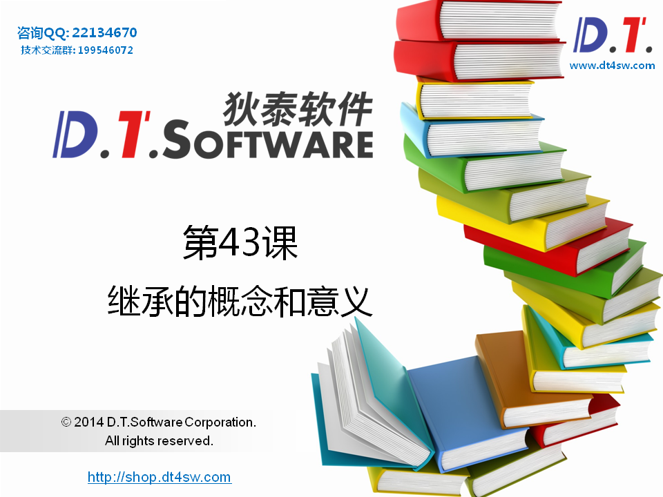


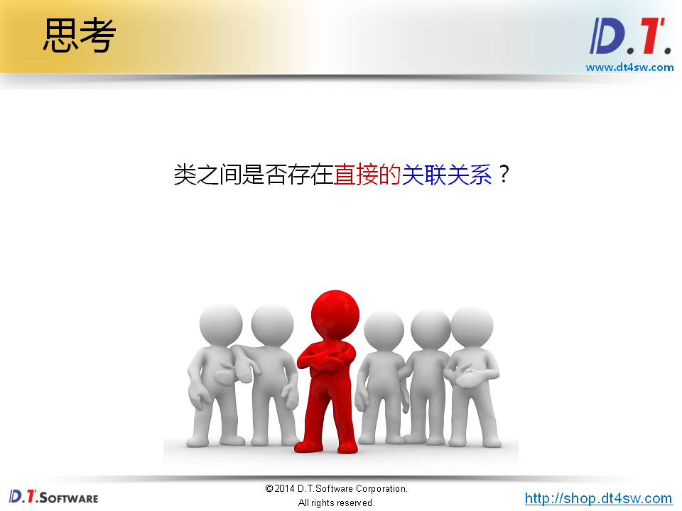


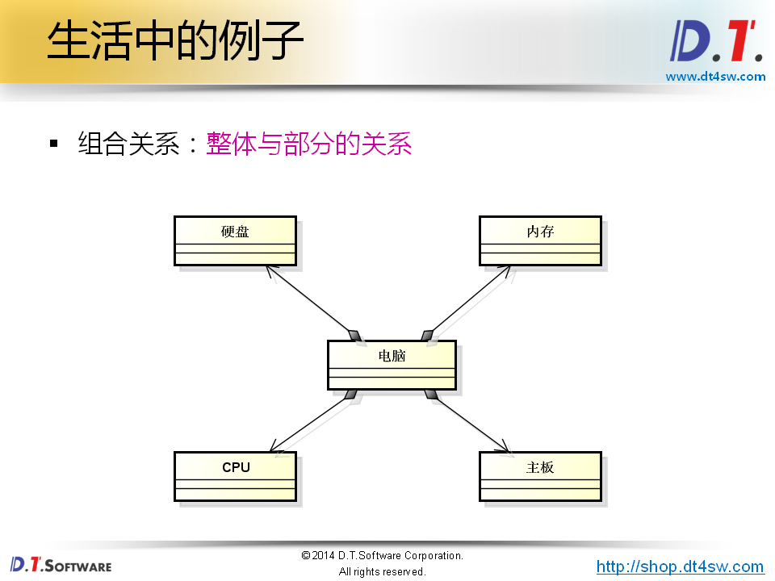


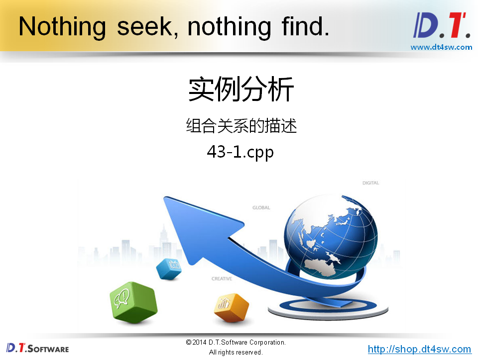

```cpp
#include <iostream>
#include <string>

using namespace std;

class Memory
{
public:
    Memory()
    {
        cout << "Memory()" << endl;
    }
    ~Memory()
    {
        cout << "~Memory()" << endl;
    }
};

class Disk
{
public:
    Disk()
    {
        cout << "Disk()" << endl;
    }
    ~Disk()
    {
        cout << "~Disk()" << endl;
    }   
};

class CPU
{
public:
    CPU()
    {
        cout << "CPU()" << endl;
    }
    ~CPU()
    {
        cout << "~CPU()" << endl;
    }    
};

class MainBoard
{
public:
    MainBoard()
    {
        cout << "MainBoard()" << endl;
    }
    ~MainBoard()
    {
        cout << "~MainBoard()" << endl;
    }    
};

class Computer
{
    Memory mMem; // 私有
    Disk mDisk;
    CPU mCPU;
    MainBoard mMainBoard;
public:
    Computer()
    {
        cout << "Computer()" << endl;
    }
    void power()
    {
        cout << "power()" << endl;
    }
    void reset()
    {
        cout << "reset()" << endl;
    }
    ~Computer()
    {
        cout << "~Computer()" << endl;
    }
};

int main()
{   
    Computer c;
    
    return 0;
}

```

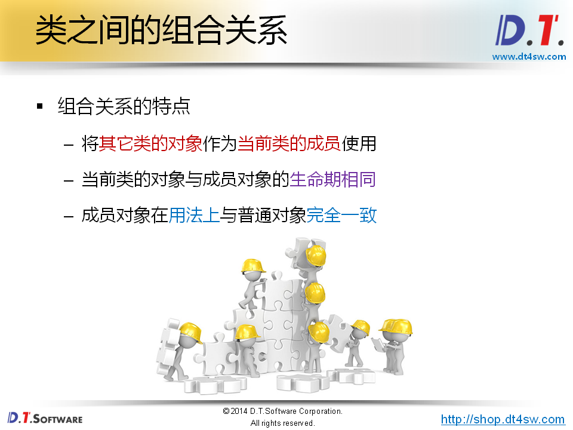

**生命周期相同**

**优先考虑组合而不是继承**

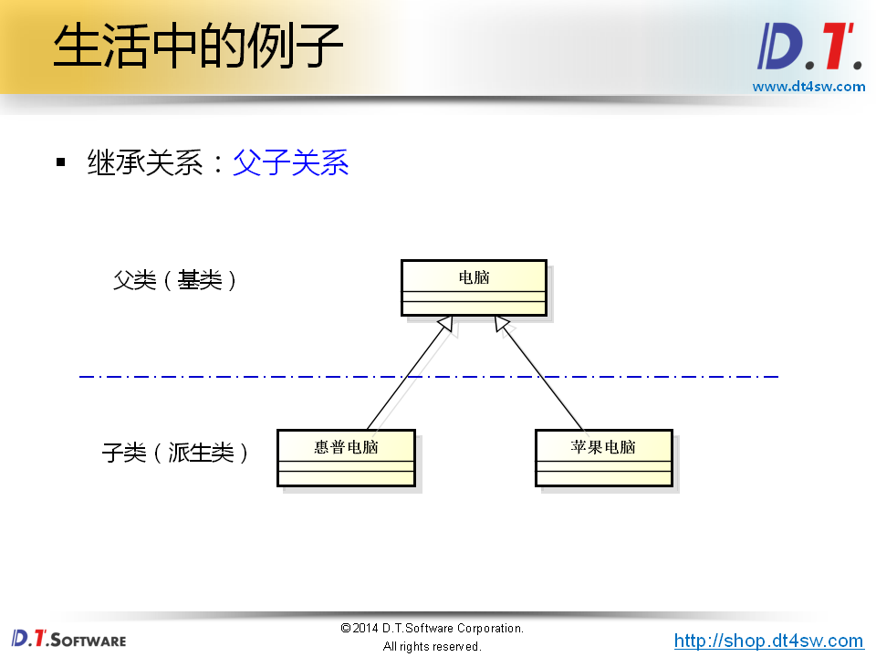


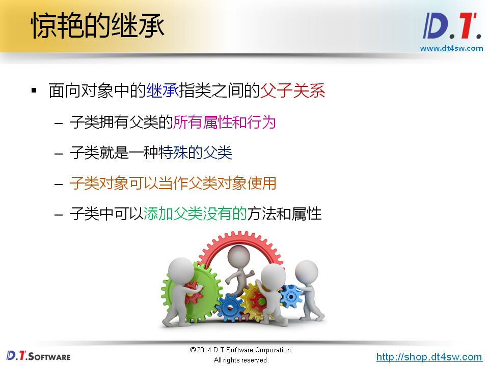


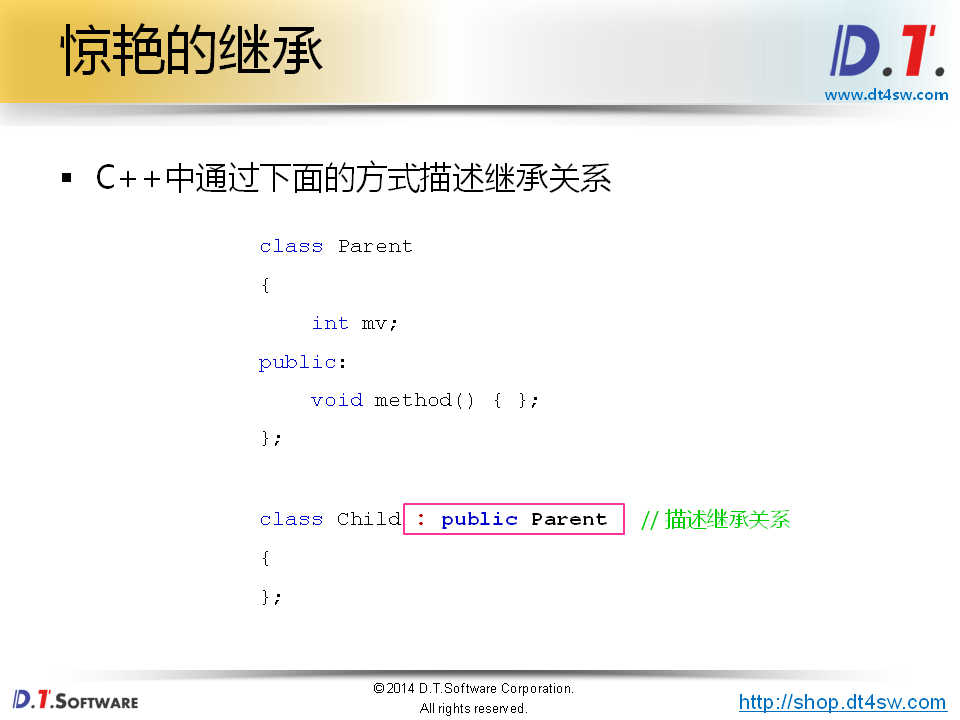


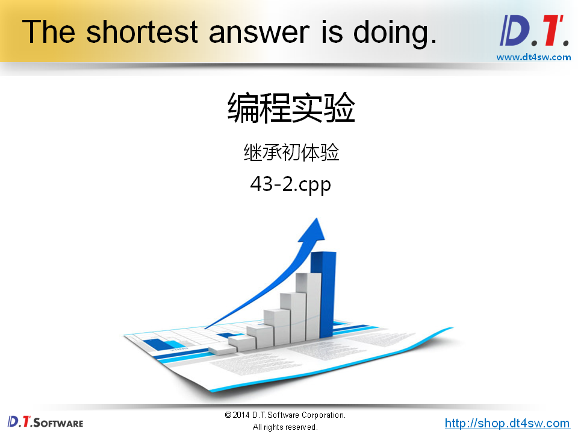

```cpp
#include <iostream>
#include <string>

using namespace std;

class Parent
{
    int mv;
public:
    Parent()
    {
        cout << "Parent()" << endl;
        mv = 100;
    }
    void method()
    {
        cout << "mv = " << mv << endl;
    }
};

class Child : public Parent
{
public:
    void hello()
    {
        cout << "I'm Child calss!" << endl;
    }
};

int main()
{   
    Child c;
    
    c.hello();
    c.method();
    
    return 0;
}

```

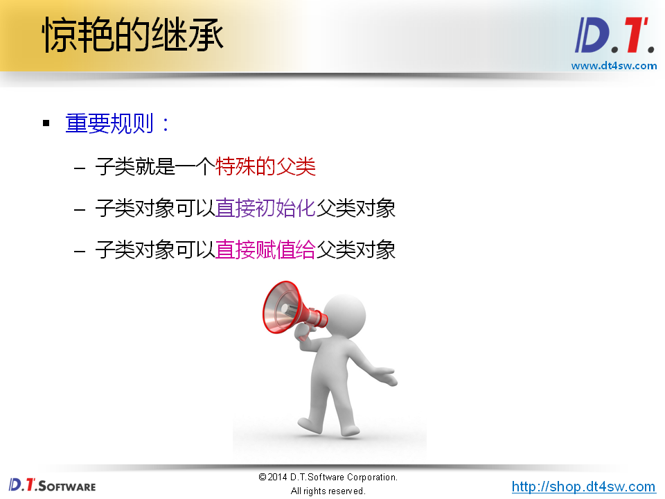


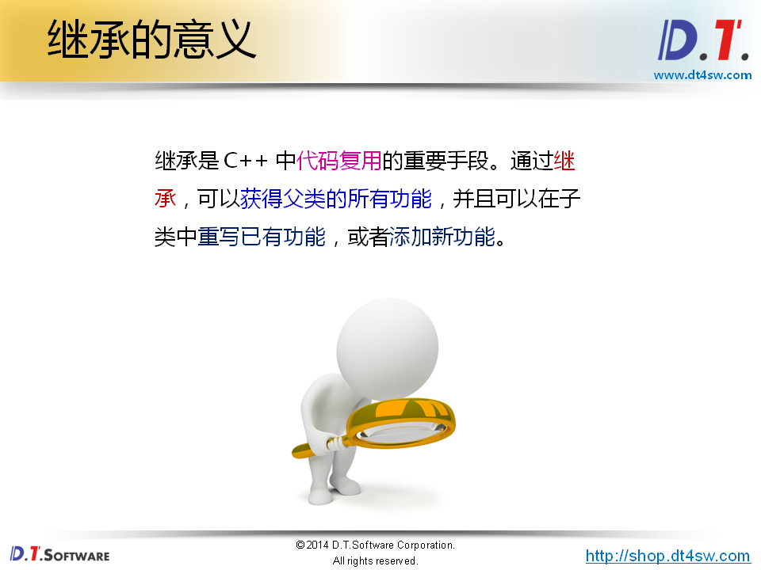


```cpp
#include <iostream>
#include <string>

using namespace std;

class Memory
{
public:
    Memory()
    {
        cout << "Memory()" << endl;
    }
    ~Memory()
    {
        cout << "~Memory()" << endl;
    }
};

class Disk
{
public:
    Disk()
    {
        cout << "Disk()" << endl;
    }
    ~Disk()
    {
        cout << "~Disk()" << endl;
    }   
};

class CPU
{
public:
    CPU()
    {
        cout << "CPU()" << endl;
    }
    ~CPU()
    {
        cout << "~CPU()" << endl;
    }    
};

class MainBoard
{
public:
    MainBoard()
    {
        cout << "MainBoard()" << endl;
    }
    ~MainBoard()
    {
        cout << "~MainBoard()" << endl;
    }    
};

class Computer
{
    Memory mMem;
    Disk mDisk;
    CPU mCPU;
    MainBoard mMainBoard;
public:
    Computer()
    {
        cout << "Computer()" << endl;
    }
    void power()
    {
        cout << "power()" << endl;
    }
    void reset()
    {
        cout << "reset()" << endl;
    }
    ~Computer()
    {
        cout << "~Computer()" << endl;
    }
};

class HPBook : public Computer
{
    string mOS;
public:
    HPBook()
    {
        mOS = "Windows 8";
    }
    void install(string os)
    {
        mOS = os;
    }
    void OS()
    {
        cout << mOS << endl;
    }
};

class MacBook : public Computer
{
public:
    void OS()
    {
        cout << "Mac OS" << endl;
    }
};

int main()
{   
    HPBook hp;
    
    hp.power();
    hp.install("Ubuntu 16.04 LTS");
    hp.OS();
    
    cout << endl;
    
    MacBook mac;
    
    mac.OS();
    
    return 0;
}

```

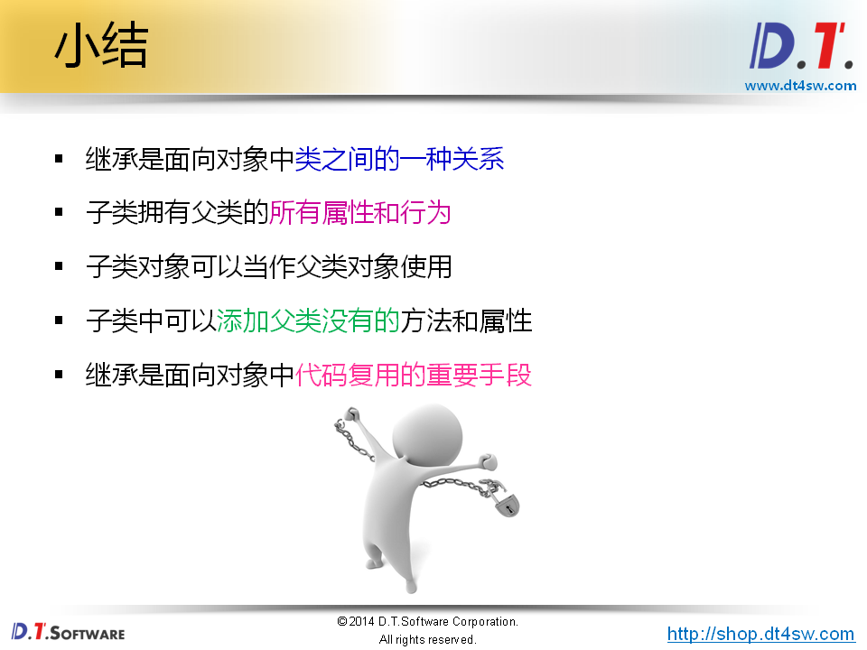