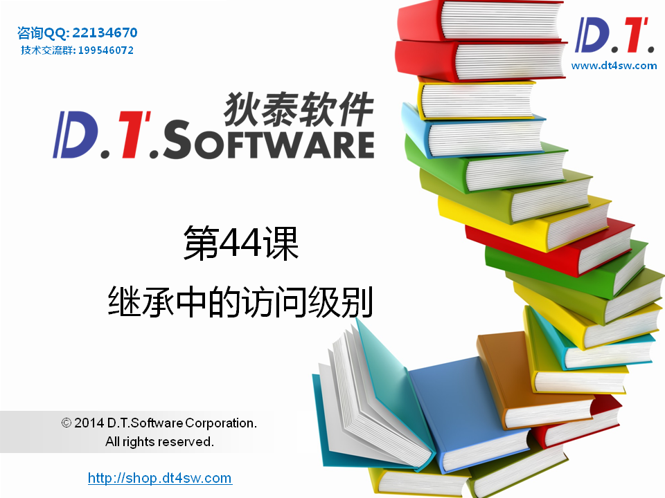
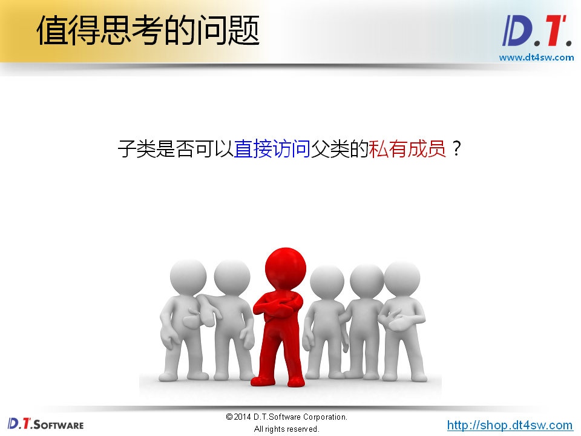
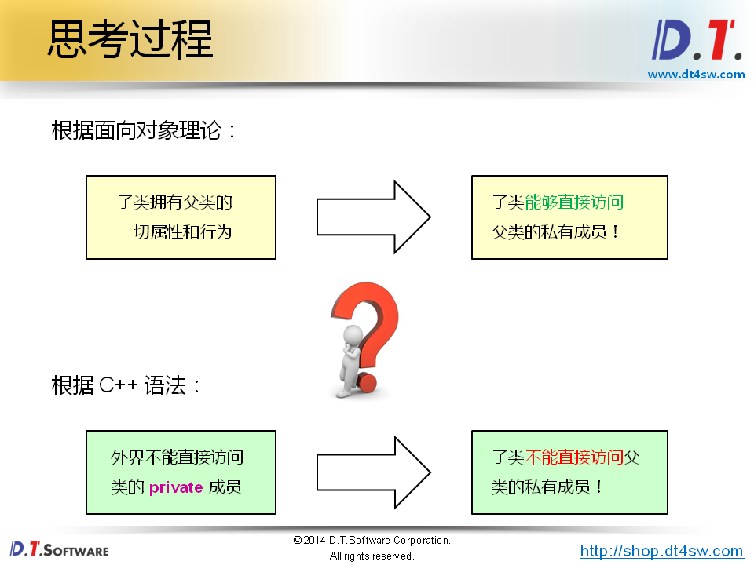
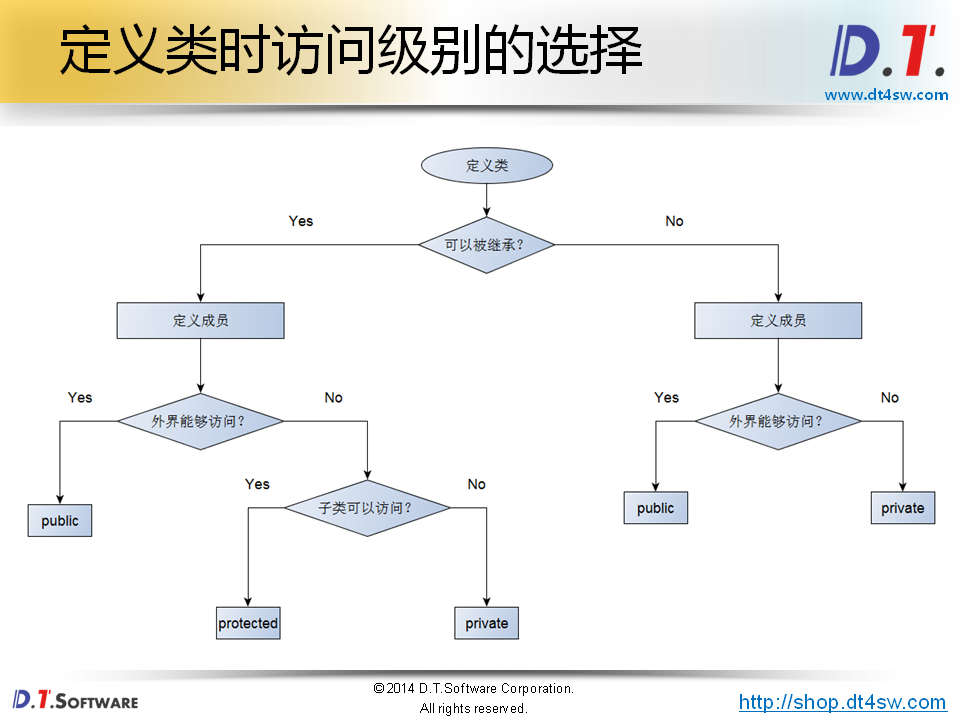
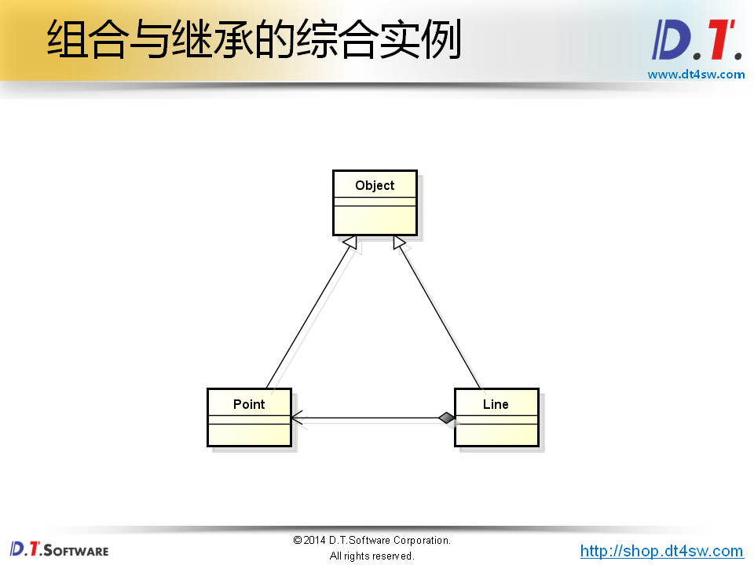
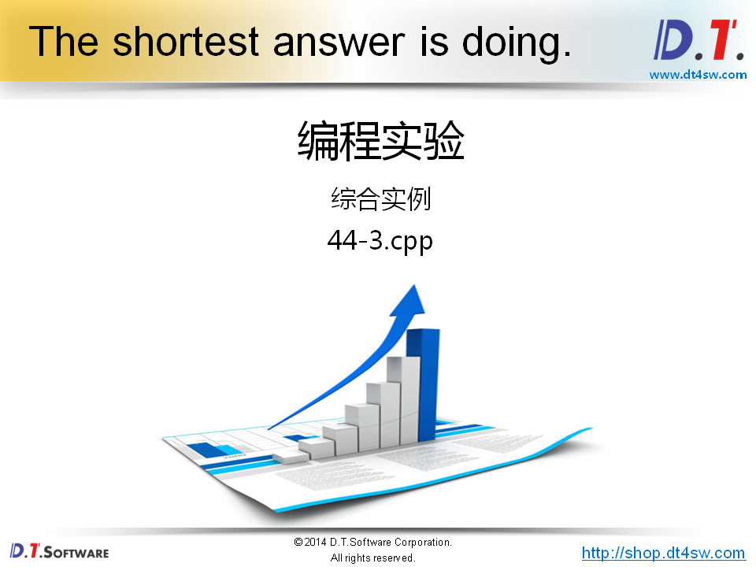

# 44.继承中的访问级别











```cpp
#include <iostream>
#include <string>

using namespace std;

class Parent
{
private:
    int mv;
public:
    Parent()
    {
        mv = 100;
    }
    
    int value()
    {
        return mv;
    }
};

class Child : public Parent
{
public:
    int addValue(int v)
    {
        mv = mv + v;    // 如何访问父类得非公有成员
    }
};

int main()
{   
    return 0;
}

```


```cpp
#include <iostream>
#include <string>

using namespace std;

class Parent
{
protected:
    int mv;
public:
    Parent()
    {
        mv = 100;
    }
    
    int value()
    {
        return mv;
    }
};

class Child : public Parent
{
public:
    int addValue(int v)
    {
        mv = mv + v;    
    }
};

int main()
{   
    Parent p;
    
    cout << "p.mv = " << p.value() << endl;
    
    // p.mv = 1000;    // error
    
    Child c;
    
    cout << "c.mv = " << c.value() << endl;
    
    c.addValue(50);
    
    cout << "c.mv = " << c.value() << endl;
    
    // c.mv = 10000;  // error
    
    return 0;
}

```










```cpp
#include <iostream>
#include <string>
#include <sstream>

using namespace std;

class Object
{
protected:
    string mName;
    string mInfo;
public:
    Object()
    {
        mName = "Object";
        mInfo = "";
    }
    string name()
    {
        return mName;
    }
    string info()
    {
        return mInfo;
    }
};

class Point : public Object
{
private:
    int mX;
    int mY;
public:
    Point(int x = 0, int y = 0)
    {
        ostringstream s;
        
        mX = x;
        mY = y;
        mName = "Point";
        
        s << "P(" << mX << ", " << mY << ")";
        
        mInfo = s.str();
    }
    int x()
    {
        return mX;
    }
    int y()
    {
        return mY;
    }
};

class Line : public Object
{
private:
    Point mP1;
    Point mP2;
public:
    Line(Point p1, Point p2)
    {
        ostringstream s;
        
        mP1 = p1;
        mP2 = p2;
        mName = "Line";
        
        s << "Line from " << mP1.info() << " to " << mP2.info();
        
        mInfo = s.str();
    }
    Point begin()
    {
        return mP1;
    }
    Point end()
    {
        return mP2;
    }
};

int main()
{   
    Object o;
    Point p(1, 2);
    Point pn(5, 6);
    Line l(p, pn);
    
    cout << o.name() << endl;
    cout << o.info() << endl;
    
    cout << endl;
    
    cout << p.name() << endl;
    cout << p.info() << endl;
    
    cout << endl;
    
    cout << l.name() << endl;
    cout << l.info() << endl;
    
    return 0;
}

```

