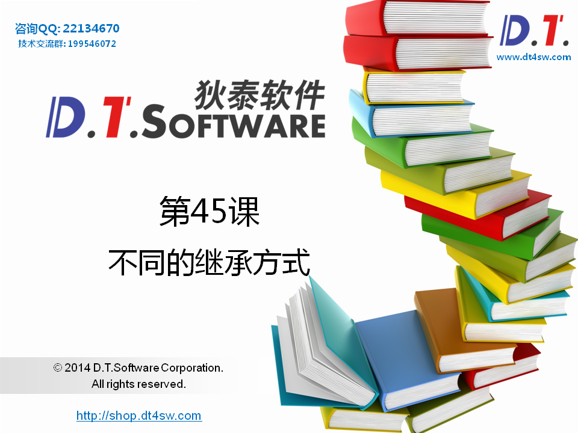
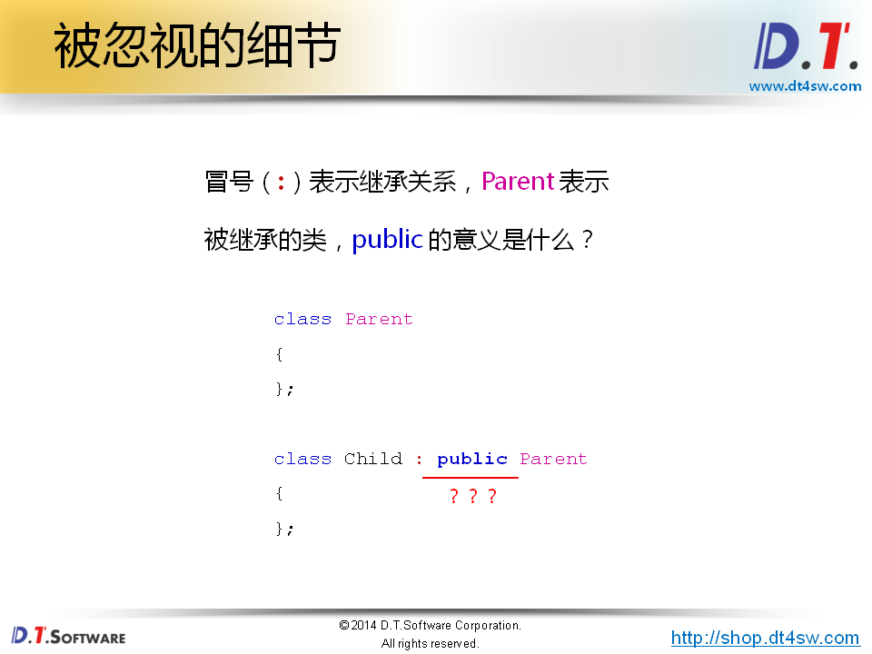
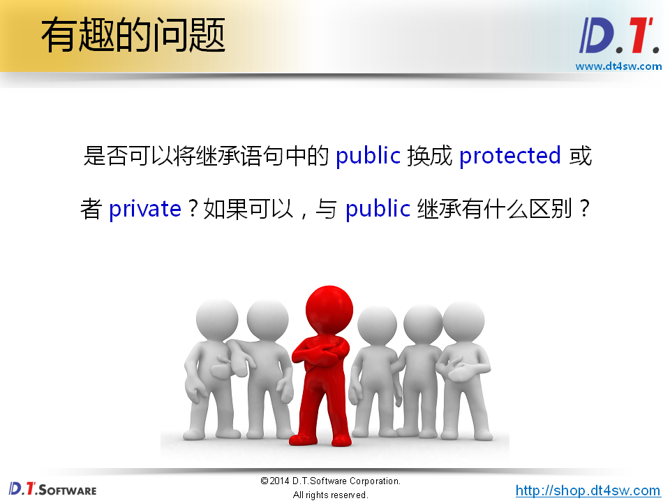
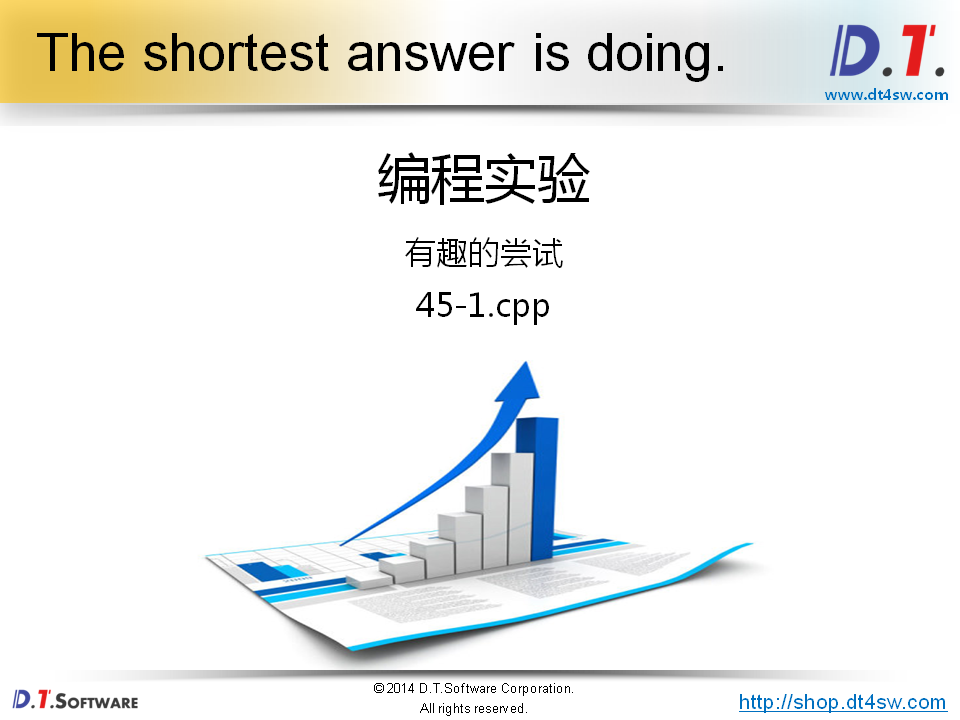
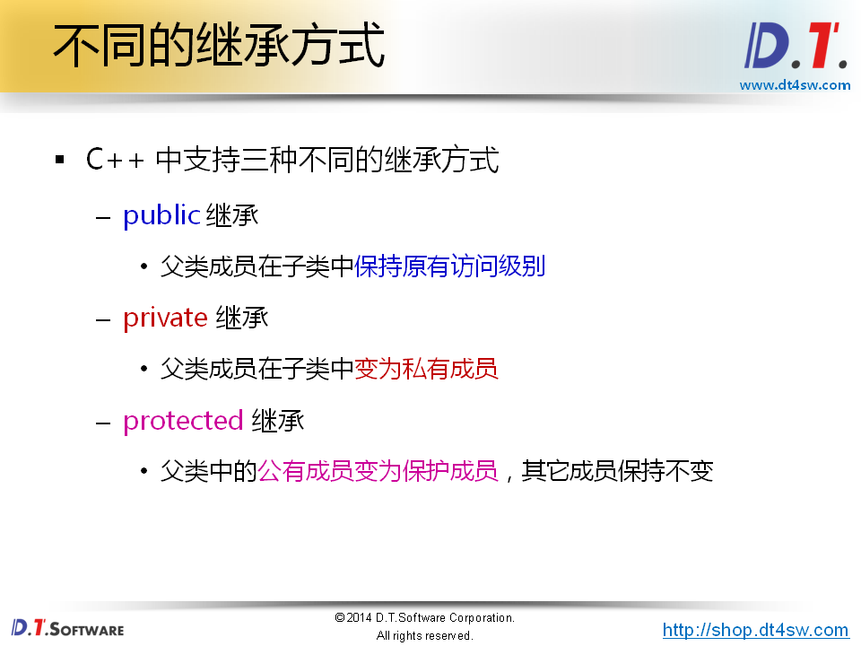
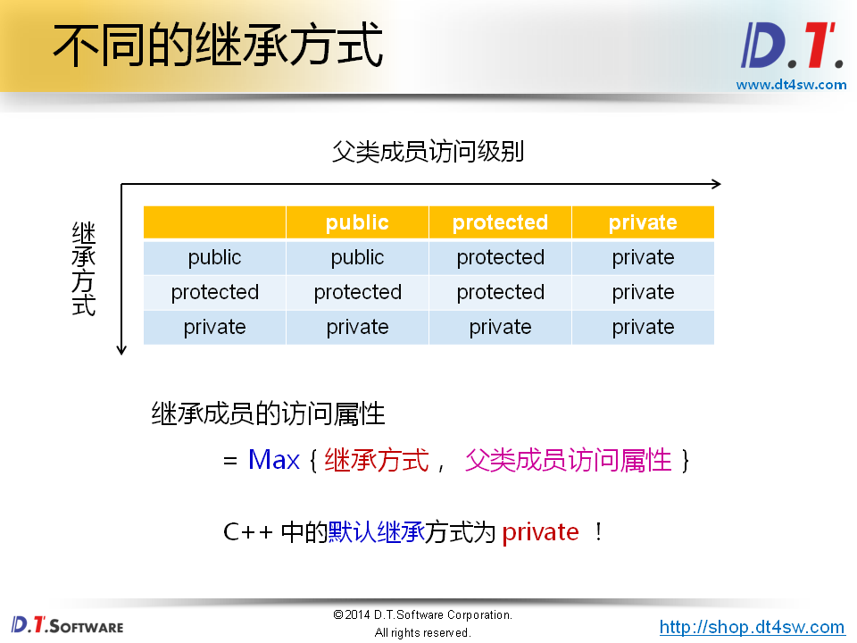
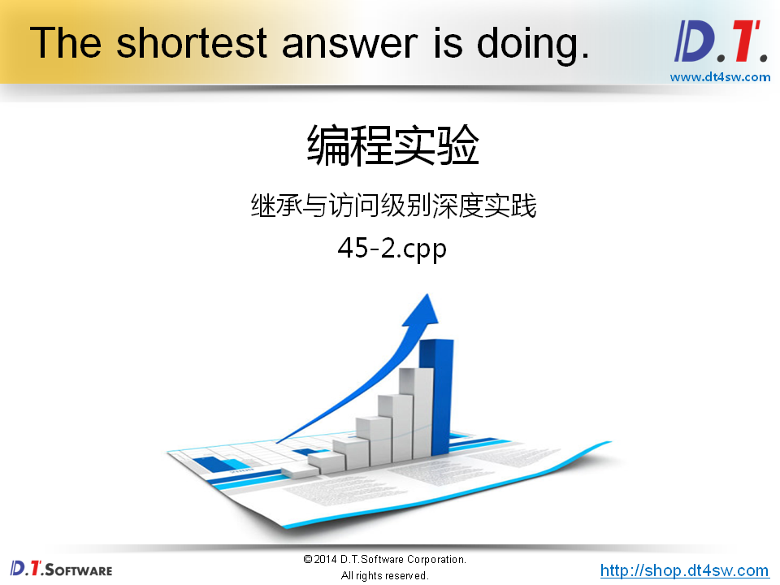
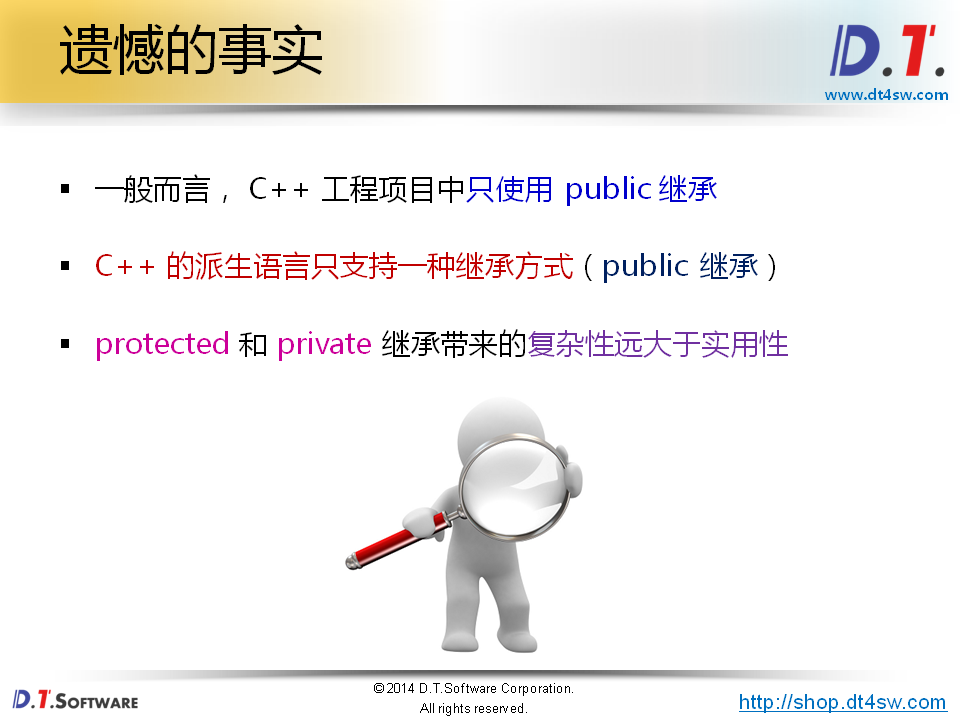
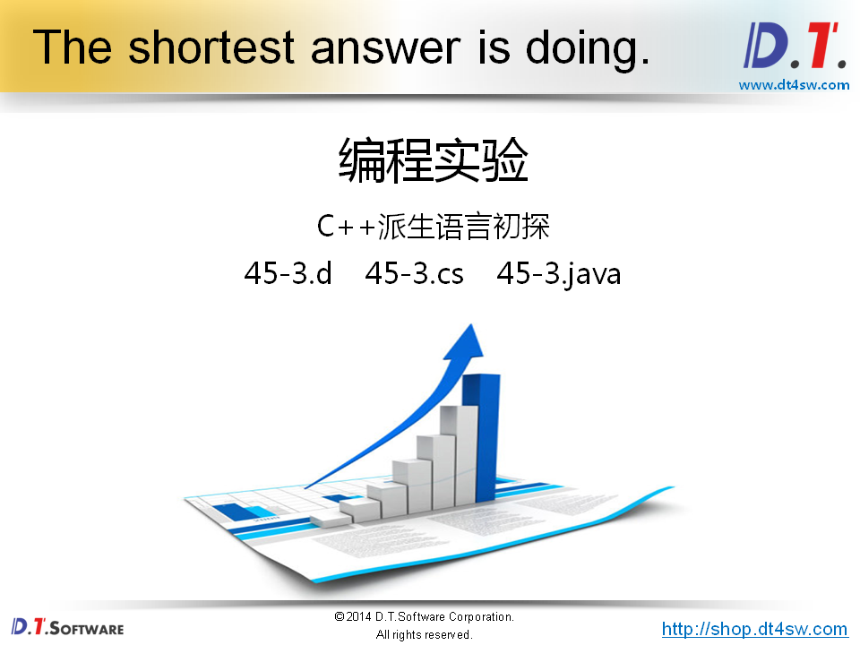
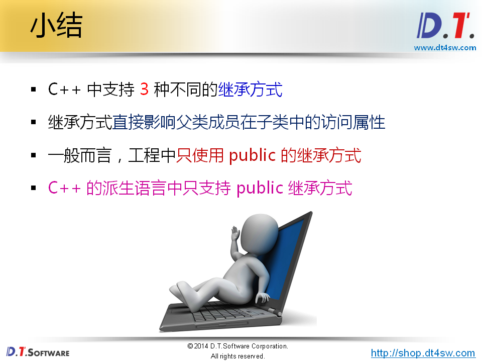

# 45.不同的继承方式













```cpp
#include <iostream>
#include <string>

using namespace std;

class Parent
{
};

class Child_A : public Parent
{
};

class Child_B : protected Parent
{
};

class Child_C : private Parent
{
};

int main()
{   
    return 0;
}

```



**为什么要有private继承-》直接全部父类直接private不好吗？**






```cpp
#include <iostream>
#include <string>

using namespace std;

class Parent
{
protected:
    int m_a;
protected:
    int m_b;
public:
    int m_c;
    
    void set(int a, int b, int c)
    {
        m_a = a;
        m_b = b;
        m_c = c;
    }
};

class Child_A : public Parent
{
public:
    void print()
    {
        cout << "m_a" << m_a << endl;
        cout << "m_b" << m_b << endl;
        cout << "m_c" << m_c << endl;
    }
};

class Child_B : protected Parent
{
public:
    void print()
    {
        cout << "m_a" << m_a << endl;
        cout << "m_b" << m_b << endl;
        cout << "m_c" << m_c << endl;
    }
};

class Child_C : private Parent
{
public:
    void print()
    {
        cout << "m_a" << m_a << endl;
        cout << "m_b" << m_b << endl;
        cout << "m_c" << m_c << endl;
    }
};

int main()
{   
    Child_A a;
    Child_B b;
    Child_C c;
    
    a.m_c = 100;
    // b.m_c = 100;    // Child_B 保护继承自 Parent所以所有的public成员全部变成了protected成员，因此外界无法访问 public 
    // c.m_c = 100;    // Child_C 私有继承自 Parent 所以所有的成员全部变成了private成员，因此外界无法访问； 
    
    a.set(1, 1, 1);
    // b.set(2, 2, 2);
    // c.set(3, 3, 3);
    
    a.print();
    b.print();
    c.print();
    
    return 0;
}

```






```c#
class Obj
{
    protected string mName;
    protected string mInfo;
    
    public Obj()
    {
        mName = "Object";
        mInfo = "";
    }
    
    public string name()
    {
        return mName;
    }
    
    public string info()
    {
        return mInfo;
    }
}

class Point : Obj
{

    private int mX;
    private int mY;

    public Point(int x, int y)
    { 
        mX = x;
        mY = y;
        mName = "Point";
        mInfo = "P(" + mX + ", " + mY + ")";
    }
    
    public int x()
    {
        return mX;
    }
    
    public int y()
    {
        return mY;
    }
}

class Program
{
    public static void Main(string[] args)
    {
        System.Console.WriteLine("C# Demo");    // C# Demo
        
        Point p = new Point(1, 2);
        
        System.Console.WriteLine(p.name());     // Point
        System.Console.WriteLine(p.info());     // P(1, 2)
        
    }
}


```

```cpp
class Obj
{
    protected String mName;
    protected String mInfo;
    
    public Obj()
    {
        mName = "Object";
        mInfo = "";
    }
    
    public String name()
    {
        return mName;
    }
    
    public String info()
    {
        return mInfo;
    }
}

class Point extends Obj
{

    private int mX;
    private int mY;

    public Point(int x, int y)
    { 
        mX = x;
        mY = y;
        mName = "Point";
        mInfo = "P(" + mX + ", " + mY + ")";
    }
    
    public int x()
    {
        return mX;
    }
    
    public int y()
    {
        return mY;
    }
}

class Program {
    public static void main(String[] args){
        System.out.println("Java Demo");    // Java Demo
        
        Point p = new Point(1, 2);
        
        System.out.println(p.name());       // Point
        System.out.println(p.info());       // P(1, 2)
    }
}
```


