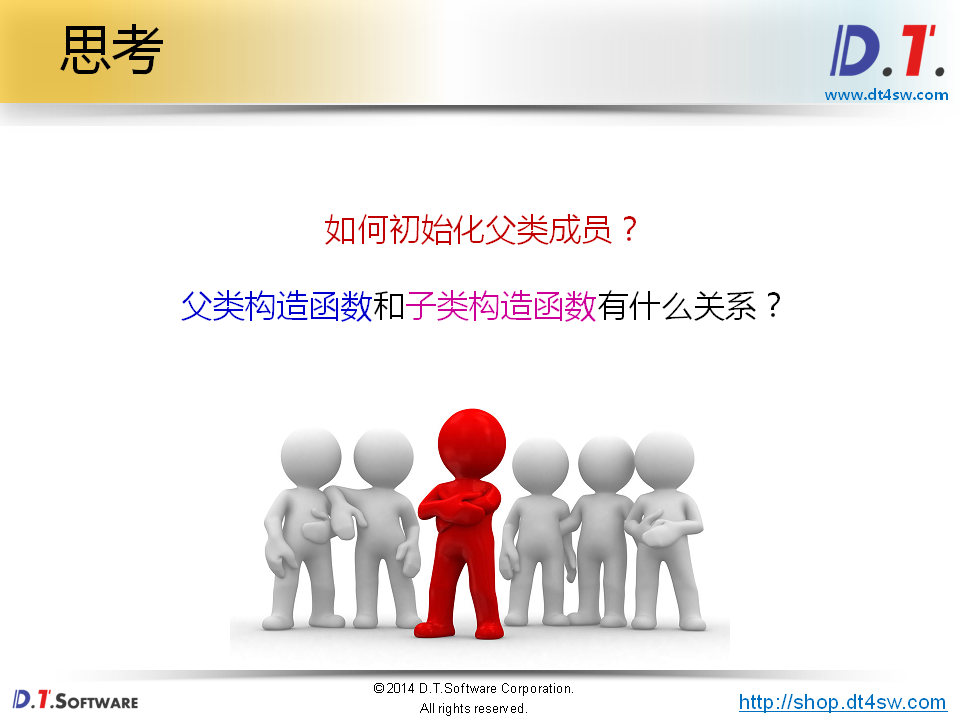
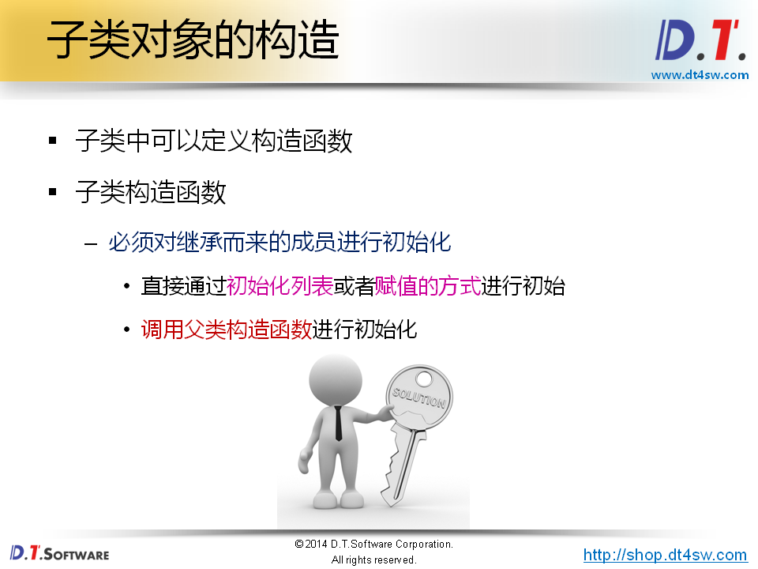
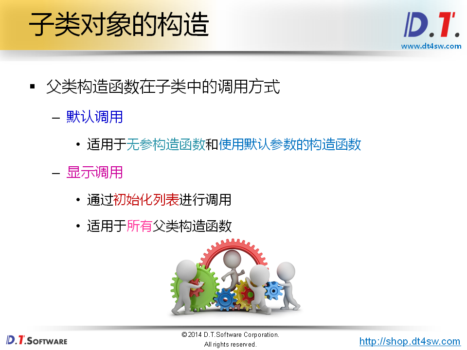
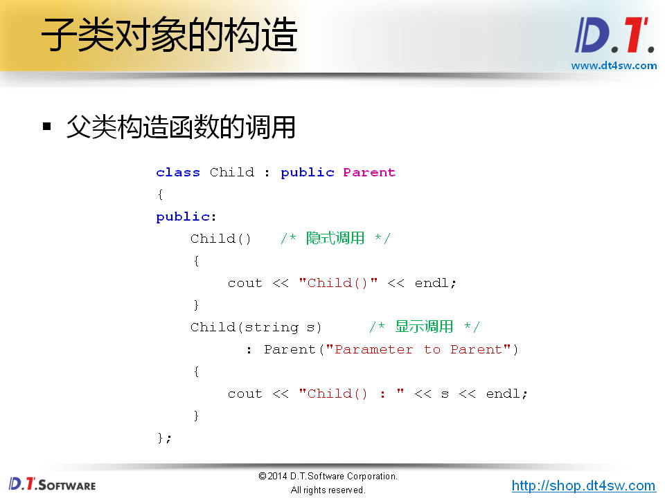
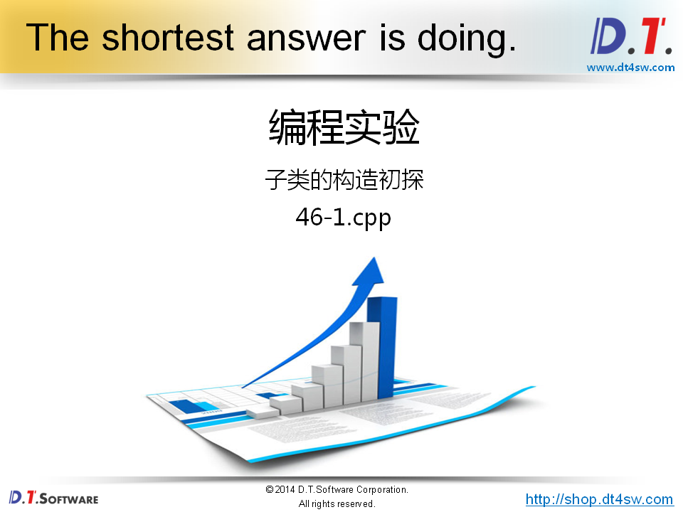
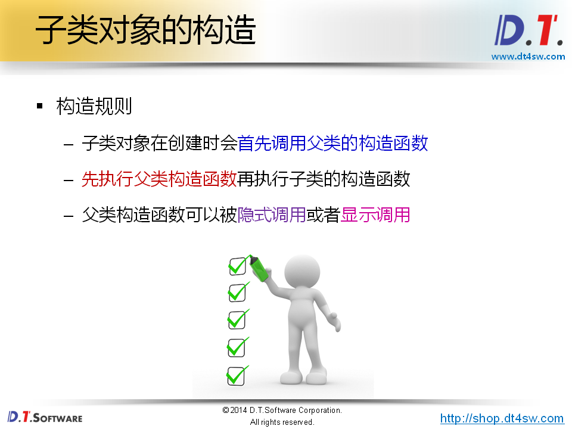
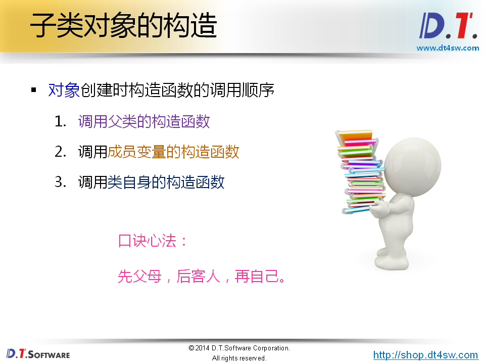
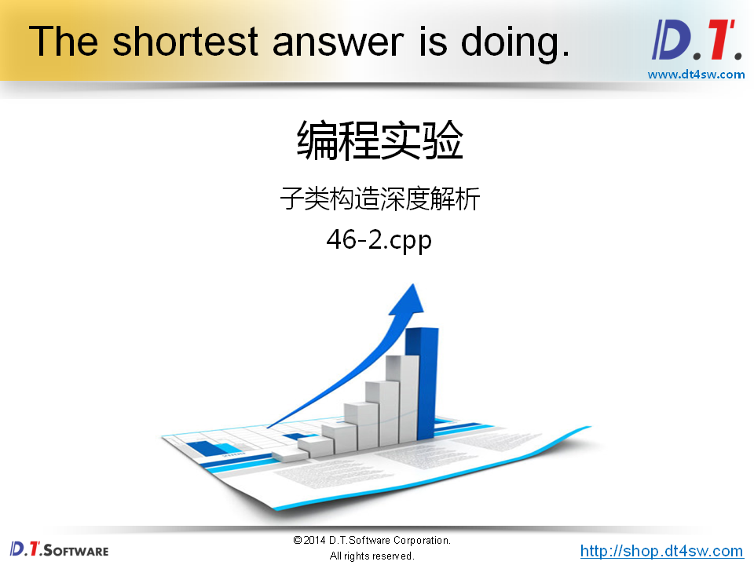
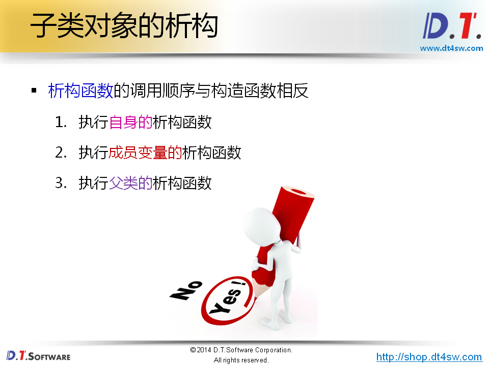
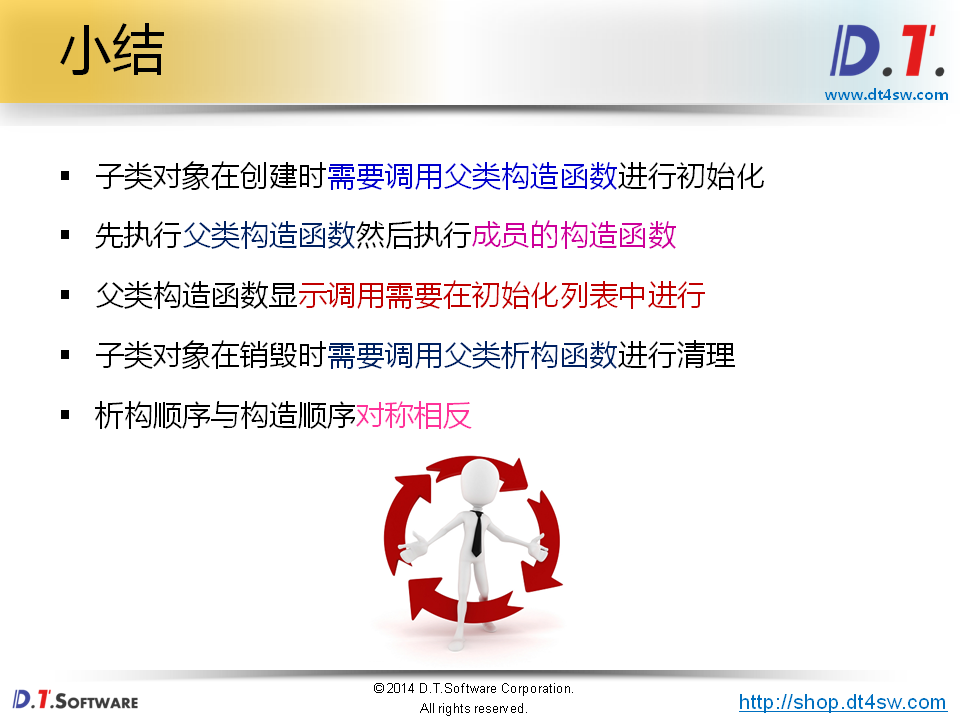

# 46.继承中的构造与析构
















```cpp
#include <iostream>
#include <string>

using namespace std;

class Parent 
{
public:
    Parent()
    {
        cout << "Parent()" << endl;
    }
    Parent(string s)
    {
        cout << "Parent(string s) : " << s << endl;
    }
};

class Child : public Parent
{
public:
    Child()
    {
        cout << "Child()" << endl;
    }
    Child(string s) : Parent(s)
    {
        cout << "Child(string s) : " << s << endl;
    }
};

int main()
{       
    Child c; // Parent() Child()
    Child cc("cc"); // "Parent(string s) Child(string s)
    
    return 0;
}

```






**先调用父类构造函数，后调用成员变量的构造函数，最后调用自己的构造函数**



```cpp
#include <iostream>
#include <string>

using namespace std;

class Object
{
public:
    Object(string s)
    {
        cout << "Object(string s) : " << s << endl;
    }
};

class Parent : public Object
{
public:
    Parent() : Object("Default")
    {
        cout << "Parent()" << endl;
    }
    Parent(string s) : Object(s)
    {
        cout << "Parent(string s) : " << s << endl;
    }
};

class Child : public Parent
{
    Object mO1; // 成员变量-》组合关系
    Object mO2; // 必须用初始化列表显式调用这两个成员变量的构造函数
public:
    Child() : mO1("Default 1"), mO2("Default 2")
    {
        cout << "Child()" << endl;
    }
    Child(string s) : Parent(s), mO1(s + " 1"), mO2(s + " 2")
    {
        cout << "Child(string s) : " << s << endl;
    }
};

int main()
{       
    Child cc("cc");
    // CC output:
    // object(string s) : cc
    // Parent(string s) : cc
    // Object(string s) ： cc 1
    // Object(string s) : cc 2
    // Child(string s) : cc
    return 0;
}

```




```cpp
#include <iostream>
#include <string>

using namespace std;

class Object
{
    string ms;
public:
    Object(string s)
    {
        cout << "Object(string s) : " << s << endl;
        ms = s;
    }
    ~Object()
    {
        cout << "~Object() : " << ms << endl;
    }
};

class Parent : public Object
{
    string ms;
public:
    Parent() : Object("Default")
    {
        cout << "Parent()" << endl;
        ms = "Default";
    }
    Parent(string s) : Object(s)
    {
        cout << "Parent(string s) : " << s << endl;
        ms = s;
    }
    ~Parent()
    {
        cout << "~Parent() : " << ms << endl;
    }
};

class Child : public Parent
{
    Object mO1;
    Object mO2;
    string ms;
public:
    Child() : mO1("Default 1"), mO2("Default 2")
    {
        cout << "Child()" << endl;
        ms = "Default";
    }
    Child(string s) : Parent(s), mO1(s + " 1"), mO2(s + " 2")
    {
        cout << "Child(string s) : " << s << endl;
        ms = s;
    }
    ~Child()
    {
        cout << "~Child() " << ms << endl;
    }
};

int main()
{       
    Child cc("cc");
    
    cout << endl;
    
    return 0;
}

```

