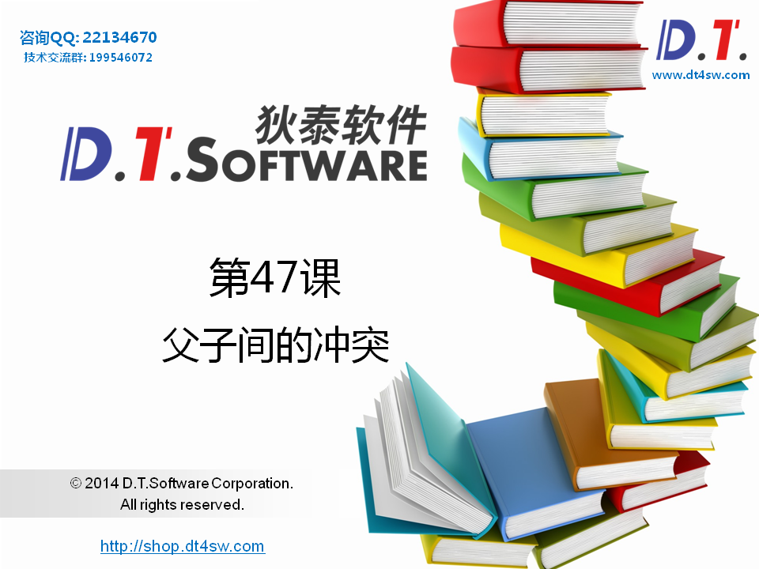
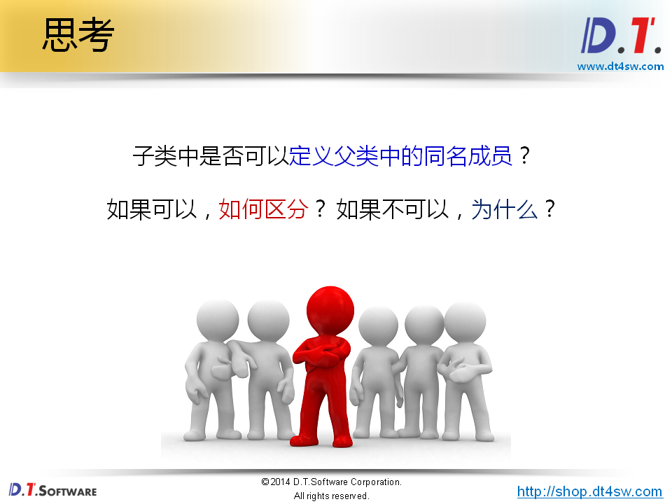
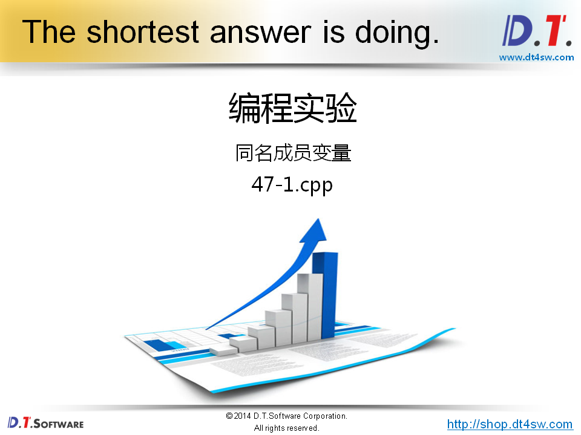
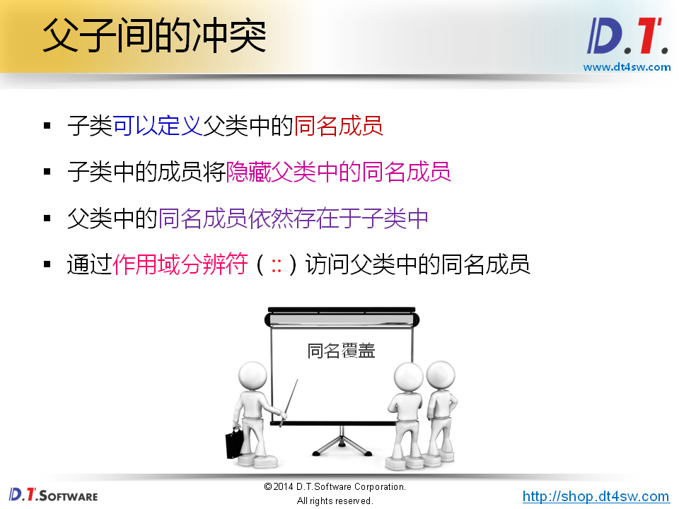
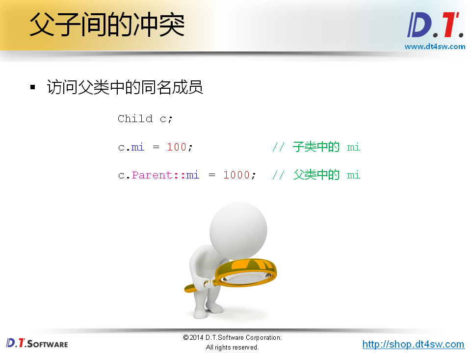
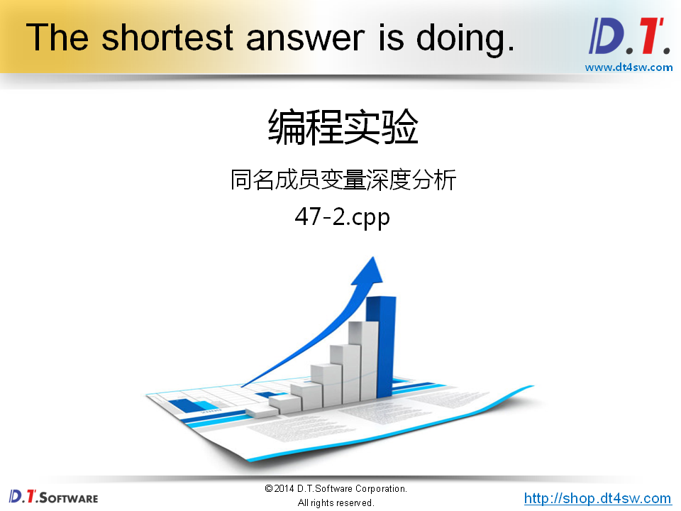
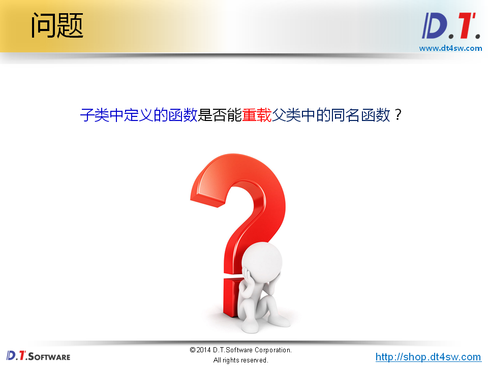
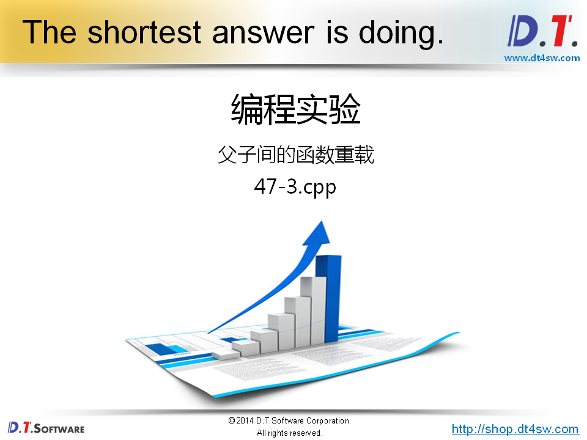
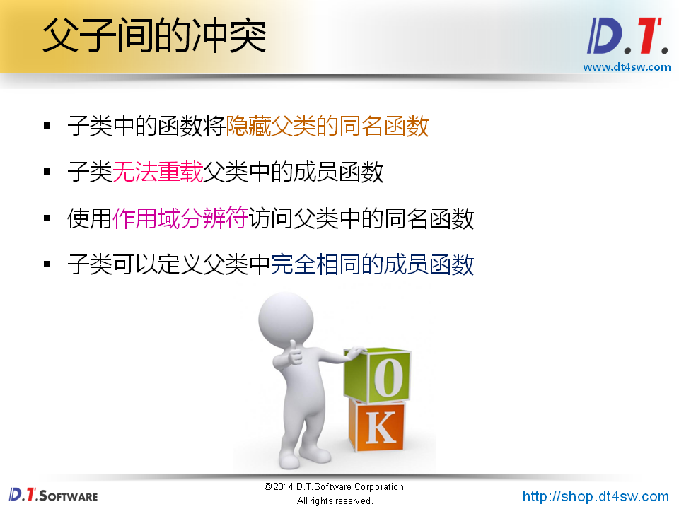
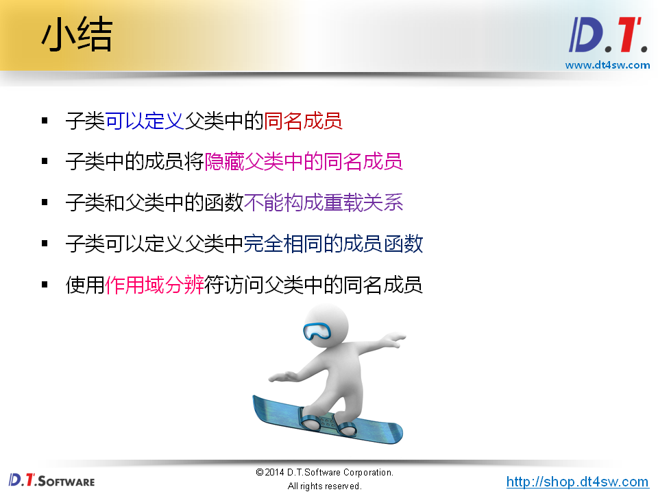

# 47.父子间的冲突










```cpp
#include <iostream>
#include <string>

using namespace std;

class Parent
{
public:
    int mi;
};

class Child : public Parent
{
public:
    int mi;
};

int main()
{
    Child c;
    
    c.mi = 100;    // mi 究竟是子类自定义的，还是从父类继承得到的->需要作用域分辨符
    
    return 0;
}
```






**因为处于不同的作用域所以允许子类这样**



```cpp
#include <iostream>
#include <string>

using namespace std;

namespace A
{
    int g_i = 0;
}

namespace B
{
    int g_i = 1;
}

class Parent
{
public:
    int mi;
    
    Parent()
    {
        cout << "Parent() : " << "&mi = " << &mi << endl;
    }
};

class Child : public Parent
{
public:
    int mi;
    
    Child()
    {
        cout << "Child() : " << "&mi = " << &mi << endl;
    }
};

int main()
{
    Child c;
    
    c.mi = 100;    
    
    c.Parent::mi = 1000;
    
    cout << "&c.mi = " << &c.mi << endl; // 0xbfb43a0c
    cout << "c.mi = " << c.mi << endl;
    
    cout << "&c.Parent::mi = " << &c.Parent::mi << endl; // 0xbfb43a08
    cout << "c.Parent::mi = " << c.Parent::mi << endl;
    
    return 0;
}
```







```cpp
#include <iostream>
#include <string>

using namespace std;

class Parent
{
public:
    int mi;
    
    void add(int v)
    {
        mi += v;
    }
    
    void add(int a, int b)
    {
        mi += (a + b);
    }
};

class Child : public Parent
{
public:
    int mi;
    
    void add(int v)
    {
        mi += v;
    }
    
    void add(int a, int b)
    {
        mi += (a + b);
    }
    
    void add(int x, int y, int z) // 只写这个，直接报错，因为同名覆盖
    {
        mi += (x + y + z);
    }
};

int main()
{
    Child c;
    
    c.mi = 100;    
    
    c.Parent::mi = 1000;
    
    cout << "c.mi = " << c.mi << endl; // 100
    
    cout << "c.Parent::mi = " << c.Parent::mi << endl; // 1000
    
    c.add(1);
    c.add(2, 3);
    c.add(4, 5, 6);
    
    cout << "c.mi = " << c.mi << endl; // 121
    
    cout << "c.Parent::mi = " << c.Parent::mi << endl; // 1006-》只有一个add(int x, int y, int z)的情况下
    
    return 0;
}
```






**不能够成重载关系-》因为不在一个作用域里面**