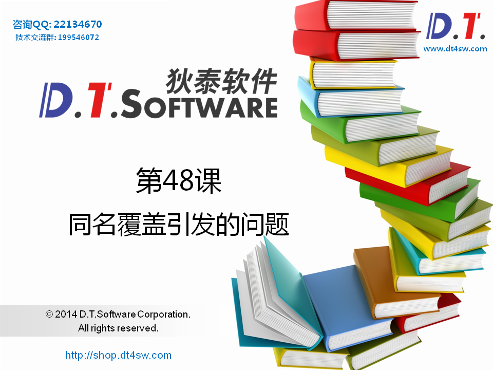
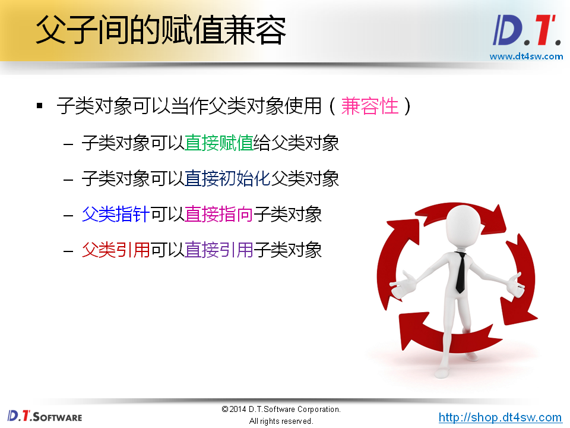
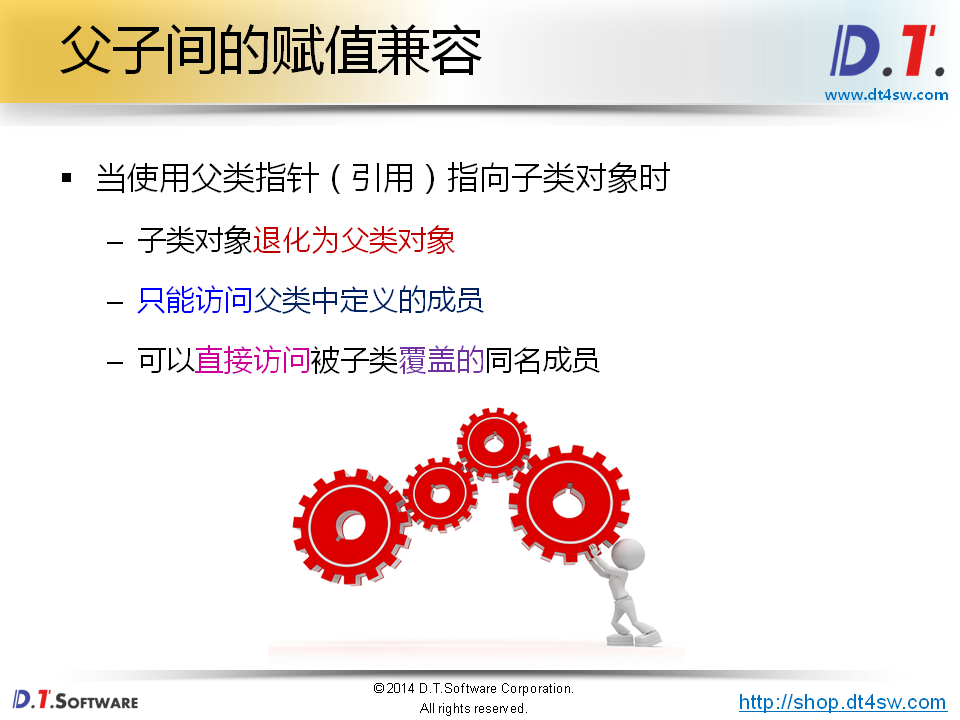
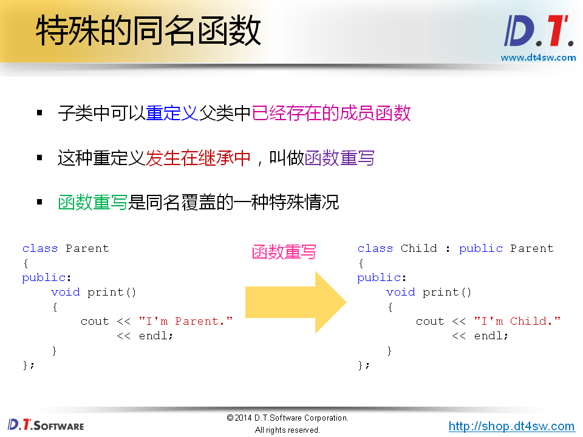
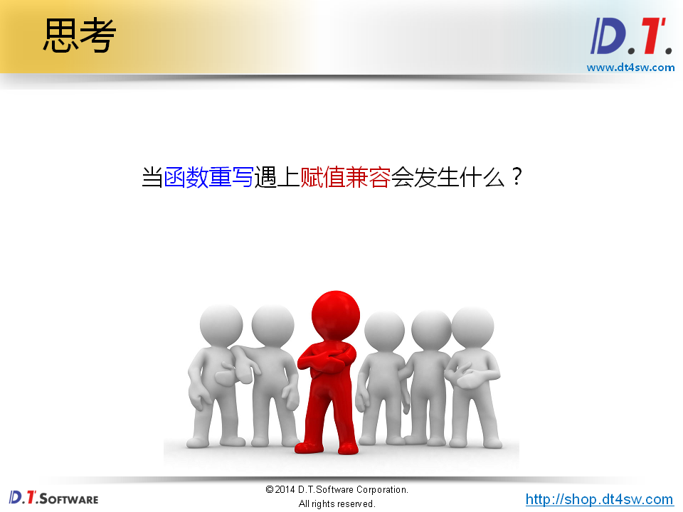
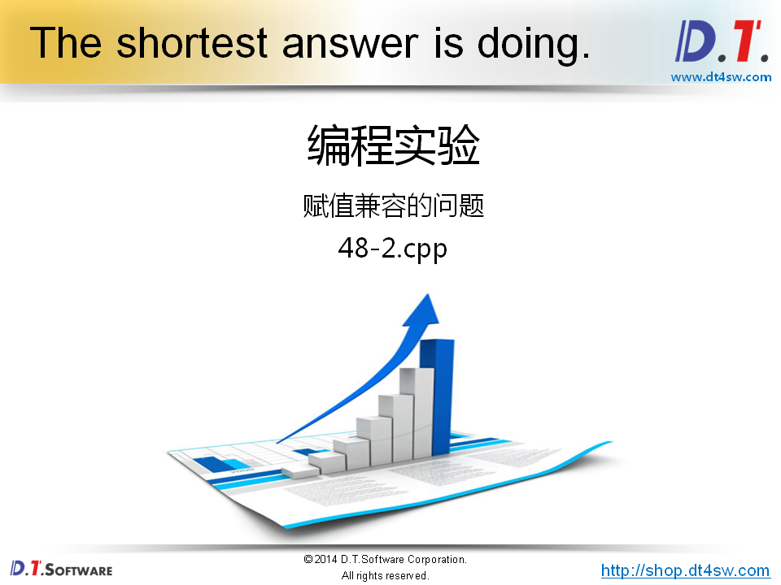
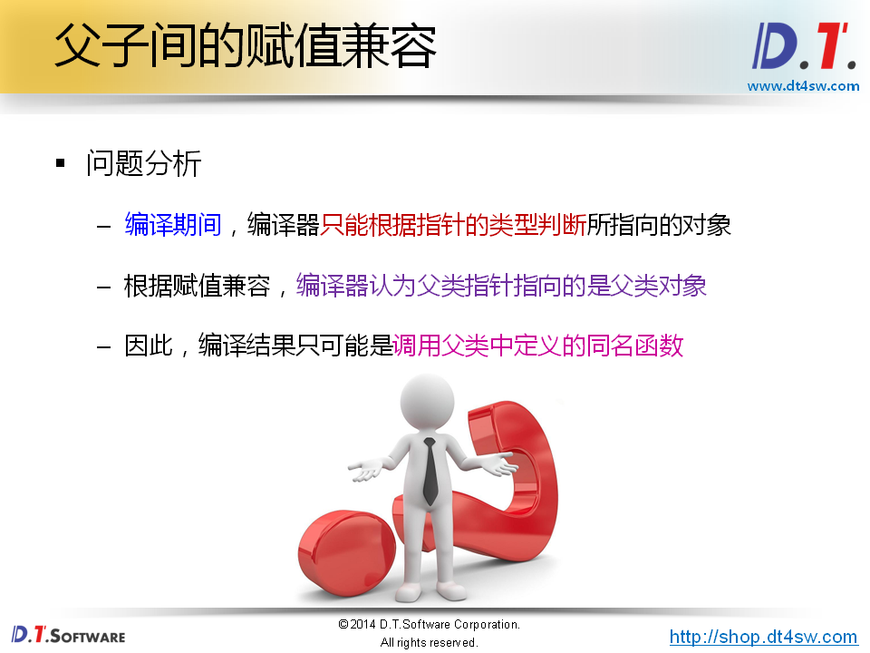
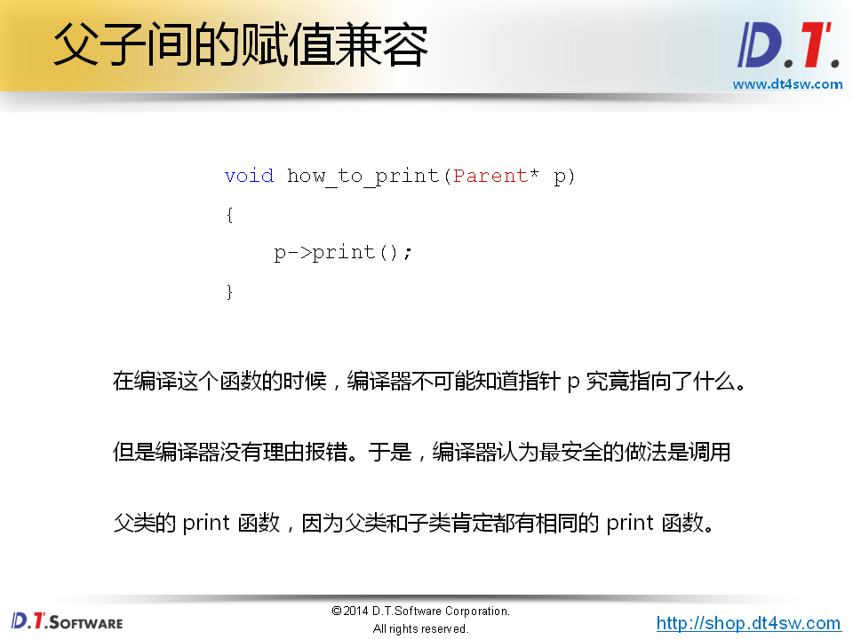
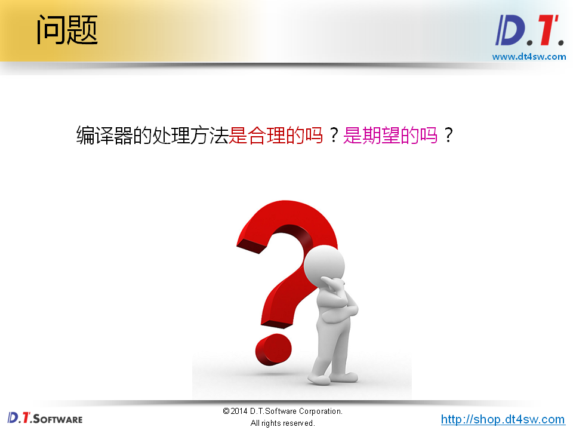
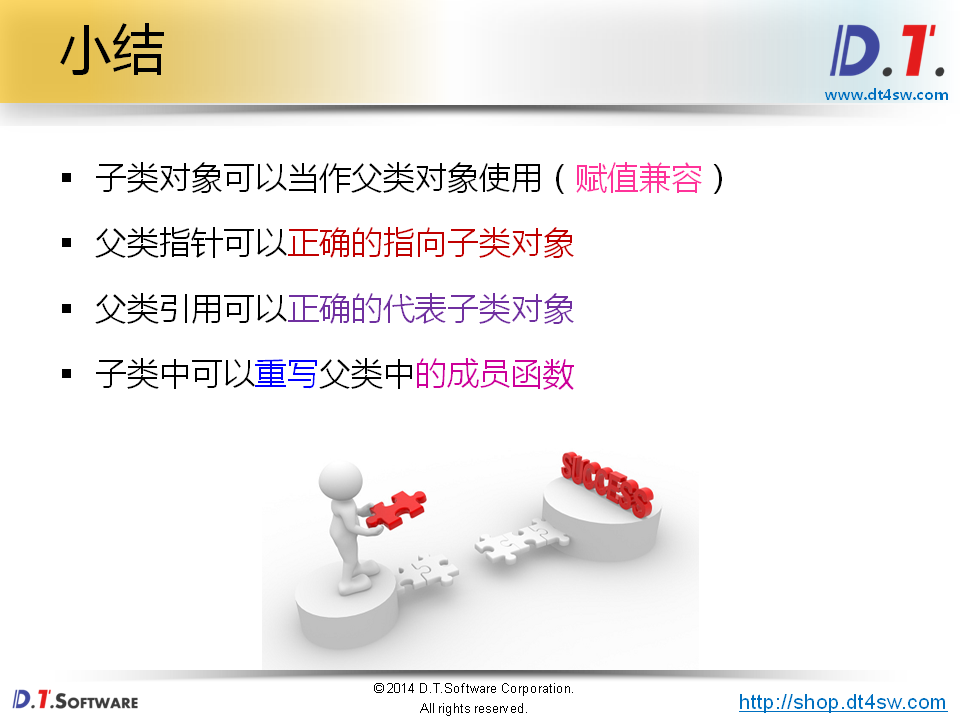

# 48.同名覆盖引发的问题








```cpp
#include <iostream>
#include <string>

using namespace std;

class Parent
{
public:
    int mi;
    
    void add(int i)
    {
        mi += i;
    }
    
    void add(int a, int b)
    {
        mi += (a + b);
    }
};

class Child : public Parent
{
public:
    int mv;
    
    void add(int x, int y, int z)
    {
        mv += (x + y + z);
    }
};

int main()
{
    Parent p;
    Child c;
    
    p = c;
    
    Parent p1(c); // 第一种兼容性的体现
    
    
    Parent& rp = c; // 可以过
    Parent* pp = &c; // 可以过
    
    rp.mi = 100;           // 使用的是父类的
    rp.add(5);             // 没有发生同名覆盖?-》使用父类的
    rp.add(10, 10);        // 没有发生同名覆盖?-》使用父类的
    
    /* 为什么编译不过? */
    // pp->mv = 1000; // 不行因为子类已经被裁剪掉了
    // pp->add(1, 10, 100);  // 不行同上
    // 深入理解C++对象模型里面的
    return 0;
}
```












```cpp
#include <iostream>
#include <string>

using namespace std;

class Parent
{
public:
    int mi;
    
    void add(int i)
    {
        mi += i;
    }
    
    void add(int a, int b)
    {
        mi += (a + b);
    }
    
    void print()
    {
        cout << "I'm Parent." << endl;
    }
};

class Child : public Parent
{
public:
    int mv;
    
    void add(int x, int y, int z)
    {
        mv += (x + y + z);
    }
    
    void print()
    {
        cout << "I'm Child." << endl;
    }
};

void how_to_print(Parent* p)
{
    p->print();
}

int main()
{
    Parent p;
    Child c;
    
    how_to_print(&p);    // Expected to print: I'm Parent.
    how_to_print(&c);    // Expected to print: I'm Child.
    
    return 0;
}
```



**解决方案是多态哈哈哈哈哈**







