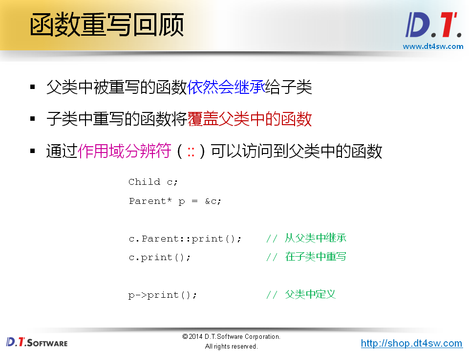
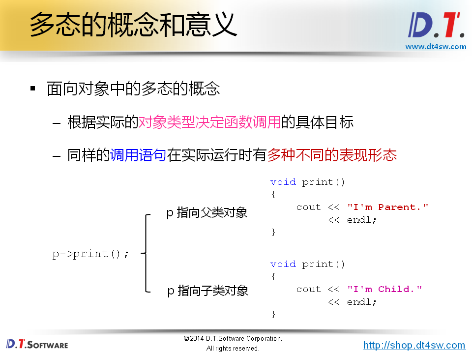
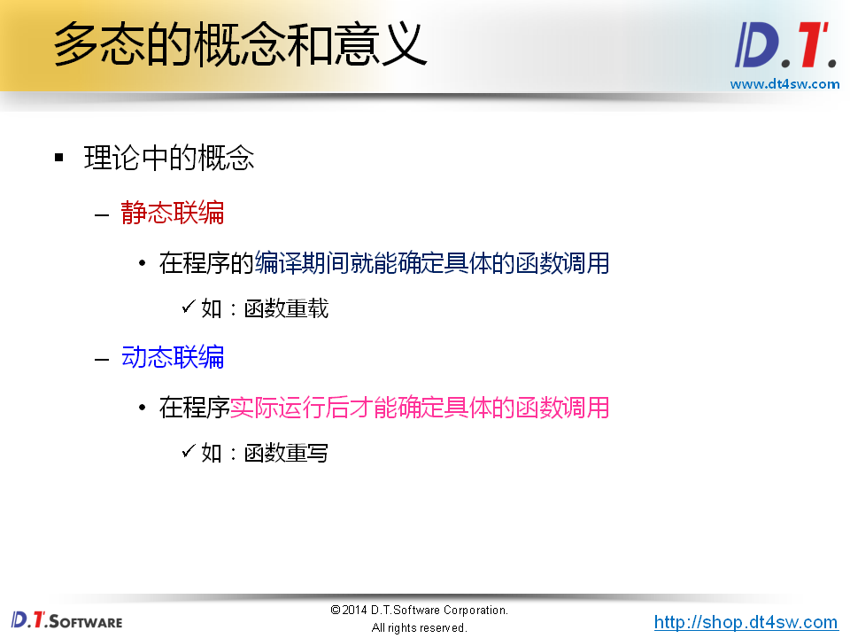
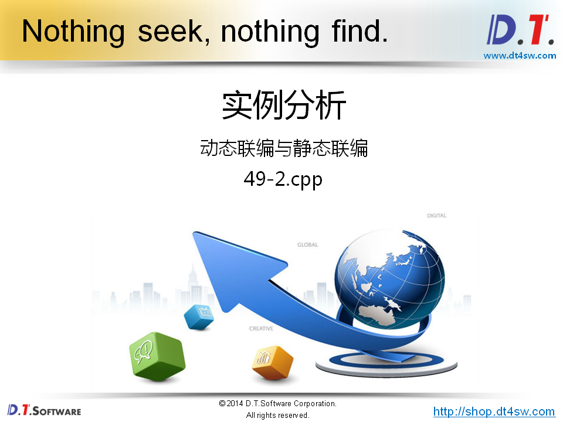
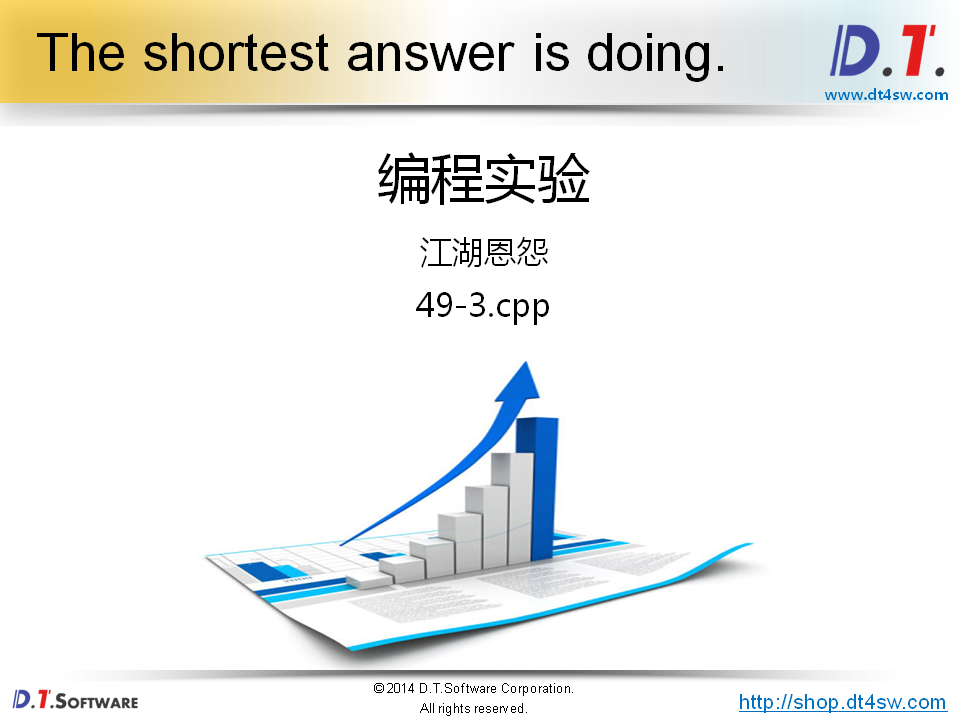
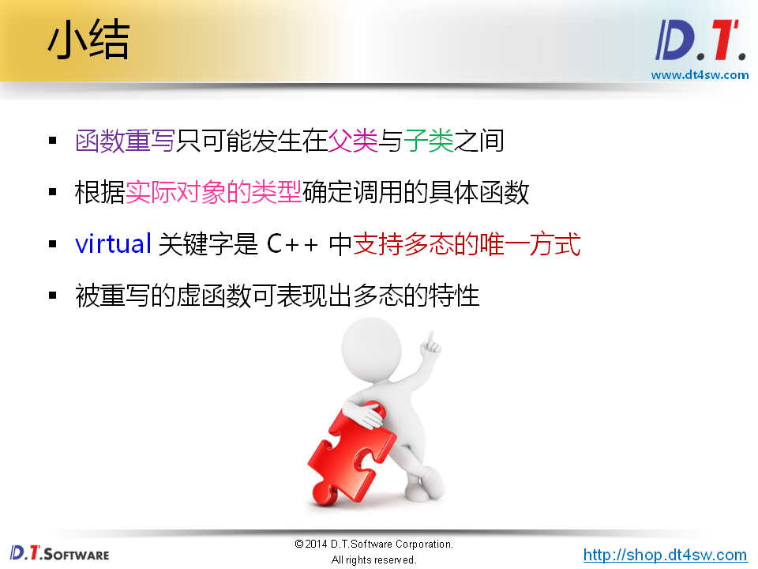

# 49.多态的概念和意义








```cpp
#include <iostream>
#include <string>

using namespace std;

class Parent
{
public:
    virtual void print()
    {
        cout << "I'm Parent." << endl;
    }
};

class Child : public Parent
{
public:
    void print()
    {
        cout << "I'm Child." << endl;
    }
};

void how_to_print(Parent* p)
{
    p->print();     // 展现多态的行为
}

int main()
{
    Parent p;
    Child c;
    
    how_to_print(&p);    // Expected to print: I'm Parent. In fact I'm Parent
    how_to_print(&c);    // Expected to print: I'm Child.  In fact I'm Child
    
    return 0;
}
```







```cpp
#include <iostream>
#include <string>

using namespace std;

class Parent
{
public:
    virtual void func()
    {
        cout << "void func()" << endl;
    }
    
    virtual void func(int i)
    {
        cout << "void func(int i) : " << i << endl;
    }
    
    virtual void func(int i, int j)
    {
        cout << "void func(int i, int j) : " << "(" << i << ", " << j << ")" << endl;
    }
};

class Child : public Parent
{
public:
    void func(int i, int j)
    {
        cout << "void func(int i, int j) : " << i + j << endl;
    }
    
    void func(int i, int j, int k)
    {
        cout << "void func(int i, int j, int k) : " << i + j + k << endl;
    }
};

void run(Parent* p)
{
    p->func(1, 2);     // 展现多态的特性
                       // 动态联编
}


int main()
{
    Parent p;
    
    p.func();         // 静态联编
    p.func(1);        // 静态联编
    p.func(1, 2);     // 静态联编
    
    cout << endl;
    
    Child c;
    
    c.func(1, 2);     // 静态联编-》编译时就可以确定，因为编译就知道调用cHild的func函数
    
    cout << endl;
    
    run(&p);  // 多态-》根据对象的实际类型来调用相应的函数接口
    run(&c);  // 多态
    
    return 0;
}

```



```cpp
#include <iostream>
#include <string>

using namespace std;

class Boss
{
public:
    int fight()
    {
        int ret = 10;
        
        cout << "Boss::fight() : " << ret << endl;
        
        return ret;
    }
};

class Master
{
public:
    virtual int eightSwordKill()
    {
        int ret = 8;
        
        cout << "Master::eightSwordKill() : " << ret << endl;
        
        return ret;
    }
};

class NewMaster : public Master
{
public:
    int eightSwordKill()
    {
        int ret = Master::eightSwordKill() * 2;
        
        cout << "NewMaster::eightSwordKill() : " << ret << endl;
        
        return ret;
    }
};

void field_pk(Master* master, Boss* boss)
{
    int k = master->eightSwordKill();
    int b = boss->fight();
    
    if( k < b )
    {
        cout << "Master is killed..." << endl;
    }
    else
    {
        cout << "Boss is killed..." << endl;
    }
}

int main()
{
    Master master;
    Boss boss;
    
    cout << "Master vs Boss" << endl;
    
    field_pk(&master, &boss);
    
    cout << "NewMaster vs Boss" << endl;
    
    NewMaster newMaster;
    
    field_pk(&newMaster, &boss);
    
    return 0;
}

```

