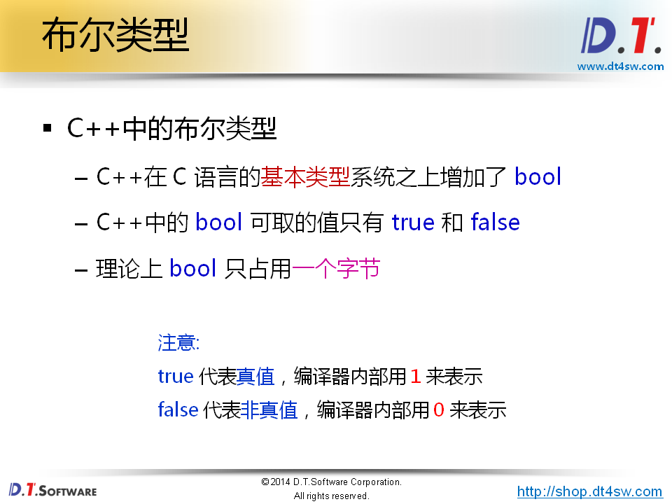
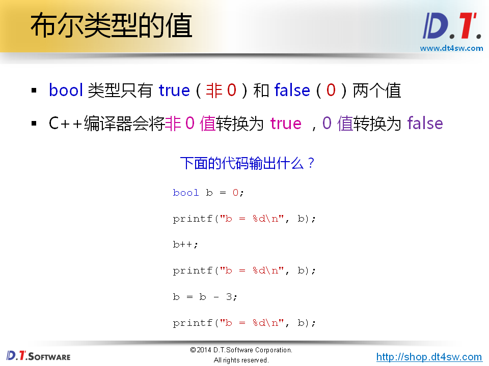
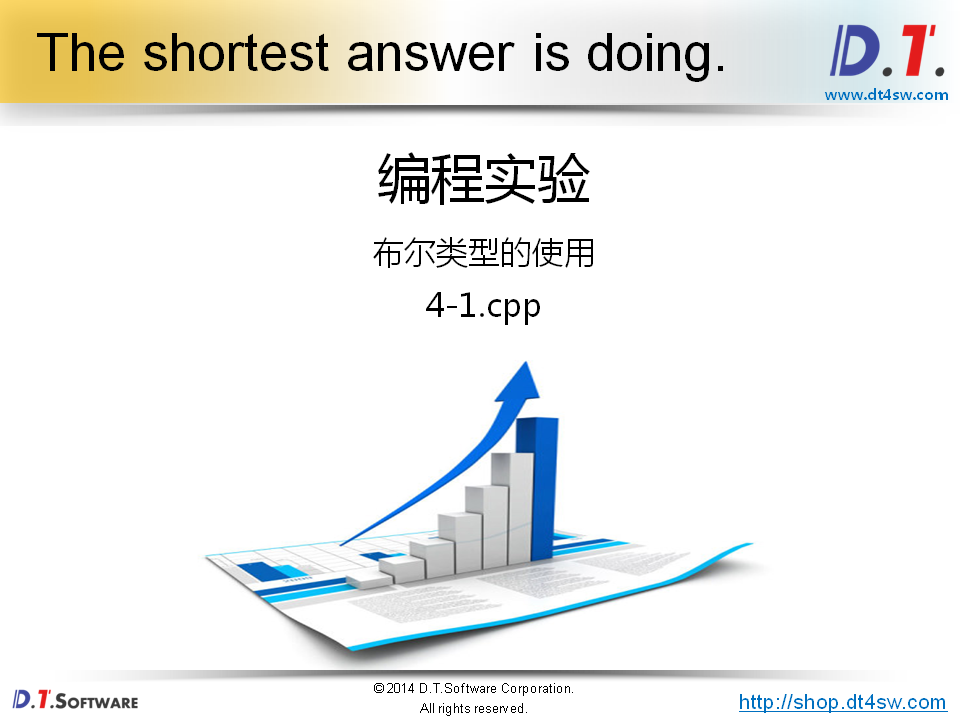
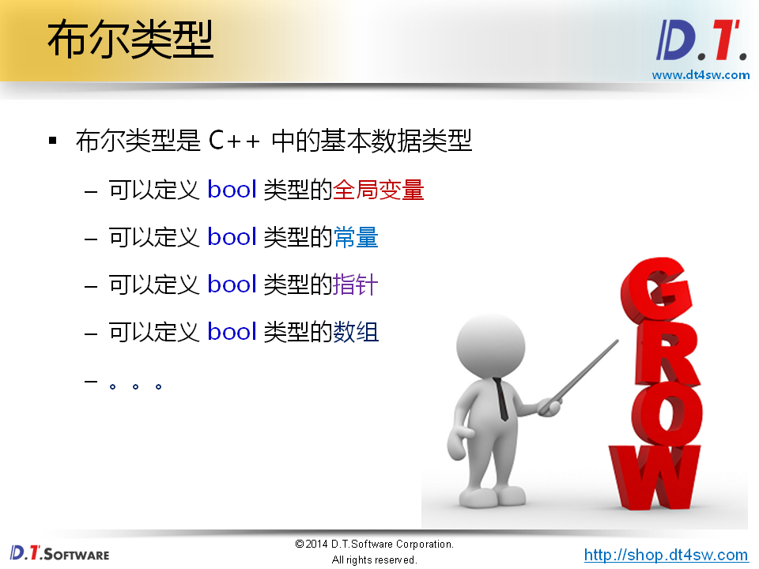
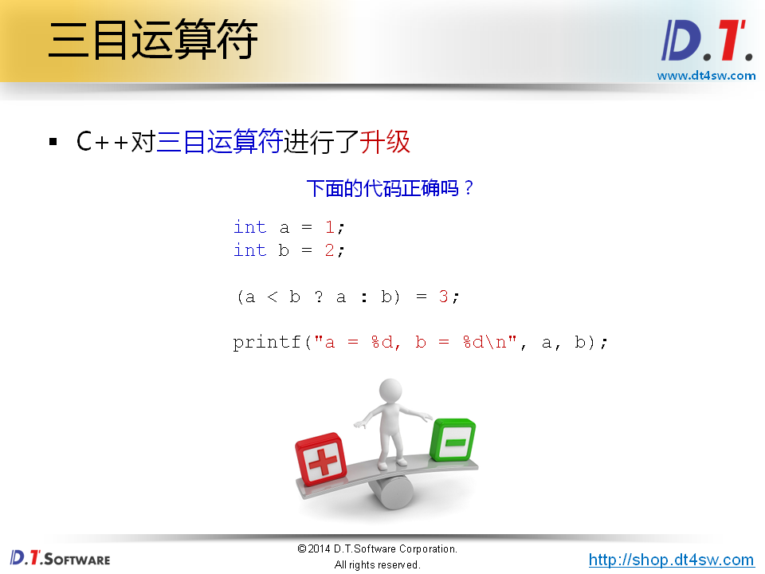
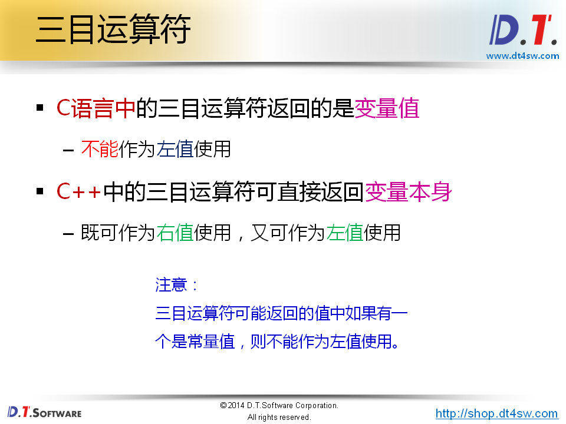
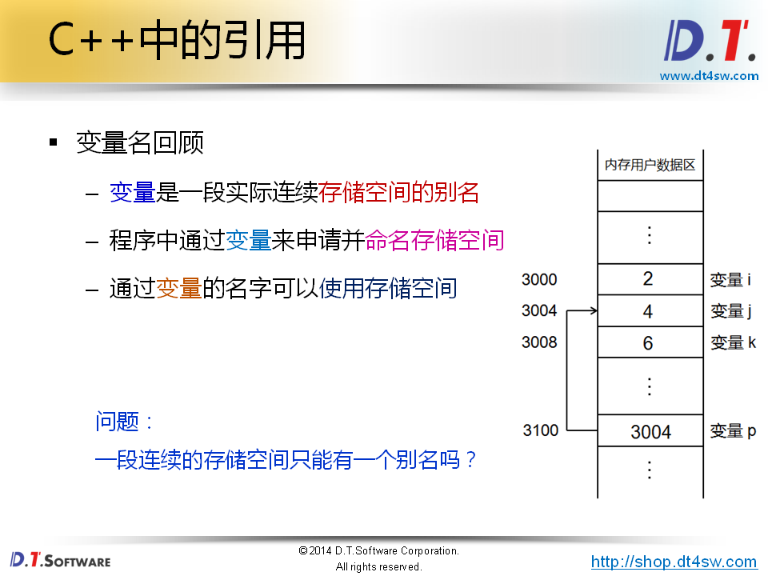
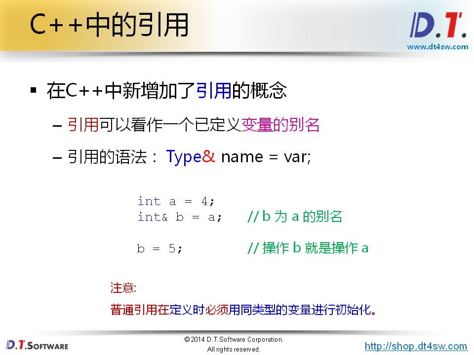
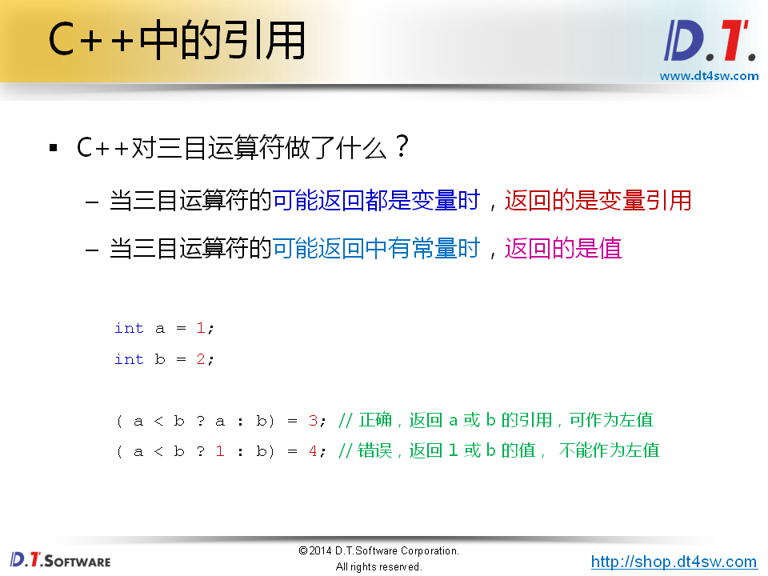
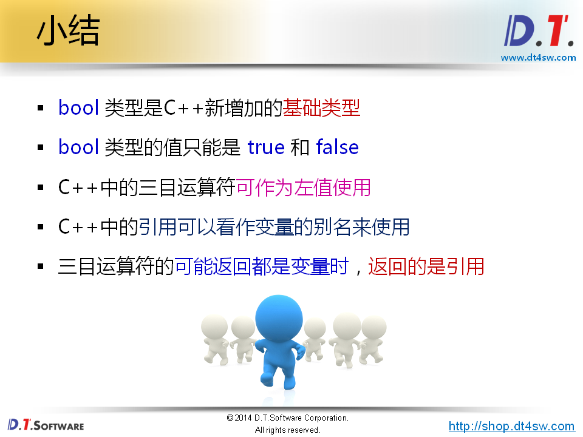

```cpp
true  1
false 0
```



```
b = 0;
bool类型支持数学运算嘛？-》概念上C++ 提供了bool基础类型，但是C++底层依然是用一个整型的一个字节实现的，所以为了支持C语言，它是支持数学运算，但C++编译器将非0值转换为true,0输出为false;
b = 1;
b = 1;
```



```cpp
#include <stdio.h>

int main(int argc, char *argv[])
{
    bool b = false; // 0
    int a = b;      // 0
    
    printf("sizeof(b) = %d\n", sizeof(b));  // 1
    printf("b = %d, a = %d\n", b, a);       // 0 0
    
    b = 3;
    a = b;
    
    printf("b = %d, a = %d\n", b, a);  // 1 1
    
    b = -5;
    a = b;
    
    printf("b = %d, a = %d\n", b, a); // 1 1
    
    a = 10;
    b = a;
    
    printf("a = %d, b = %d\n", a, b); // 10 1
    
    a = 0;
    b = a;
    
    printf("a = %d, b = %d\n", a, b); // 0 0
    
    return 0;
}

```






```
gcc 上面的代码不正确 （a < b ? a : b）为一个值
g++ 上面代码是可以的 
a = 3, b = 2
```



```
混搭-》一个是变量一个是常量看编译器行为
(a < b ? a : 2) = 3;
// g++编译不过，和c语言编译的错误信息一样；

```


```
三目运算符都是变量的时候，返回的是变量的本身（关键）。这意味着C++的新的东西->引用
```






**关键是已经定义的变量的别名**


```cpp
#include <stdio.h>

int main(int argc, char *argv[])
{
    int a = 4;
    int& b = a;
    
    b = 5;
    
    printf("a = %d\n", a);
    printf("b = %d\n", b);
    printf("&a = %p\n", &a);
    printf("&b = %p\n", &b);
    
    return 0;
}
 //g++ a = 5
       b = 5;
       &a = 0xbfe54aec;
	   &b = 0xbfe54aec;
// 如果修改引用的类型：
	float& b = a;
// error invalid initalization of reference of type 'float&'类型检测过不了
    float& b = 1;

```



关键点：返回的是引用->可以把它看成变量的本身；




