# 52.C++ 中的抽象类和接口


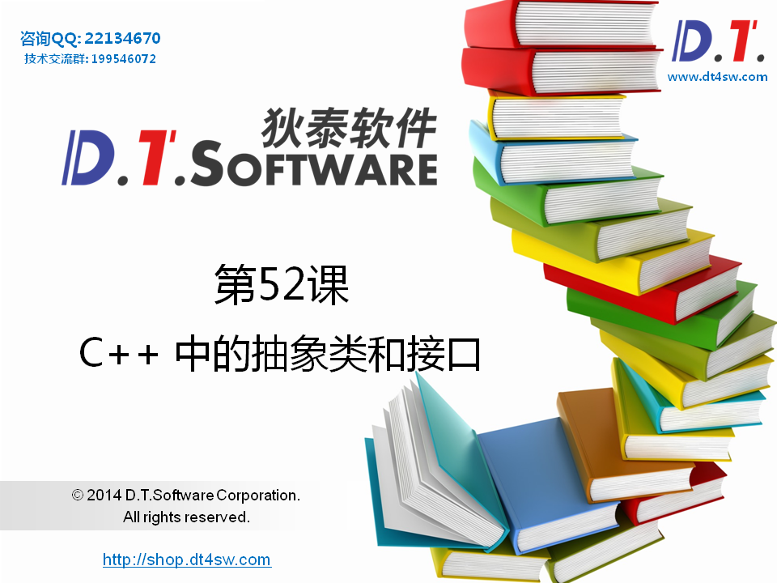


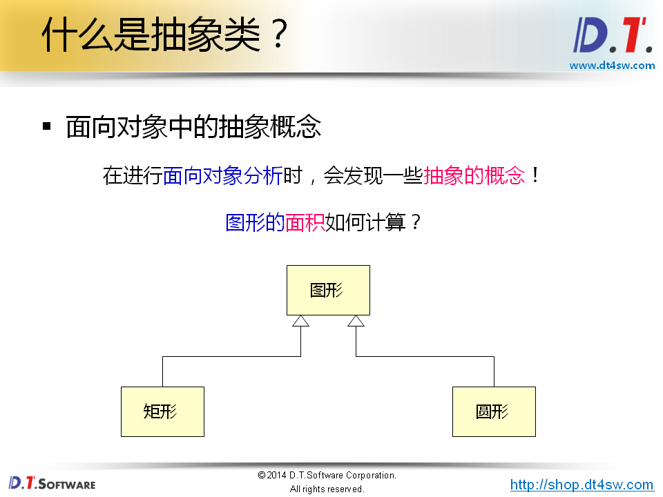


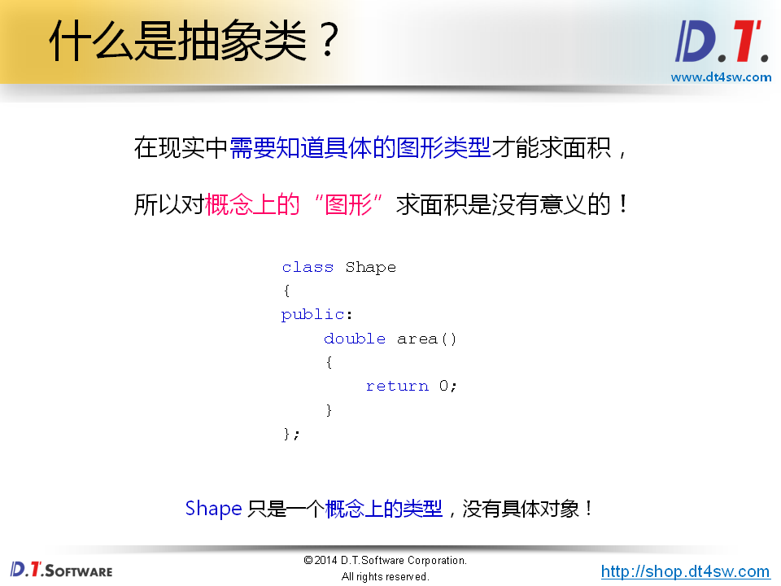


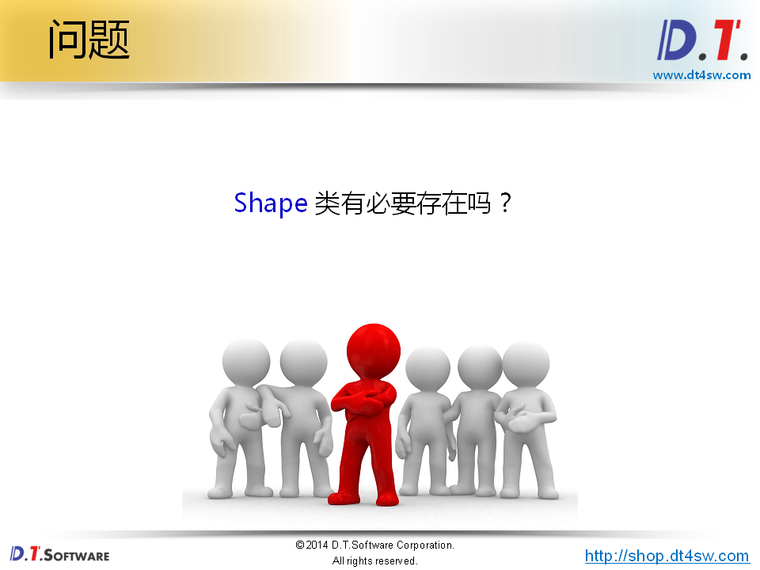


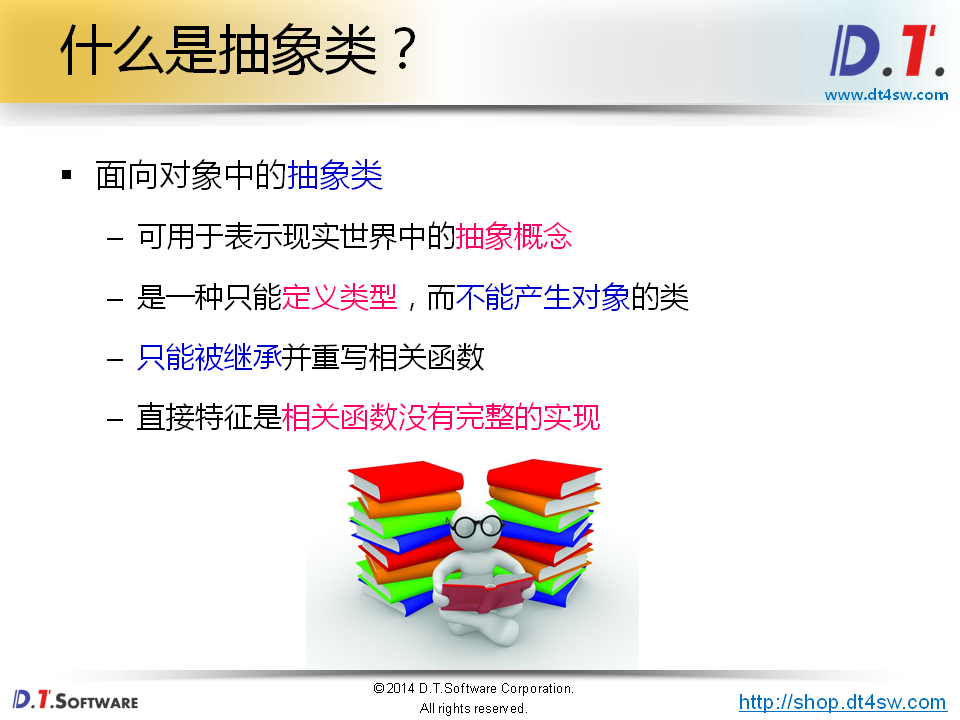

**考虑父类能作为一个抽象类型-》考虑父类有没有必要产生一个对象-》没有-》抽象类**

问题：抽象类被继承时会调用对应的构造顺序？

https://www.zhihu.com/question/54969763

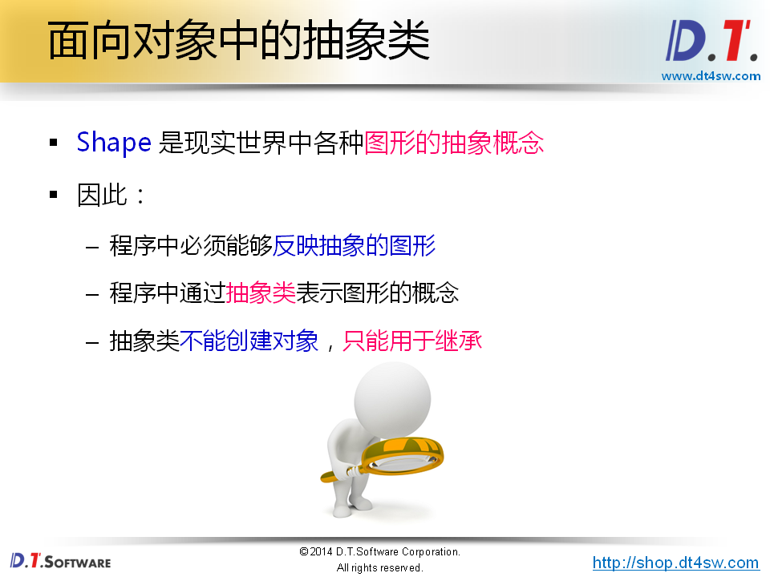

怎么让一个类不生产对象-》纯虚函数

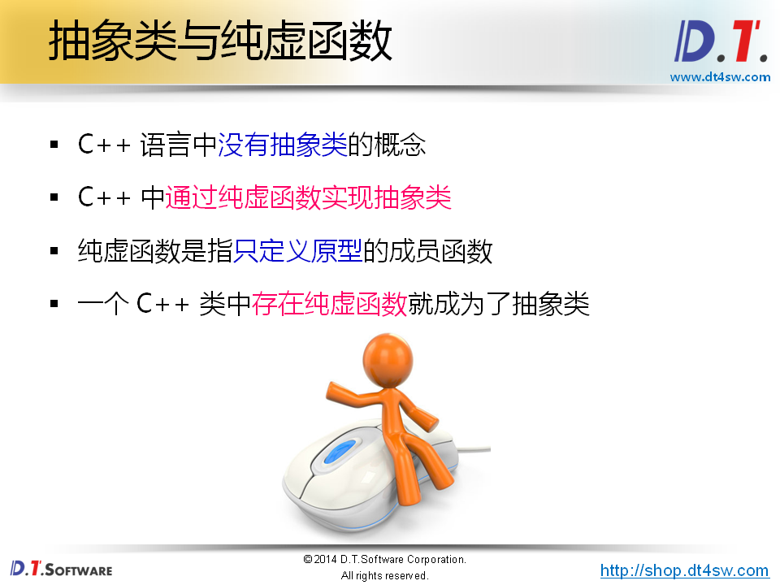


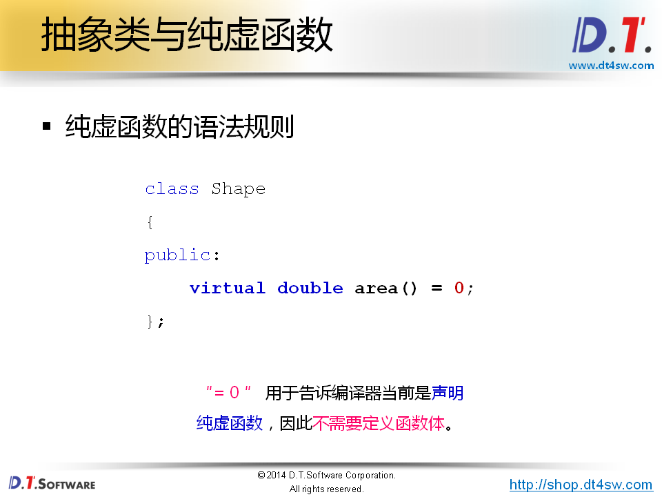


```cpp
#include <iostream>
#include <string>

using namespace std;

class Shape
{
public:
    virtual double area() = 0;
};

class Rect : public Shape
{
    int ma;
    int mb;
public:
    Rect(int a, int b)
    {
        ma = a;
        mb = b;
    }
    double area()
    {
        return ma * mb;
    }
};

class Circle : public Shape
{
    int mr;
public:
    Circle(int r)
    {
        mr = r;
    }
    double area()
    {
        return 3.14 * mr * mr;
    }
};

void area(Shape* p) // 多态
{
    double r = p->area();
    
    cout << "r = " << r << endl;
}

int main()
{
    Rect rect(1, 2);
    Circle circle(10);
    
    area(&rect);
    area(&circle);
    
    return 0;
}

```


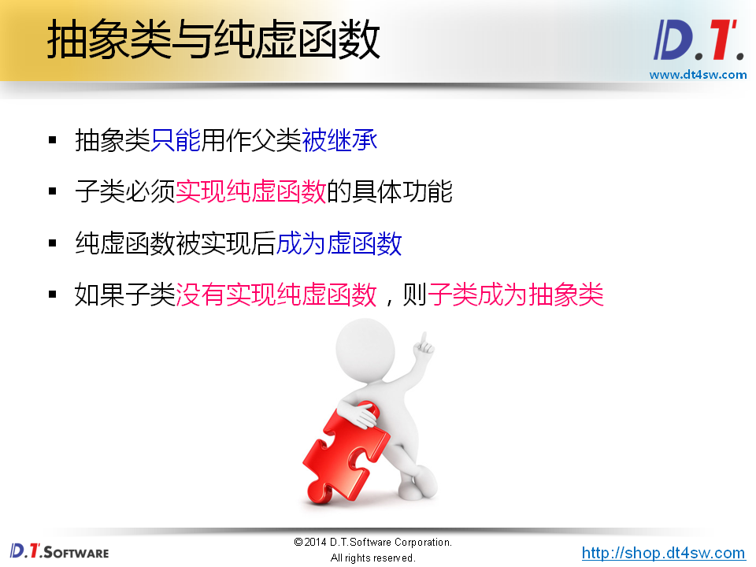


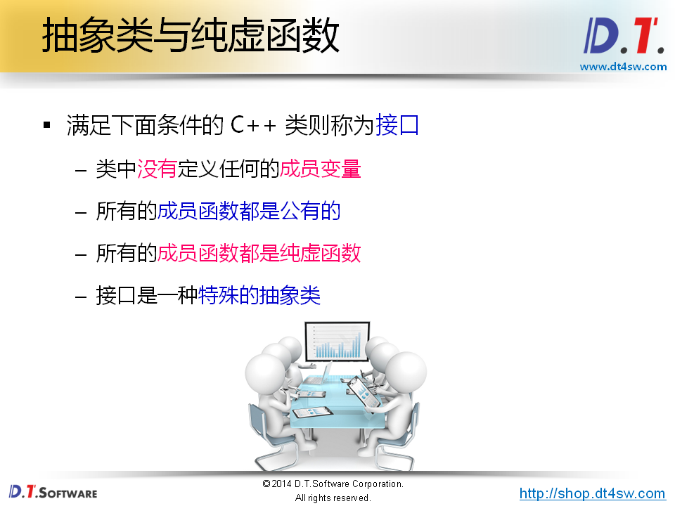


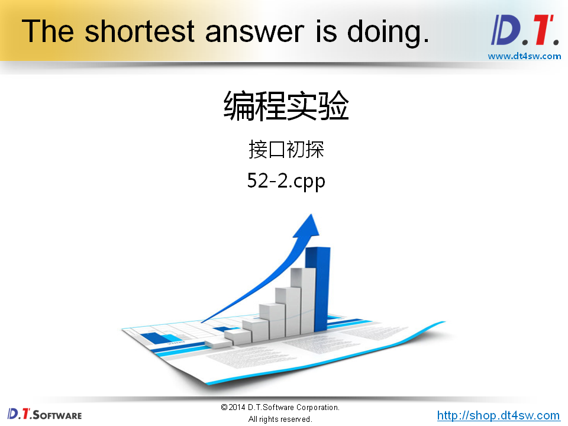

```cpp
#include <iostream>
#include <string>

using namespace std;

class Channel
{
public:
    virtual bool open() = 0;
    virtual void close() = 0;
    virtual bool send(char* buf, int len) = 0;
    virtual int receive(char* buf, int len) = 0;
};

int main()
{
    return 0;
}

```

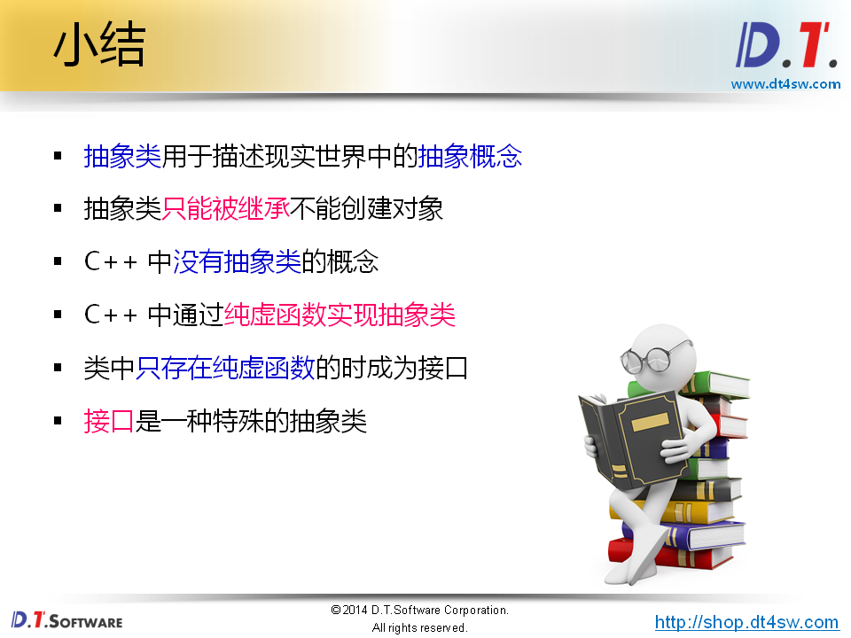