# 55.经典问题解析四


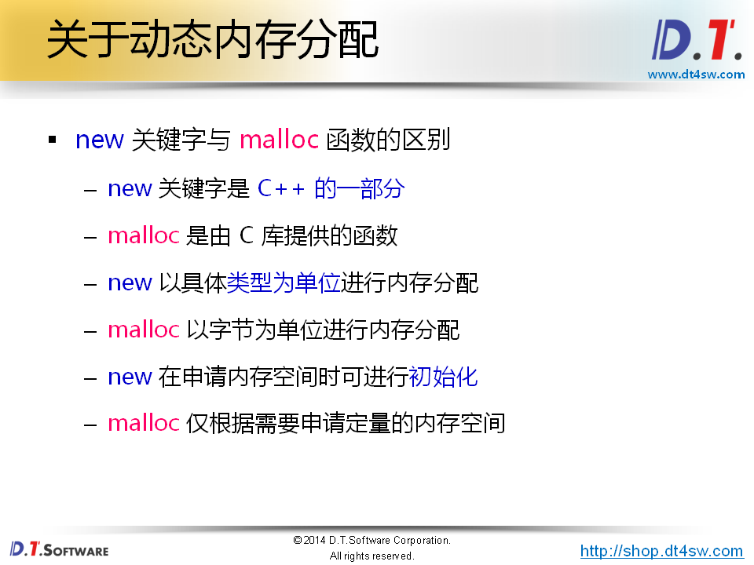

**面试问题：为什么new是关键字？**->核心在于构造和析构


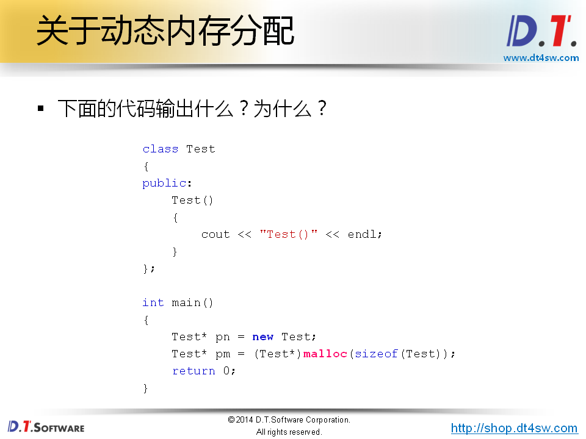

**第一步申请对空间-》第二部在堆空间上面进行调用构造**


```cpp
#include <iostream>
#include <string>
#include <cstdlib>

using namespace std;

class Test
{
    int* mp;
public:
    Test()
    {
        cout << "Test::Test()" << endl;
        
        mp = new int(100);
        
        cout << *mp << endl;
    }
    ~Test()
    {
        delete mp;
        
        cout << "~Test::Test()" << endl;
    }
};

int main()
{
    Test* pn = new Test;
    Test* pm = (Test*)malloc(sizeof(Test));
    
    delete pn;
    free(pm);
    
    return 0;
}

```

**使用C语言不能进行动态内存分配;**

**但是使用c++肯定可以对内存进行分配；new是关键字所以原生支持；**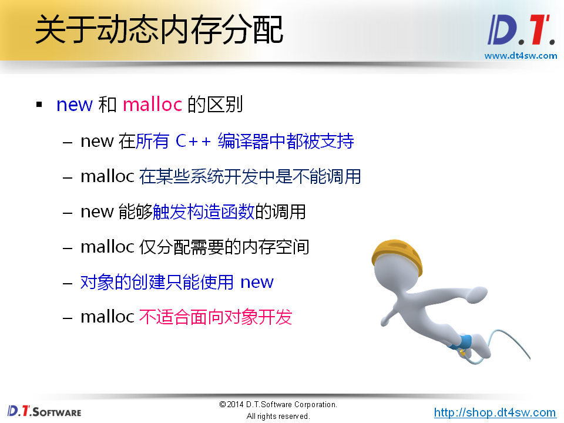

**对象得创建只能用new因为需要调用构造函数**

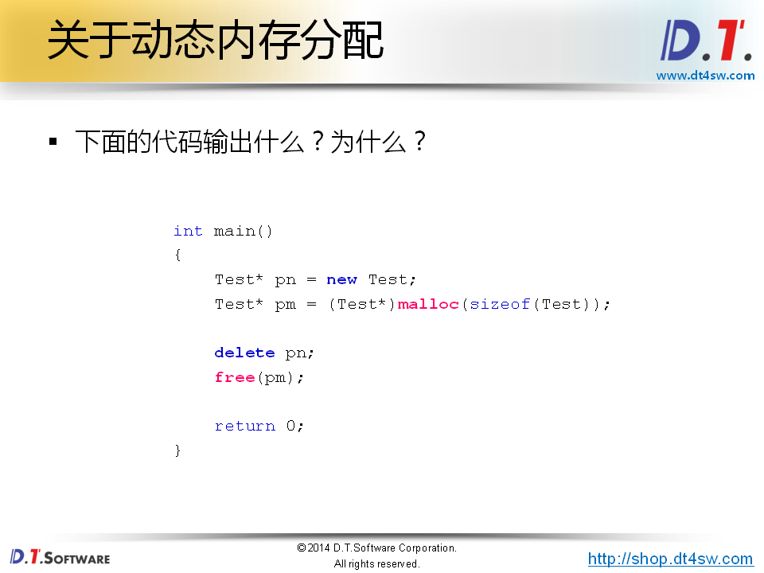

**不要混用，会出现很多问题**

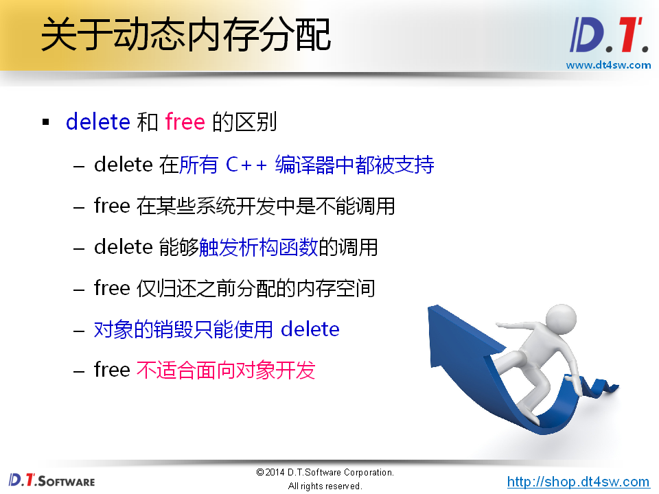

 


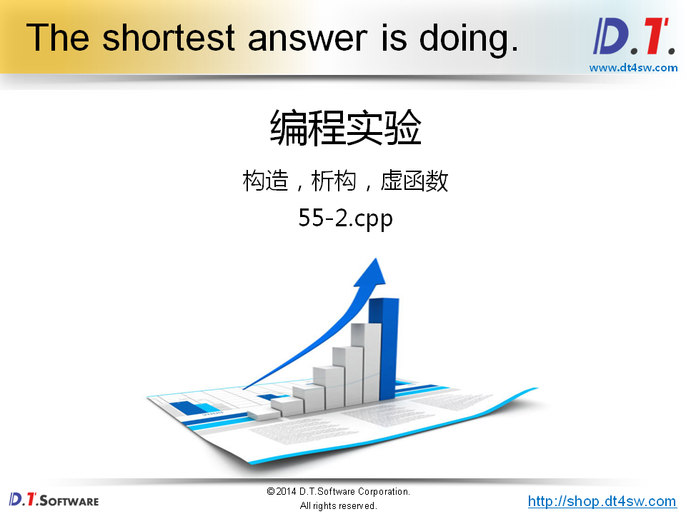

```cpp
#include <iostream>
#include <string>

using namespace std;

class Base
{
public:
    Base()
    {
        cout << "Base()" << endl;
        
        func();
    }
    
    virtual void func() 
    {
        cout << "Base::func()" << endl;
    }
    
    virtual ~Base()
    {
        func();
        
        cout << "~Base()" << endl;
    }
};


class Derived : public Base
{
public:
    Derived()
    {
        cout << "Derived()" << endl;
        
        func();
    }
    
    virtual void func()
    {
        cout << "Derived::func()" << endl;
    }
    
    ~Derived()
    {
        func();
        
        cout << "~Derived()" << endl;
    }
};


int main()
{
    Base* p = new Derived();
    
    // ...
    
    delete p;
    
    return 0;
}

```


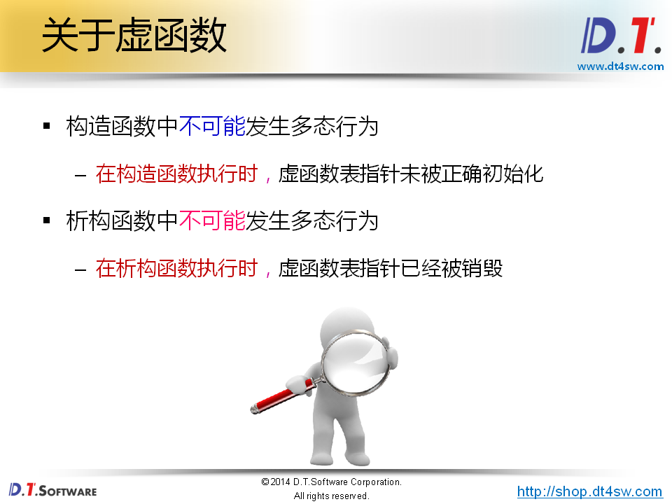


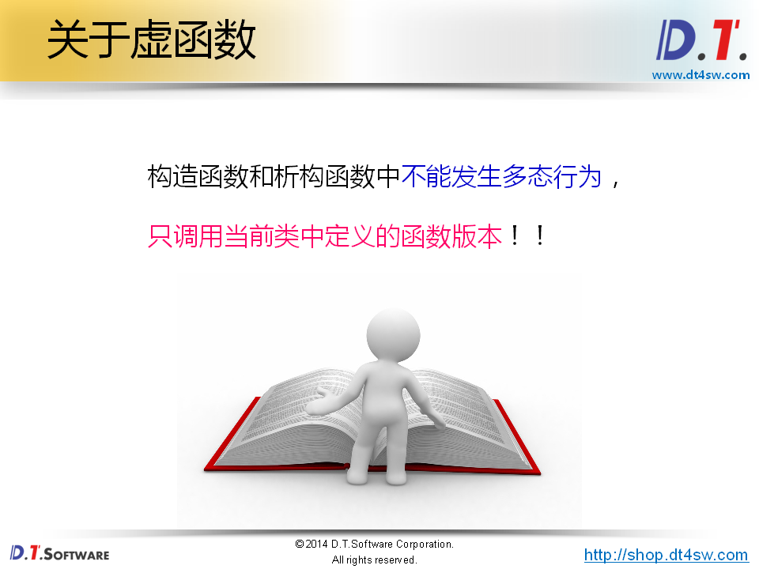


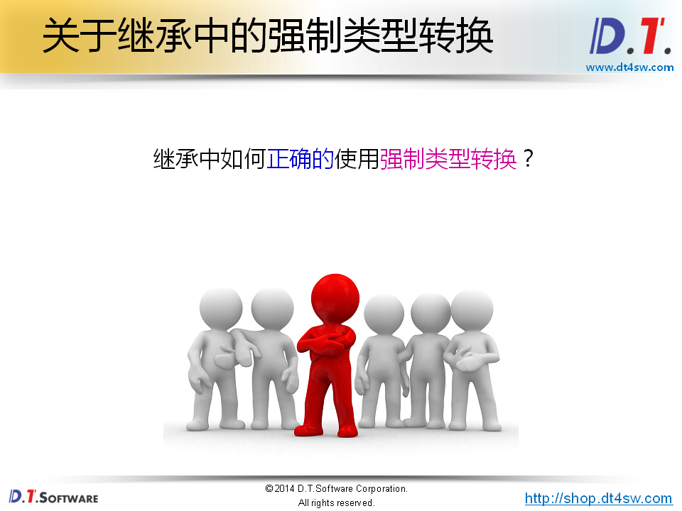


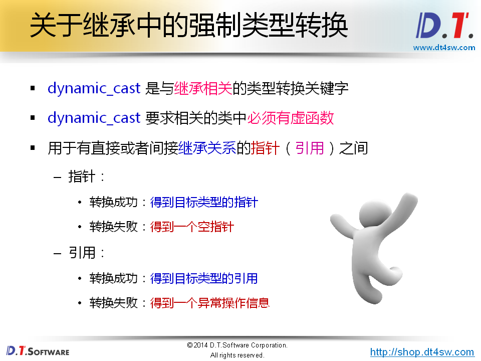


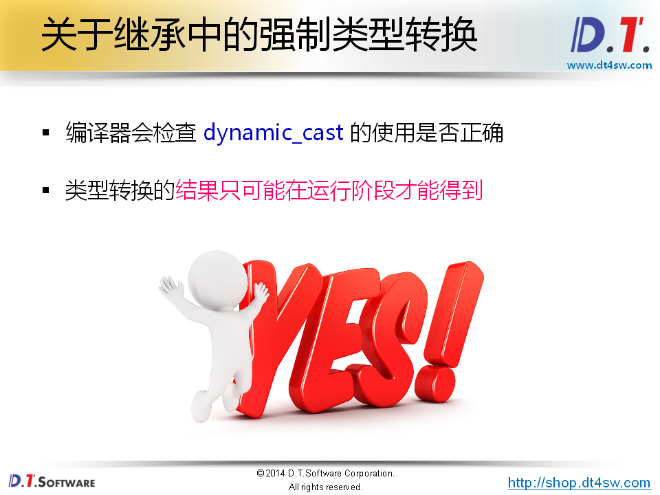


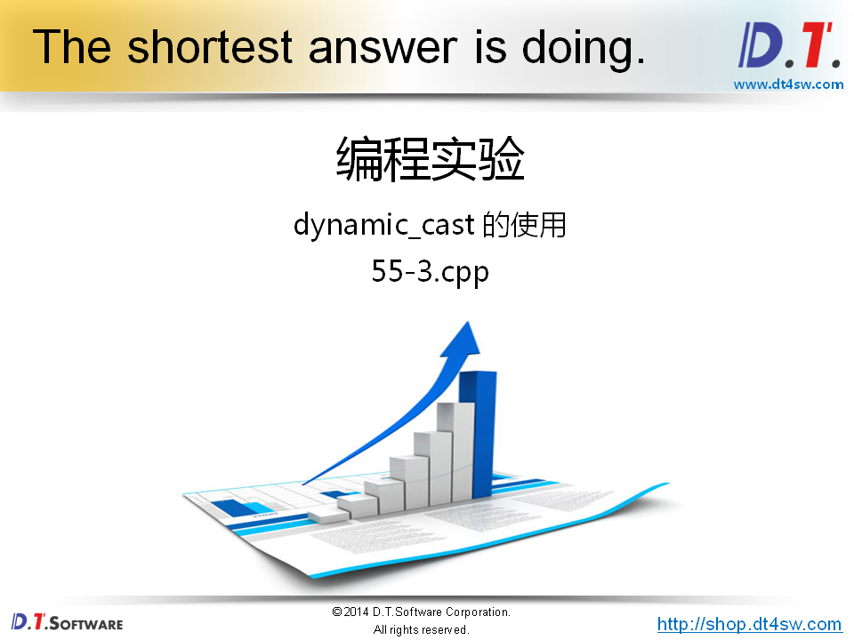

```cpp
#include <iostream>
#include <string>

using namespace std;

class Base
{
public:
    Base()
    {
        cout << "Base::Base()" << endl;
    }
    
    virtual ~Base()
    {
        cout << "Base::~Base()" << endl;
    }
};

class Derived : public Base
{

};

int main()
{
    Base* p = new Base;
    
    Derived* pd = dynamic_cast<Derived*>(p);
    
    if( pd != NULL )
    {
        cout << "pd = " << pd << endl;
    }
    else
    {
        cout << "Cast error!" << endl;
    }
    
    delete p;
    
    return 0;
}


```

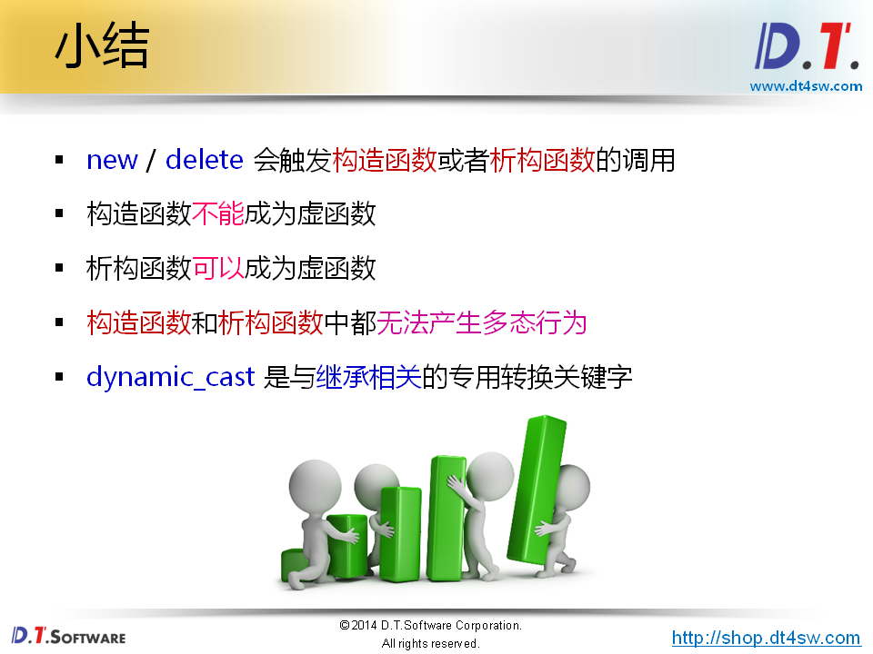