# 56.函数模板的概念和意义


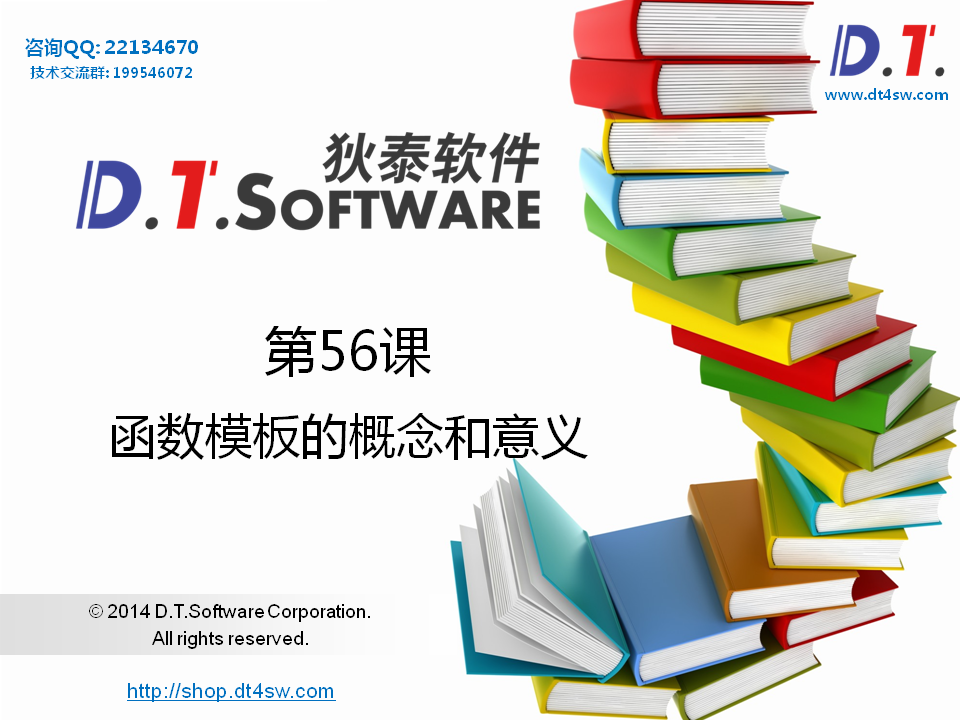


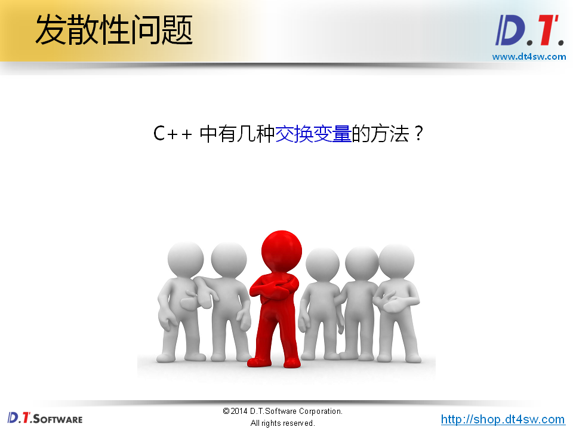


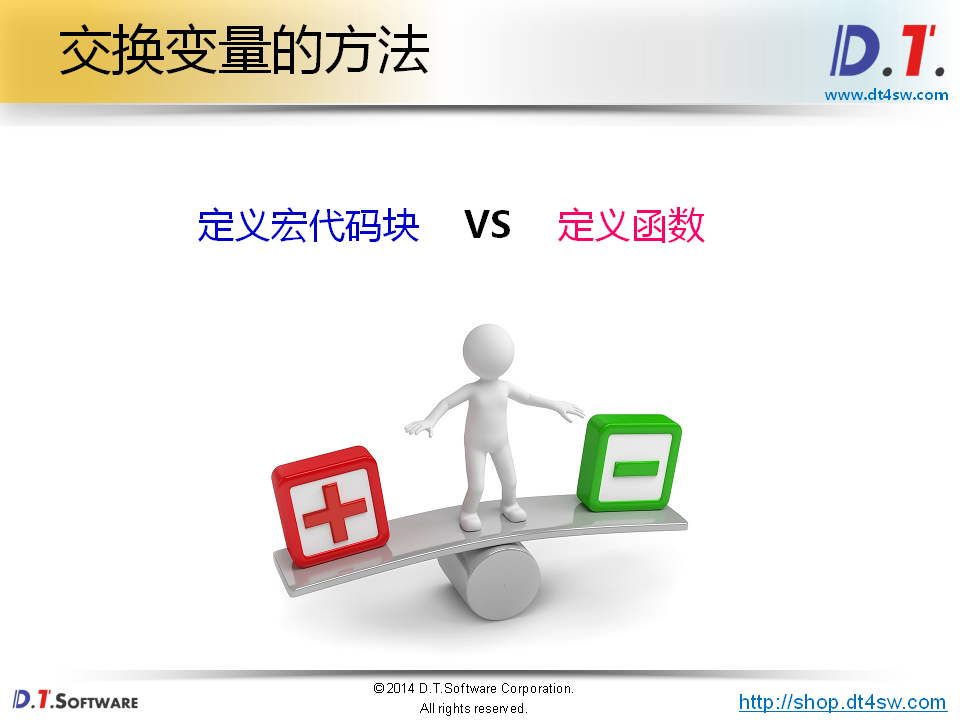


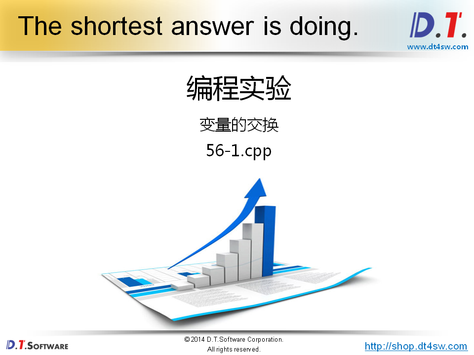

```cpp
#include <iostream>
#include <string>

using namespace std;

#define SWAP(t, a, b)    \
do                       \
{                        \
    t c = a;             \
    a = b;               \
    b = c;               \
}while(0)


void Swap(int& a, int& b)
{
    int c = a;
    a = b;
    b = c;
}

void Swap(double& a, double& b)
{
    double c = a;
    a = b;
    b = c;
}

void Swap(string& a, string& b)
{
    string c = a;
    a = b;
    b = c;
}

int main()
{
    int a = 0;
    int b = 1;
    
    Swap(a, b);
    
    cout << "a = " << a << endl;
    cout << "b = " << b << endl;
    
    double m = 2;
    double n = 3;
    
    Swap(m, n);
    
    cout << "m = " << m << endl;
    cout << "n = " << n << endl;
    
    string d = "Delphi";
    string t = "Tang";
    
    Swap(d, t);
    
    cout << "d = " << d << endl;
    cout << "t = " << t << endl;
    
    return 0;
}


```

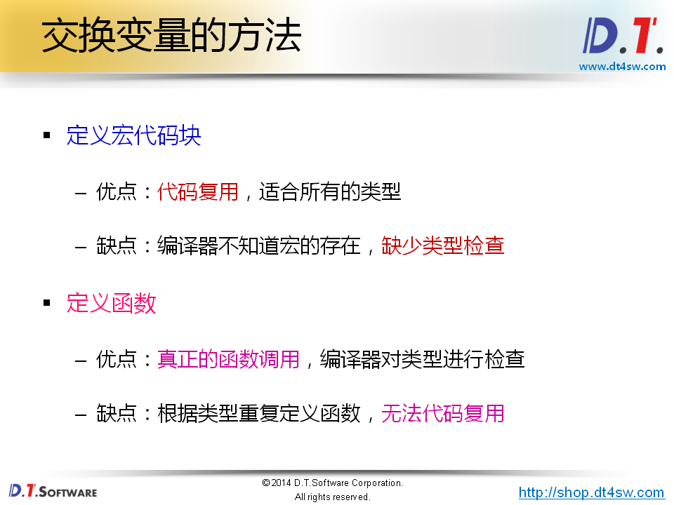


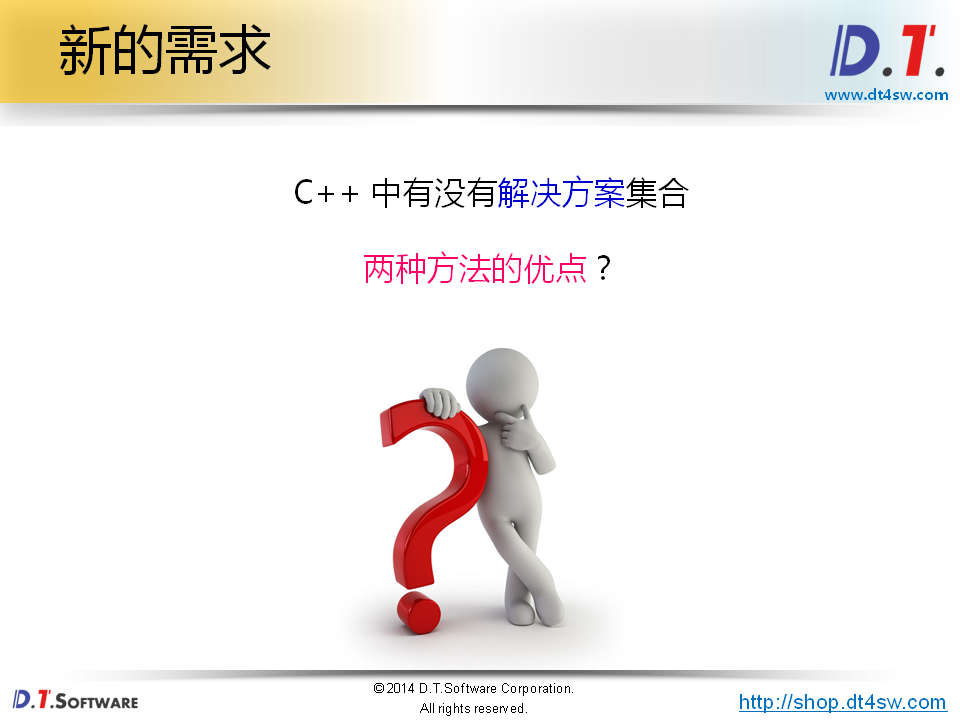


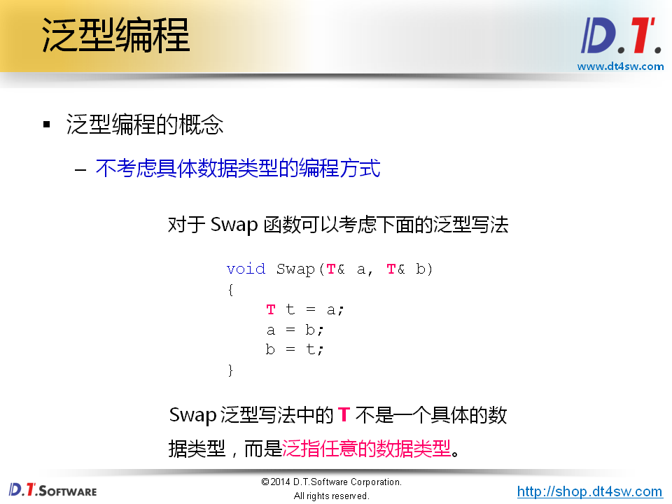


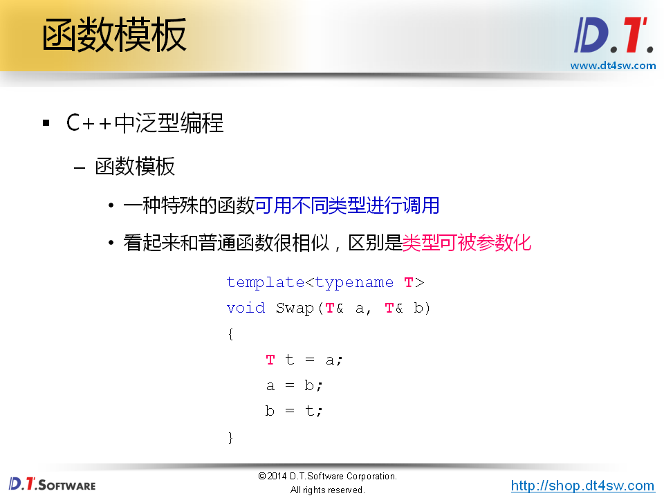


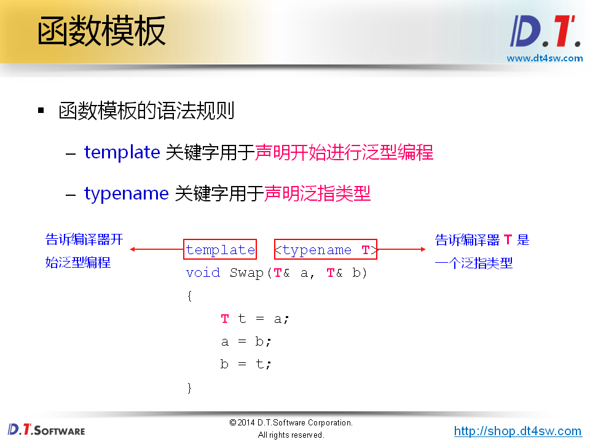


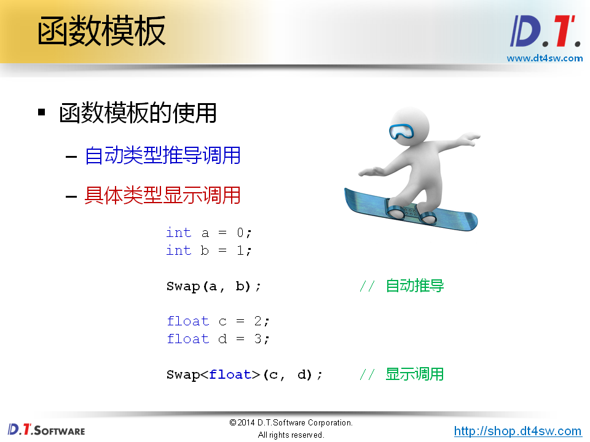


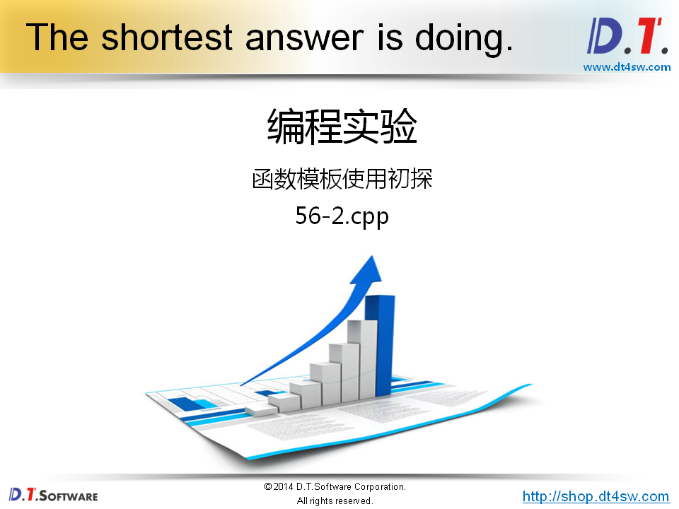

```cpp
#include <iostream>
#include <string>

using namespace std;

template < typename T >
void Swap(T& a, T& b)
{
    T c = a;
    a = b;
    b = c;
}

template < typename T >
void Sort(T a[], int len)
{
    for(int i=0; i<len; i++)
    {
        for(int j=i; j<len; j++)
        {
            if( a[i] > a[j] )
            {
                Swap(a[i], a[j]);
            }
        }
    }
}

template < typename T >
void Println(T a[], int len)
{
    for(int i=0; i<len; i++)
    {
        cout << a[i] << ", ";
    }
    
    cout << endl;
}

int main()
{
    int a[5] = {5, 3, 2, 4, 1};
    
    Println(a, 5);
    Sort(a, 5);
    Println(a, 5);
    
    string s[5] = {"Java", "C++", "Pascal", "Ruby", "Basic"};
    
    Println(s, 5);
    Sort(s, 5);
    Println(s, 5);
    
    return 0;
}


```

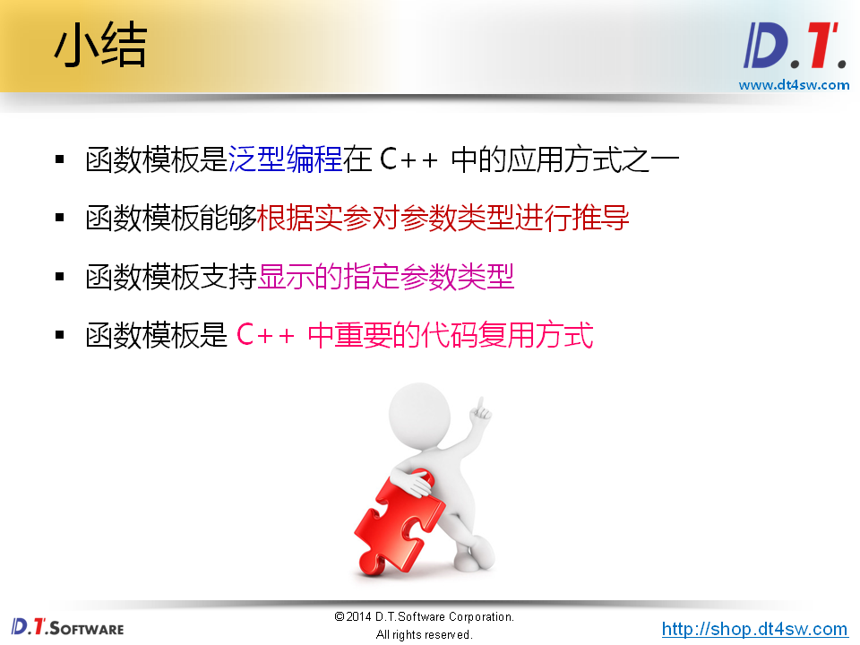