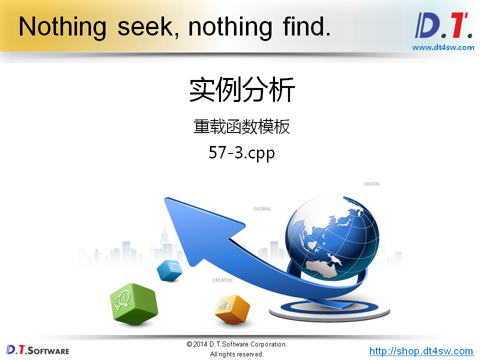

# 57.深入理解函数模板


```cpp
#include <iostream>
#include <string>

using namespace std;

class Test
{
    Test(const Test&);
public:
    Test()
    {
    }
};

template < typename T >
void Swap(T& a, T& b)
{
    T c = a;
    a = b;
    b = c;
}

typedef void(FuncI)(int&, int&);
typedef void(FuncD)(double&, double&);
typedef void(FuncT)(Test&, Test&);

int main()
{
    FuncI* pi = Swap;    // 编译器自动推导 T 为 int
    FuncD* pd = Swap;    // 编译器自动推导 T 为 double
    // FuncT* pt = Swap;    // 编译器自动推导 T 为 Test
    
    cout << "pi = " << reinterpret_cast<void*>(pi) << endl; // 打印得值不一样
    cout << "pd = " << reinterpret_cast<void*>(pd) << endl; // 打印得值不一样
    // cout << "pt = " << reinterpret_cast<void*>(pt) << endl;// 拷贝构造是私有的error
    
    return 0;
}


```


```cpp
#include <iostream>
#include <string>

using namespace std;

template 
< typename T1, typename T2, typename T3 >
T1 Add(T2 a, T3 b)
{
    return static_cast<T1>(a + b);
}


int main()
{
    // T1 = int, T2 = double, T3 = double
    int r1 = Add<int>(0.5, 0.8);

    // T1 = double, T2 = float, T3 = double
    double r2 = Add<double, float>(0.5, 0.8);

    // T1 = float, T2 = float, T3 = float
    float r3 = Add<float, float, float>(0.5, 0.8);

    cout << "r1 = " << r1 << endl;     // r1 = 1
    cout << "r2 = " << r2 << endl;     // r2 = 1.3
    cout << "r3 = " << r3 << endl;     // r3 = 1.3
    
    return 0;
}
```




```cpp
#include <iostream>
#include <string>

using namespace std;


template < typename T >
T Max(T a, T b)
{
    cout << "T Max(T a, T b)" << endl;
    
    return a > b ? a : b;
}

int Max(int a, int b)
{
    cout << "int Max(int a, int b)" << endl;
    
    return a > b ? a : b;
}

template < typename T >
T Max(T a, T b, T c)
{
    cout << "T Max(T a, T b, T c)" << endl;
    
    return Max(Max(a, b), c);
}

int main()
{
    int a = 1;
    int b = 2;
    
    cout << Max(a, b) << endl;                   // 普通函数 Max(int, int)
    
    cout << Max<>(a, b) << endl;                 // 函数模板 Max<int>(int, int)
    
    cout << Max(3.0, 4.0) << endl;               // 函数模板 Max<double>(double, double)
    
    cout << Max(5.0, 6.0, 7.0) << endl;          // 函数模板 Max<double>(double, double, double)
    
    cout << Max('a', 100) << endl;               // 普通函数 Max(int, int)
    
    return 0;
}
```


