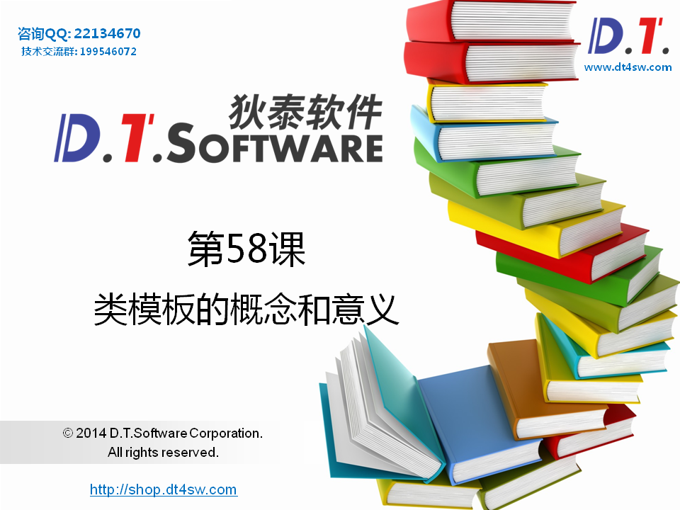
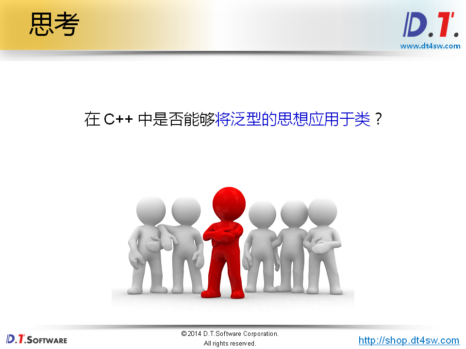
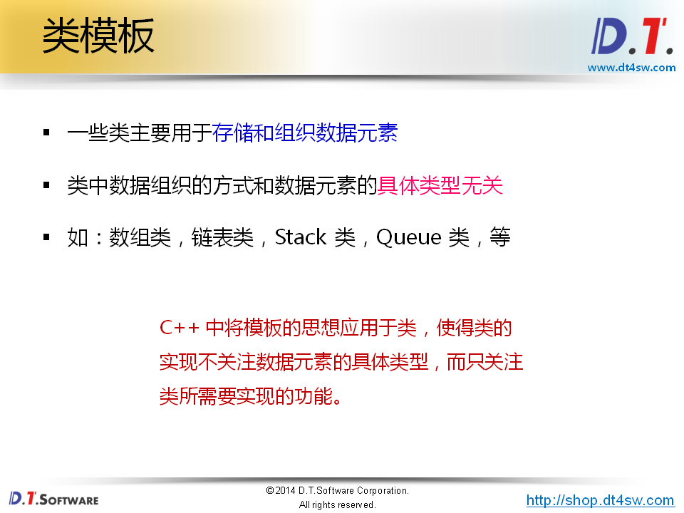
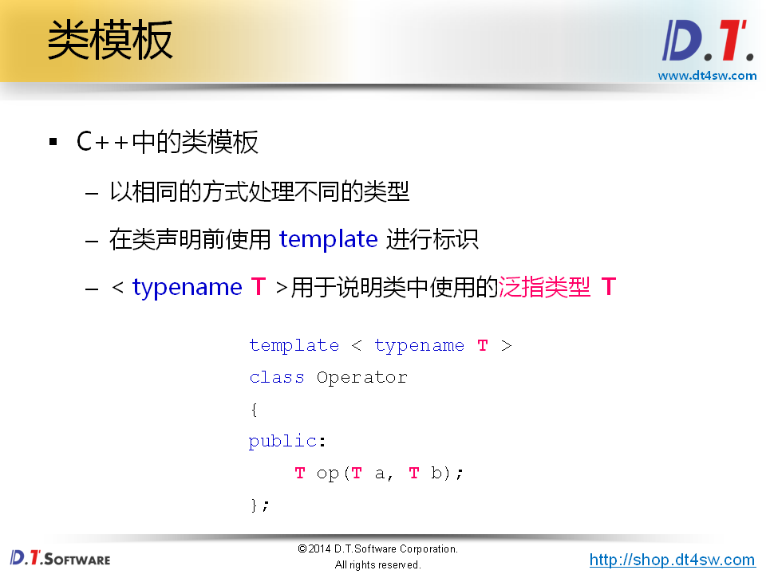
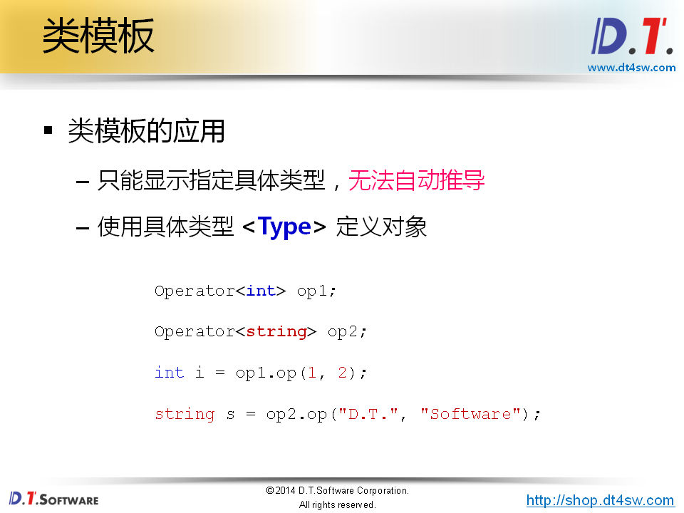
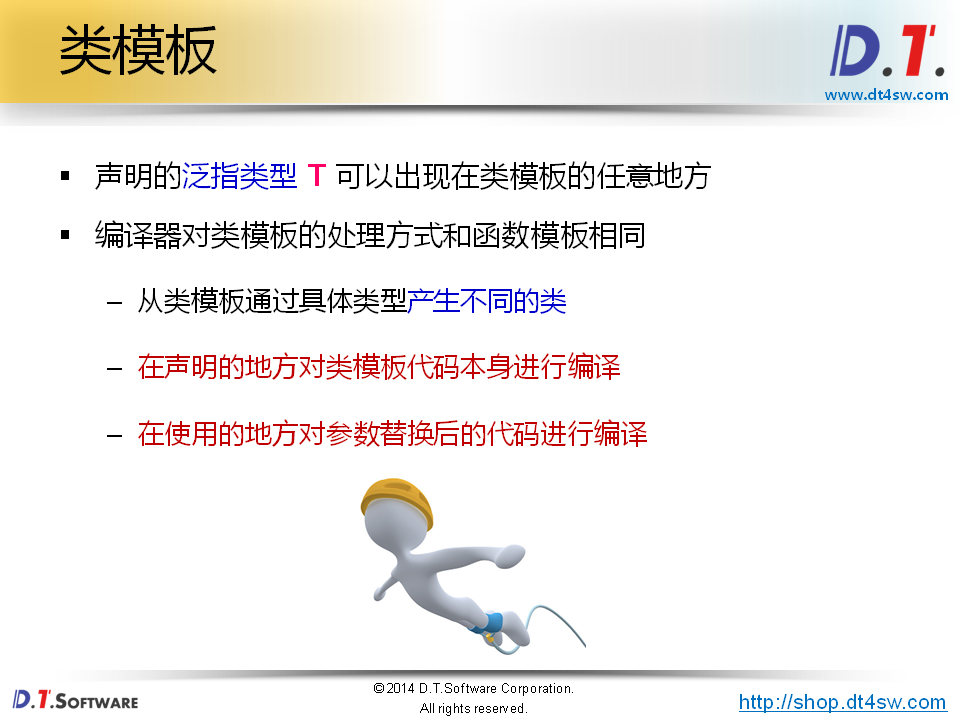
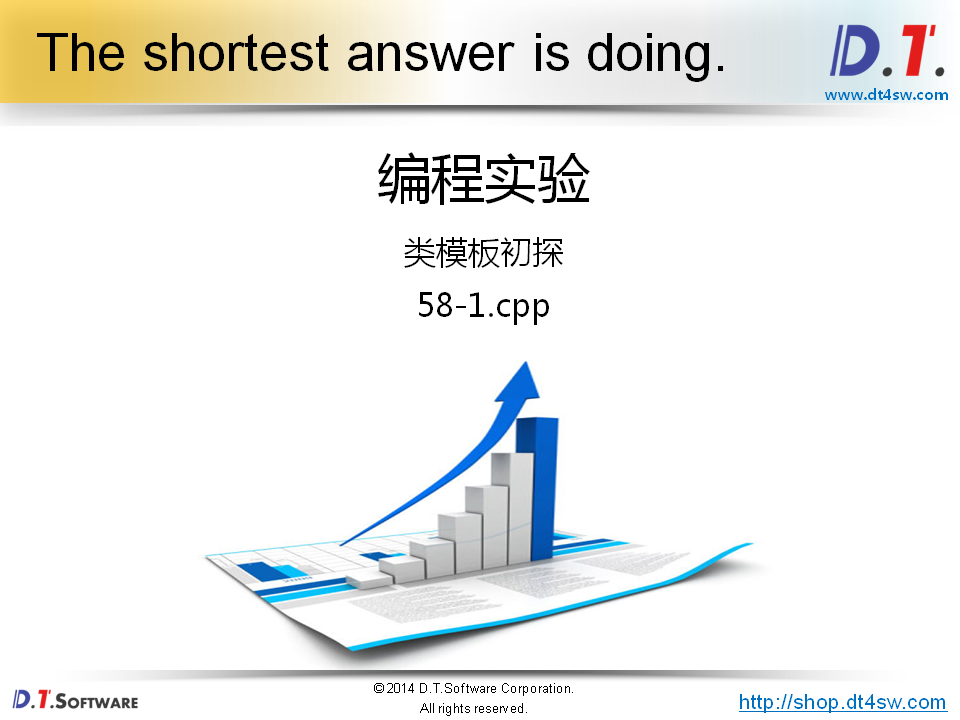
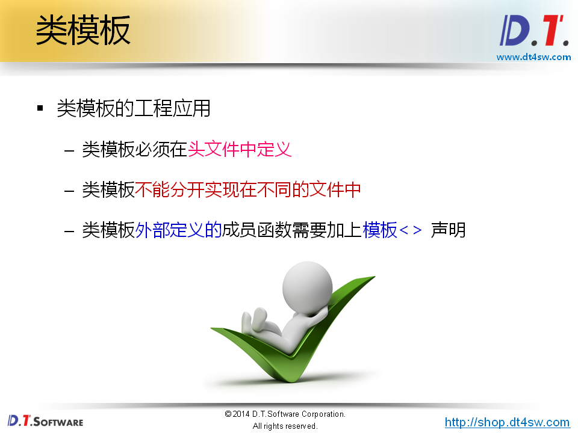
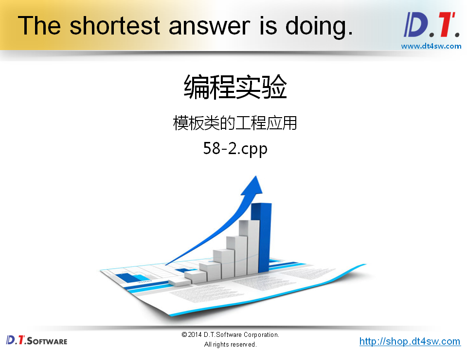
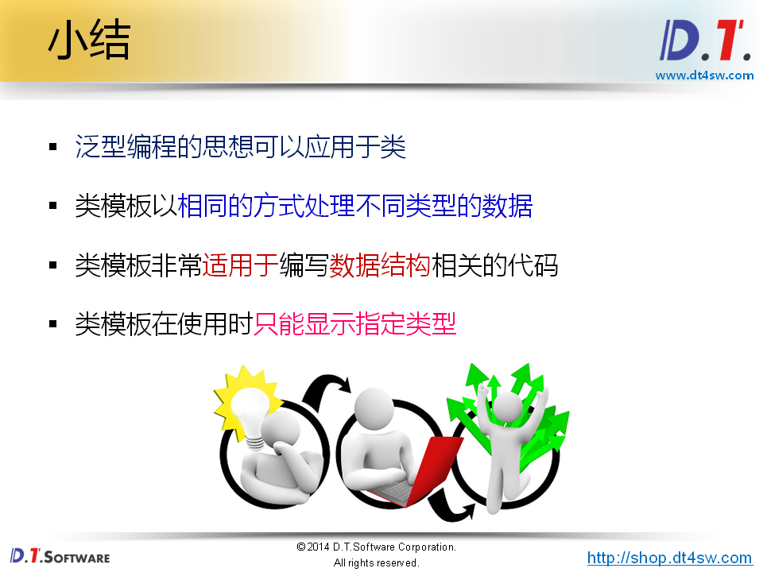

#  58.类模板的概念和意义






















```cpp
#include <iostream>
#include <string>

using namespace std;

template < typename T >
class Operator
{
public:
    T add(T a, T b)
    {
        return a + b;
    }
    T minus(T a, T b)
    {
        return a - b;
    }
    T multiply(T a, T b)
    {
        return a * b;
    }
    T divide(T a, T b)
    {
        return a / b;
    }
};

string operator-(string& l, string& r)
{
    return "Minus";
}

int main()
{
    Operator<int> op1;
    
    cout << op1.add(1, 2) << endl; // 3
    
    Operator<string> op2;
    
    cout << op2.add("D.T.", "Software") << endl;  // "D.T.Software"
    cout << op2.minus("D.T", "Software") << endl; // "Minus"
    
    return 0;
}
```






```cpp
#ifndef _OPERATOR_H_
#define _OPERATOR_H_

template < typename T >
class Operator
{
public:
    T add(T a, T b);
    T minus(T a, T b);
    T multiply(T a, T b);
    T divide(T a, T b);
};

template < typename T >
T Operator<T>::add(T a, T b)
{
    return a + b;
}


template < typename T >
T Operator<T>::minus(T a, T b)
{
    return a - b;
}


template < typename T >
T Operator<T>::multiply(T a, T b)
{
    return a * b;
}


template < typename T >
T Operator<T>::divide(T a, T b)
{
    return a / b;
}

#endif
```

```cpp
#include <iostream>
#include <string>
#include "Operator.h"

using namespace std;


int main()
{
    Operator<int> op1;
    
    cout << op1.add(1, 2) << endl;
    cout << op1.multiply(4, 5) << endl;
    cout << op1.minus(5, 6) << endl;
    cout << op1.divide(10, 5) << endl;
    
    return 0;
}
```

