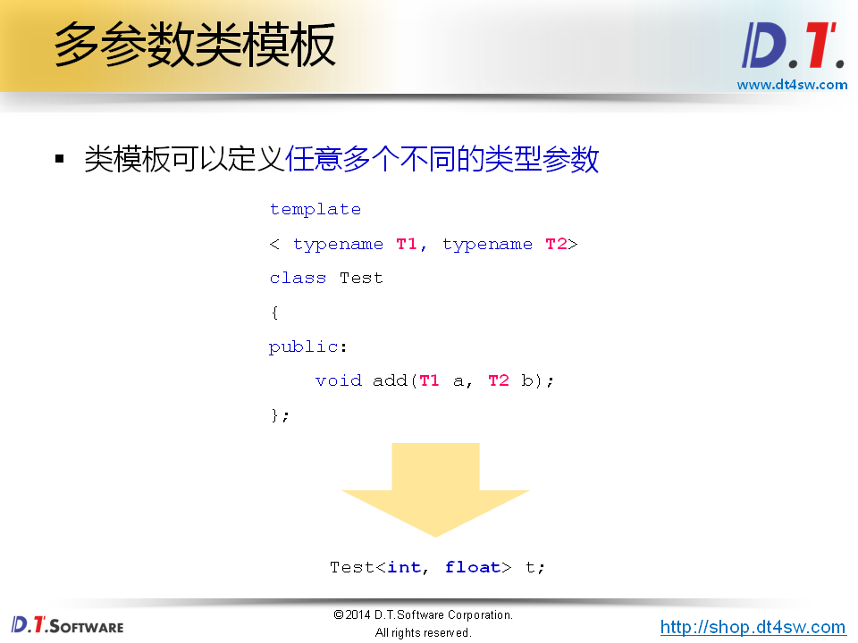
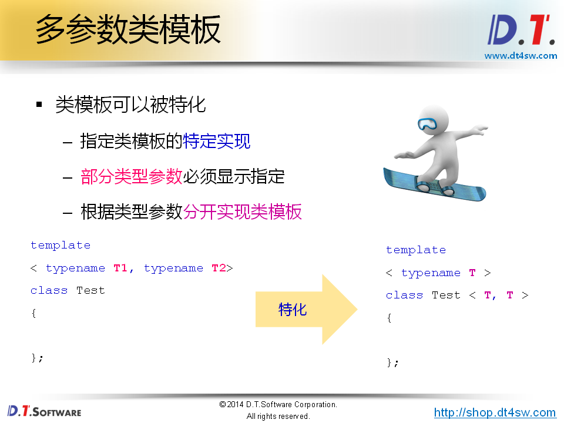
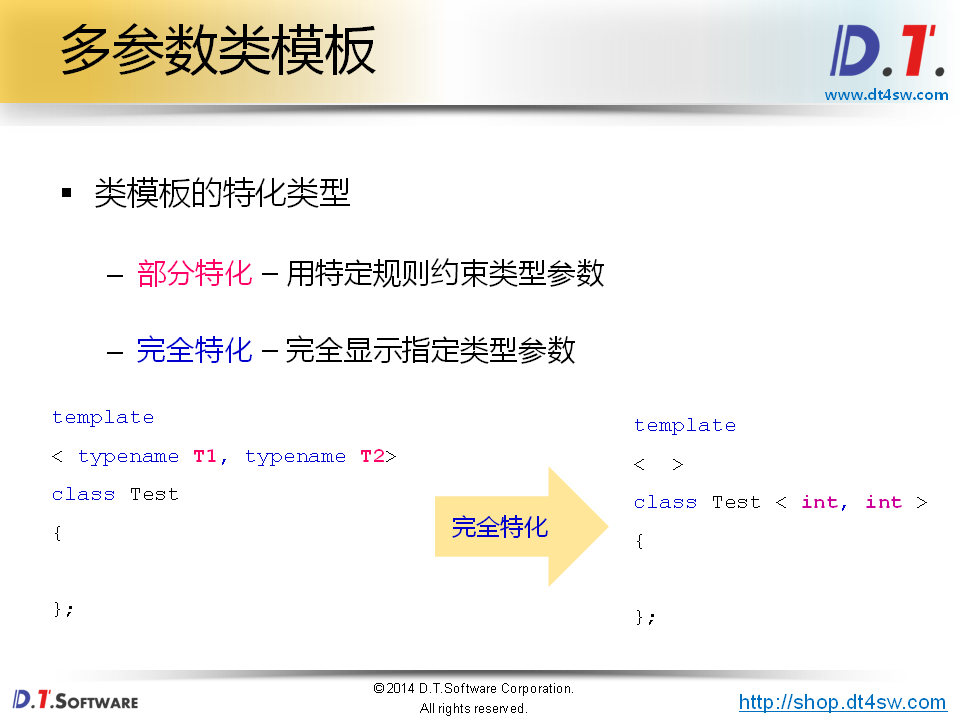
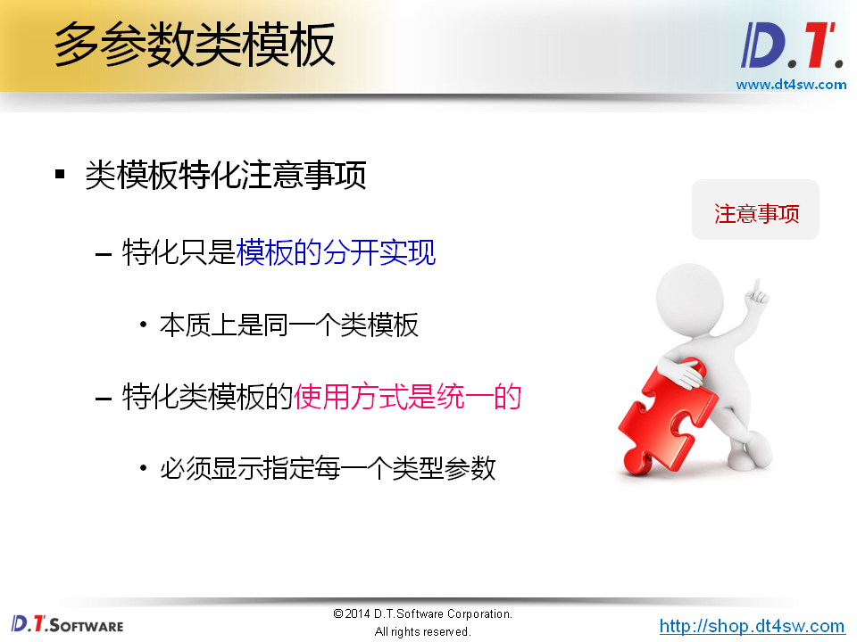
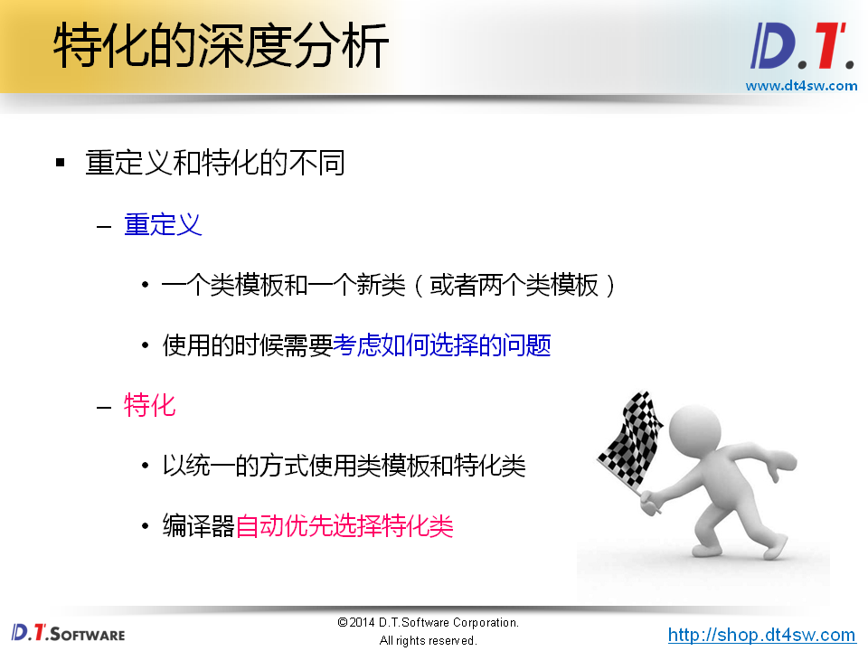
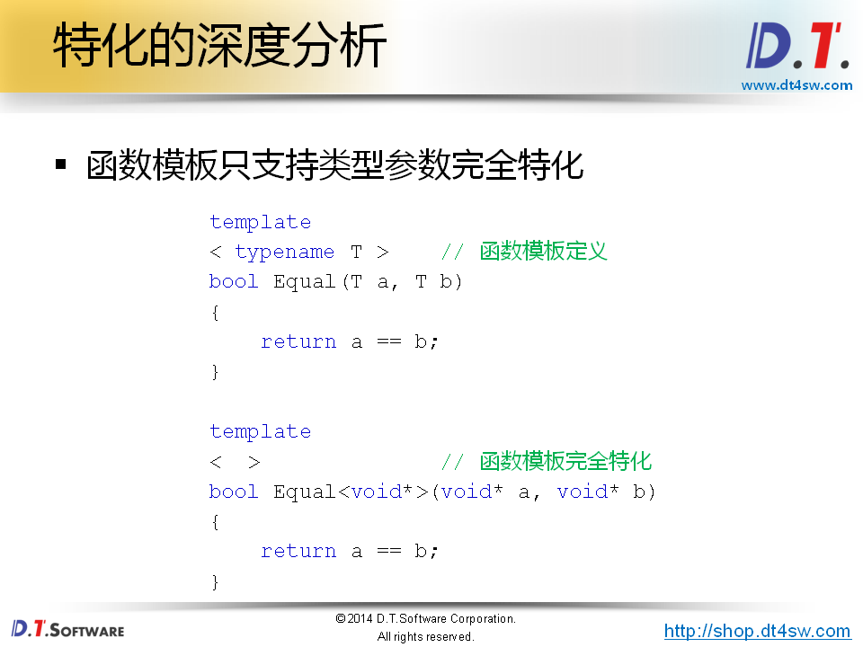
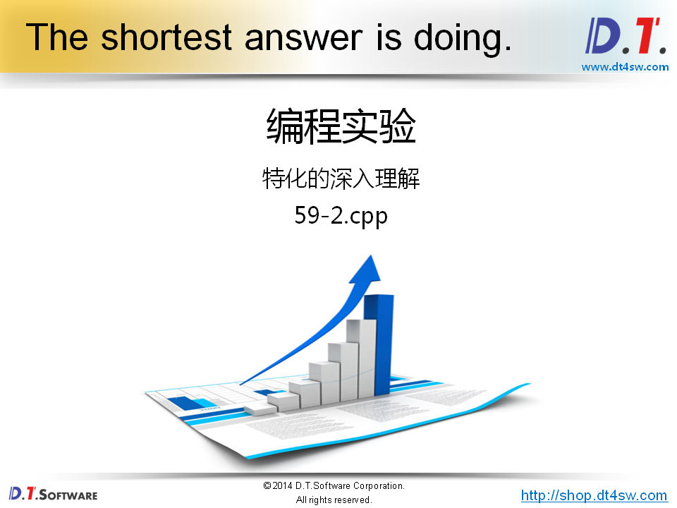
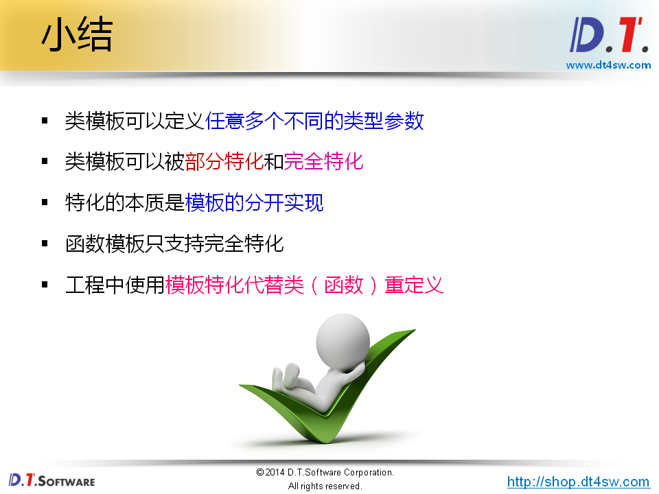

# 59.类模板深度剖析











```cpp
#include <iostream>
#include <string>

using namespace std;

template
< typename T1, typename T2 >
class Test
{
public:
    void add(T1 a, T2 b)
    {
        cout << "void add(T1 a, T2 b)" << endl;
        cout << a + b << endl;
    }
};

template
< typename T1, typename T2 >
class Test < T1*, T2* >      // 关于指针的特化实现
{
public:
    void add(T1* a, T2* b)
    {
        cout << "void add(T1* a, T2* b)" << endl;
        cout << *a + *b << endl;
    }
};

template
< typename T >
class Test < T, T >    // 当 Test 类模板的两个类型参数完全相同时，使用这个实现
{
public:
    void add(T a, T b)
    {
        cout << "void add(T a, T b)" << endl;
        cout << a + b << endl;
    }
    void print()
    {
        cout << "class Test < T, T >" << endl;
    }
};

template
<  >
class Test < void*, void* >    // 当 T1 == void* 并且 T2 == void* 时
{
public:
    void add(void* a, void* b)
    {
        cout << "void add(void* a, void* b)" << endl;
        cout << "Error to add void* param..." << endl;
    }
};

int main()
{  
    Test<int, float> t1;
    Test<long, long> t2;
    Test<void*, void*> t3;
    
    t1.add(1, 2.5); // "void add(T1 a, T2 b)" 
    
    t2.add(5, 5); //  "void add(T a, T b)" 
    t2.print();   //  cout << "class Test < T, T >" << endl;
    
    t3.add(NULL, NULL); //  "void add(void* a, void* b)"
    
    Test<int*, double*> t4;
    int a = 1;
    double b = 0.1;
    
    t4.add(&a, &b); //  void add(T1* a, T2* b)
    
    return 0;
}
```






能做特化的，就别做重定义






```cpp
#include <iostream>
#include <string>

using namespace std;

template
< typename T1, typename T2 >
class Test
{
public:
    void add(T1 a, T2 b)
    {
        cout << "void add(T1 a, T2 b)" << endl;
        cout << a + b << endl;
    }
};

/*
template
<  >
class Test < void*, void* >    // 当 T1 == void* 并且 T2 == void* 时
{
public:
    void add(void* a, void* b)
    {
        cout << "void add(void* a, void* b)" << endl;
        cout << "Error to add void* param..." << endl;
    }
};
*/

class Test_Void
{
public:
    void add(void* a, void* b)
    {
        cout << "void add(void* a, void* b)" << endl;
        cout << "Error to add void* param..." << endl;
    }
};

template
< typename T >
bool Equal(T a, T b)
{
    cout << "bool Equal(T a, T b)" << endl;
    
    return a == b;
}

template
< >
bool Equal<double>(double a, double b)
{
    const double delta = 0.00000000000001;
    double r = a - b;
    
    cout << "bool Equal<double>(double a, double b)" << endl;
    
    return (-delta < r) && (r < delta);
}

bool Equal(double a, double b)
{
    const double delta = 0.00000000000001;
    double r = a - b;
    
    cout << "bool Equal(double a, double b)" << endl;
    
    return (-delta < r) && (r < delta);
}

int main()
{  
    cout << Equal( 1, 1 ) << endl;
    cout << Equal<>( 0.001, 0.001 ) << endl;
    
    return 0;
}
```


