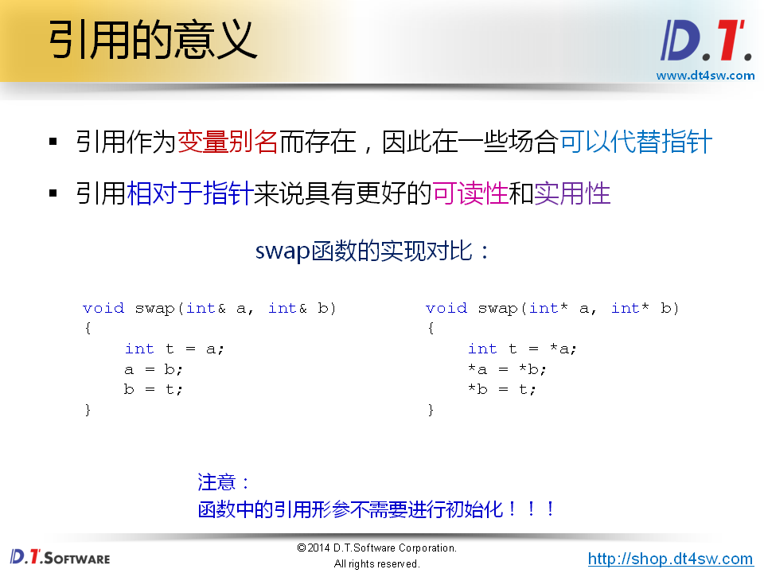
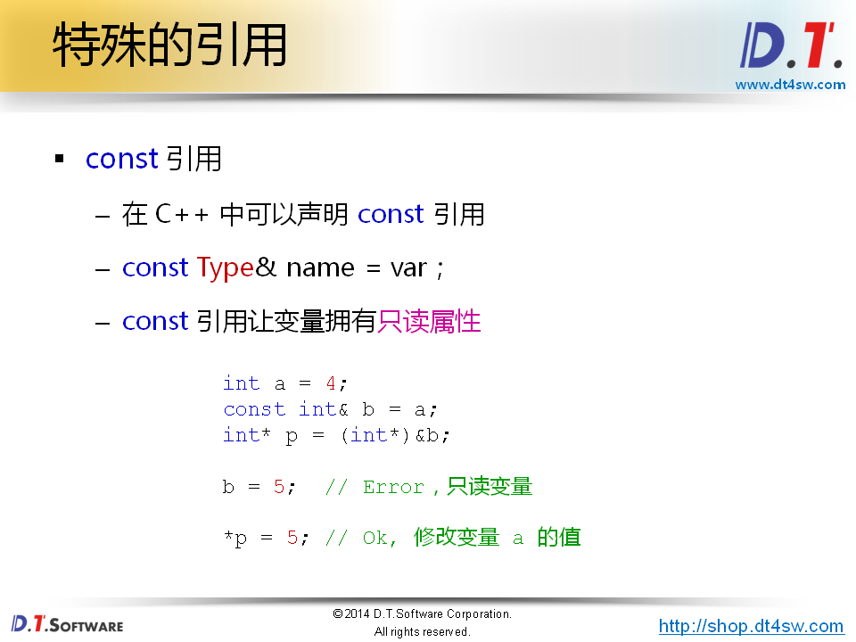
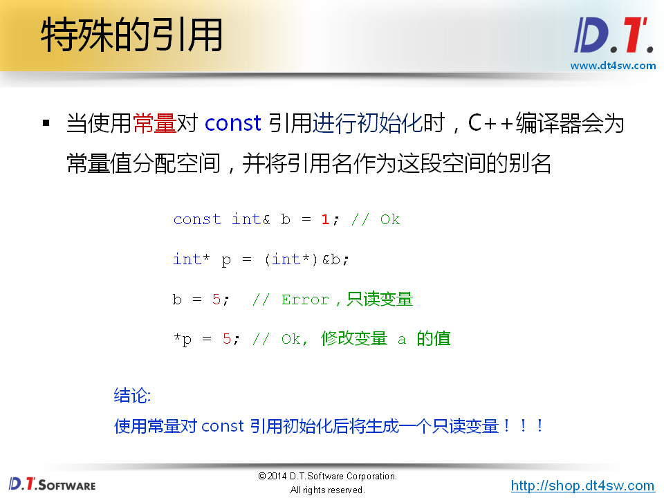
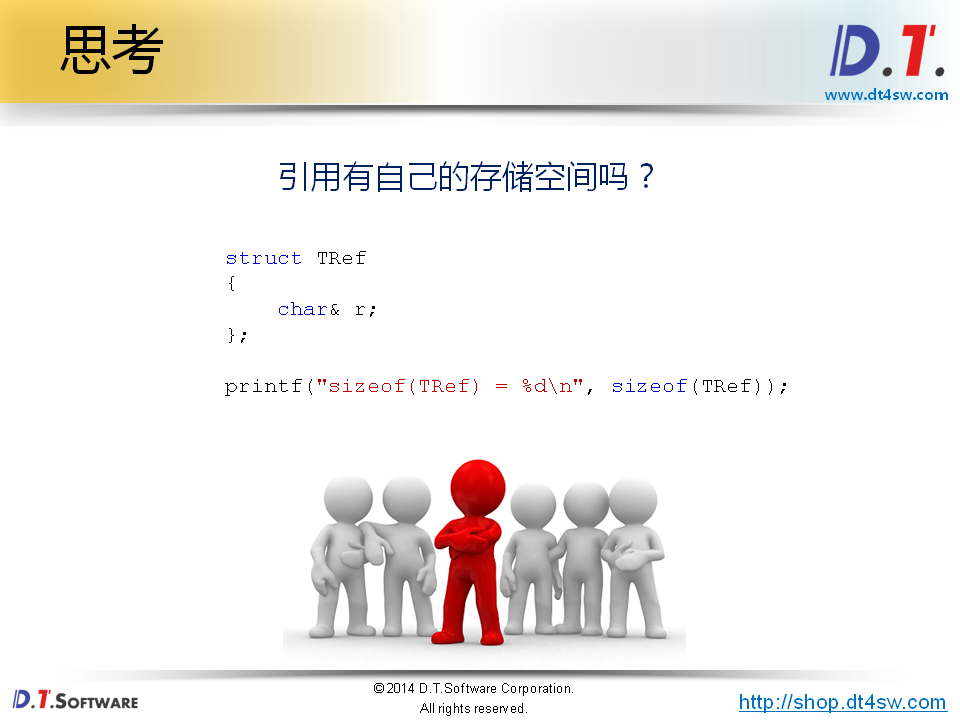
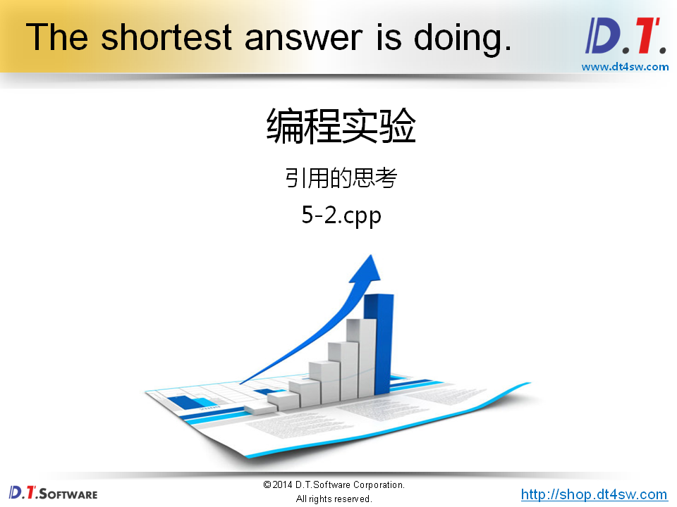
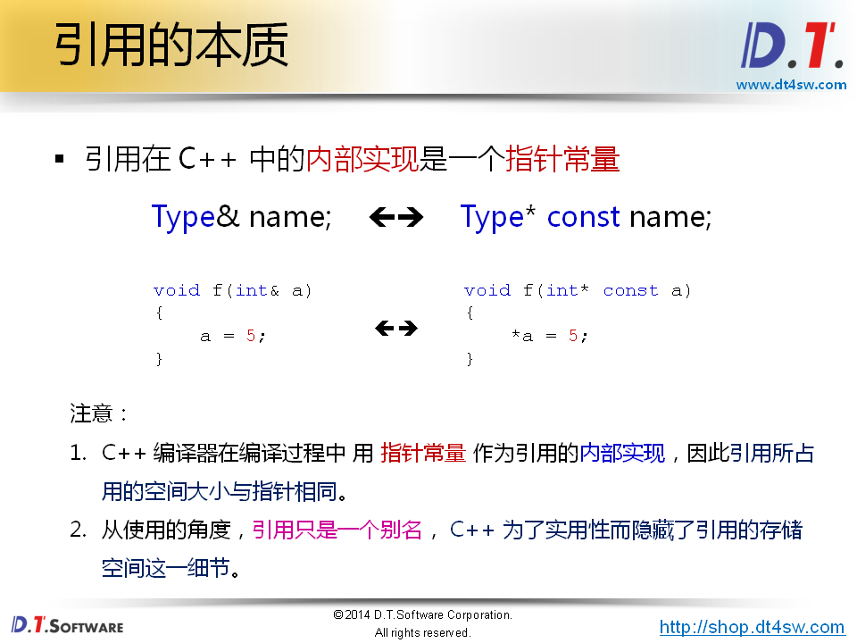
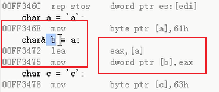
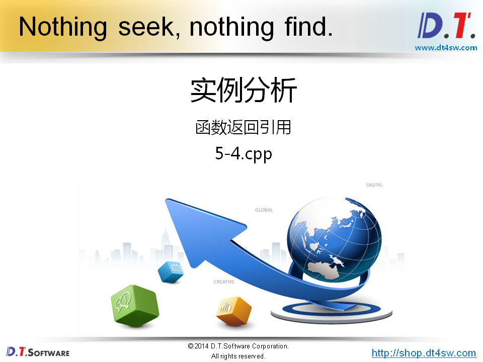
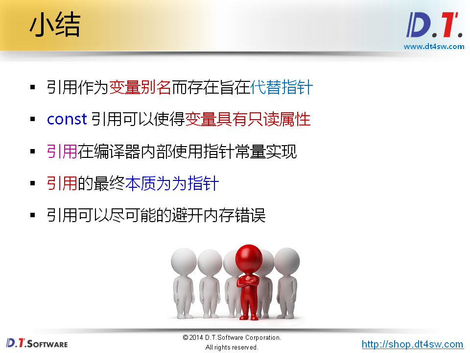

#  引用的本质分析




 **引用参数->不用初始化，初始化发生在函数调用的时候** **知识点是引用必须一开始初始化引用参数确不需要**

**引用绝对不能是一个常量的别名**




```cpp
#include <stdio.h>

void Example()
{
    printf("Example:\n");
    
    int a = 4;
    const int& b = a;
    int* p = (int*)&b;
    
    //b = 5;
    
    *p = 5;
    
    printf("a = %d\n", a);
    printf("b = %d\n", b);
}

void Demo()
{
    printf("Demo:\n");
    
    const int& c = 1;
    int* p = (int*)&c;
    
    //c = 5;
    
    *p = 5;
    
    printf("c = %d\n", c);
}

int main(int argc, char *argv[])
{
    Example();
    
    printf("\n");
    
    Demo();

    return 0;
}

output:
	Example:
	a = 5;
    b = 5;
    Demo:
	c = 5; 
// 去掉 // b Exmple error assignment of read-only reference 'b'
// 去掉 demo Exmple error assignment of read-only reference 'c'
```

```cpp
c++中只读变量 定义一个const变量即可
```



```cpp
#include <stdio.h>

struct TRef
{
    char& r;
};

int main(int argc, char *argv[])
{ 
    char c = 'c';
    char& rc = c;
    TRef ref = { c };
    
    printf("sizeof(char&) = %d\n", sizeof(char&)); // 1 求对应变量的大小
    printf("sizeof(rc) = %d\n", sizeof(rc));       // sizeof(c) => 1
    
    printf("sizeof(TRef) = %d\n", sizeof(TRef));   // 0 ? 打印4-》引用和指针是不是有关系；底层实现是指针，所以和指针大小类似
    printf("sizeof(ref.r) = %d\n", sizeof(ref.r)); // sizeof(c) =>1

    return 0;
}

```







```cpp
#include <stdio.h>

struct TRef
{
    char* before;
    char& ref;
    char* after;
};

int main(int argc, char* argv[])
{
    char a = 'a';
    char& b = a;
    char c = 'c';

    TRef r = {&a, b, &c};

    printf("sizeof(r) = %d\n", sizeof(r));   // 12
    printf("sizeof(r.before) = %d\n", sizeof(r.before)); // 4
    printf("sizeof(r.after) = %d\n", sizeof(r.after)); // 4
    printf("&r.before = %p\n", &r.before); // 0xbf8a300c
    printf("&r.after = %p\n", &r.after);   // 0xbf8a3014

    return 0;
}

```



**b将a的地址，保存到它的里面里面--》这讲就是指针的行为呀！！！！**




```cpp
#include <stdio.h>

// 返回局部变量的引用是不允许的 int* const
int& demo()
{
    int d = 0;
    
    printf("demo: d = %d\n", d);
    
    return d; // return &d; 返回局部变量的地址
}

int& func()
{
    static int s = 0;
    
    printf("func: s = %d\n", s);
    
    return s; // 这个是没有问题的
}

int main(int argc, char* argv[])
{
    int& rd = demo();
    int& rs = func();
    
    printf("\n");
    printf("main: rd = %d\n", rd);
    printf("main: rs = %d\n", rs);
    printf("\n");
    
    rd = 10;
    rs = 11;
    
    demo();
    func();
    
    printf("\n");
    printf("main: rd = %d\n", rd);
    printf("main: rs = %d\n", rs);
    printf("\n");
    
    return 0;
}
output:
	demo: d = 0
    func: s = 0
    main: rd = 13209588 // 随机值，野指针
    main: rs = 0
    demo: d = 0
    func: s = 11
    main: rd = 13209588 // 随机值，野指针
    main: rs = 11
```

