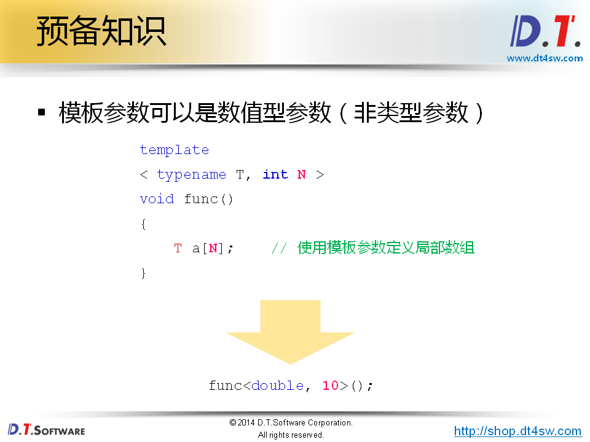
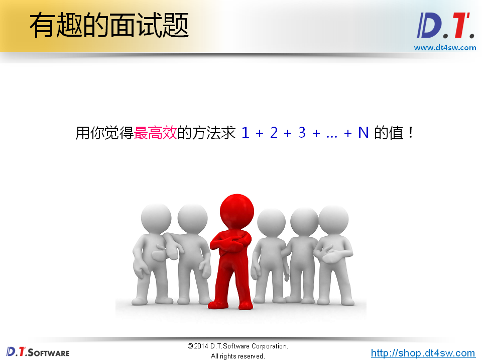
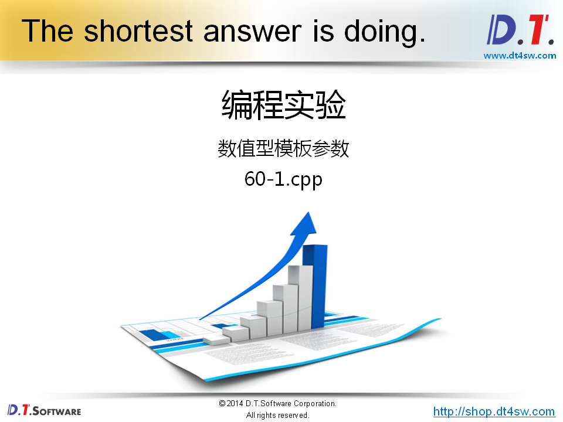
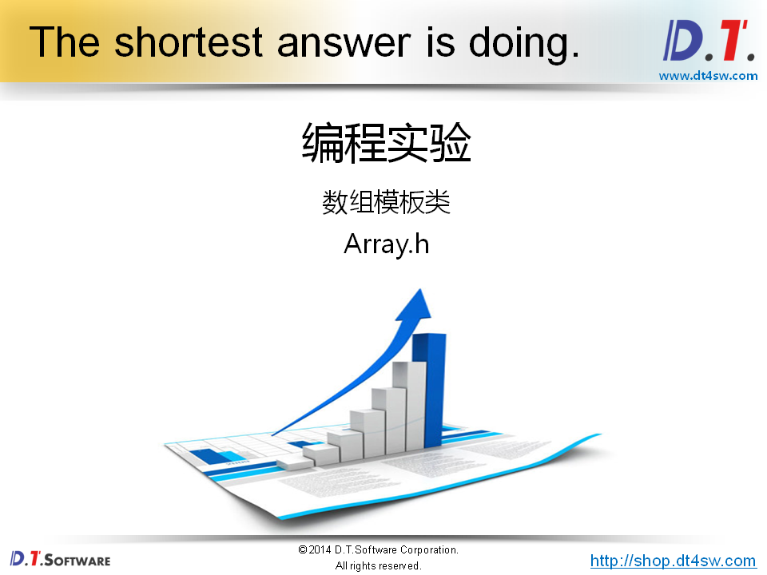
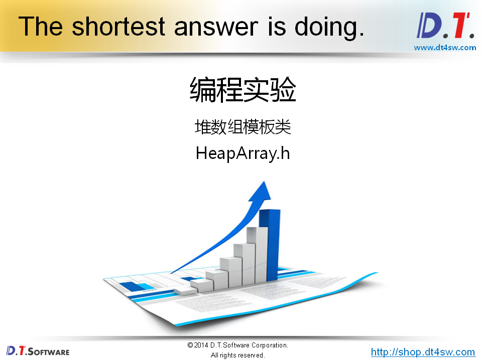
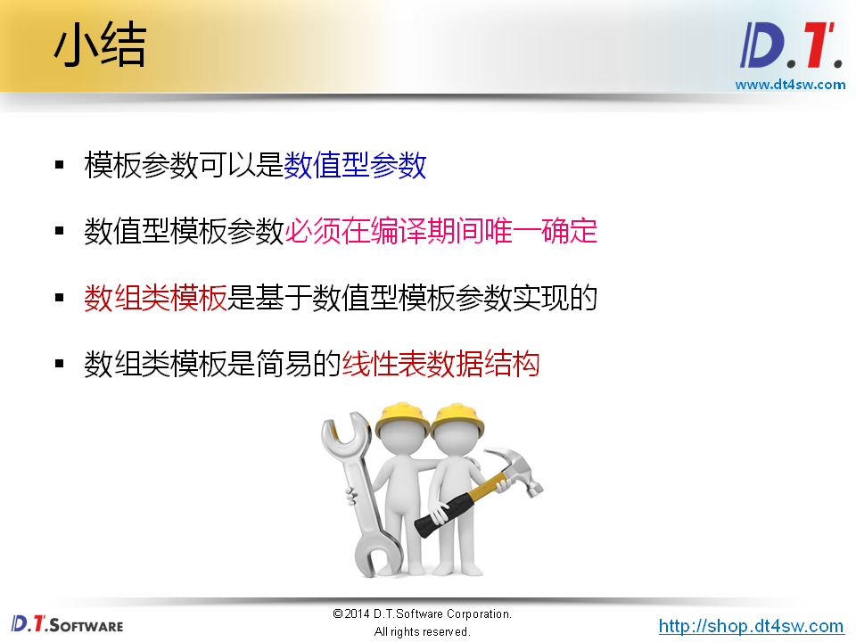

# 60.数组类模板










```cpp
#include <iostream>
#include <string>

using namespace std;

template
< typename T, int N >
void func()
{
    T a[N] = {0};
    
    for(int i=0; i<N; i++)
    {
        a[i] = i;
    }
    
    for(int i=0; i<N; i++)
    {
        cout << a[i] << endl;
    }
}

template
< int N >
class Sum
{
public:
    static const int VALUE = Sum<N-1>::VALUE + N; // 定义常量-》全局数据区或者符号表中，VALUE放符号表和全局数据区  // 递归到等于1的->然后定义一个特化的实现作为递归的终止条件
};

template
< >
class Sum < 1 >
{
public:
    static const int VALUE = 1;
};


int main()
{
    cout << "1 + 2 + 3 + ... + 10 = " << Sum<10>::VALUE << endl; // 编译期间就确定了
    cout << "1 + 2 + 3 + ... + 100 = " << Sum<100>::VALUE << endl;
    
    return 0;
}


```






```cpp
#ifndef _HEAPARRAY_H_
#define _HEAPARRAY_H_

template
< typename T >
class HeapArray
{
private:
    int m_length;
    T* m_pointer;
    
    HeapArray(int len);
    HeapArray(const HeapArray<T>& obj);
    bool construct();
public:
    static HeapArray<T>* NewInstance(int length); 
    int length();
    bool get(int index, T& value);
    bool set(int index ,T value);
    T& operator [] (int index);
    T operator [] (int index) const;
    HeapArray<T>& self();
    ~HeapArray();
};

template
< typename T >
HeapArray<T>::HeapArray(int len)
{
    m_length = len;
}

template
< typename T >
bool HeapArray<T>::construct()
{   
    m_pointer = new T[m_length];
    
    return m_pointer != NULL;
}

template
< typename T >
HeapArray<T>* HeapArray<T>::NewInstance(int length) // 二阶构造
{
    HeapArray<T>* ret = new HeapArray<T>(length);
    
    if( !(ret && ret->construct()) ) 
    {
        delete ret;
        ret = 0;
    }
        
    return ret;
}

template
< typename T >
int HeapArray<T>::length()
{
    return m_length;
}

template
< typename T >
bool HeapArray<T>::get(int index, T& value)
{
    bool ret = (0 <= index) && (index < length());
    
    if( ret )
    {
        value = m_pointer[index];
    }
    
    return ret;
}

template
< typename T >
bool HeapArray<T>::set(int index, T value)
{
    bool ret = (0 <= index) && (index < length());
    
    if( ret )
    {
        m_pointer[index] = value;
    }
    
    return ret;
}

template
< typename T >
T& HeapArray<T>::operator [] (int index)
{
    return m_pointer[index];
}

template
< typename T >
T HeapArray<T>::operator [] (int index) const
{
    return m_pointer[index];
}

template
< typename T >
HeapArray<T>& HeapArray<T>::self()
{
    return *this;
}

template
< typename T >
HeapArray<T>::~HeapArray()
{
    delete[]m_pointer;
}


#endif

```

```cpp

#ifndef _ARRAY_H_
#define _ARRAY_H_

template
< typename T, int N > // 使用数值型的参数N
class Array
{
    T m_array[N];
public:
    int length();
    bool set(int index, T value);
    bool get(int index, T& value);
    T& operator[] (int index);
    T operator[] (int index) const;
    virtual ~Array();
};

template
< typename T, int N >
int Array<T, N>::length()
{
    return N;
}

template
< typename T, int N >
bool Array<T, N>::set(int index, T value)
{
    bool ret = (0 <= index) && (index < N);
    
    if( ret )
    {
        m_array[index] = value;
    }
    
    return ret;
}

template
< typename T, int N >
bool Array<T, N>::get(int index, T& value)
{
    bool ret = (0 <= index) && (index < N);
    
    if( ret )
    {
        value = m_array[index];
    }
    
    return ret;
}

template
< typename T, int N >
T& Array<T, N>::operator[] (int index)
{
    return m_array[index];
}

template
< typename T, int N >
T Array<T, N>::operator[] (int index) const // 有可能是const成员变量所以设计为const成员函数，返回值也不能是引用
{
    return m_array[index];
}

template
< typename T, int N >
Array<T, N>::~Array()
{

}

#endif
```

```cpp
#include <iostream>
#include <string>
#include "Array.h"
#include "HeapArray.h"

using namespace std;

int main()
{
    Array<double, 5> ad;
    
    for(int i=0; i<ad.length(); i++)
    {
        ad[i] = i * i;
    }
    
    for(int i=0; i<ad.length(); i++)
    {
        cout << ad[i] << endl;
    }
    
    cout << endl;
    
    HeapArray<char>* pai = HeapArray<char>::NewInstance(10);
    
    if( pai != NULL )
    {
        HeapArray<char>& ai = pai->self();
        
        for(int i=0; i<ai.length(); i++)
        {
            ai[i] = i + 'a';
        }
        
        for(int i=0; i<ai.length(); i++)
        {
            cout << ai[i] << endl;
        }
    }
    
    delete pai;
    
    return 0;
}


```

