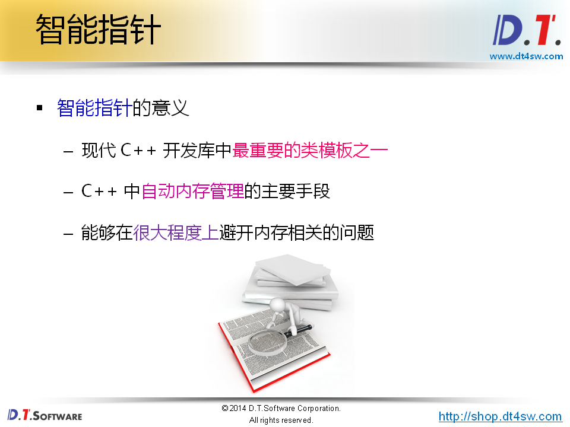
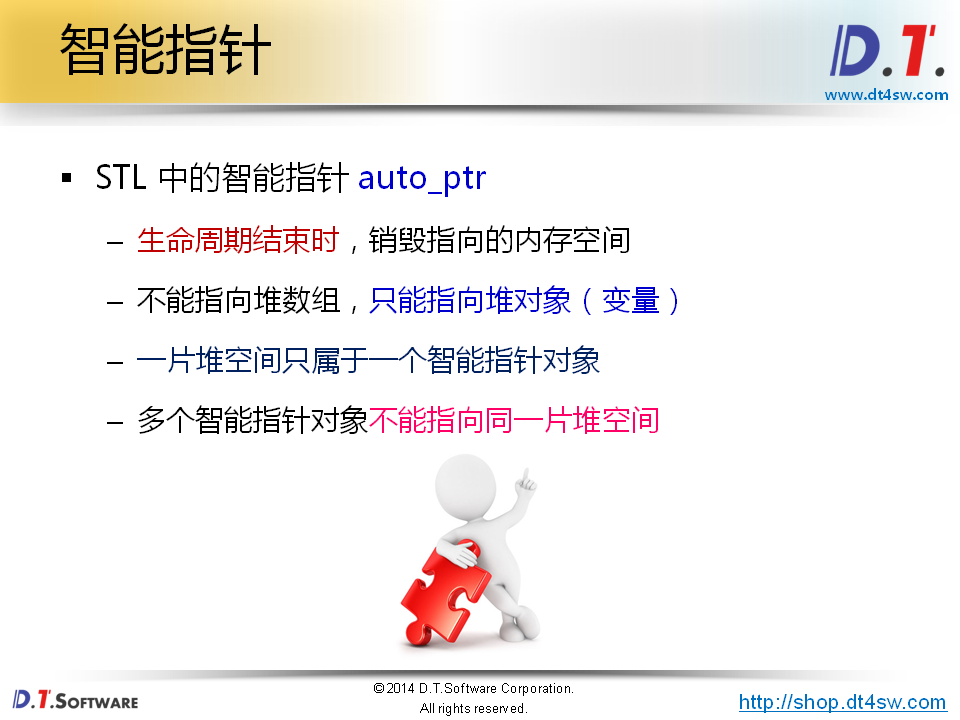
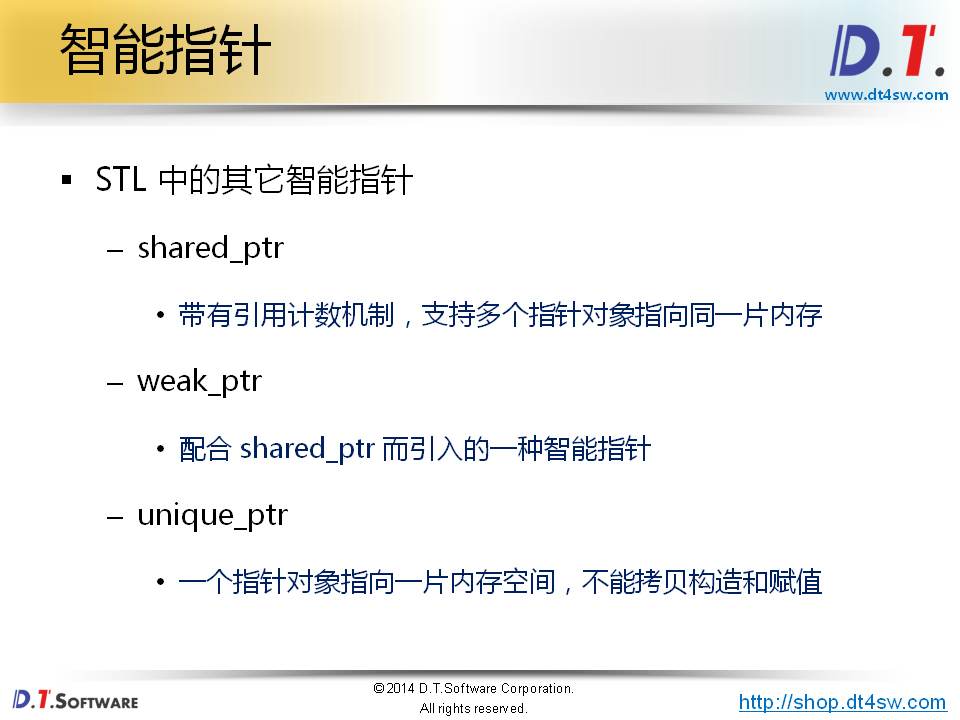
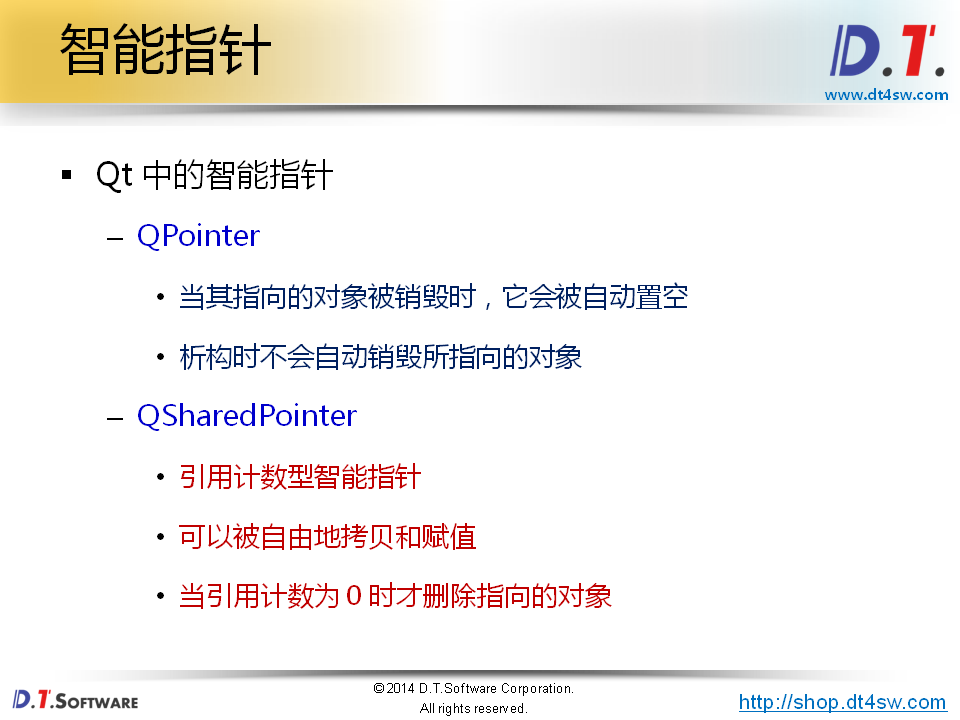
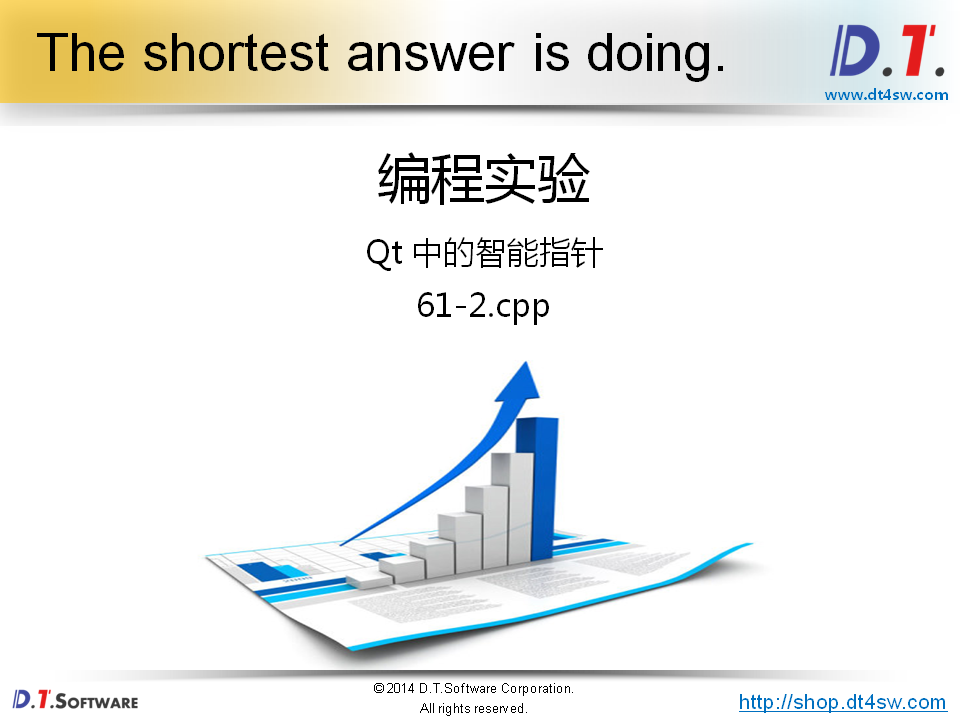
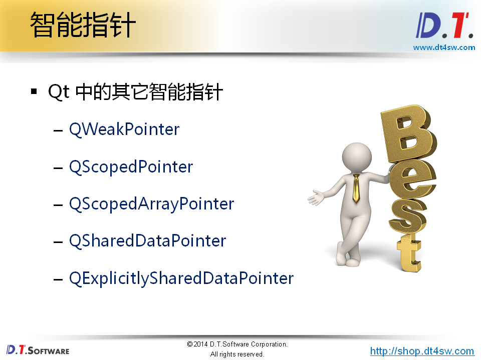
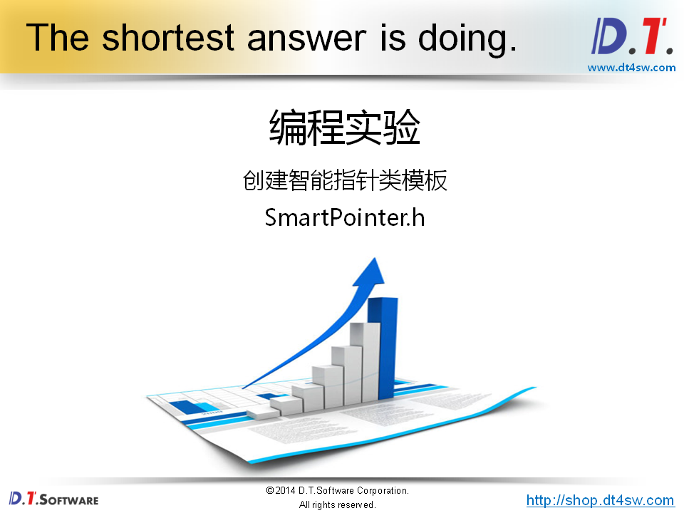
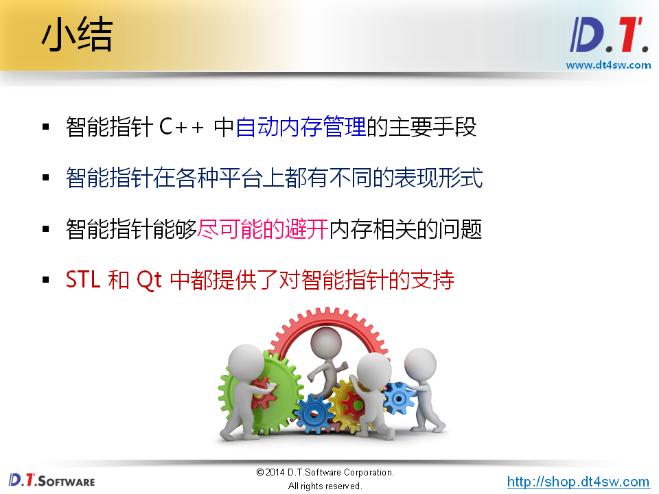

# 61.智能指针类模板








```cpp
#include <iostream>
#include <string>
#include <memory>

using namespace std;

class Test
{
    string m_name;
public:
    Test(const char* name)
    {
        cout << "Hello, " << name << "." << endl;
        
        m_name = name;
    }
    
    void print()
    {
        cout << "I'm " << m_name << "." << endl;
    }
    
    ~Test()
    {
        cout << "Goodbye, " << m_name << "." << endl;
    }
};

int main()
{
    auto_ptr<Test> pt(new Test("D.T.Software"));
    
    cout << "pt = " << pt.get() << endl; // 返回指向堆空间的起始地址
    
    pt->print();
    
    cout << endl;
    
    auto_ptr<Test> pt1(pt);
    
    cout << "pt = " << pt.get() << endl;   // 返回指向堆空间的起始地址
    cout << "pt1 = " << pt1.get() << endl; // 返回指向堆空间的起始地址,多个auto ptr的指针不能指向同一片空间，避免重复释放的问题
    
    pt1->print();
    
    return 0;
}


```









```cpp
#include <QPointer>
#include <QSharedPointer>
#include <QDebug>

class Test : public QObject
{
    QString m_name;
public:
    Test(const char* name)
    {
        qDebug() << "Hello, " << name << ".";

        m_name = name;
    }

    void print()
    {
        qDebug() << "I'm " << m_name << ".";
    }

    ~Test()
    {
        qDebug() << "Goodbye, " << m_name << ".";
    }
};

int main()
{
    QPointer<Test> pt(new Test("D.T.Software"));
    QPointer<Test> pt1(pt);
    QPointer<Test> pt2(pt);

    pt->print();
    pt1->print();
    pt2->print();

    delete pt;

    qDebug() << "pt = " << pt;
    qDebug() << "pt1 = " << pt1;
    qDebug() << "pt2 = " << pt2;

    qDebug() << endl;

    QSharedPointer<Test> spt(new Test("Delphi Tang")); // 使用引用技术的机制
    QSharedPointer<Test> spt1(spt);
    QSharedPointer<Test> spt2(spt);

    spt->print();
    spt1->print();
    spt2->print();

    return 0;
}

```






```cpp

#ifndef _SMARTPOINTER_H_
#define _SMARTPOINTER_H_

template
< typename T >
class SmartPointer
{
    T* mp;
public:
    SmartPointer(T* p = NULL)
    {
        mp = p;
    }
    
    SmartPointer(const SmartPointer<T>& obj)
    {
        mp = obj.mp;
        const_cast<SmartPointer<T>&>(obj).mp = NULL;
    }
    
    SmartPointer<T>& operator = (const SmartPointer<T>& obj)
    {
        if( this != &obj )
        {
            delete mp;
            mp = obj.mp;
            const_cast<SmartPointer<T>&>(obj).mp = NULL;
        }
        
        return *this;
    }
    
    T* operator -> ()
    {
        return mp;
    }
    
    T& operator * ()
    {
        return *mp;
    }
    
    bool isNull()
    {
        return (mp == NULL);
    }
    
    T* get()
    {
        return mp;
    }
    
    ~SmartPointer()
    {
        delete mp;
    }
};

#endif
```

```cpp
#include <iostream>
#include <string>
#include "SmartPointer.h"

using namespace std;

class Test
{
    string m_name;
public:
    Test(const char* name)
    {
        cout << "Hello, " << name << "." << endl;
        
        m_name = name;
    }
    
    void print()
    {
        cout << "I'm " << m_name << "." << endl;
    }
    
    ~Test()
    {
        cout << "Goodbye, " << m_name << "." << endl;
    }
};

int main()
{
    SmartPointer<Test> pt(new Test("D.T.Software"));
    
    cout << "pt = " << pt.get() << endl;
    
    pt->print();
    
    cout << endl;
    
    SmartPointer<Test> pt1(pt);
    
    cout << "pt = " << pt.get() << endl;
    cout << "pt1 = " << pt1.get() << endl;
    
    pt1->print();
    
    return 0;
}


```

