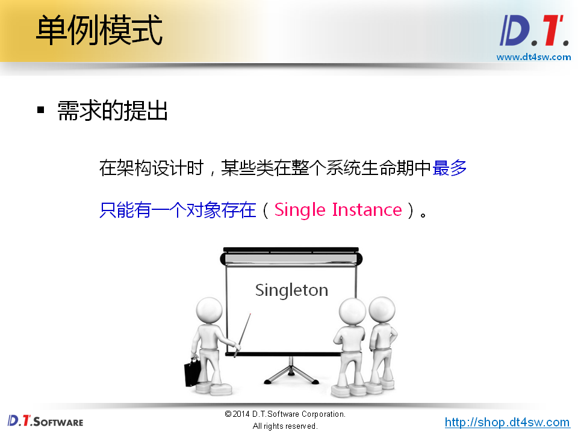
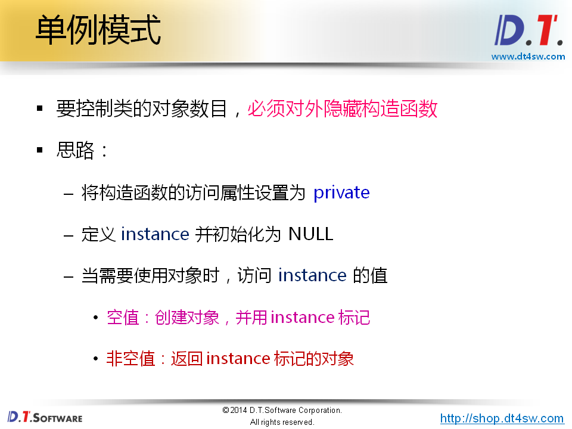
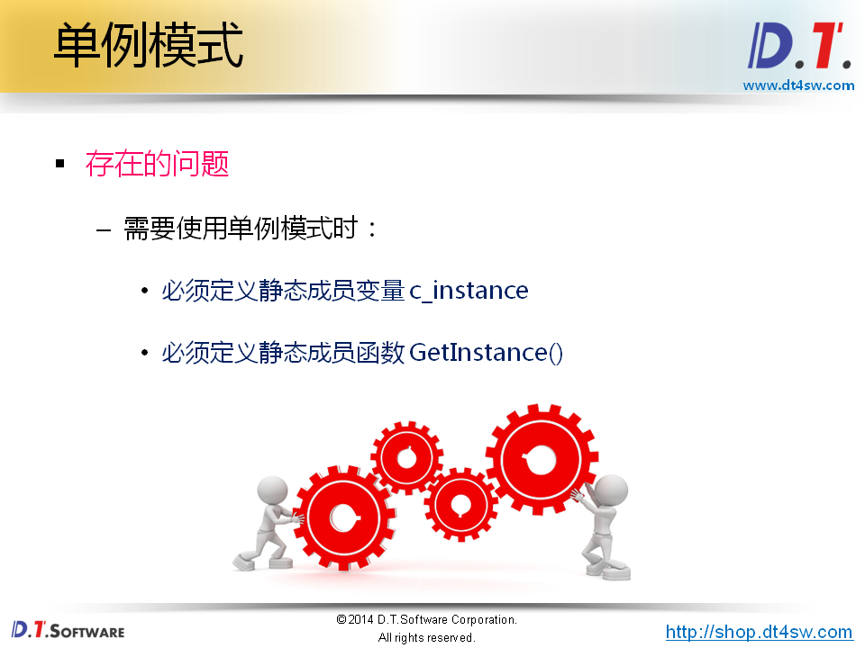
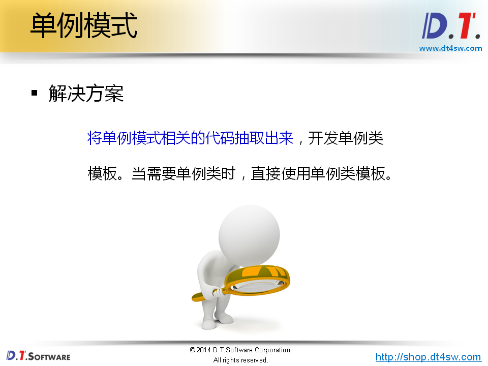

# 62.单例类模板








```cpp
#include <iostream>
#include <string>

using namespace std;

class SObject
{
    static SObject* c_instance;  // 标识符标识只有一个对象
    
    SObject(const SObject&); // 拷贝构造函数私有
    SObject& operator= (const SObject&); // 赋值构造函数私有
     
    SObject() // 构造函数私有
    {
    }
public:
    static SObject* GetInstance(); // 静态成员函数返回对象
    
    void print()
    {
        cout << "this = " << this << endl;
    }
};

SObject* SObject::c_instance = NULL;

SObject* SObject::GetInstance()
{
    if( c_instance == NULL )
    {
        c_instance = new SObject(); // 为什么构造函数私有了，还能new-》因为这个是成员函数，可以访问类内的私有方法
    }
    
    return c_instance;
}

int main()
{
    SObject* s = SObject::GetInstance();
    SObject* s1 = SObject::GetInstance();
    SObject* s2 = SObject::GetInstance();
    
    s->print(); // 地址都是一样的
    s1->print();
    s2->print();
    
    return 0;
}


```







```cpp

#ifndef _SINGLETON_H_
#define _SINGLETON_H_

template
< typename T >
class Singleton
    static T* c_instance; // 标识符标识只有一个对象
public:
    static T* GetInstance();
};

template
< typename T >
T* Singleton<T>::c_instance = NULL;

template
< typename T >
T* Singleton<T>::GetInstance()
{
    if( c_instance == NULL )
    {
        c_instance = new T();
    }
    
    return c_instance;
}


#endif
```

```cpp
#include <iostream>
#include <string>
#include "Singleton.h"

using namespace std;

class SObject
{
    friend class Singleton<SObject>;    // 当前类需要使用单例模式
    
    SObject(const SObject&);
    SObject& operator= (const SObject&);
    
    SObject()
    {
    }
public:
    
    void print()
    {
        cout << "this = " << this << endl;
    }
};

int main()
{
    SObject* s = Singleton<SObject>::GetInstance();
    SObject* s1 = Singleton<SObject>::GetInstance();
    SObject* s2 = Singleton<SObject>::GetInstance();
    
    s->print();
    s1->print();
    s2->print();
    
    return 0;
}


```


