# 63.C 语言异常处理


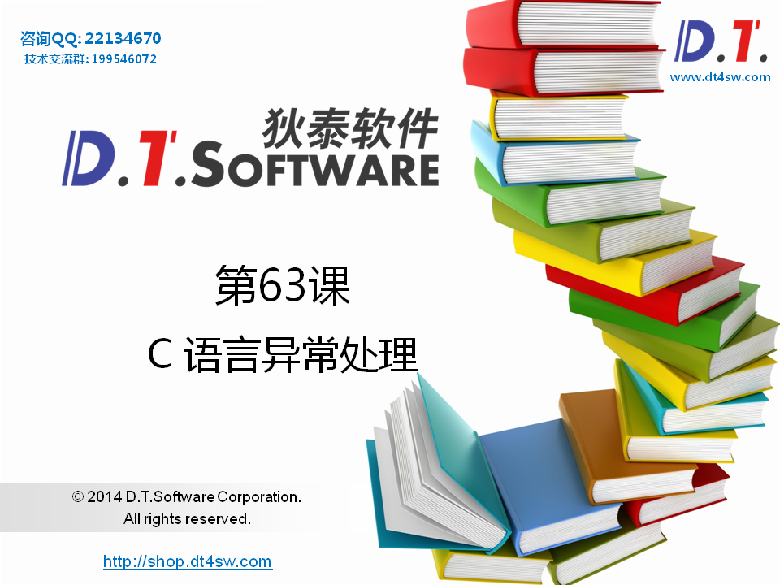


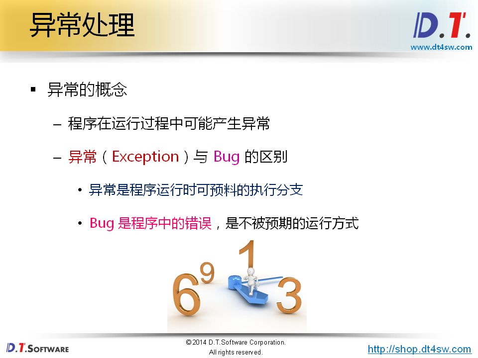


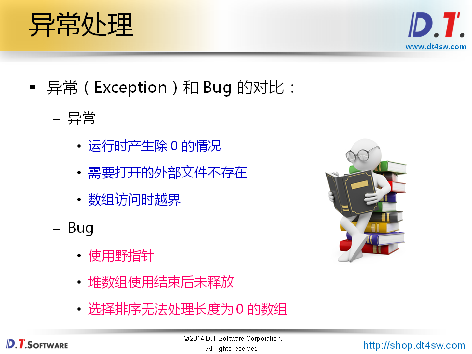


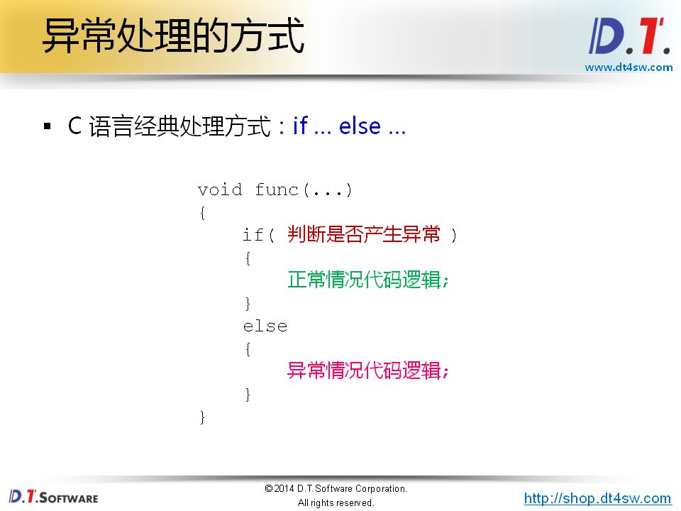


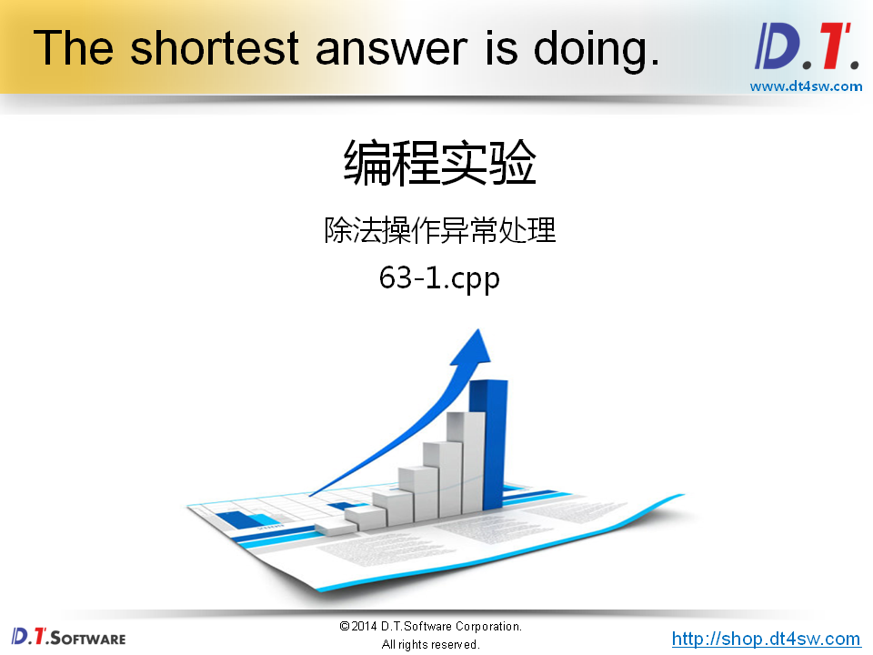

```cpp
#include <iostream>
#include <string>

using namespace std;

double divide(double a, double b, int* valid)
{
    const double delta = 0.000000000000001;
    double ret = 0;
    
    if( !((-delta < b) && (b < delta)) )
    {
        ret = a / b;
        
        *valid = 1;
    }
    else
    {
        *valid = 0;
    }
    
    return ret;
}

int main(int argc, char *argv[])
{   
    int valid = 0;
    double r = divide(1, 0, &valid);
    
    if( valid )
    {
        cout << "r = " << r << endl;
    }
    else
    {
        cout << "Divided by zero..." << endl;
    }
    
    return 0;
}


```

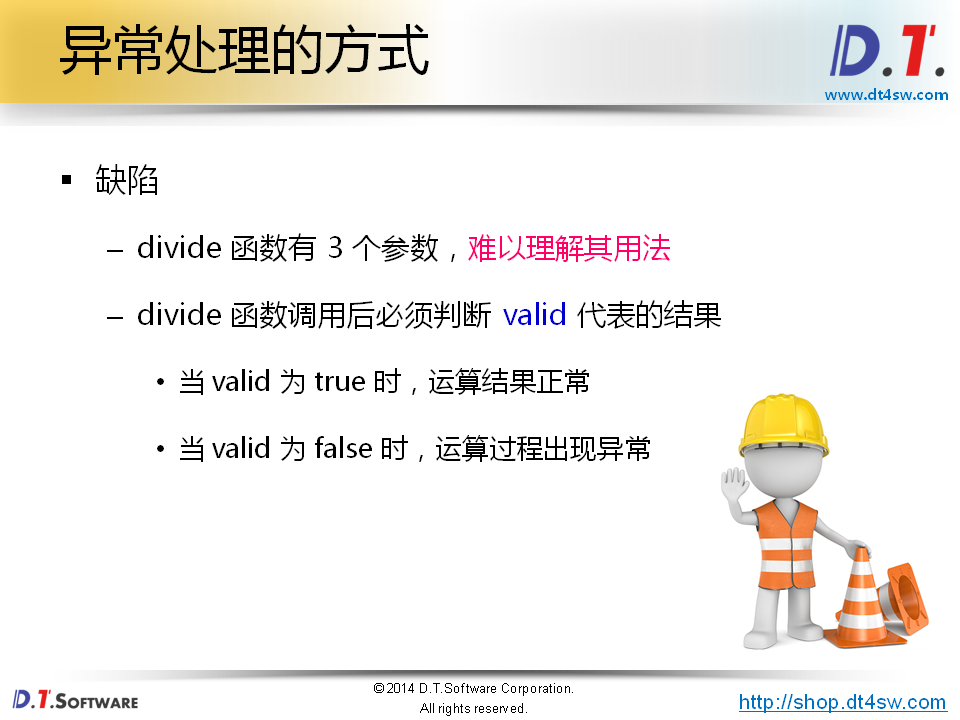


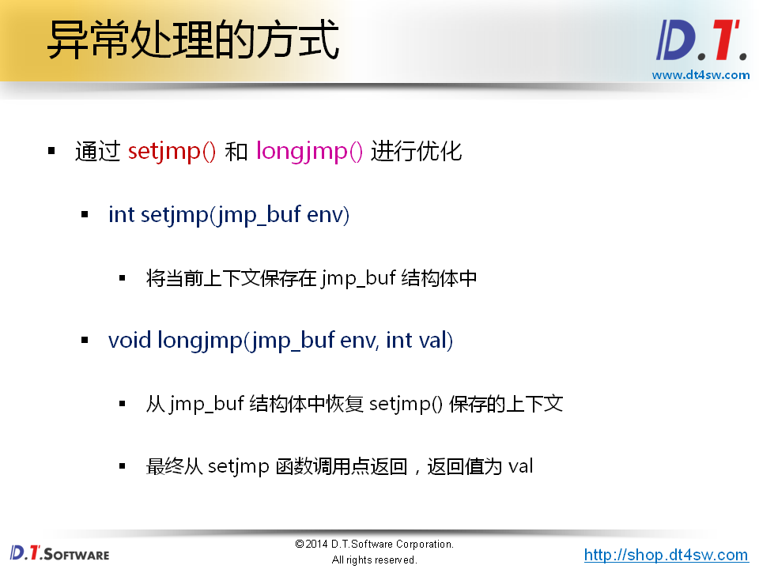

破坏结构化程序设计的特性：

**顺序，分支，循环执行**

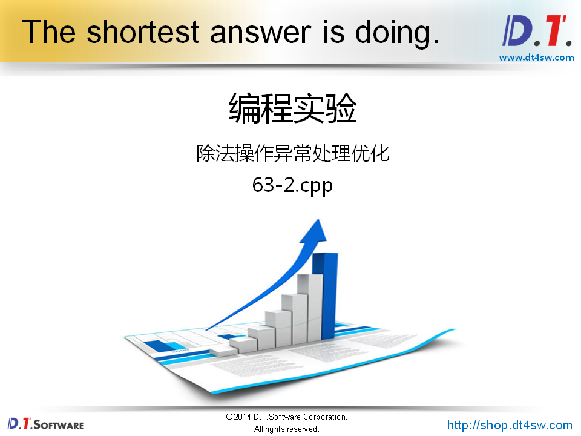

```cpp
#include <iostream>
#include <string>
#include <csetjmp>

using namespace std;

static jmp_buf env;

double divide(double a, double b)
{
    const double delta = 0.000000000000001;
    double ret = 0;
    
    if( !((-delta < b) && (b < delta)) )
    {
        ret = a / b;
    }
    else
    {
        longjmp(env, 1);
    }
    
    return ret;
}

int main(int argc, char *argv[])
{   
    if( setjmp(env) == 0 )
    {
        double r = divide(1, 1);
        
        cout << "r = " << r << endl;
    }
    else
    {
        cout << "Divided by zero..." << endl;
    }
    
    return 0;
}


```

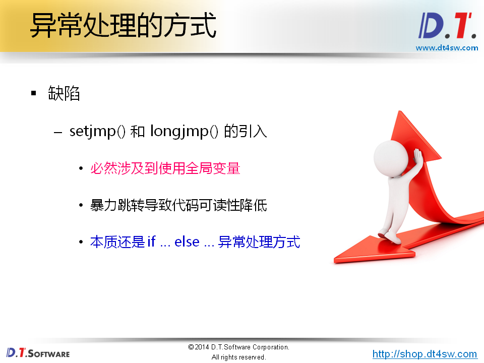


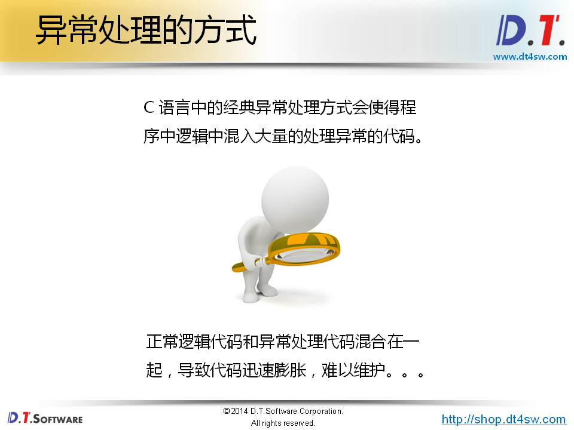


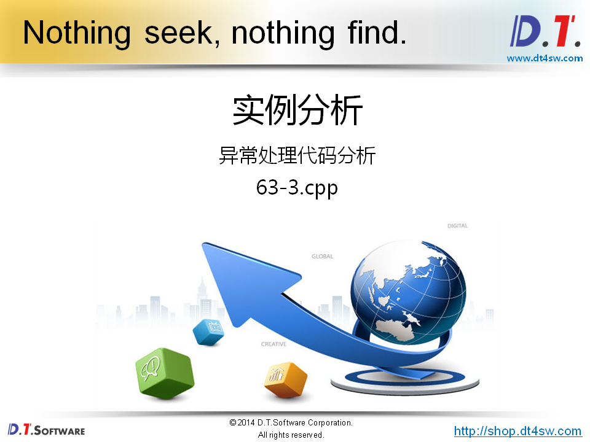

```cpp
#include <iostream>
#include <string>

using namespace std;

#define SUCCESS           0 
#define INVALID_POINTER   -1
#define INVALID_LENGTH    -2
#define INVALID_PARAMETER -3

int MemSet(void* dest, unsigned int length, unsigned char v)
{
    if( dest == NULL )
    {
        return INVALID_POINTER;
    }
    
    if( length < 4 )
    {
        return INVALID_LENGTH;
    }
    
    if( (v < 0) || (v > 9) )
    {
        return INVALID_PARAMETER;
    }
    
    unsigned char* p = (unsigned char*)dest;
    
    for(int i=0; i<length; i++)
    {
        p[i] = v;
    }
    
    return SUCCESS;
}

int main(int argc, char *argv[])
{
    int ai[5];
    int ret = MemSet(ai, sizeof(ai), 0);
    
    if( ret == SUCCESS )
    {
    }
    else if( ret == INVALID_POINTER )
    {
    }
    else if( ret == INVALID_LENGTH )
    {
    }
    else if( ret == INVALID_PARAMETER )
    {
    }
    
    return ret;
}


```

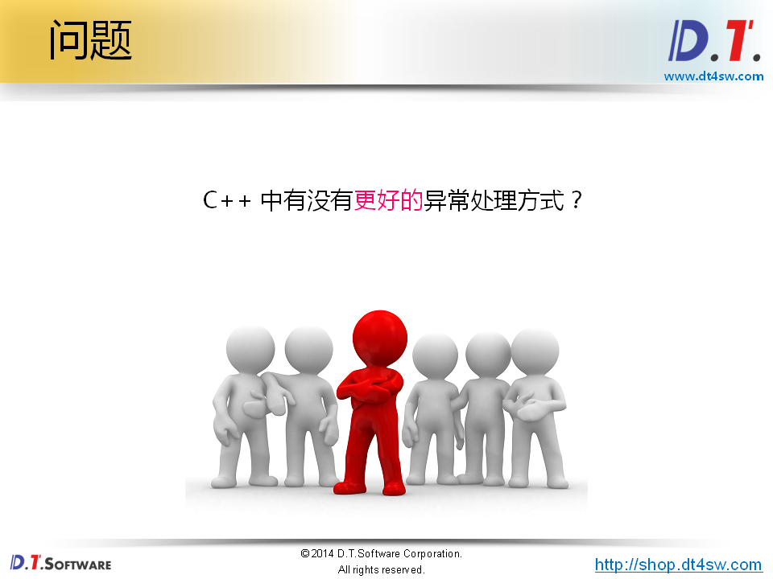


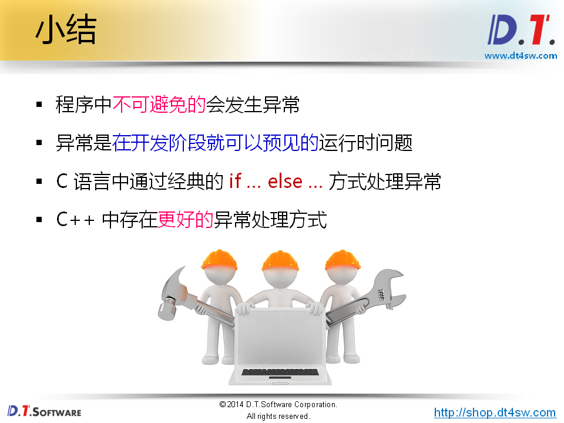